# Failover Cluster Lab 1 — Shared Storage with iSCSI Target Server

This lab builds the **shared storage foundation** that a Windows Server Failover Cluster (WSFC) needs before it can be created. A domain controller (`PDC16`) is configured as an **iSCSI Target Server**, three virtual disks (LUNs) are carved out and shared, and two future cluster nodes (`Node1`, `Node2`) are configured as **iSCSI Initiators** that discover, connect to, and surface that storage. By the end of the lab both nodes can see the same three disks over the network — exactly what Failover Cluster Manager will require later when validating the configuration and creating the cluster.

## Lab Objectives

- Separate traffic into three dedicated networks (Domain, iSCSI, Cluster) on the PDC and both nodes
- Install/use the iSCSI Target Server role on `PDC16` to publish virtual disks as iSCSI LUNs
- Restrict access to those LUNs to only the two cluster nodes, using their IQNs
- Configure the iSCSI Initiator on each node, binding it to the correct NIC/subnet
- Connect both nodes to the target and confirm both can see all three disks
- Bring the disks online safely from a single node to avoid disk-signature conflicts

## Environment / Topology

| Role | Hostname | Purpose |
|---|---|---|
| Storage server | `PDC16` | Domain Controller + iSCSI Target Server |
| Cluster node 1 | `Node1` | iSCSI Initiator, future cluster node |
| Cluster node 2 | `Node2` | iSCSI Initiator, future cluster node |

All three machines are domain-joined to **`company.local`** and each one has **three NICs**, one per network. The lab uses a consistent addressing convention — the last octet of the IP identifies the host (`100` = PDC16, `110` = Node1, `120` = Node2) across all three subnets:

| Network | Subnet | PDC16 | Node1 | Node2 | Carries |
|---|---|---|---|---|---|
| Domain | 192.168.1.0/24 | .100 | .110 | .120 | AD / client traffic |
| iSCSI | 192.168.2.0/24 | .100 | .110 | .120 | Storage (initiator ↔ target) traffic |
| Cluster | 192.168.3.0/24 | .100 | .110 | .120 | Heartbeat / intra-cluster traffic |

Keeping iSCSI traffic on its own isolated subnet (rather than letting it share the Domain NIC) is a standard practice — it avoids storage I/O competing with regular network traffic and keeps the cluster heartbeat network from being affected by SAN load.

## Prerequisites

- `PDC16` has the **iSCSI Target Server** role installed (File and Storage Services)
- `Node1` and `Node2` are domain-joined member servers with the **iSCSI Initiator** service available (built into Windows)
- A volume with free space on `PDC16` to host the virtual disks (this lab uses the `E:` volume)
- Three NICs per machine, each patched into its own isolated subnet/VLAN as above

---

## Part 1 — Configure the Three NICs

Each machine (PDC and both nodes) gets three NICs renamed/labeled `Domain`, `iSCSI`, and `Cluster`, each with a static IP on its respective subnet and IPv6 left enabled. The screenshot below was taken on Node2 and shows the pattern clearly — all three adapters share the same final octet (`.120`) for that host:

*Cluster → 192.168.3.120, Domain → 192.168.1.120, iSCSI → 192.168.2.120 — the identical `.110` and `.100` pattern is applied on Node1 and PDC16 respectively.*

---

## Part 2 — Provision the iSCSI Storage on PDC16

All storage provisioning happens from **Server Manager → File and Storage Services → iSCSI** on `PDC16`, using the **New iSCSI Virtual Disk Wizard**. The wizard is run three times to create three LUNs: `Disk01` (10 GB), `Disk02` (15 GB), and `Disk03` (512 MB). The *first* run also creates the iSCSI **target** itself; the second and third runs simply attach a new disk to that already-existing target.

### 2.1 First disk — create the virtual disk *and* the new target (Disk01, 10 GB)

**Select the virtual disk location.** `PDC16` is listed as the only server with the iSCSI Target Server role, and volume `E:` (65.3 GB free) is selected as the home for the `.vhdx` files:

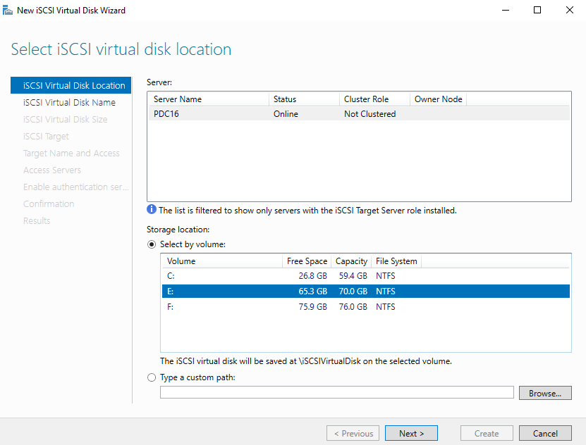

**Name the virtual disk.** The disk is saved as `E:\iSCSIVirtualDisks\Disk01.vhdx`:

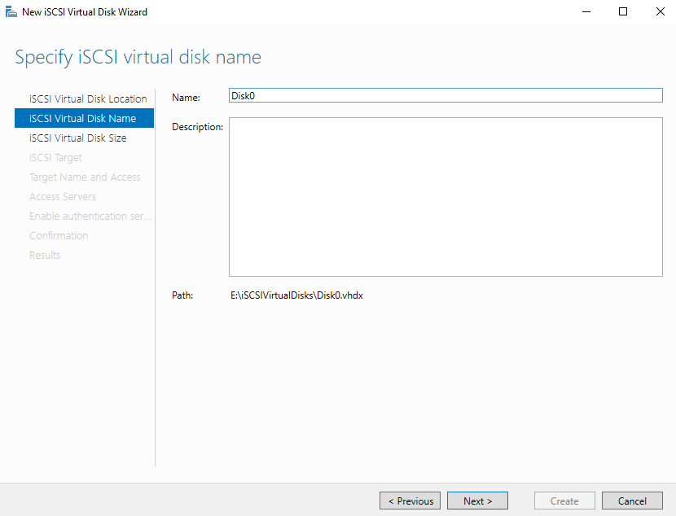

**Specify the size and type.** `10 GB`, **Dynamically expanding** — the file starts small and grows as data is written, which is the recommended type for disks that won't be under constant heavy write load (Fixed size is recommended only for I/O-intensive workloads since it pre-allocates the full size for performance):

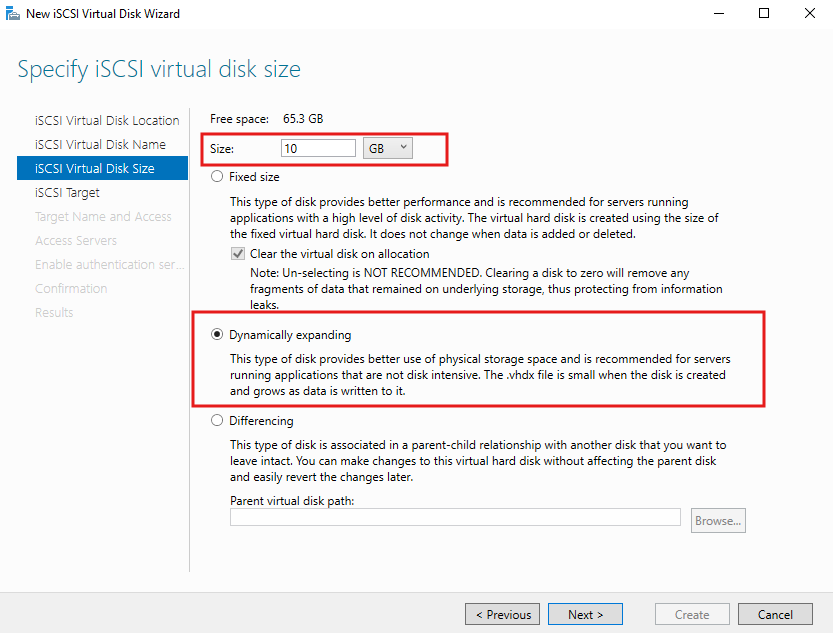

**Create a new iSCSI target.** Because no target exists yet, a new one is created and named `pdc16-target`. Every additional disk attached to this target later inherits its name and access list, so a clear, server-identifying name pays off:

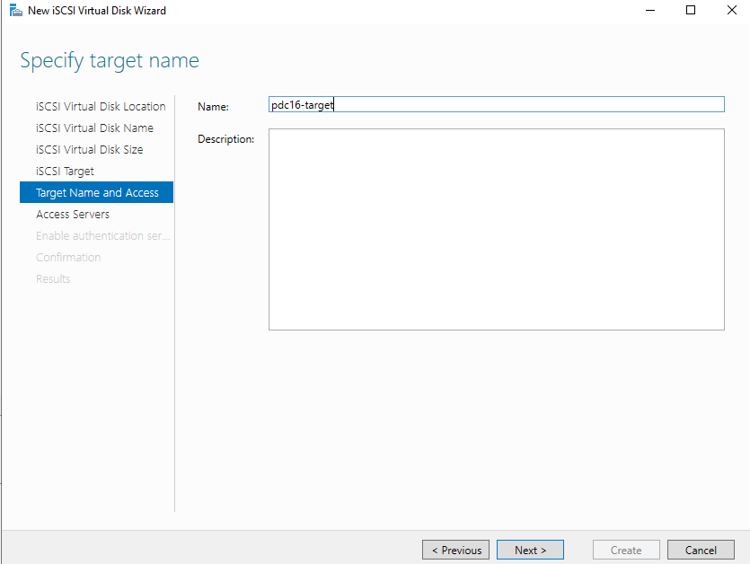

**Add the access servers (IQNs).** This is the step that actually grants Node1 and Node2 permission to log in to this target. Each node's IQN is obtained beforehand from its own iSCSI Initiator → **Configuration** tab, then added here by IQN value:

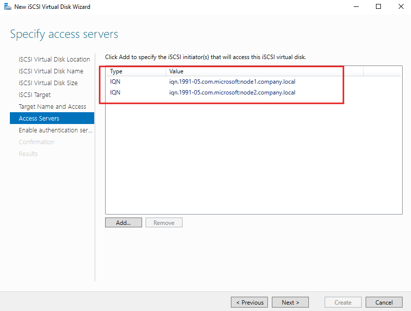

> **Tip:** if a node isn't allowed to log on to the target later, this is almost always the first place to check — either the wrong IQN was typed, or one node's IQN was never added.

**Confirm and create.** The final confirmation screen for this first disk shows the complete configuration — note that because a *new* target was being created, the wizard included the extra **Target Name and Access**, **Access Servers**, and **Enable authentication** pages:

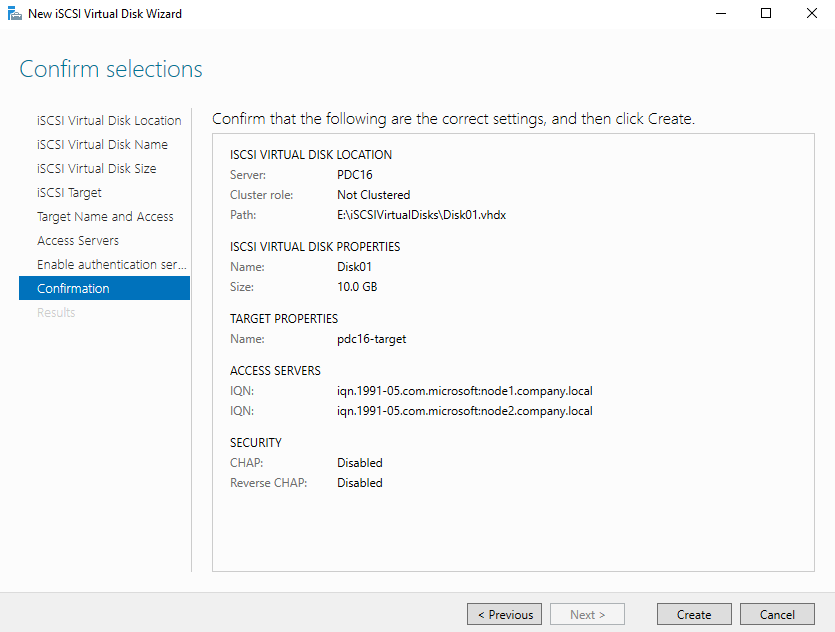

### 2.2 Additional disks — attach to the existing target (Disk02, Disk03)

For `Disk02` (15 GB) and `Disk03` (512 MB), the wizard is run again but **"Existing target: pdc16-target"** is chosen on the iSCSI Target page instead of creating a new one. Because the target — and therefore its access list and authentication settings — already exists, the wizard *skips* the Target Name, Access Servers, and Enable Authentication pages entirely and goes straight from disk size to confirmation:

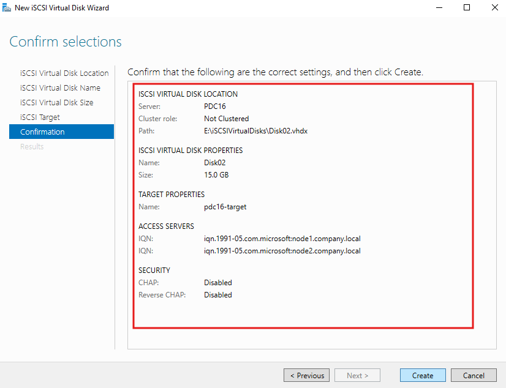

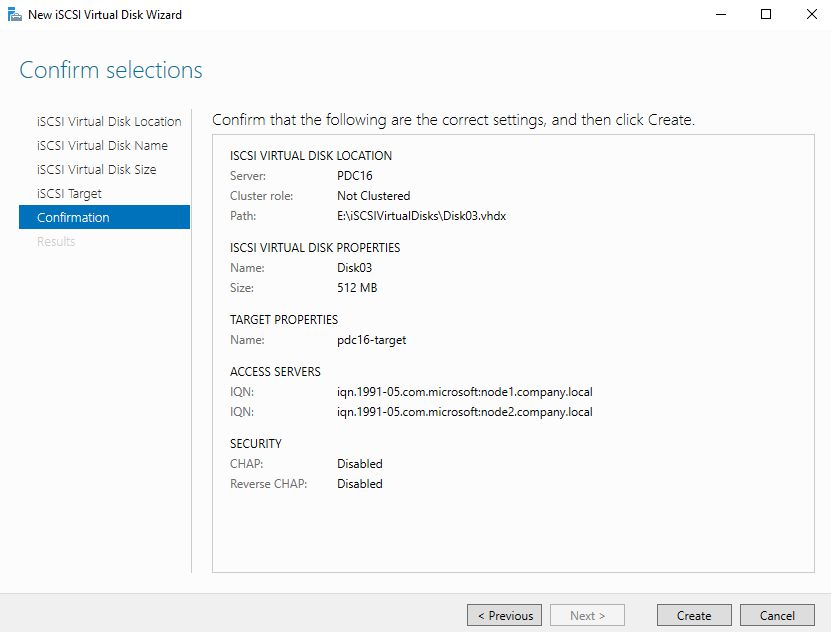

At this point `PDC16` is hosting three virtual disks (10 GB, 15 GB, 512 MB) on a single target, `pdc16-target`, accessible only to the IQNs of Node1 and Node2.

---

## Part 3 — Configure the iSCSI Initiator on Each Node

On each node, **iSCSI Initiator → Discovery → Discover Portal** is used to point at the target server's iSCSI-network IP, `192.168.2.100`, port `3260`. The critical part of this step is the **Advanced Settings**, where the **Local adapter** is set to *Microsoft iSCSI Initiator* and the **Initiator IP** is explicitly pinned to that node's own iSCSI-subnet address. Without this, Windows could pick any local adapter for the session, including the Domain NIC, which defeats the purpose of separating the traffic.

**Node1** discovers the portal and binds to its iSCSI IP, `192.168.2.110` (its IQN, `iqn.1991-05.com.microsoft:node1.company.local`, auto-fills the CHAP name field below since CHAP isn't actually being used here):

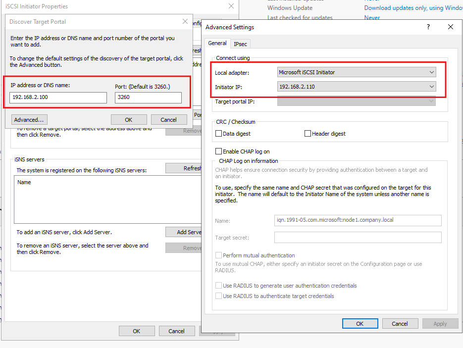

**Node2** does the same, binding to its own iSCSI IP, `192.168.2.120`:

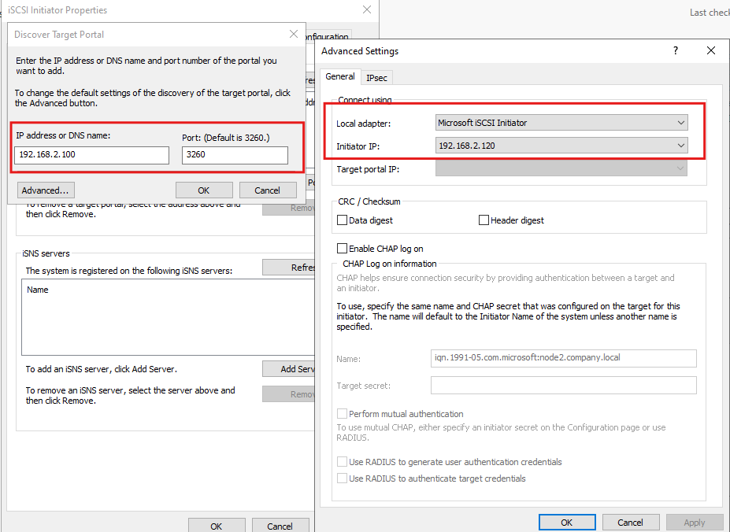

---

## Part 4 — Connect Both Nodes to the Target

After discovery, the target shows up under the **Targets** tab on each node as `iqn.1991-05.com.microsoft:pdc16-pdc16-target-target` with a status of **Inactive**. (The long, doubled-up name is just how Windows auto-generates target IQNs: `<server>-<target-name>-target`, i.e. `pdc16` + `pdc16-target` + `-target`.)

Clicking **Connect** opens the same Advanced Settings dialog again, where the Local adapter, Initiator IP, and Target portal IP are set to match the discovery step exactly, and **"Add this connection to the list of Favorite Targets"** is checked so the session automatically reconnects on reboot.

**Node1** connects, pinned to `192.168.2.110` ↔ target portal `192.168.2.100:3260`:

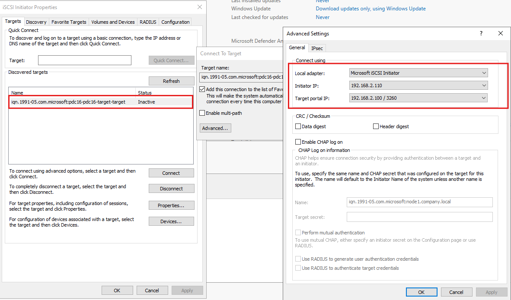

**Node2** connects, pinned to `192.168.2.120` ↔ target portal `192.168.2.100:3260`:

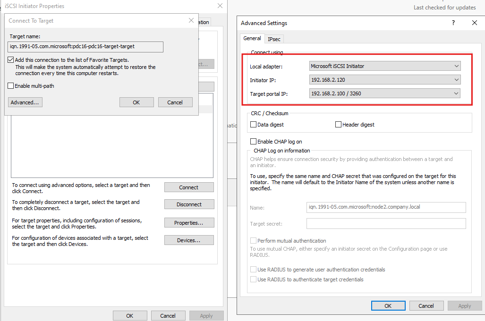

Once connected, the **Volumes and Devices** tab on either node, followed by **Auto Configure**, binds all three LUNs as persistent devices — confirmed here by the three `scsi#disk&ven_msft&prod_virtual_hd...` entries (one per virtual disk) appearing in the volume list on both nodes:

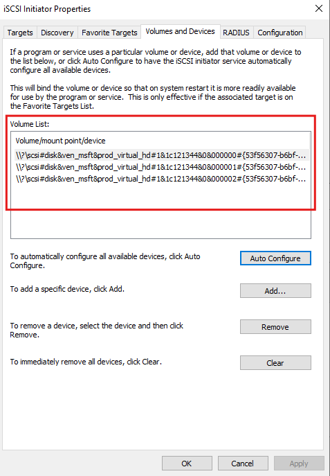

---

## Part 5 — Bring the Disks Online (One Node Only)

Both nodes can now see the three LUNs at the OS level, but Windows deliberately brings newly-connected shared disks up as **Offline** by default — this SAN policy exists specifically to prevent two hosts from racing to initialize/write to the same disk at once and corrupting it. Opening **Disk Management** on Node1 shows exactly that — all three disks present, but Offline and Unallocated:

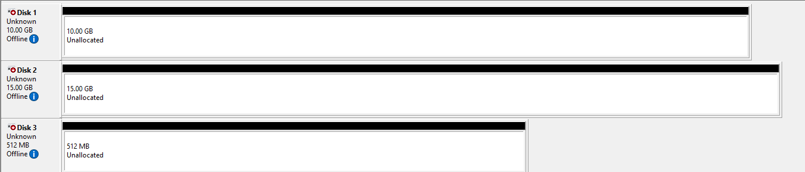

From here, each disk is brought **Online** (right-click → Online) and initialized **on Node1 only**. Node2 is deliberately left untouched at this stage — it will continue to see the disks as Offline until Failover Cluster Manager takes ownership of them later. Bringing them online from both nodes simultaneously is the most common way to corrupt shared LUNs before a cluster even exists, so this single-node rule is the most important safety step in the whole lab.

---

## Solution Summary — Expected End State

| Item | Value |
|---|---|
| iSCSI Target Server | `PDC16` |
| Target name | `pdc16-target` |
| Target IQN | `iqn.1991-05.com.microsoft:pdc16-pdc16-target-target` |
| Disk01 | 10 GB, Dynamically expanding |
| Disk02 | 15 GB, Dynamically expanding |
| Disk03 | 512 MB |
| Access servers (IQNs) | `iqn.1991-05.com.microsoft:node1.company.local`, `iqn.1991-05.com.microsoft:node2.company.local` |
| CHAP / Reverse CHAP | Disabled |
| Node1 iSCSI binding | 192.168.2.110 ↔ 192.168.2.100:3260 |
| Node2 iSCSI binding | 192.168.2.120 ↔ 192.168.2.100:3260 |
| Disks visible on | Node1 and Node2 (both, via Auto Configure) |
| Disks online/initialized on | Node1 only |

## Common Pitfalls

- **Target connects but login fails** — almost always a missing or mistyped IQN in the target's Access Servers list; double check both IQNs exactly match what each node's iSCSI Initiator → Configuration tab reports.
- **Disk shows Offline and won't go Online** — this is expected behavior for newly-presented shared storage (SAN policy), not an error; it just needs to be onlined manually, and only from the node that should own it first.
- **Initiator binds to the wrong NIC** — if Initiator IP isn't explicitly set in Advanced Settings during both Discovery and Connect, Windows may route iSCSI traffic over the Domain NIC instead of the dedicated iSCSI NIC.
- **Re-running the wizard creates a duplicate target** — when adding more disks to storage that's already shared, choose "Existing target" on the iSCSI Target page rather than "New target," or the access list and naming will have to be redone.

## Next Steps

With shared storage now visible to both nodes, the next lab installs the **Failover Clustering** feature on Node1 and Node2, runs **Validate a Configuration**, creates the cluster, and adds these three disks as Cluster Disks (or Cluster Shared Volumes) so cluster roles can use them.

---

## Appendix — Screenshot Index

| File | Description |
|---|---|
| `task1-add-3-nics-on-pdc-and-nodes.png` | Three NICs (Domain/iSCSI/Cluster) configured, shown on Node2 |
| `task2-create-iscsi-vhd.png` | Wizard: select virtual disk location (volume E:) |
| `task3-specify-iscsi-vhd-name.png` | Wizard: name the virtual disk |
| `task4-specify-iscsi-vhd-size.png` | Wizard: size (10 GB) and type (Dynamically expanding) |
| `task5-specify-iscsi-target-name.png` | Wizard: create new target `pdc16-target` |
| `task6-connect-to-target-from-intiator2.png` | Discover Target Portal on Node1 (192.168.2.110) |
| `task7-connect-to-target-from-intiator1.png` | Discover Target Portal on Node2 (192.168.2.120) |
| `task8-add-2-intiators-to-target.png` | Wizard: Access Servers — both node IQNs added |
| `task9-confirm-iscsi-disk1.png` | Confirmation — Disk02, 15 GB, existing target |
| `task9-confirm-iscsi-disk2.png` | Confirmation — Disk01, 10 GB, new target |
| `task9-confirm-iscsi-disk3.png` | Confirmation — Disk03, 512 MB, existing target |
| `task10-activate-intiator1-and-tatget-connection.png` | Connect to Target on Node1 |
| `task10-activate-intiator2-and-tatget-connection.png` | Connect to Target on Node2 |
| `task11-3disks-added-to-both-intiators.png` | Auto Configure — 3 disks bound on both initiators |
| `task12-activate-3-disks-on-intiator1-only.png` | Disk Management — 3 disks Offline, pre-activation, Node1 |
