# Failover Cluster Lab 2 — Creating the Cluster, Adding a Highly Available File Server, and Configuring Quorum

This lab picks up where **Lab 1** (shared iSCSI storage) left off. With three LUNs already presented to `Node1` and `Node2`, this lab validates the hardware/software configuration, creates the actual failover cluster, brings the shared storage under cluster control, adds a highly available **File Server** role on top of it, creates and verifies an SMB share, and finishes by configuring the cluster's quorum witness.

## Lab Objectives

- Run **Validate a Configuration** before creating the cluster (this is a Microsoft support requirement, not optional)
- Create the cluster and confirm both nodes are members and reporting `Up`
- Control which network the cluster uses for client connections
- Add a clustered **File Server (general use)** role — the classic active/passive file server — using the storage from Lab 1
- Confirm the cluster automatically creates the matching Active Directory and DNS objects
- Create and verify a real SMB file share hosted on the clustered File Server
- Configure a **disk witness** for cluster quorum

## Environment Recap

| Role | Hostname | Notes |
|---|---|---|
| Domain controller / storage server | `pdc` | Same role as `PDC16` in Lab 1 |
| Cluster node 1 | `Node1` | iSCSI Initiator → now also a cluster node |
| Cluster node 2 | `Node2` | iSCSI Initiator → now also a cluster node |

The domain in this environment is **`tshoot.com`**, and the same three-subnet addressing convention from Lab 1 continues, now with two new addresses added for the cluster's own identity and the File Server role:

| Network | Subnet | pdc | Node1 | Node2 | Cluster (`cluster1`) | File Server (`public`) |
|---|---|---|---|---|---|---|
| Domain | 192.168.1.0/24 | .100 | .110 | .120 | — | — |
| iSCSI | 192.168.2.0/24 | .100 | — | — | — | — |
| Cluster | 192.168.3.0/24 | — | — | — | .150 | .160 |

> **Note on naming:** the Validate/Create Cluster wizard screenshots below (the very first ones in this lab) show example input of `NODE1.company.local` / `NODE2.company.local` and a cluster name of `My-Cluster`. The environment that actually got built — confirmed by Failover Cluster Manager, AD, and DNS later in the lab — ended up as `cluster1.tshoot.com`. Both sets of screenshots are included as captured; just be aware the very first few are illustrating the wizard mechanics rather than the final values used.

## Prerequisites

- Lab 1 completed: three iSCSI virtual disks (10 GB, 15 GB, 512 MB) created on `pdc` and connected from both `Node1` and `Node2`
- **Failover Clustering** feature installed on both `Node1` and `Node2` (Server Manager → Add Roles and Features, or `Install-WindowsFeature Failover-Clustering`) — there's no screenshot for this step in the set, but it must happen before the Validate wizard will even run
- **File Server** role (File and Storage Services → File Server) installed on both nodes before adding the File Server as a highly available role (see the warning in Part 3 below — this lab actually hits that exact error)

---

## Part 1 — Validate the Cluster Configuration

Before a cluster is created, Microsoft requires the **Validate a Configuration Wizard** to pass — it's the basis for any supported cluster ("Microsoft supports a cluster solution only if the complete configuration ... can pass all tests in this wizard").

**Select the servers to validate.** Both nodes are entered by name:

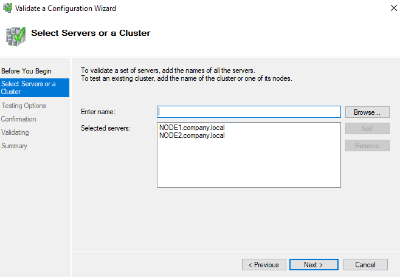

**Choose the testing scope.** "Run all tests (recommended)" is selected — this exercises Cluster Configuration, Inventory, Network, Storage, and System Configuration checks across both nodes. The wizard text also confirms the target platform here is **Windows Server 2022**:

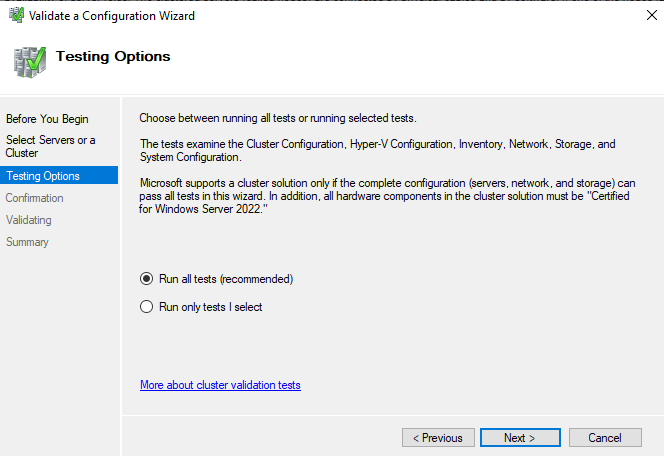

The wizard runs through every test and produces an HTML report; any failed test should be resolved before proceeding (common culprits at this stage are mismatched Windows updates between nodes, or a network that hasn't been tagged correctly).

---

## Part 2 — Create the Cluster

With validation passing, the **Create Cluster Wizard** is run from Failover Cluster Manager.

**Select servers for the cluster** — again both nodes:

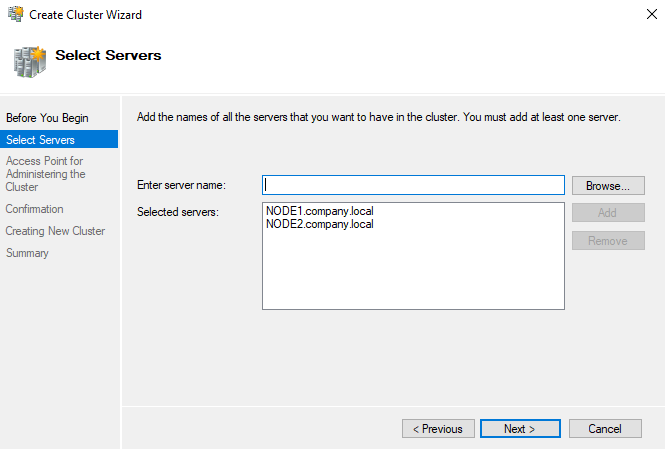

**Name the cluster and choose its access point.** This is the cluster's own identity on the network — its Cluster Name Object (CNO) and IP. Only the `192.168.3.0/24` network is checked, with the address `192.168.3.150` assigned, meaning the cluster's own network name will live on the "Cluster" network rather than the Domain or iSCSI ones:

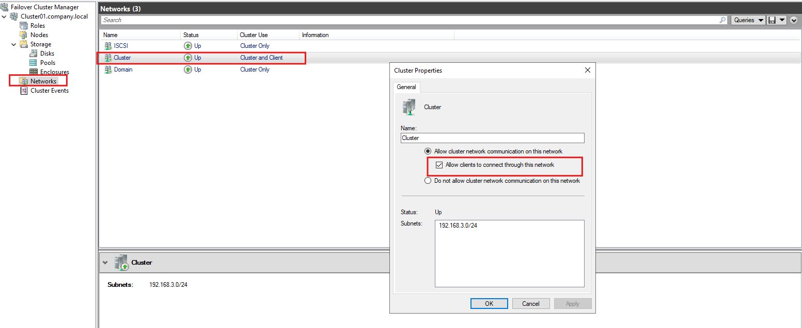

Once created, Failover Cluster Manager confirms both nodes joined successfully and are reporting `Up`, each with an assigned and current vote of `1` (their quorum vote — relevant again in Part 7):

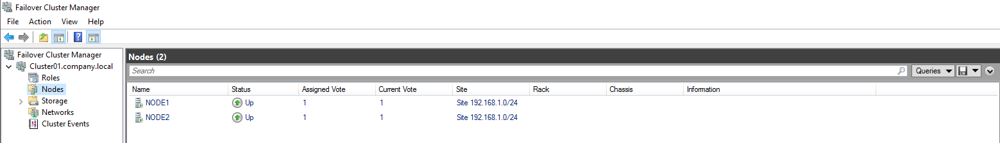

At this point the cluster itself exists, but it has no roles and the shared disks from Lab 1 haven't been added to it yet.

---

## Part 3 — Configure Cluster Networks

Failover Cluster Manager treats each NIC's subnet as a separate "cluster network" and lets you control, per network, whether it carries cluster communication and whether it's allowed to accept client connections. Since the cluster's access point (Part 2) and the File Server's IP (Part 4) both live on `192.168.3.0/24`, that network needs **"Allow clients to connect through this network"** enabled, while the Domain and iSCSI networks are left as internal-only.

> This screenshot (`task6-cluster-networks-only-cluster-allow-clients-to-connect.png`) came through completely black in the uploaded file, so no field values can be confirmed visually — but the setting it documents is exactly the one above, and it's consistent with the single-network selection already seen in the Access Point step.

---

## Part 4 — Add a Highly Available File Server Role

With the cluster networks sorted, the **High Availability Wizard** (Configure Role) is used to add the File Server.

**Select Role.** `File Server` is highlighted — and the wizard immediately surfaces a real prerequisite error here: *"The required role or feature, 'File Services', could not be found on any node."* This is the File Server role/feature itself (not the File Server **cluster role**) — it must be installed via Server Manager → Add Roles and Features on both nodes first, then the wizard can be re-run:

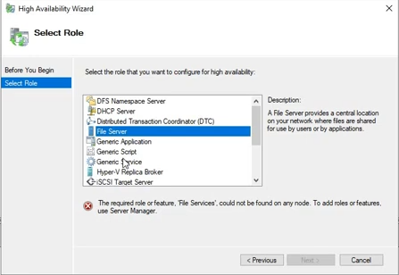

**Select Storage.** This page lets you pick which cluster disk(s) the File Server role will use.

> This screenshot (`task6-cluster-storage.png`) also came through completely black. Based on the share created later in Part 6 (a `H:` volume with 10.0 GB capacity), the disk selected here was Lab 1's **Disk01 (10 GB)** — it's the only one of the three LUNs that matches that size.

**Choose the File Server type.** **"File Server for general use"** is selected — the traditional active/passive clustered file server (SMB and NFS, supports Data Dedup, FSRM, DFS Replication). The alternative, Scale-Out File Server, is for active/active workloads like Hyper-V or SQL storage and isn't appropriate here:

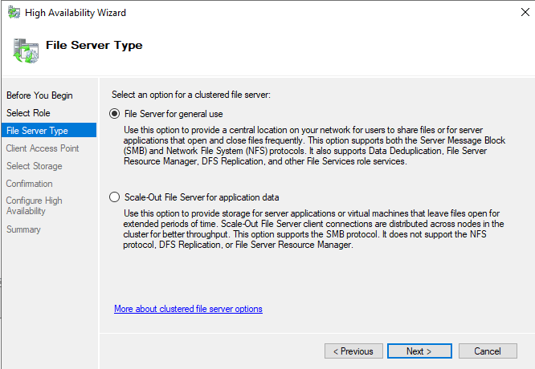

**Result.** The role comes up and is shown in Failover Cluster Manager as `public`, Running, Type File Server, currently owned by `Node2`:

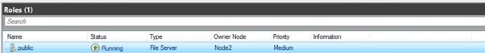

**Summary.** The wizard confirms high availability was configured successfully, and shows exactly what it created automatically: a Network Name of `public`, placed in the `CN=Computers,DC=tshoot,DC=com` OU in Active Directory, with IP address `192.168.3.160`:

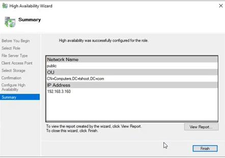

---

## Part 5 — Confirm the AD and DNS Objects

Two things happen automatically that are worth verifying directly, since they're exactly what client computers will rely on to actually find the cluster and the file server.

**Active Directory.** Both the cluster itself (`cluster1`) and the File Server role's network name (`public`) appear as **Computer objects** in AD — each one is a "Failover cluster virtual network name" object, created and managed by the cluster automatically (these are the CNO for the cluster and the VCO for the File Server role):

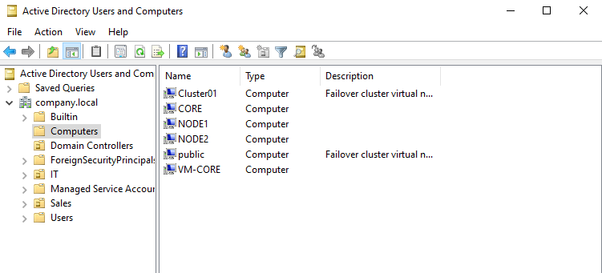

**DNS.** The `tshoot.com` zone shows host (A) records for `cluster1` → `192.168.3.150` and `public` → `192.168.3.160`, alongside the existing `Node1`, `Node2`, and `pdc` records from Lab 1. This is what lets users connect to `\\public\` or admins connect to `cluster1` by name instead of IP:

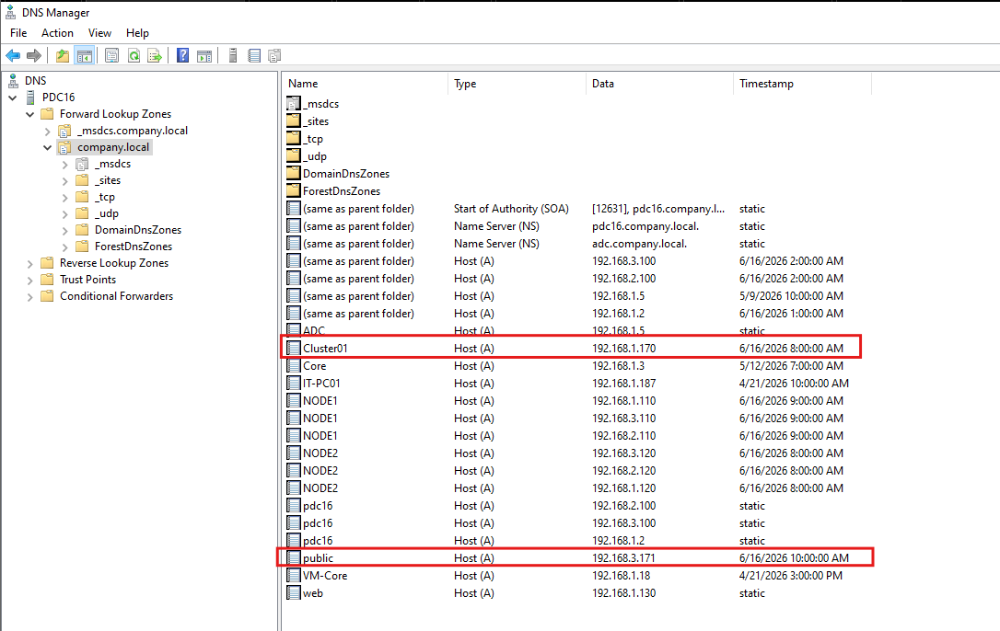

---

## Part 6 — Create and Verify a File Share

With the File Server role online, a share is created directly from Failover Cluster Manager → Roles, using the **New Share Wizard**.

**Select the server and path.** The `public` File Server role is selected, and `H:` (9.94 GB free of 10.0 GB capacity, NTFS) is chosen as the share location — this is Lab 1's `Disk01` now presented inside the cluster as drive `H:`:

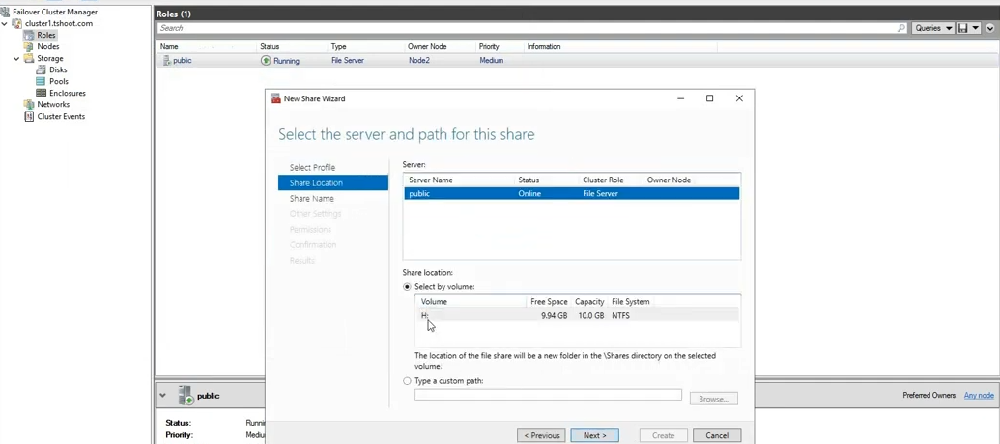

**Specify the share name.** The share is named `HR_data`, with a local path of `H:\Shares\HR_data` and a resulting remote/UNC path of `\\public\HR_data`:

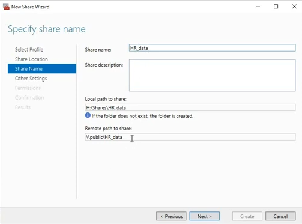

**Other Settings and Permissions.** The wizard's remaining pages — share settings (continuous availability, caching, encryption, etc.) and then sharing/NTFS permissions — were also captured, but both files uploaded as completely black images:

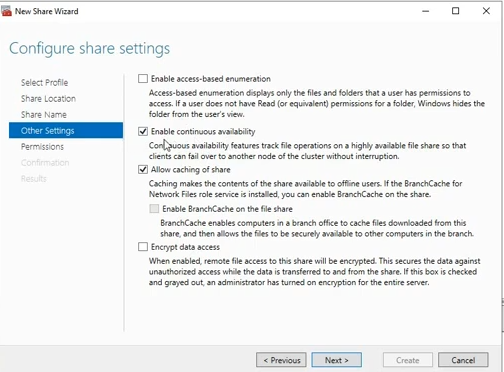

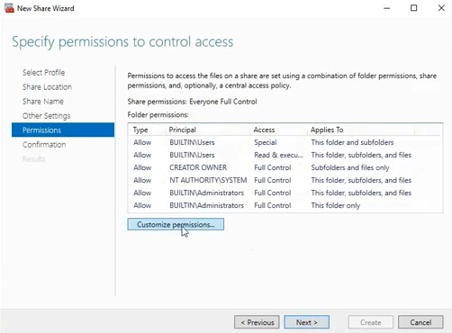

Both pages are standard wizard steps (toggle availability/caching/encryption options on one, then either accept default permissions or customize sharing + NTFS ACLs on the other) — re-capturing them isn't required for the lab to work, just for the documentation to be complete.

**Verification.** Browsing to `\\public\HR_data` from a client confirms the share is live and reachable over the network, here containing a test subfolder:

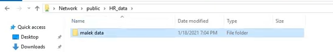

---

## Part 7 — Configure the Quorum Witness

Quorum determines how many node "votes" are needed to keep the cluster running and avoid a split-brain scenario if nodes lose contact with each other. With exactly two nodes (each with one vote, as seen back in Part 2), a witness is what gives the cluster a tie-breaking vote.

**Select Quorum Configuration Option.** Rather than leaving the default (which would normally auto-select a witness anyway for an even number of nodes), **"Select the quorum witness"** is explicitly chosen, to control exactly which witness type is used:

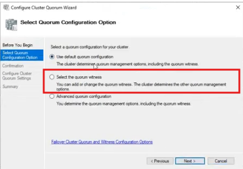

**Select Quorum Witness.** **"Configure a disk witness"** is chosen over a file share or cloud witness. This is where Lab 1's third, deliberately tiny **512 MB Disk03** finally gets used — a disk witness only needs to store cluster configuration metadata, so a small dedicated LUN is the standard choice:

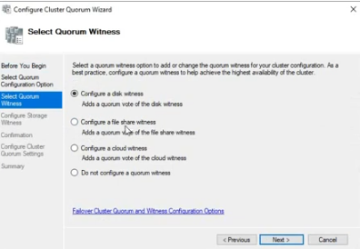

---

## Solution Summary — Expected End State

| Item | Value |
|---|---|
| Cluster name | `cluster1.tshoot.com` |
| Cluster access point | 192.168.3.150 |
| Cluster nodes | Node1, Node2 — both `Up`, vote = 1 each |
| Client-enabled network | 192.168.3.0/24 ("Cluster" network) |
| File Server role name | `public` |
| File Server role IP | 192.168.3.160 |
| File Server type | File Server for general use (active/passive) |
| File Server storage | Lab 1's Disk01 (10 GB), surfaced in-cluster as `H:` |
| File share | `HR_data` → `H:\Shares\HR_data` → `\\public\HR_data` |
| AD objects created | `cluster1` (CNO), `public` (VCO) — both under `CN=Computers,DC=tshoot,DC=com` |
| DNS records created | `cluster1` A → .150, `public` A → .160 |
| Quorum witness type | Disk witness |
| Quorum witness disk | Lab 1's Disk03 (512 MB) |

## Common Pitfalls

- **"File Services could not be found on any node"** when adding the File Server role — install the File Server role/feature (Server Manager → Add Roles and Features → File and Storage Services → File Server) on *every* node before configuring the role, not just the one currently running the wizard.
- **Validate a Configuration fails on Storage tests** — usually means a node can't see one of the iSCSI disks from Lab 1, or SAN policy still has it offline on one node; revisit Lab 1, Part 5.
- **Cluster access point doesn't come online** — check that the network chosen during cluster creation is actually set to allow client connections (Part 3); a network with cluster communication disabled won't host the name resource.
- **Quorum witness disk option is greyed out / unavailable** — the disk intended as the witness must already be added to cluster storage and not currently assigned to another role.

## Next Steps

With a working cluster, a highly available File Server, and a configured quorum witness, the natural next lab is a **planned and unplanned failover test** — moving the `public` role between Node1 and Node2 (or pulling power/network from the owning node) and confirming the `HR_data` share stays reachable throughout.

---

## Appendix — Screenshot Index

| File | Description |
|---|---|
| `task1-validate-cluster-step1.png` | Validate a Configuration Wizard — select servers |
| `task1-validate-cluster-step2.png` | Validate a Configuration Wizard — testing options (run all tests) |
| `task3-create-cluster-add-servers.png` | Create Cluster Wizard — select servers |
| `task4-name-and-cluster-network.png` | Create Cluster Wizard — cluster name & access point network |
| `task5-cluster-nodes.png` | Failover Cluster Manager — both nodes Up |
| `task6-cluster-configure-role.png` | High Availability Wizard — Select Role (File Server), missing-feature warning |
| `task6-cluster-networks-only-cluster-allow-clients-to-connect.png` | Cluster Networks — allow client connections *(uploaded blank/black)* |
| `task6-cluster-storage.png` | High Availability Wizard — Select Storage *(uploaded blank/black)* |
| `task7-configure-fileserver-as-active-passive.png` | High Availability Wizard — File Server Type (general use) |
| `task8-cluster-role.png` | Roles — `public` File Server running on Node2 |
| `task8-configure-fileserver-summary.png` | High Availability Wizard — Summary (Network Name, OU, IP) |
| `task9-cluster-and-fileserver-as-computers-in-AD.png` | AD Users and Computers — `cluster1` and `public` as Computer objects |
| `task10-dns-records-for-cluster-and-fileserver-role.png` | DNS Manager — A records for `cluster1` and `public` |
| `task11-file-share-from-roles.png` | New Share Wizard — select server/volume (H:) |
| `task12-specify-share-name.png` | New Share Wizard — share name `HR_data` |
| `task13-configure-share-settings.png` | New Share Wizard — Other Settings *(uploaded blank/black)* |
| `task14-specify-sharing-and-ntfs-permisiions.png` | New Share Wizard — Permissions *(uploaded blank/black)* |
| `task15-file-share.png` | File Explorer — `\\public\HR_data` reachable |
| `task16-select-quorum-settings.png` | Configure Cluster Quorum Wizard — select quorum option |
| `task17-select-quorum-witness.png` | Configure Cluster Quorum Wizard — disk witness selected |
