# Failover Cluster Lab 3 — Hyper-V Role and Highly Available Virtual Machines

This lab adds the **Hyper-V role** to the existing two-node failover cluster, creates a new virtual machine on shared cluster storage, configures that VM as a clustered, highly available role, and proves the whole thing works by migrating the running VM from one node to the other.

## Lab Objectives

- Enable nested virtualization on both cluster nodes (they are themselves VMs)
- Install the Hyper-V role on both nodes, choosing carefully which NIC becomes a virtual switch
- Recover network connectivity after Hyper-V rewires the host's networking stack
- Build a new VM (`CORE-VM`) with its files stored on shared cluster storage, not local disk
- Configure that VM as a highly available **Virtual Machine** role in Failover Cluster Manager
- Migrate the running VM between nodes and confirm it comes back up on the other side

## Environment Recap

| Role | Hostname | Notes |
|---|---|---|
| Cluster | `Cluster01.company.local` | Same `company.local` domain used in Lab 1 |
| Cluster node 1 | `NODE1.company.local` | |
| Cluster node 2 | `NODE2.company.local` | |
| Existing clustered role | `public` (File Server) | Carried over from Lab 2 — still running on `NODE1` throughout this lab |
| New clustered role | `CORE-VM` (Virtual Machine) | Built in this lab |

A detail worth calling out: `NODE1` and `NODE2` are themselves virtual machines (the screenshot in Part 1 below shows VMware-style hardware — an NVMe disk, a "Bridged (Automatic)" adapter, and adapters on `VMnet2`/`VMnet3`). That means Hyper-V here is running **nested** inside another hypervisor, which is exactly why Part 1 exists — nested virtualization has to be explicitly exposed before a guest OS can install and run Hyper-V itself.

## Prerequisites

- A working two-node failover cluster (`Cluster01.company.local`, with `NODE1`/`NODE2` as members) — see Lab 1 and Lab 2
- Shared cluster storage already presented to both nodes and assigned a drive letter (this lab uses `F:`)
- A Windows Server evaluation ISO available on shared storage for the new VM's guest OS install
- The host hypervisor (VMware Workstation/Player, based on the settings shown below) configured to allow nested virtualization on both node VMs

---

## Part 1 — Enable Nested Virtualization on Both Nodes

Before Hyper-V can be installed *inside* `NODE1` and `NODE2`, the underlying VM settings for each node need **"Virtualize Intel VT-x/EPT or AMD-V/RVI"** checked. Without this, Windows will refuse to enable the Hyper-V hypervisor because it can't see real CPU virtualization extensions — only the passthrough from the host:

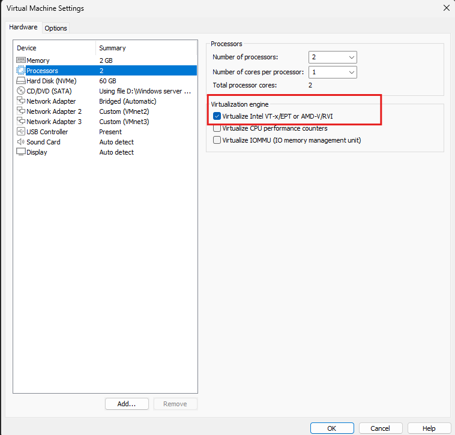

This setting is changed on **both** node VMs, while they're powered off, before moving on.

---

## Part 2 — Install the Hyper-V Role

With nested virtualization exposed, the Hyper-V role is installed via **Add Roles and Features Wizard** on each node.

**Create Virtual Switches.** This page is where Hyper-V decides which physical NICs become Hyper-V virtual switches (so VMs can reach the network). Only the **Domain** adapter is checked — the **Cluster** adapter is deliberately left unchecked:

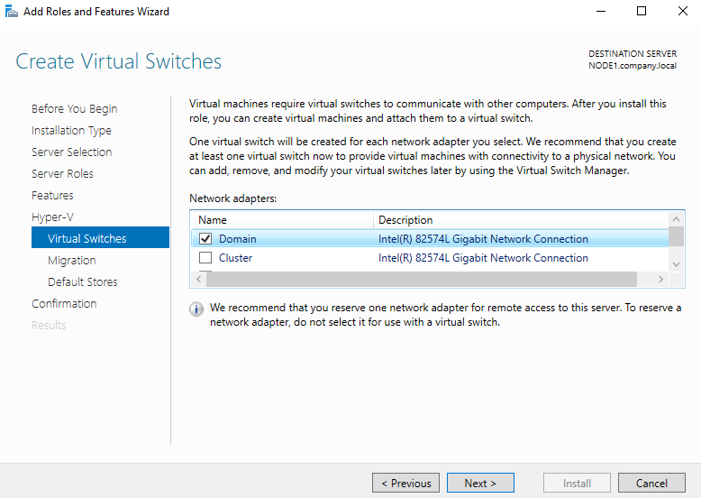

> Leaving the Cluster network out of this step matters: turning a NIC into a virtual switch briefly disrupts traffic on it while the switch is created, and you don't want that happening to the network carrying cluster heartbeat communication. The Domain NIC is the one VMs actually need reach the production network through, so it's the right one to convert.

**Installation progress.** The wizard installs Hyper-V itself along with the Hyper-V Management Tools (PowerShell module + GUI tools) and Remote Server Administration Tools:

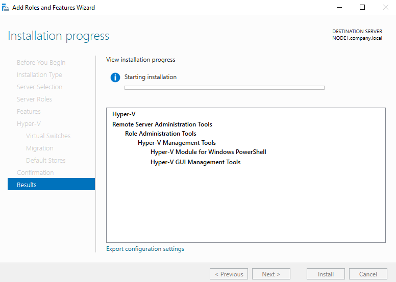

A reboot is required on both nodes after this completes.

---

## Part 3 — Recover Network Connectivity on the New Virtual NIC

Converting the Domain NIC into a virtual switch replaces the original network adapter's connection point with a new **Hyper-V Virtual Ethernet Adapter**. That new adapter usually doesn't carry over the static IP configuration automatically, so each node needs its IP settings reapplied — here, `192.168.1.120` (matching the addressing convention from Lab 1), subnet mask `255.255.255.0`, and DNS server `192.168.1.2`:

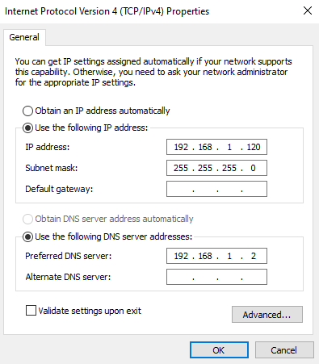

This is done on **both** nodes — a node that's still on DHCP or has no IP at all on this adapter will drop off the domain network until it's fixed.

---

## Part 4 — Create the Virtual Machine

A new VM, `CORE-VM`, is built using the **New Virtual Machine Wizard**. Its name strongly suggests a Server Core (no-GUI) guest OS install, consistent with the lab using it purely as a clustered test workload.

**Name and location.** The VM is named `CORE-VM`, and — critically for clustering — **"Store the virtual machine in a different location"** is checked, pointing it at `F:\` rather than the node's local disk:

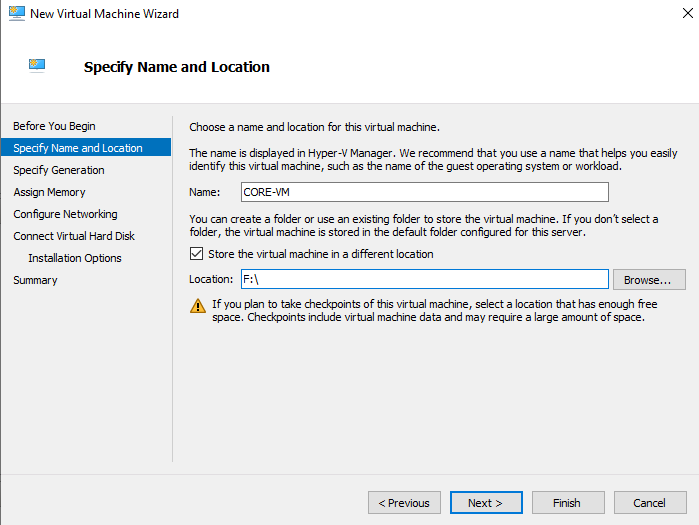

> This is the single most important choice in the whole VM-creation step. A clustered VM role can only fail over to another node if that node can also read the VM's configuration and virtual disk files — which means they must live on shared cluster storage (here, `F:`), never on a node's local `C:` drive.

**Generation.** **Generation 1** is selected — broader compatibility, BIOS-based boot, fine for a general-purpose Server Core VM (Generation 2 would add UEFI and newer virtual hardware, at the cost of requiring a 64-bit guest OS that supports it):

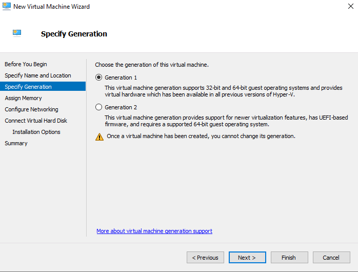

**Memory.** Startup memory of `1024 MB`, with **Dynamic Memory** enabled so Hyper-V can grow or shrink the allocation based on actual guest demand rather than reserving the full amount permanently:

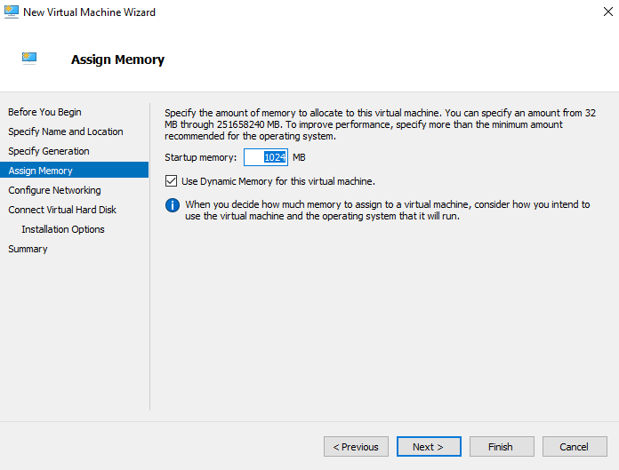

**Networking.** The VM's virtual NIC is connected to the virtual switch created back in Part 2:

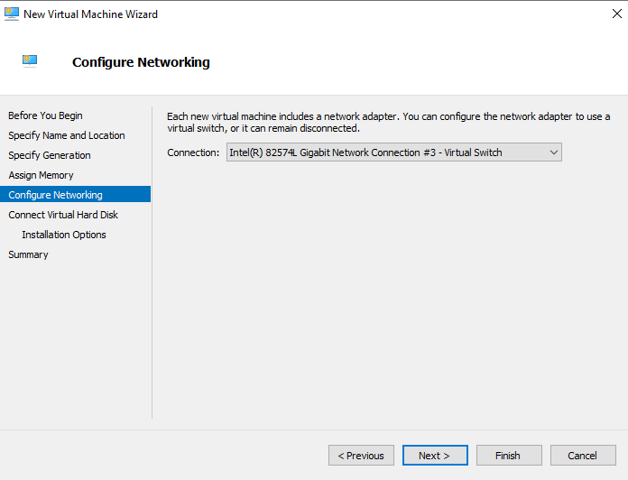

**Virtual hard disk.** A new dynamically expanding VHDX is created — `CORE-VM.vhdx`, stored at `F:\CORE-VM\Virtual Hard Disks\`, with a maximum size of `127 GB` (it only consumes that much space on `F:` as data is actually written, not up front):

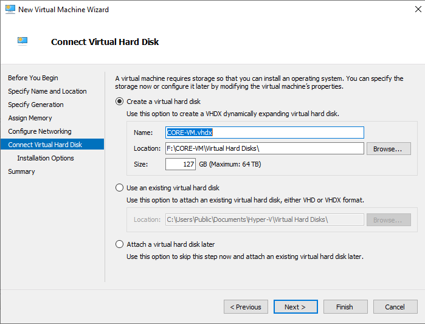

> The 127 GB *virtual* size against an `F:` volume that (per Lab 1's sizing) is realistically much smaller is exactly what dynamically expanding disks are for — the file starts small and only grows toward that ceiling as the guest OS actually fills it.

**Installation media.** The new VM boots from a Windows Server evaluation ISO staged on shared storage, `F:\SERVER_EVAL_x64FRE_en-us.iso`, to install the guest OS:

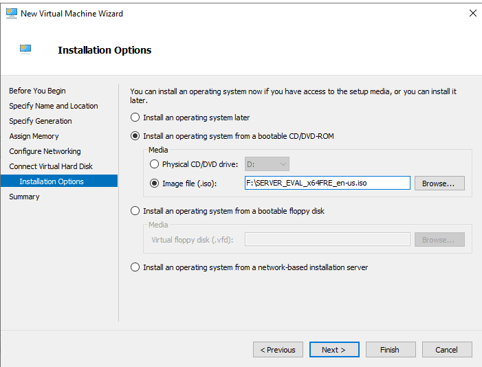

At this point `CORE-VM` exists and is running on `NODE1`, but Failover Cluster Manager doesn't know about it yet — it's just a regular, unclustered Hyper-V VM.

---

## Part 5 — Make the VM Highly Available

The **High Availability Wizard** (Configure Role, from Failover Cluster Manager) is used to bring `CORE-VM` under cluster management.

**Select Role.** `Virtual Machine` is the role type — the wizard's description sums up exactly what's about to happen: *a virtualized computer system that can run on, and move between, the cluster's physical nodes*:

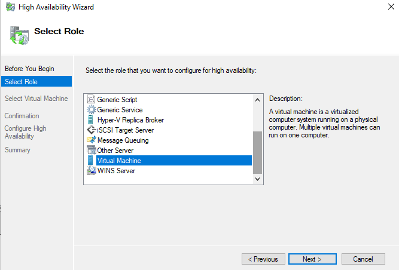

**Select Virtual Machine.** `CORE-VM` is listed, currently `Running` with a Host Server of `NODE1.company.local`, and is checked to bring under cluster control:

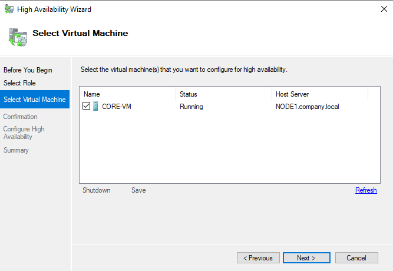

---

## Part 6 — Confirm the Role and Test Migration

**Confirm it's clustered.** Failover Cluster Manager now shows **two** roles: `CORE-VM` (Virtual Machine, owned by `NODE1`) alongside the `public` File Server role from Lab 2 (also still owned by `NODE1`) — both Running, both Medium priority:

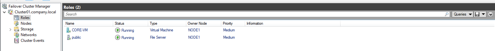

**Move the VM.** From Failover Cluster Manager, `CORE-VM` is moved to `NODE2` — the **Move Virtual Machine** dialog lists `NODE2` as the only other (and currently `Up`) destination node for the migration:

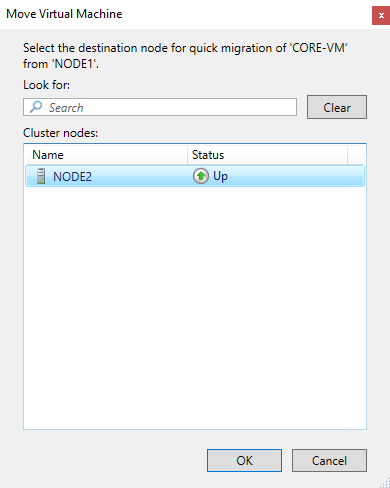

**Confirm it landed.** Hyper-V Manager, connected to `NODE2`, now shows `CORE-VM` in the **Starting** state with a fresh uptime of `00:00:00` — proof the VM has actually moved and is coming back up on the new owner node:

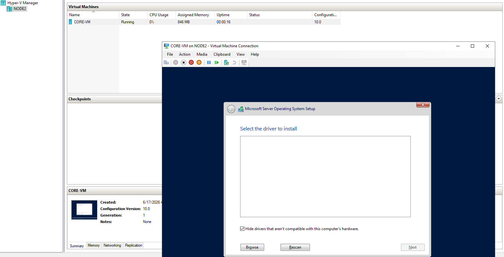

> The brief `Starting`/reset-uptime state here points to a **Quick Migration** (save state → move → resume) rather than a true zero-downtime **Live Migration**. Live Migration typically requires the VM's storage to be on a Cluster Shared Volume (CSV) rather than a plain lettered cluster disk, plus compatible processors between nodes — worth revisiting in a follow-up lab if zero-downtime moves are the goal.

---

## Solution Summary — Expected End State

| Item | Value |
|---|---|
| Cluster | `Cluster01.company.local` |
| Hyper-V virtual switch | Created from the **Domain** NIC on both nodes |
| Node IP after Hyper-V install | `192.168.1.120` / `255.255.255.0`, DNS `192.168.1.2` (per node, on the new vEthernet adapter) |
| VM name | `CORE-VM` |
| VM generation | Generation 1 |
| VM memory | 1024 MB startup, Dynamic Memory enabled |
| VM storage | `F:\CORE-VM\Virtual Hard Disks\CORE-VM.vhdx`, 127 GB dynamically expanding |
| VM install source | `F:\SERVER_EVAL_x64FRE_en-us.iso` |
| Clustered role type | Virtual Machine |
| Roles after this lab | `CORE-VM` (Virtual Machine) + `public` (File Server) |
| Migration tested | `NODE1` → `NODE2`, via Move / Quick Migration |

## Common Pitfalls

- **Hyper-V install fails or won't enable** — if `NODE1`/`NODE2` are nested VMs, the host-level "Virtualize Intel VT-x/EPT or AMD-V/RVI" setting from Part 1 must be on, or the hypervisor simply won't start inside the guest.
- **Cluster heartbeat drops during/after Hyper-V install** — almost always caused by accidentally creating a virtual switch on the Cluster NIC instead of (or in addition to) the Domain NIC.
- **Node loses domain connectivity after Hyper-V install** — the new Hyper-V virtual Ethernet adapter doesn't always inherit the old static IP; reapply it manually as in Part 3, on every node.
- **"Configure High Availability" fails for a VM** — the most common cause is the VM's files living on a node's local disk instead of shared cluster storage; the VM has to be created (or moved) onto shared storage first.
- **Migration causes downtime** — Quick Migration (save/move/resume) is expected to briefly stop the VM; if true zero-downtime failover is required, the VM's storage needs to be on a Cluster Shared Volume and Live Migration needs to be used instead.

## Next Steps

With a highly available VM proven out, a natural follow-up is converting `F:` into a **Cluster Shared Volume (CSV)** so multiple VMs can live on the same volume simultaneously and so true **Live Migration** becomes possible, then testing an actual node failure (rather than a planned move) to confirm `CORE-VM` automatically restarts on the surviving node.

---

## Appendix — Screenshot Index

| File | Description |
|---|---|
| `task1-enable-virtualization-on-both-servers.png` | Enable nested virtualization (VT-x/AMD-V passthrough) on both node VMs |
| `task2-hyperv-virtual-switch.png` | Add Roles and Features Wizard — create virtual switch from the Domain NIC |
| `task3-hyperv-install.png` | Add Roles and Features Wizard — Hyper-V installation progress |
| `task4-change-the-ip-configuration-of-hyperv-virtual-nic-on-bith-nodes.png` | Reassigning static IP to the new Hyper-V virtual NIC |
| `task5-vm-name-and-store-it-on-external-storage.png` | New VM Wizard — name `CORE-VM`, stored on `F:\` |
| `task5-vm-generation.png` | New VM Wizard — Generation 1 |
| `task5-assign-vm-ram.png` | New VM Wizard — 1024 MB, Dynamic Memory |
| `task5-vm-network.png` | New VM Wizard — connect to virtual switch |
| `task5-vm-hard-disk.png` | New VM Wizard — 127 GB dynamically expanding VHDX on `F:` |
| `task5-vm-install-from-iso.png` | New VM Wizard — boot from Server evaluation ISO |
| `task6-add-virtualmachine-role.png` | High Availability Wizard — Select Role: Virtual Machine |
| `task7-select-core-vm.png` | High Availability Wizard — Select Virtual Machine: CORE-VM |
| `task8-vm-running-on-node1.png` | Failover Cluster Manager — CORE-VM and public, both on NODE1 |
| `task9-move-vm-to-node2.png` | Move Virtual Machine — destination NODE2 |
| `task10-vm-run-on-node2.png` | Hyper-V Manager on NODE2 — CORE-VM Starting |
