# MDT + WDS Lab — Building a Network-Based Windows Deployment Solution

This lab builds a complete **Lite Touch Installation (LTI)** deployment solution using the **Microsoft Deployment Toolkit (MDT)**, the **Windows ADK**, and **Windows Deployment Services (WDS)**. By the end, a PXE-booting client on the network can pull a fully unattended Windows 10 Pro install — complete with bundled applications (Firefox, 7-Zip) and zero prompts — straight off the deployment server.

> Note: although the user-facing request for this writeup referred to a "WDT" lab, the screenshots are all **MDT (Microsoft Deployment Toolkit)** and **WDS (Windows Deployment Services)** — this README documents what's actually shown.

## Lab Objectives

- Install the **Windows ADK** and the **Windows PE add-on**, then **MDT** itself
- Install the **WDS** role so clients can PXE boot to the network
- Fix a real-world image problem: Windows 10 ships as `install.esd` (a compressed, non-importable format) and has to be converted to `install.wim` before MDT can use it
- Configure **DHCP Option 60/66/67** so PXE clients know which WDS server to boot from and which boot file to request
- Create an MDT **Deployment Share**, import the Windows 10 Pro image into it, and confirm the share's permissions
- Add applications (Firefox, 7-Zip) for silent, unattended install alongside the OS
- Build a **Task Sequence** that ties the OS image, product key, and applications together into one deployable unit
- Configure **Bootstrap.ini** / **CustomSettings.ini** so the deployment wizard runs with zero (or minimal) user interaction
- Update the deployment share to generate a working **Windows PE boot image** for WDS to serve

## Environment

| Role | Hostname | Notes |
|---|---|---|
| Deployment server | `PDC16` | Hosts DHCP, WDS, and the MDT Deployment Share |
| Domain | `company.local` | NetBIOS domain: `company` |
| Deployment share (local) | `F:\DeploymentShare` | |
| Deployment share (network) | `\\PDC16\DeploymentShare$` | Hidden share (trailing `$`) |
| Target OS | Windows 10 Pro x64 | Imported as `install.wim`, index 1 |
| Task sequence ID | `TS001` (`Win10_64`) | |

---

## Part 1 — Install the Prerequisites: ADK, Windows PE Add-on, MDT

Three separate installers are required, in order, before MDT can build anything: the ADK itself, the Windows PE add-on (a separate download that plugs into the ADK), and then MDT.

**Windows ADK — select features.** Only the components MDT actually needs are selected: **Deployment Tools** and **User State Migration Tool (USMT)** — the rest (ICD, Configuration Designer, VAMT, App-V tooling, etc.) aren't required for this lab and are left unchecked, saving install time and disk space:

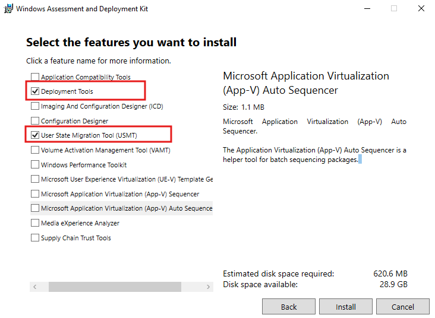

**Windows PE Add-on.** A second, separate installer adds **Windows Preinstallation Environment (Windows PE)** support — required because MDT's deployment wizard actually runs *inside* a WinPE boot image, not inside the full target OS:

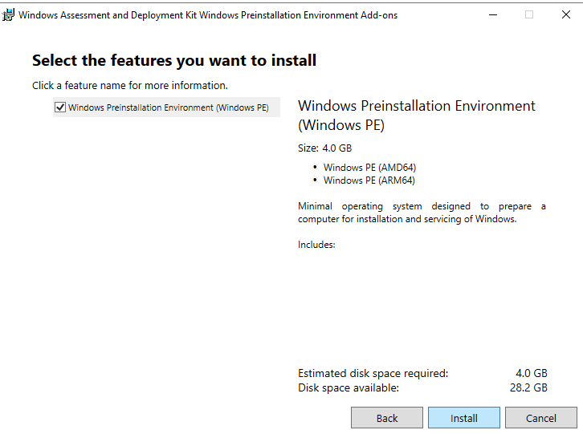

**Install MDT.** The Microsoft Deployment Toolkit installer runs last, since it depends on the ADK components above already being present:

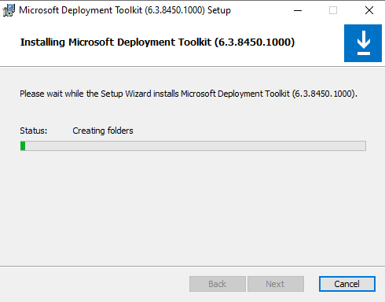

> **Note on this screenshot's filename:** it's named `task2-install-wds.png`, but it actually captures the **MDT** setup wizard ("Installing Microsoft Deployment Toolkit (6.3.8450.1000)..."), not a Windows Deployment Services role installation. The lab clearly *does* use WDS — DHCP is configured for PXE boot in Part 3, and the generated boot image in Part 12 is meant to be served by WDS — but no distinct screenshot of the WDS role-installation step (Server Manager → Add Roles and Features → Windows Deployment Services) was included in this set. That step still needs to happen on `PDC16` before PXE boot will work, even though it isn't pictured here.

---

## Part 2 — Convert install.esd to install.wim

Retail/eval Windows 10 ISOs ship `sources\install.esd` instead of `install.wim`. `.esd` is a highly compressed, encrypted-capable format used for distribution — but **MDT's Import Operating System wizard can't import an `.esd` file directly**, so it has to be converted to `.wim` first using `dism`.

**Step 1 — inspect the image and attempt the export.** `dism /Get-WimInfo` against `install.esd` lists all seven SKUs bundled inside it (Home, Home N, Home Single Language, Education, Education N, Pro, Pro N) along with their index numbers — Windows 10 Pro is **index 6**. The first export attempt fails with `Error: 5` (access denied) when run directly inside the mounted ISO's `E:\sources` folder, since that path is read-only:

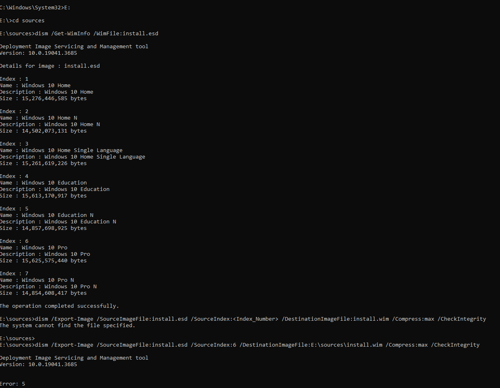

**Step 2 — export to a writable location.** A new folder, `C:\NewWim`, is created on the local (writable) drive, and the export is re-run targeting that folder instead — `dism /Export-Image /SourceImageFile:E:\sources\install.esd /SourceIndex:6 /DestinationImageFile:C:\NewWim\install.wim /Compress:max /CheckIntegrity`. This time it proceeds normally:

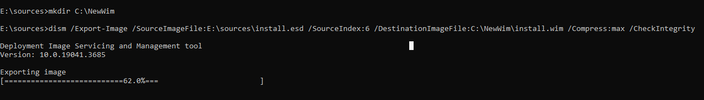

> **Lesson:** `dism` needs write access to the destination path. Running it from inside a mounted, read-only ISO volume (`E:\`) will fail with Error 5 even though the read side of the operation is fine — always export to local writable storage.

**Step 3 — confirm and reintegrate.** The resulting `install.wim` (4,587,253 KB) is placed back into the working Windows ISO at `\sources\install.wim`, confirmed here inside an ISO-editing tool, ready to either build a new bootable ISO or be used directly as the import source for MDT:

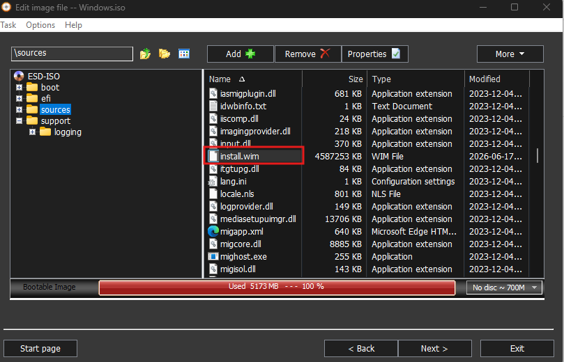

---

## Part 3 — Configure DHCP for PXE Boot

For a client to PXE boot against WDS, DHCP needs to hand out a few extra scope options beyond the usual IP/gateway/DNS — these tell the client's PXE firmware where the boot server is and what file to request:

| Option | Value | Purpose |
|---|---|---|
| 006 DNS Servers | 192.168.2.1 | Standard DNS option |
| 015 DNS Domain Name | company.local | Standard domain option |
| 066 Boot Server Host Name | 192.168.2.1 | Tells the client which TFTP/WDS server to contact |
| 067 Bootfile Name | `boot\x64\wdsmgfw.efi` | The actual boot loader file to request (UEFI x64 path) |
| 060 PXEClient | PXEClient | Identifies this scope as PXE-capable to client firmware |

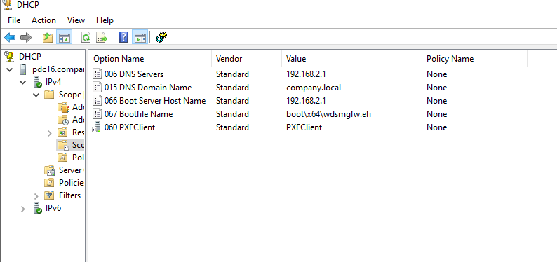

> Option 67's value, `boot\x64\wdsmgfw.efi`, confirms this lab targets **UEFI** clients specifically — BIOS/legacy clients would instead request `boot\x86\wdsnbp.com` or similar.

---

## Part 4 — Mount the Working ISO to a Build VM

With the corrected ISO (containing `install.wim`) ready, it's attached to a test/build VM's virtual CD/DVD drive as `D:\Windows 10 ISO\Windows.iso`, so the VM can be used to validate the image or stage files for the deployment share:

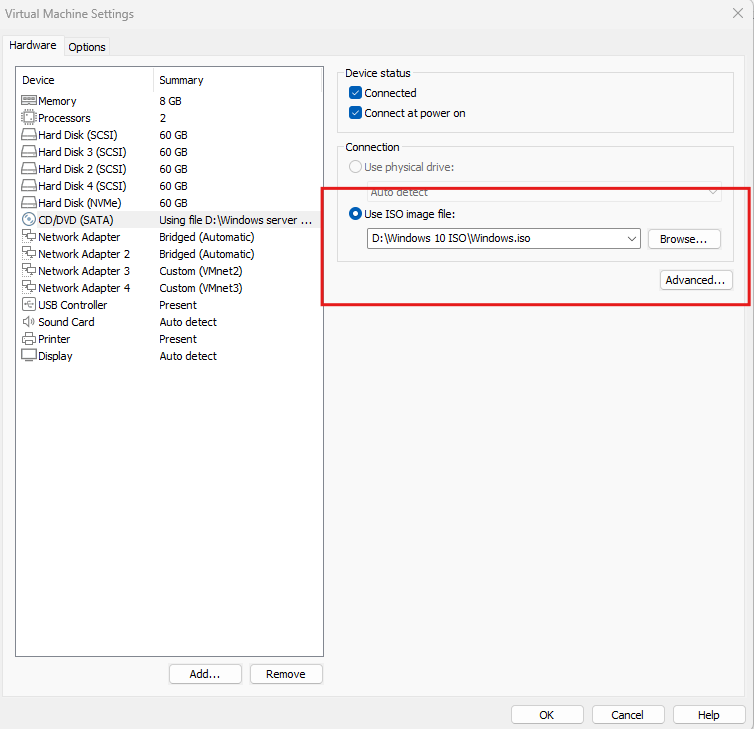

---

## Part 5 — Create the MDT Deployment Share

The **New Deployment Share Wizard** (run from the Deployment Workbench) sets up the folder structure and share that will hold the OS image, applications, drivers, and task sequences.

**Summary.** Key choices: local path `F:\DeploymentShare`, share name `DeploymentShare$` (the trailing `$` hides it from casual network browsing while still being fully accessible by UNC path), and every "ask about/for" prompt (Backup, Product Key, Admin Password, Image Capture, BitLocker) is set to **False** — laying the groundwork for the fully unattended deployment configured later in Part 9:

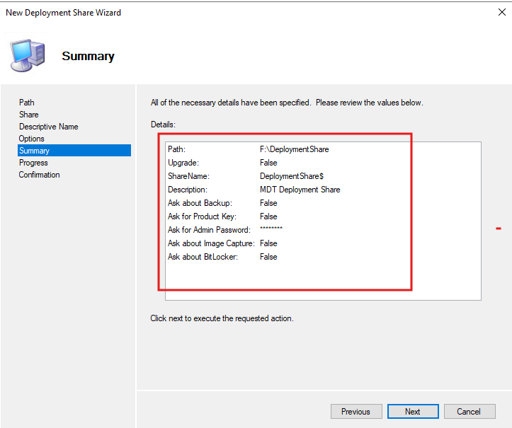

---

## Part 6 — Import the Windows 10 Pro Operating System

The **Import Operating System Wizard** pulls the corrected install image into the deployment share.

**Summary.** OS Type `SOURCE` (a full set of source files, not a single custom WIM), source path `D:\` (the mounted ISO from Part 4), destination folder name `Windows 10 Pro x64`, and `MoveOS: False` — meaning the files are **copied** into the deployment share rather than moved out of the source location:

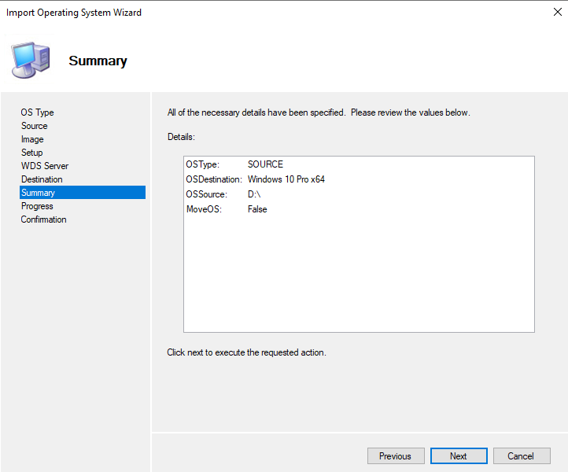

**Confirm the imported OS details.** Once imported, the OS shows up in the Deployment Workbench as a selectable item with full metadata pulled straight from the WIM: build `10.0.19041.3803`, platform `x64`, image index `1`, image name `Windows 10 Pro`, size `14901 MB`, image flags `Professional`, stored at `.\Operating Systems\Windows 10 Pro x64\Sources\install.wim`:

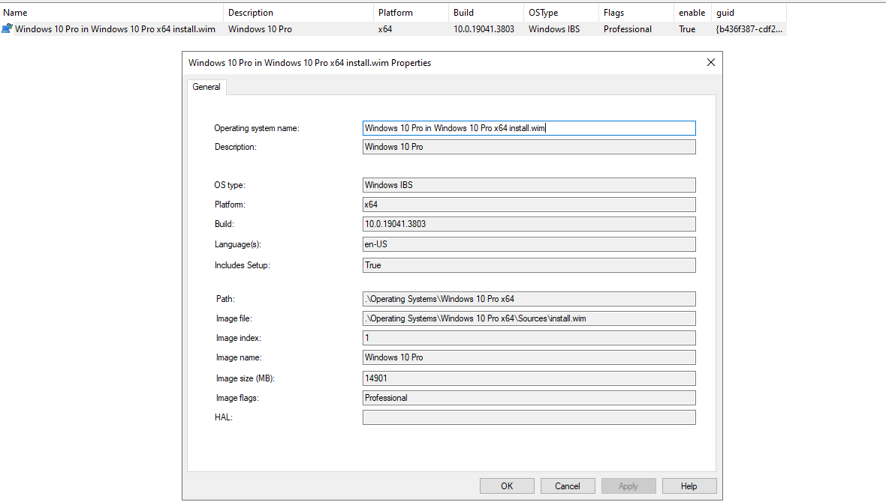

---

## Part 7 — Verify the Deployment Share's Network Sharing

Since the share was created with the hidden `$` suffix, it's worth confirming the share is actually live and reachable. The folder's **Sharing** tab confirms the network path is `\\PDC16\DeploymentShare$` and the share status reads **Shared**:

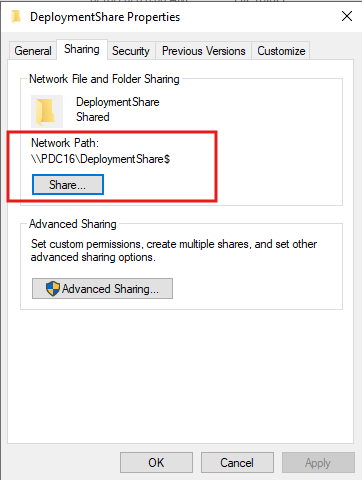

---

## Part 8 — Add Applications for Silent Deployment

Two applications are added via the **New Application Wizard** so they install automatically as part of the same deployment that lays down Windows itself.

**Mozilla Firefox.** Application type `COPY` (files are copied into the deployment share rather than referenced from a network path), source directory `F:\Programs\FireFox`, and a silent install command line of **`Firefox Installer.exe /norestart`**:

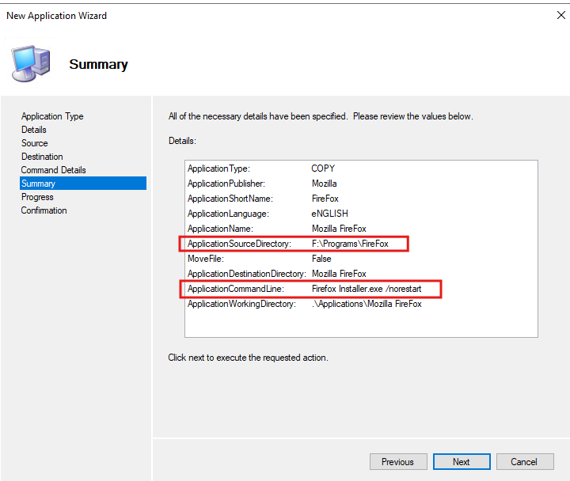

**7-Zip.** Same pattern: type `COPY`, source `F:\Programs\7-Zip`, command line **`7z2601-x64.exe /norestart`**:

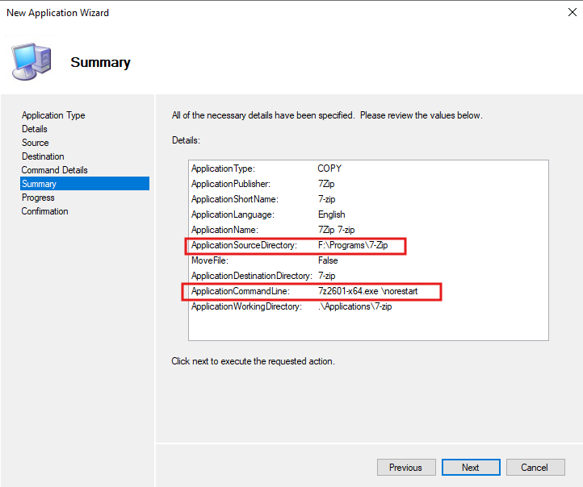

> Both install commands rely on each installer's own native silent-install switches plus `/norestart` to prevent either application from rebooting the machine mid-task-sequence — a reboot at the wrong moment would interrupt the deployment.

---

## Part 9 — Build the Task Sequence

The **New Task Sequence Wizard** ties the OS image, license info, and organizational defaults together into a single deployable sequence.

**Summary.** Task Sequence ID `TS001`, name `Win10_64`, template `Client.xml` (the standard client OS deployment template), operating system `Windows 10 Pro in Windows 10 Pro x64 install.wim`, organization name `company`, full name `Windows User`, home page `about:blank`, and `IsUpgradeTS: False` (this is a clean/refresh deployment, not an in-place upgrade):

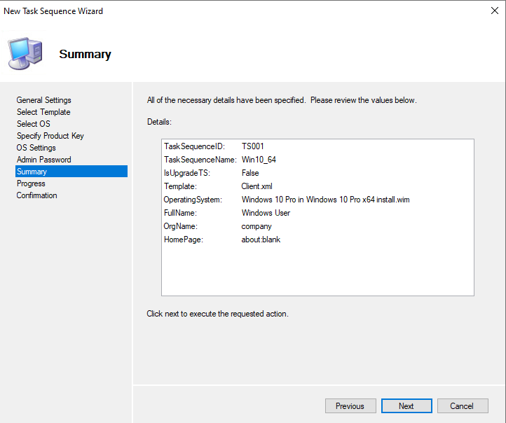

**Confirm the task sequence is enabled.** Reopening `Win10_64` Properties confirms `Enable this task sequence` is checked and `This can run on any platform` is selected — meaning it isn't artificially restricted to a specific client OS/architecture filter:

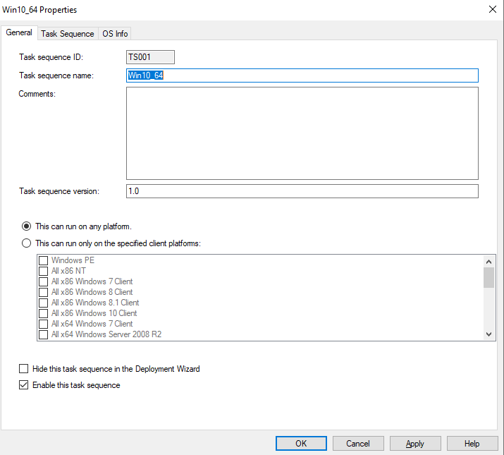

---

## Part 10 — Configure the Deployment Share's Platform Support and Rules

**General — platform support.** Back on the Deployment Share's own Properties, only **x64** is checked under Platforms Supported — this deployment share will not build or serve x86 boot images, matching the x64-only OS and bootfile (`wdsmgfw.efi`) used throughout this lab:

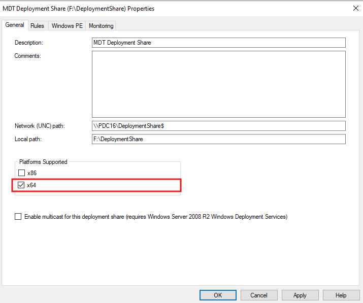

**Rules — Bootstrap.ini and CustomSettings.ini.** This is where the "ask nothing" deployment experience actually gets implemented. The **Rules** tab (which edits `CustomSettings.ini`) sets `SkipCapture=YES`, `SkipAdminPassword=YES`, `SkipProductKey=YES`, `SkipComputerBackup=YES`, `SkipBitLocker=YES`, along with domain-join automation: `JoinDomain=company.local`, `DomainAdmin=administrator`, `DomainAdminDomain=company`, `MachineObjectOU=OU=IT,DC=company,DC=local`. Alongside it, **Bootstrap.ini** (which runs *before* the share is even connected to) specifies `DeployRoot=\\PDC16\DeploymentShare$` and the credentials (`UserDomain`, `UserID`, `UserPassword`) WinPE uses to authenticate to that share in the first place:

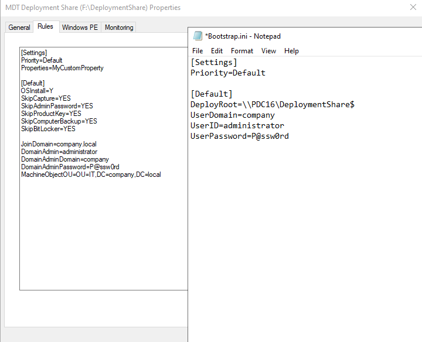

> **Security note:** `Bootstrap.ini` and `CustomSettings.ini` store these credentials in **plain text** inside the deployment share. In a lab this is fine; in production, a dedicated low-privilege deployment account (not a Domain Admin) should be used, and the share's NTFS/share permissions tightened accordingly.

---

## Part 11 — Confirm Windows PE Feature Packs

Under the **Windows PE** tab → **Features** sub-tab (platform: x86 view shown here), no extra Feature Packs are added — the default WinPE feature set generated by MDT is sufficient for this lab's needs (no extra language packs, scripting engines, or driver injection requirements beyond what ADK's WinPE add-on already provides):

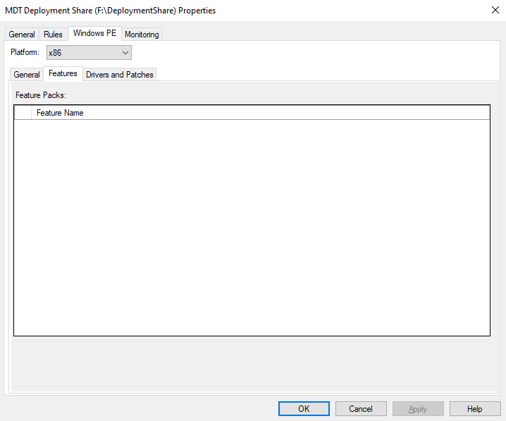

---

## Part 12 — Update the Deployment Share (Generate the Boot Image)

Running **Update Deployment Share** is the step that actually compiles everything configured so far — the OS, applications, task sequence, and rules — into a bootable **LiteTouchPE_x64.wim** boot image that WDS can serve to PXE clients.

**Confirmation.** The log shows the process completing successfully: ensuring the share has the latest x86/x64 tools, processing the **LiteTouchPE (x64) boot image**, mounting the base WinPE WIM from the ADK install path, setting the WinPE system root and scratch space, and adding the required WinPE components (`winpe-hta`, `winpe-scripting`, `winpe-wmi`, `winpe-securestartup`, `fmapi`, `winpe-mdac`, and more):

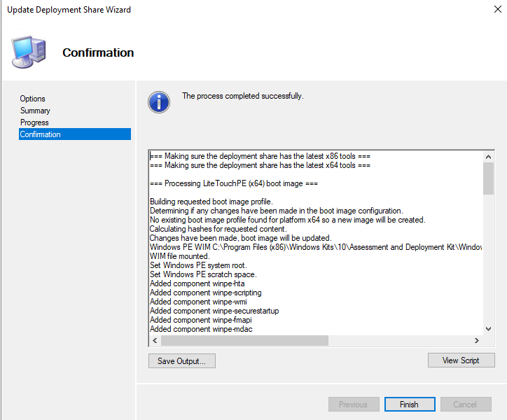

The resulting boot WIM (typically `F:\DeploymentShare\Boot\LiteTouchPE_x64.wim`) is then added to WDS as a boot image, making the whole deployment share PXE-bootable.

---

## Solution Summary — Expected End State

| Item | Value |
|---|---|
| ADK components installed | Deployment Tools, USMT, Windows PE Add-on |
| WDS role | Installed on `PDC16` |
| OS image fix | `install.esd` (index 6, Windows 10 Pro) exported to `install.wim` via DISM |
| DHCP PXE options | 060 PXEClient, 066 → 192.168.2.1, 067 → `boot\x64\wdsmgfw.efi` |
| Deployment share | `F:\DeploymentShare` / `\\PDC16\DeploymentShare$` |
| Imported OS | Windows 10 Pro x64, build 10.0.19041.3803, index 1 |
| Applications | Mozilla Firefox (silent), 7-Zip (silent) |
| Task sequence | `TS001` / `Win10_64`, template Client.xml |
| Platforms supported | x64 only |
| Unattended settings | Skip capture, admin password, product key, backup, BitLocker prompts |
| Domain join | `company.local`, OU=IT |
| Boot image | LiteTouchPE (x64), generated via Update Deployment Share |

## Common Pitfalls

- **"Cannot import install.esd"** in the Import Operating System wizard — MDT doesn't support `.esd` directly; convert it to `.wim` first with `dism /Export-Image` as shown in Part 2.
- **`dism /Export-Image` fails with Error 5 (access denied)** — the destination path isn't writable; this happens when working directly inside a mounted, read-only ISO. Export to local disk (e.g. `C:\NewWim`) instead.
- **Client PXE boots but can't find the server** — double-check DHCP options 066 (boot server IP) and 067 (boot filename) match the WDS server's actual IP and the correct architecture's boot file (UEFI vs BIOS).
- **Deployment wizard still prompts for things you tried to skip** — `Skip*=YES` settings must be paired with the corresponding default value also being set (e.g. skipping the product key prompt still requires `ProductKey=` to be defined, even if blank, or the install can hang); double check `CustomSettings.ini` syntax.
- **WinPE can't connect to the deployment share at boot** — check `Bootstrap.ini`'s `DeployRoot` and credentials; this file controls the very first connection, before `CustomSettings.ini` is even read.
- **Applications don't install silently** — verify the install switches in `ApplicationCommandLine` actually match that installer's supported silent-install flags; not all installers honor a generic `/norestart` alone.

## Next Steps

With a working Lite Touch deployment share, the natural next steps are: adding device drivers for the actual target hardware/VM platform, testing a full PXE boot end-to-end against a clean VM, and optionally converting select settings in `CustomSettings.ini` to use **MDT databases or web services** for fully dynamic, zero-touch (ZTI) deployments at scale.

---

## Appendix — Screenshot Index

| File | Description |
|---|---|
| `task1-install-adk.png` | Windows ADK — select features (Deployment Tools, USMT) |
| `task2-install-winPE.png` | Windows ADK WinPE Add-on — select features |
| `task2-install-wds.png` | MDT installer running (filename says "wds" but content shows the MDT setup wizard — see note in Part 1) |
| `task3-convert-esd-to-wim-cmd1.png` | DISM — Get-WimInfo on install.esd; first export attempt fails (Error 5) |
| `task3-convert-esd-to-wim-cmd2.png` | DISM — successful export to C:\NewWim\install.wim |
| `task4-make-sure-its-wim.png` | install.wim confirmed inside the working ISO's \sources folder |
| `task5-dhcp-options.png` | DHCP scope options for PXE boot (006/015/060/066/067) |
| `task6-mount-win10-iso.png` | VM Settings — CD/DVD using the corrected Windows.iso |
| `task7-crete-deployment-share.png` | New Deployment Share Wizard — Summary |
| `task8-import-windows-os.png` | Import Operating System Wizard — Summary |
| `task9-os-details.png` | Imported OS Properties — Windows 10 Pro details |
| `task10-hidden-shared.png` | DeploymentShare Properties — Sharing tab, network path |
| `task11-add-firefox-application.png` | New Application Wizard — Firefox, Summary |
| `task12-add-7zip-application.png` | New Application Wizard — 7-Zip, Summary |
| `task13-add-task-sequence.png` | New Task Sequence Wizard — Summary |
| `task14-task-sequence-properities.png` | Win10_64 Properties — enabled, runs on any platform |
| `task15-deployment-share-general.png` | Deployment Share Properties — General, x64 platform only |
| `task16-deployment-rules-bootstrap-and-customsettings.png` | Rules tab — Bootstrap.ini & CustomSettings.ini |
| `task17-install-winPE-Features.png` | Windows PE → Features tab — no extra Feature Packs |
| `task18-update-deployment-share.png` | Update Deployment Share Wizard — Confirmation, success |
