# MDT + WDS Lab (Continued) — Boot Image Deployment, Driver Injection, and Reference Image Capture

This README continues directly from the first **MDT + WDS Lab** README (ADK/MDT/WDS install → ESD-to-WIM conversion → deployment share → OS import → applications → task sequence → DHCP PXE options). With that foundation in place, this part takes the generated boot image live on WDS, proves a real client can PXE boot to it, injects out-of-box network drivers so deployed machines actually get a NIC driver during setup, and finally builds a second task sequence whose entire purpose is to **capture** a fully-built reference machine back into a new, reusable WIM image.

## Lab Objectives

- Add the LiteTouch PE boot image, generated by `Update Deployment Share` in the previous lab, to **WDS** as an actual boot image
- PXE boot a real client and confirm it reaches the WDS server and starts pulling the boot file
- Import a batch of out-of-box Intel network drivers into the deployment share
- Group those drivers into a **Selection Profile** so they can be targeted precisely
- Wire that Selection Profile into the **Inject Drivers** step of the deployment task sequence
- Build a dedicated **Capture-only** task sequence for turning a fully configured reference machine into a new master image
- Adjust `CustomSettings.ini` so this rebuilt machine prompts for a capture decision instead of running a normal install
- Update the deployment share again so all the above changes (drivers, new task sequence, rules changes) take effect
- Run `LiteTouch.vbs` from the deployment share on the reference machine and walk through capturing it to a new `.wim`

## Environment Recap

| Item | Value | Notes |
|---|---|---|
| Deployment server | `PDC16` | Same as previous lab |
| Deployment share | `\\PDC16\DeploymentShare$` | |
| Boot image | `F:\DeploymentShare\Boot\LiteTouchPE_x64.wim` | Generated previously, added to WDS in this lab |
| Driver storage location | `Out-of-Box Drivers\Windows 10 x64 Drivers` | New folder created for Intel NIC drivers |
| Selection profile | `Windows_10_Drivers` | Scopes driver injection to just that folder |
| Original deployment task sequence | `Win10_64` (`TS001`, from the previous lab) | Now updated to inject drivers |
| New capture task sequence | `Win10_64_Capture` (`TS` `003`, template `CaptureOnly.xml`) | Built in this lab |
| Captured image output | `\\PDC16\DeploymentShare$\Captures\Win10Updated.wim` | |

---

## Part 13 — Add the LiteTouch Boot Image to WDS

The boot image MDT generated (`LiteTouchPE_x64.wim`) doesn't automatically appear as something WDS can hand out over PXE — it has to be explicitly added to WDS's **Boot Images** node using the **Add Image Wizard**.

**Summary.** Image group `Boot Images`, image file `F:\DeploymentShare\Boot\LiteTouchPE_x64.wim`, with the single selected image `Lite Touch Windows PE (x64)`:

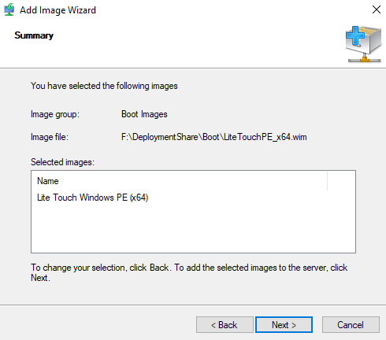

Once this completes, WDS has a real boot image on file and is ready to serve it to any client that PXE boots against it.

---

## Part 14 — Confirm PXE Boot End-to-End

With DHCP options 060/066/067 configured (previous lab) and the boot image now live in WDS, a test client is powered on and allowed to PXE boot. The console output confirms every link in the chain worked:

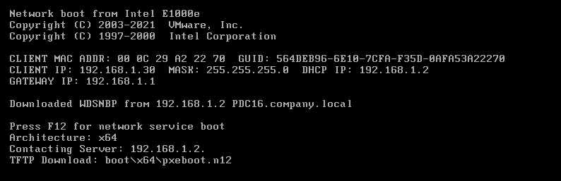

Reading the output line by line confirms the full handshake:
- The client's NIC (`Intel E1000e`) requests a network boot
- It receives a DHCP lease: `CLIENT IP: 192.168.1.30`, mask `255.255.255.0`, from `DHCP IP: 192.168.1.2`, gateway `192.168.1.1`
- It downloads `WDSNBP` (the WDS Network Boot Program) from `192.168.1.2 PDC16.company.local` — confirming DHCP options 066/067 correctly pointed it at the right server
- It identifies its architecture as `x64` and requests the next-stage file via TFTP: `boot\x64\pxeboot.n12`

> This is the single best checkpoint in the whole deployment chain to validate networking + DHCP + WDS together — if any of DHCP scope options, WDS service status, or firewall/TFTP access were wrong, this screen simply wouldn't appear (or would hang on "Contacting Server").

---

## Part 15 — Import Out-of-Box Network Drivers

A freshly-imaged machine booted from WinPE often has no NIC driver at all until Windows Setup loads one — for hardware where the built-in driver set doesn't cover the NIC, **Import Drivers** is used to stage the correct ones into the deployment share ahead of time.

**Import Driver Wizard — Confirmation.** A batch of Intel network drivers is imported, landing in `DS001:\Out-of-Box Drivers\Windows 10 x64 Drivers\` — the log shows individual `.inf` files being registered one at a time (`Intel Net e1c65x64.inf`, `Intel Net e1d.inf`, `Intel Net e1r65x64.inf`, and many more, each tagged with its driver version):

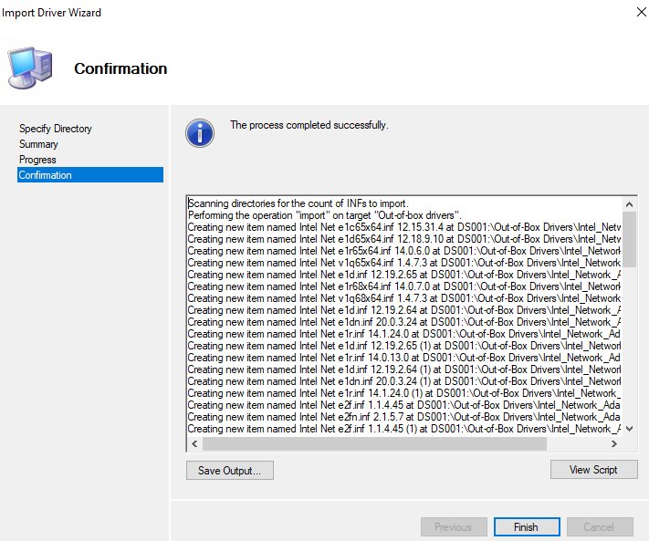

**Confirm the drivers landed.** Back in the Deployment Workbench, the `Windows 10 x64 Drivers` folder under `Out-of-Box Drivers` now lists the full imported set — dozens of Intel NIC `.inf` files spanning multiple chipset generations and driver versions:

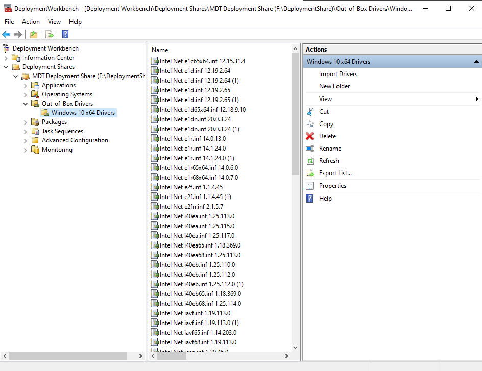

---

## Part 16 — Create a Selection Profile for the Drivers

Importing drivers into the share doesn't automatically mean every task sequence uses them — MDT needs to be told **which** drivers apply to **which** deployment, which is exactly what a **Selection Profile** is for.

**New Selection Profile Wizard — Folders.** Only the `Windows 10 x64 Drivers` folder (under `Out-of-Box Drivers`) is checked — `Applications`, `Operating Systems`, `Packages`, and `Task Sequences` are left unchecked, scoping this profile to drivers only:

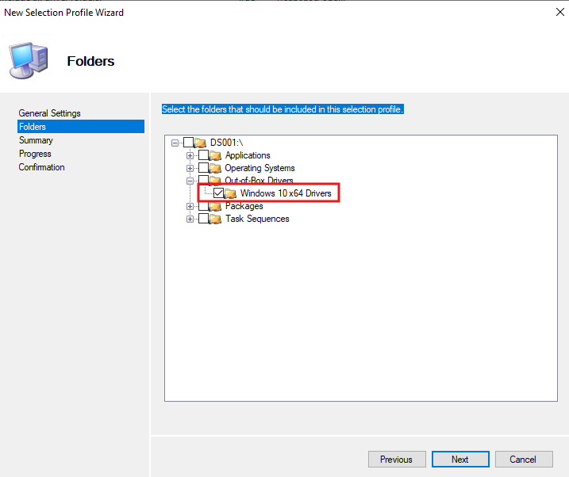

This profile is saved with the name `Windows_10_Drivers` (referenced directly in the next step).

---

## Part 17 — Attach the Driver Profile to the Task Sequence

Back on the original `Win10_64` task sequence's **Task Sequence** tab, under the **Preinstall** phase, the **Inject Drivers** step is configured:

- **Choose a selection profile:** `Windows_10_Drivers` — the exact profile built in Part 16
- **Install all drivers from the selection profile** is selected (rather than "Install only matching drivers") — every driver in that folder gets injected, regardless of whether MDT's plug-and-play detection thinks it's a match for the target hardware

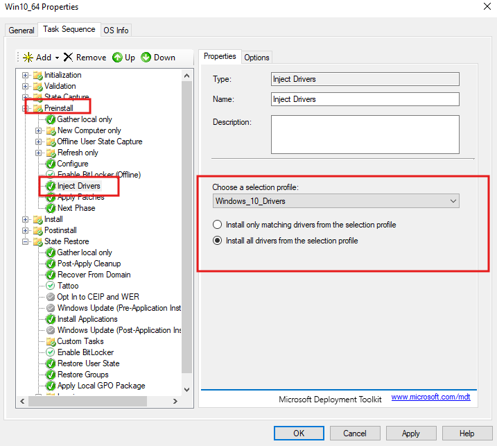

> **"Install all" vs "Install only matching"** is a real tradeoff: "matching" is safer/cleaner (only relevant drivers get staged) but depends on MDT's hardware-matching logic working correctly against every target machine; "all" guarantees nothing gets missed but bloats the WinPE driver store with every driver in the selected folder, including ones that will never be used on a given machine. For a folder scoped narrowly to just NIC drivers (as here), "Install all" is a reasonable, low-risk choice.

---

## Part 18 — Build a Capture-Only Task Sequence

To turn a fully built, fully patched, fully configured reference machine into a new deployable master image, a **second** task sequence is created — one whose template's entire job is to run Sysprep and capture, not install Windows from scratch.

**New Task Sequence Wizard — Summary.** Task Sequence ID `003`, name `Win10_64_Capture`, template `CaptureOnly.xml` (a built-in MDT template purpose-built for this exact scenario), still tied to the same base OS reference (`Windows 10 Pro in Windows 10 Pro x64 install.wim`), with the same organization defaults (`Company`) as the original deployment sequence:

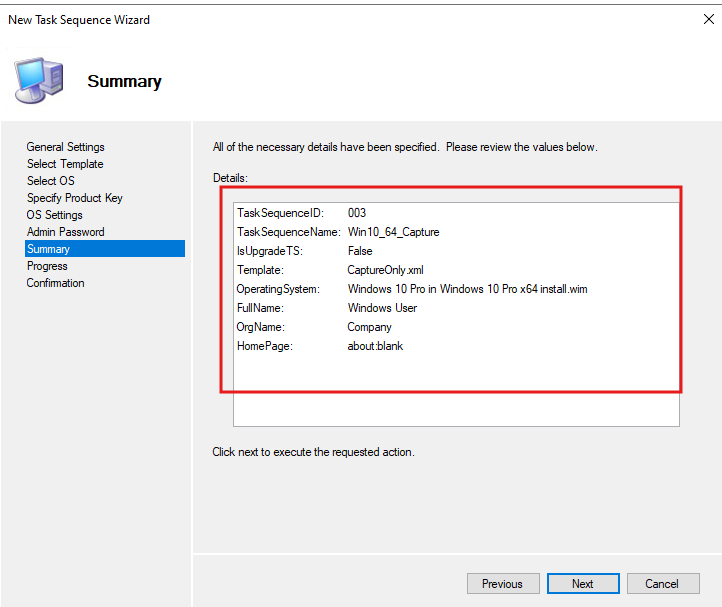

---

## Part 19 — Configure Capture Rules and Update the Deployment Share

**Edit the deployment share's rules for capture mode.** Back in `CustomSettings.ini`, two settings are specifically called out: `OSInstall=N` (this deployment is explicitly **not** installing an OS — it's running against an already-built machine) and `SkipCapture=NO` (meaning the deployment wizard **will** stop and ask the operator whether/how to capture an image, rather than silently skipping that step like the original unattended install sequence does). Bootstrap.ini's connection details (`DeployRoot`, `UserDomain`, `UserID`, `UserPassword`) are unchanged from the original lab:

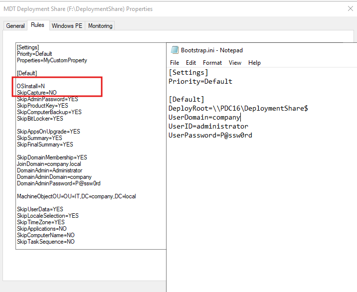

> This is the key behavioral difference from the original deployment: the first lab's rules set `SkipCapture=YES` to keep the standard install fully unattended. Capture mode flips that — the whole point of running this sequence is to be asked about capturing, so that step can't be skipped.

**Update Deployment Share Wizard — Options.** Before the new task sequence, drivers, and rules changes take effect on the share/boot image, **Update Deployment Share** is run again, with **"Optimize the boot image updating process"** selected (faster — only rebuilds what changed) rather than fully regenerating the boot images from scratch:

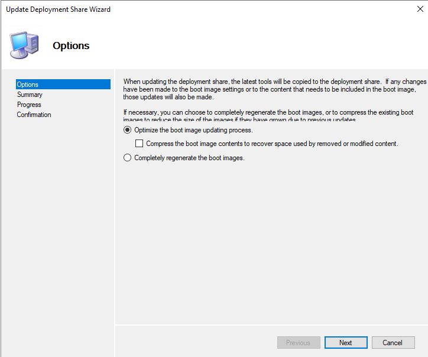

---

## Part 20 — Run LiteTouch on the Reference Machine

On the fully built reference machine (not a fresh PXE boot this time — this machine already has Windows, applications, and configuration in place), the deployment scripts are run directly from the network share rather than from a WinPE boot. Browsing to `\\192.168.1.2\DeploymentShare$\Scripts\`, the script `LiteTouch.vbs` is launched, which immediately starts **"Processing Bootstrap Settings"** — pulling local computer information (here shown checking BitLocker status) exactly the same way it would during a PXE-initiated deployment:

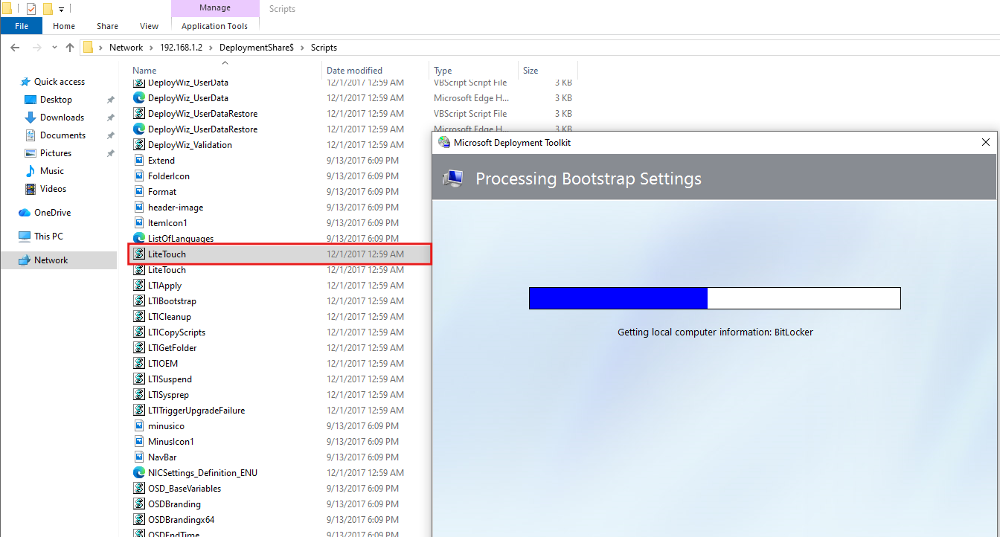

> Running `LiteTouch.vbs` directly (rather than via PXE boot into WinPE) is the standard way to trigger MDT actions — including image capture — **against a machine that's already running its full OS**, which is exactly the scenario capture mode requires (you can't capture a machine that's currently booted from PE into itself).

---

## Part 21 — Capture the Reference Image

The Windows Deployment Wizard, now running the `Win10_64_Capture` sequence, reaches its **Capture Image** page — and because `SkipCapture=NO` was set, it actually stops here and asks:

- **"Capture an image of this reference computer"** is selected (as opposed to Sysprep-only, prepare-only, or skipping capture entirely)
- **Location:** `\\PDC16\DeploymentShare$\Captures`
- **File name:** `Win10Updated.wim`

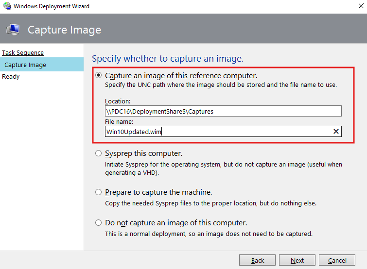

From here, the task sequence runs Sysprep against the reference machine and captures the resulting generalized image to that `.wim` file — which can then be imported back into the Deployment Workbench (the same way `install.wim` was imported in the original lab) as a new, ready-to-deploy master image, complete with all the applications and customizations baked into the reference machine.

---

## Solution Summary — Expected End State

| Item | Value |
|---|---|
| WDS boot image | `Lite Touch Windows PE (x64)`, from `LiteTouchPE_x64.wim` |
| PXE boot confirmed | Client reaches WDS via DHCP options 066/067, downloads `boot\x64\pxeboot.n12` |
| Imported drivers | Intel network drivers, in `Out-of-Box Drivers\Windows 10 x64 Drivers` |
| Selection profile | `Windows_10_Drivers` (scoped to that one folder) |
| Driver injection setting | Selection profile `Windows_10_Drivers`, "Install all drivers from the selection profile" |
| Capture task sequence | `003` / `Win10_64_Capture`, template `CaptureOnly.xml` |
| Capture rules | `OSInstall=N`, `SkipCapture=NO` |
| Deployment share update mode | Optimize (not full regenerate) |
| Capture trigger | `LiteTouch.vbs`, run directly on the already-built reference machine |
| Captured image | `\\PDC16\DeploymentShare$\Captures\Win10Updated.wim` |

## Common Pitfalls

- **PXE boot hangs at "Contacting Server"** — confirm the WDS boot image was actually added (Part 13); a correctly configured DHCP scope with no boot image behind it will get this far and no further.
- **Deployed machine has no network connectivity during/after setup** — almost always a missing NIC driver; revisit Part 15–17 and confirm the Selection Profile is actually attached to the Inject Drivers step, not just imported into the share.
- **"Install only matching drivers" silently skips a needed driver** — if a deployed machine's NIC isn't recognized after using the matching-only option, switch to "Install all drivers from the selection profile" for that folder, or verify the driver's INF actually declares the correct hardware ID.
- **Capture sequence runs but doesn't prompt for capture** — check `SkipCapture` in `CustomSettings.ini`; if it's still `YES` (inherited from the original deployment rules), the wizard will skip straight past the Capture Image page.
- **Capture sequence tries to reinstall Windows instead of capturing** — confirm `OSInstall=N` is actually set for this rule scope; `Y` (or unset, depending on inheritance) will cause MDT to treat this as a normal OS deployment.
- **Changes to drivers/rules/task sequences don't show up on PXE-booted clients** — `Update Deployment Share` must be re-run (Part 19) after any change that affects the boot image or its content; editing the Workbench alone does not regenerate what WDS actually serves.

## Next Steps

With a captured reference image (`Win10Updated.wim`) now sitting in the Captures folder, the next logical step is to **import it back into the Deployment Workbench** as a new Operating System (the same Import Operating System Wizard used for the original `install.wim`, but choosing "custom image file" as the source type instead of full install media), then build a new deployment task sequence around it — turning today's fully-patched, fully-configured reference machine into tomorrow's one-click golden image for new deployments.

---

## Appendix — Screenshot Index

| File | Description |
|---|---|
| `task19-add-litetouchPE-boot-image-to-wds.png` | Add Image Wizard — Summary, LiteTouchPE_x64.wim added to WDS Boot Images |
| `task20-network-pxe-boot.png` | PXE boot console — DHCP lease, WDSNBP, TFTP download confirmed |
| `task21_import_drivers.png` | Import Driver Wizard — Confirmation, Intel network drivers imported |
| `task22_listed_drivers.png` | Deployment Workbench — Windows 10 x64 Drivers folder populated |
| `task23-create-new-profile-containing-win10-drivers.png` | New Selection Profile Wizard — Folders, Windows 10 x64 Drivers checked |
| `task24_attach_drivers_profile_to_task_sequence.png` | Win10_64 Properties — Inject Drivers, selection profile attached |
| `task25-create-task-seq-for-capture-image.png` | New Task Sequence Wizard — Summary, Win10_64_Capture (CaptureOnly.xml) |
| `task26-edit-capture-images-rules.png` | Rules tab — OSInstall=N, SkipCapture=NO, alongside Bootstrap.ini |
| `task26-update-deploymentsharepng.png` | Update Deployment Share Wizard — Options, optimize boot image update |
| `task27-run-litetouch-vbscript.png` | LiteTouch.vbs running from the network share — Processing Bootstrap Settings |
| `task28-capture-the-image.png` | Capture Image page — capturing to Win10Updated.wim |
