# FSRM Lab 2 — File Screening & Storage Reports

**Role:** File Server Resource Manager (FSRM)
**Server:** `PDC16` (domain: `company.local`)
**Data location:** `E:\Data`
**Report locations:** `C:\StorageReports\Incident`, `C:\StorageReports\Scheduled`, `C:\StorageReports\Interactive`

## Lab Overview

This lab builds on a base FSRM install and walks through the two core jobs FSRM does besides quotas: **File Screening** (blocking unwanted file types) and **Storage Reports** (auditing and analyzing disk usage). By the end of the lab you will have:

- Created a custom file group and a reusable file screen template
- Applied active file screening to a folder and proven it blocks files
- Reviewed the resulting audit trail in Event Viewer
- Configured where reports are saved and tuned their default parameters
- Generated an on-demand report, scheduled a recurring report, and produced a File Screening Audit report

### Prerequisites
- Windows Server with the **File Server Resource Manager** role service installed
- A test data volume (`E:\Data`) with at least one subfolder to screen
- Administrative access to the FSRM MMC console, Event Viewer, and PowerShell

### Task Map

| # | Task | What it proves |
|---|------|-----------------|
| 1 | Create a File Group | Define which files count as "MP" files |
| 2 | Create a File Screen Template | Package a reusable screening + logging policy |
| 3 | Create a File Screen | Apply the template to a real folder |
| 4 | Test the screen | Blocked saves return Access Denied |
| 5 | Review the Event Log | Violations are logged automatically |
| 6 | Review Report Locations | Know where each report type is saved |
| 7 | Edit default report parameters | Tune Duplicate Files / Large Files reports |
| 8 | Create an on-demand report | Run a report manually against a scope |
| 9 | View the generated report | Confirm the output is useful |
| 10 | Schedule a report | Automate recurring reporting |
| 11 | Enable File Screen Auditing | Turn on the auditing database |
| 12 | Generate a File Screening Audit report | Report on screening activity itself |

---

## Task 1 — Create a File Group

A **file group** is a named set of file-name patterns. File screens and screen templates reference file groups rather than hard-coded extensions, so the group can be reused and edited centrally.

**Steps**
1. Open **FSRM** → **File Screening Management** → **File Groups**.
2. Right-click → **Create File Group**.
3. Set **File group name** to `MP template`.
4. Under **Files to include**, type `*.mp*` and click **Add**. This pattern matches any file extension that starts with "mp" — `.mp3`, `.mp4`, `.mpg`, `.mp1`, `.mp2`, etc.
5. Leave **Files to exclude** empty.
6. Click **OK**.

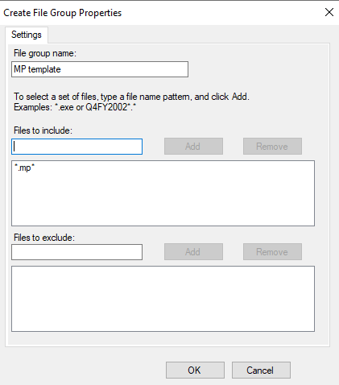

**Result:** A reusable file group named `MP template` now exists and can be attached to any file screen template.

---

## Task 2 — Create a File Screen Template

A **file screen template** bundles the screening behavior (active vs. passive), the file groups to block, and the response actions (email, event log, command, report) into one reusable object.

**Steps**
1. Go to **File Screening Management** → **File Screen Templates** → **Create File Screen Template**.
2. Optionally copy properties from the built-in **Block Audio and Video Files** template as a starting point.
3. Name the template `Block MP Files`.
4. Set **Screening type** to **Active screening: Do not allow users to save unauthorized files**.
5. In **File groups**, check **MP template** (the group created in Task 1).

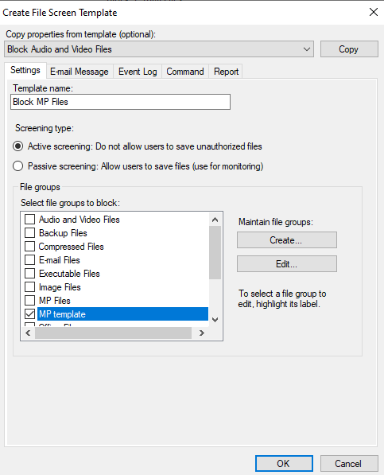

6. Switch to the **Event Log** tab and check **Send warning to event log**. The default log message uses variables such as `[Source Io Owner]`, `[Source File Path]`, `[File Screen Path]`, `[Server]`, and `[Violated File Group]` so each log entry is populated dynamically with the real user, path, and group at the time of the violation.

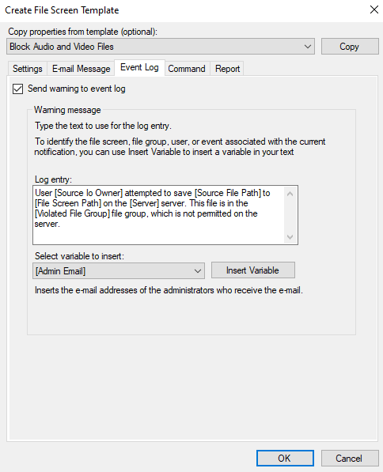

7. Click **OK** to save the template.

**Result:** `Block MP Files` is now a reusable, self-contained screening policy: block `MP template` files and write an event log entry whenever someone tries to save one.

---

## Task 3 — Create a File Screen

A **file screen** is what actually applies a template (or custom properties) to a specific folder path.

**Steps**
1. Go to **File Screening Management** → **File Screens** → **Create File Screen**.
2. Set **File screen path** to `E:\Data\3` (use **Browse** to select it).
3. Choose **Derive properties from this file screen template (recommended)** and select **Block MP Files**.
4. Review the summary — it confirms: Source template `Block MP Files`, Screening type `Active`, File groups `MP template`, Notifications `Event log`.
5. Click **Create**.

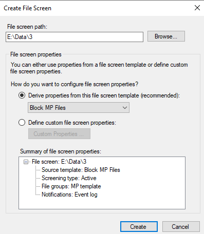

**Result:** Any attempt to save a file matching `*.mp*` inside `E:\Data\3` will now be blocked and logged.

---

## Task 4 — Test the File Screen

**Steps**
1. Open PowerShell and navigate into the screened folder:
   ```powershell
   e:
   cd .\Data\3
   ```
2. Attempt to create files that match the blocked pattern:
   ```powershell
   fsutil.exe file createNew file1.mp4 100
   fsutil.exe file createNew file1.mp3 100
   fsutil.exe file createNew file1.mp2 100
   fsutil.exe file createNew file1.mp1 100
   ```
3. Every command returns **Error: Access is denied.**


**Result:** Active screening is confirmed working — the underlying NTFS save is intercepted and rejected before the file is written, regardless of which "mp" extension is used.

---

## Task 5 — Review the Event Log

**Steps**
1. Open **Event Viewer** → **Windows Logs** → **Application**.
2. Filter for **Source: SRMSVC**. A **Warning**, Event ID **8215**, appears at the time of the blocked save.
3. Open the event and review the **General** tab. It reports the user who attempted the save, the full source path (`E:\Data\3\file1.mp4`), the server (`PDC16`), and the file group that was violated.

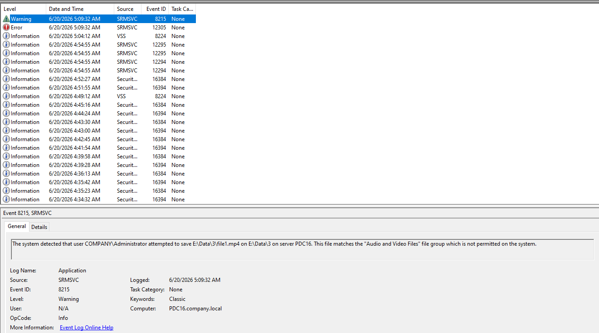

**Result:** Every blocked save is independently auditable in the Windows Event Log, which is exactly what the Event Log action configured in Task 2 was for.

---

## Task 6 — Review Storage Report Locations (Report Types)

FSRM generates three distinct categories of storage report, each saved to its own folder:

| Report type | Trigger | Default location |
|---|---|---|
| **Incident reports** | Generated automatically when a user exceeds a quota threshold or tries to save an unauthorized file | `C:\StorageReports\Incident` |
| **Scheduled reports** | Generated periodically by a scheduled report task | `C:\StorageReports\Scheduled` |
| **On-demand reports** | Generated manually, on request | `C:\StorageReports\Interactive` |

**Steps**
1. Open **FSRM** → **Configure Options** → **Report Locations** tab.
2. Confirm or set the three folder paths above.

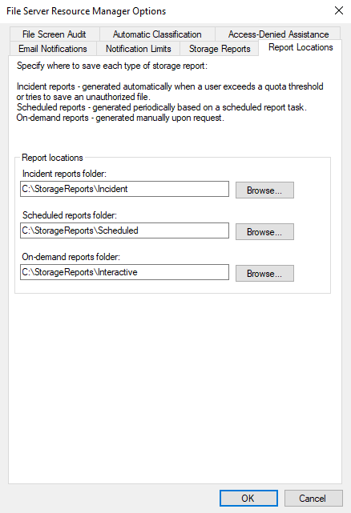

**Result:** Knowing which folder corresponds to which trigger makes it easy to find the right report later without searching the whole report archive.

---

## Task 7 — Edit Default Report Parameters

Each storage report type has tunable default parameters. Setting good defaults here means every incident report, scheduled report, and on-demand report uses sensible thresholds unless explicitly overridden.

**Steps**
1. Open **Configure Options** → **Storage Reports** tab.
2. Select **Duplicate Files** → **Edit Parameters**. Set:
   - **Maximum number of files in a duplicate group per report:** `10`
   - **Maximum number of groups of duplicate files per report:** `100`

   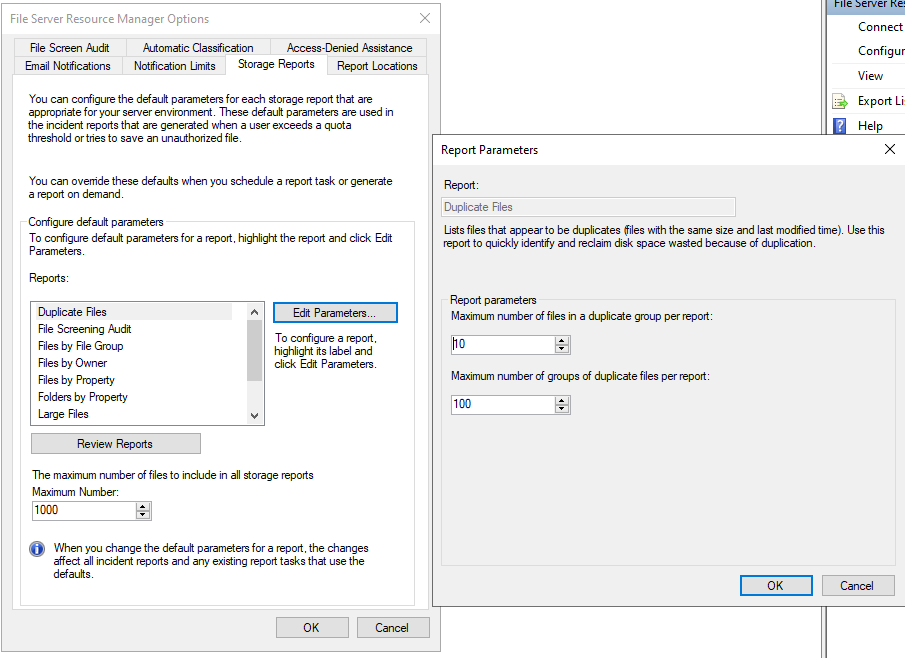

3. Select **Large Files** → **Edit Parameters**. Set:
   - **Minimum file size:** `5.000 MB`

   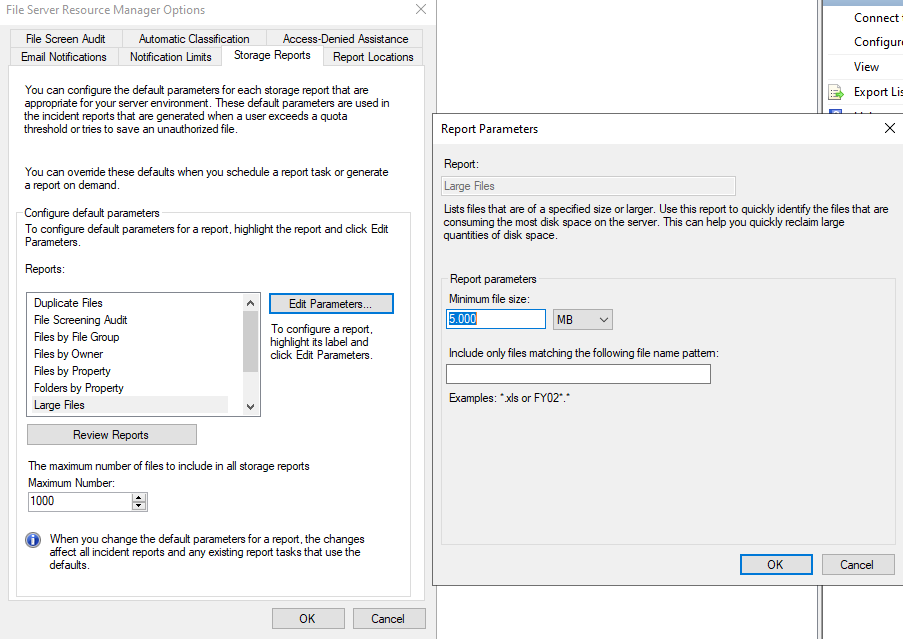

4. Click **OK** to save. A note in the dialog reminds you these defaults affect **all** future incident reports and any existing report tasks that rely on the defaults rather than their own overrides.

**Result:** Duplicate Files and Large Files reports are now tuned to the lab environment instead of running with out-of-the-box defaults.

---

## Task 8 — Create an On-Demand Report

On-demand reports are run manually against a chosen scope and delivered immediately.

**Steps**
1. Go to **Storage Reports Management** → **Generate Reports Now**.
2. On the **Settings** tab, the task is auto-named (e.g. `Interactive Report Task 6/20/2026 6:31:54 AM`). Check **Duplicate Files** under **Select reports to generate**, and check **DHTML** under **Report formats**.

   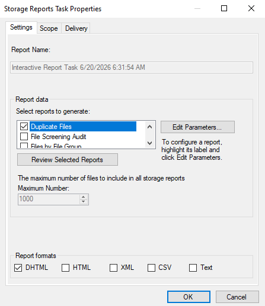

3. On the **Scope** tab, add `E:\Data` to **The following folders are included in this scope**.

   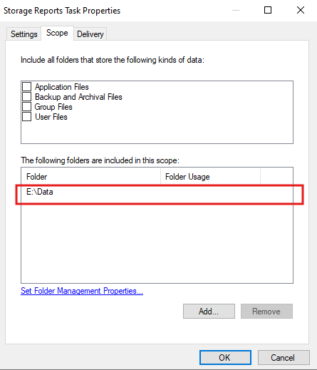

4. On the **Delivery** tab, check **Send reports to the following administrators** and enter `Administrator@company.local`. Note the dialog also confirms the report will be saved to `C:\StorageReports\Interactive`.

   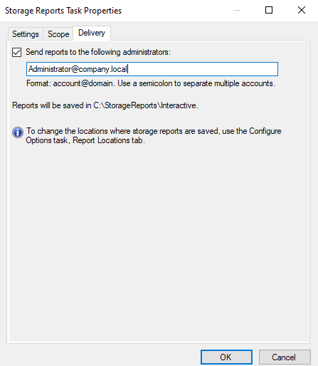

5. Click **OK** to generate the report immediately.

**Result:** A Duplicate Files report is generated against `E:\Data`, saved to the interactive reports folder, and emailed to the administrator account.

---

## Task 9 — Review the Generated Report

**Steps**
1. Open the generated **Duplicate Files Report** (DHTML) from `C:\StorageReports\Interactive` or the link delivered by email.
2. Review the report sections: **Report Totals**, **Size by Owner**, **Size by File Group**, **Report statistics**.

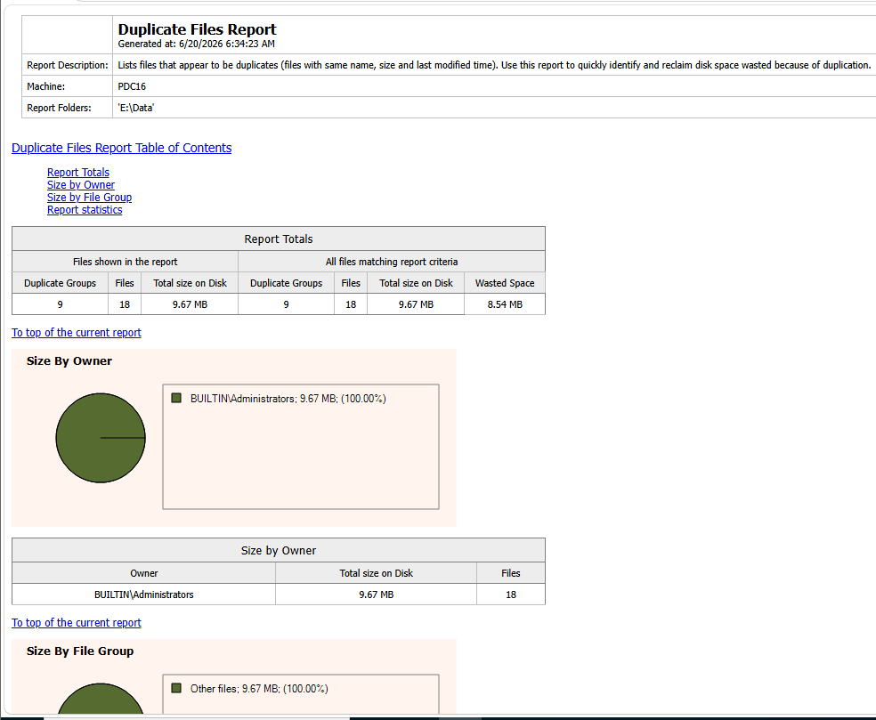

**Result (from this run):** Scanning `E:\Data` on `PDC16` found **9 duplicate groups / 18 files**, totaling **9.67 MB** on disk, with **8.54 MB of wasted space** that could be reclaimed by removing duplicates. All of the duplicate data is owned by `BUILTIN\Administrators` and falls under the "Other files" file group — confirming the report is both accurate and actionable for reclaiming disk space.

---

## Task 10 — Schedule a Report

Scheduled report tasks run automatically on a recurring basis instead of being triggered manually.

**Steps**
1. Go to **Storage Reports Management** → **Schedule a New Report Task**.
2. On the **Settings** tab, name the task (e.g. `Files Larger Than 1 MB Report`) and check **Large Files** under **Select reports to generate**.
3. Click **Edit Parameters** to confirm/override the report's parameters for this specific task — here, **Minimum file size: 1 MB**, independent of the default of 5 MB set in Task 7.
4. Check **DHTML** under **Report formats**.

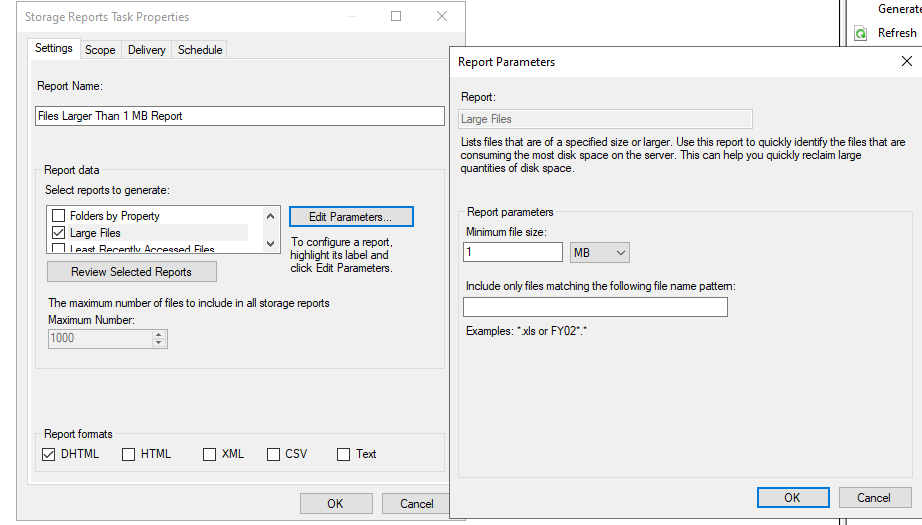

5. Configure the **Scope**, **Delivery**, and **Schedule** tabs (frequency, start time, recurrence) and click **OK**.

**Result:** A recurring scheduled task now produces a "Files Larger Than 1 MB" report automatically, independent of any manually-run report.

---

## Task 11 — Enable File Screen Auditing

Before a **File Screening Audit** report can show anything meaningful, FSRM needs to be told to record screening activity into its auditing database.

**Steps**
1. Open **Configure Options** → **File Screen Audit** tab.
2. Check **Record file screening activity in auditing database**.
3. Click **OK**.

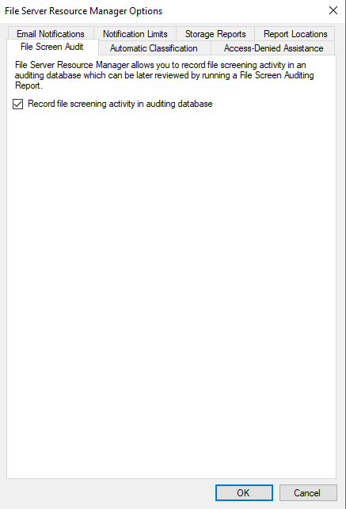

**Result:** From this point forward, every file-screening event (block or warning) across all file screens is recorded centrally, making it possible to run a File Screening Audit report later.

---

## Task 12 — Generate a File Screening Audit Report

With auditing enabled, you can configure a file screen to automatically generate a **File Screening Audit** report whenever a violation occurs.

**Steps**
1. Open the properties of a file screen (e.g. `E:\Data\2`).
2. Go to the **Report** tab and check **Generate reports**.
3. Under **Select reports to generate**, check **File Screening Audit**.
4. Optionally check **Send reports to the following administrators** and/or **Send reports to the user who attempted to save an unauthorized file**.
5. Note the reports will be saved to `C:\StorageReports\Incident` (the Incident reports folder configured in Task 6).
6. Click **OK**.

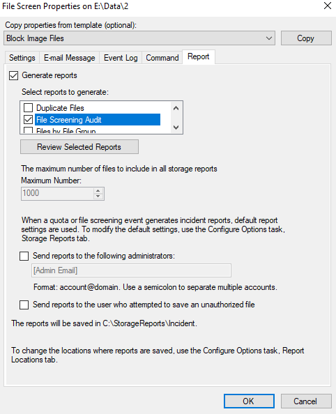

**Result:** Future violations on `E:\Data\2` will automatically generate a File Screening Audit incident report, giving a full picture of who tried to save what, where, and when — built directly from the auditing database enabled in Task 11.

---

## Lab Summary

| Object | Name | Purpose |
|---|---|---|
| File Group | `MP template` | Matches `*.mp*` (mp3, mp4, mp1, mp2…) |
| File Screen Template | `Block MP Files` | Active screening of `MP template` + event log warning |
| File Screen | `E:\Data\3` | Applies `Block MP Files` to a real folder |
| FSRM Option | File Screen Audit | Enables the screening auditing database |
| Storage Report | Duplicate Files (on-demand) | Found 9 duplicate groups / 8.54 MB reclaimable |
| Storage Report | Large Files (scheduled) | Recurring report of files ≥ 1 MB |
| Storage Report | File Screening Audit | Reports on screening violations themselves |

**Key takeaways**
- File groups → file screen templates → file screens is the building-block hierarchy FSRM uses: define *what*, then *how to respond*, then *where to apply it*.
- Active screening enforces in real time at the file-system level (`fsutil` calls fail outright); passive screening would only log/notify without blocking.
- Every screening violation can be traced two ways: live in **Event Viewer** (Event ID 8215, source `SRMSVC`) and historically via the **File Screening Audit** report (once auditing is enabled).
- Storage Reports have three independent trigger types (Incident / Scheduled / On-demand), each with its own save location and its own overridable parameters.

---

### Folder structure of this submission

```
README.md

 ├─ task1-create-file-group.png
 ├─ task2-create-file-screen-template.png
 ├─ task2-create-file-screen-template-event-log-action.png
 ├─ task3-create-file-screen.png
 ├─ task4-access-denied.png
 ├─ task5-event-log.png
 ├─ task6-types-of-reports.png
 ├─ task7-edit-parameters1.png
 ├─ task7-edit-parameters2.png
 ├─ task8-create-on-demand-report.png
 ├─ task8-create-on-demand-report-scope.png
 ├─ task8-create-on-demand-report-delivery.png
 ├─ task9-report.png
 ├─ task10-schedule-report.png
 ├─ task11-enable-file-screen-auditing.png
 └─ task12-generate-file-screen-report.png
```

> Keep `README.md` and the `` folder in the same parent directory (e.g. when uploading to GitHub or opening locally) so the screenshots render correctly.
