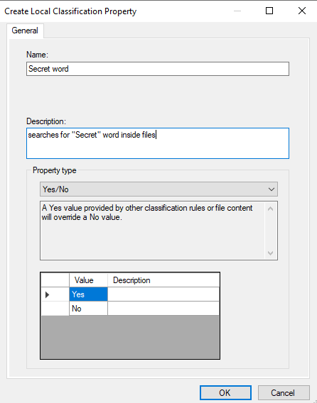
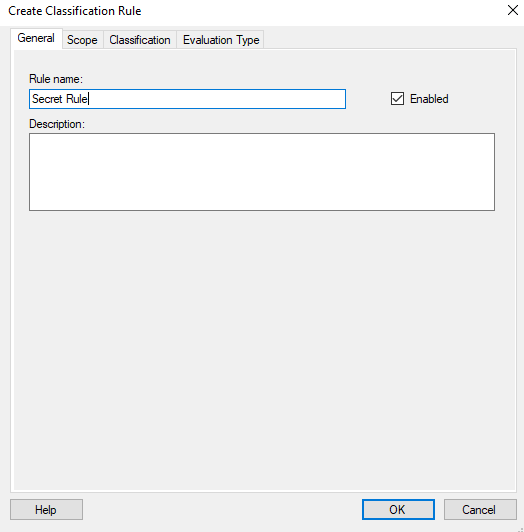
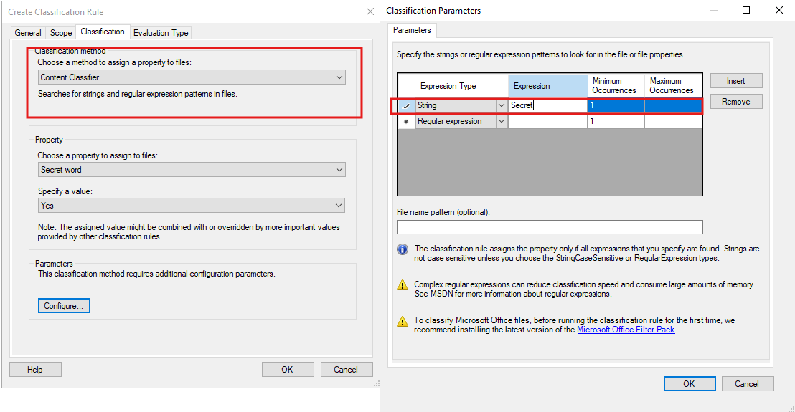
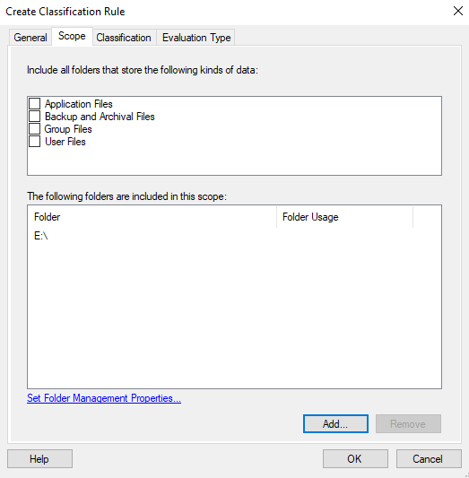
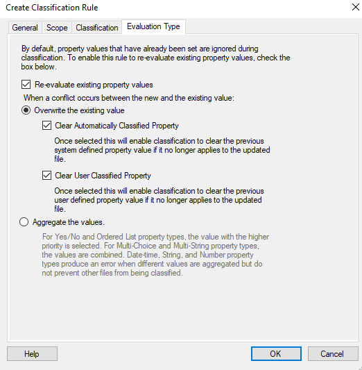
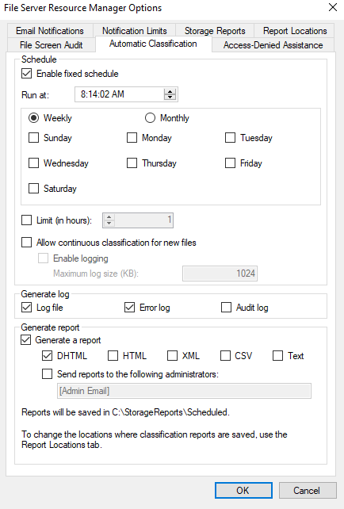
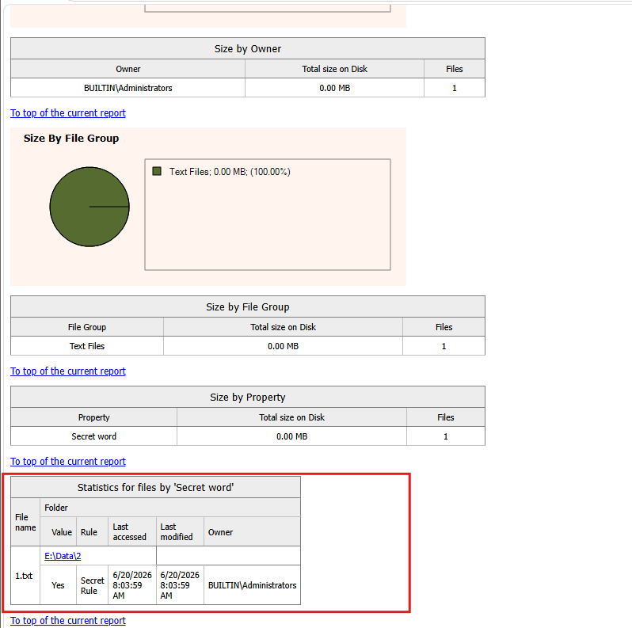

# FSRM Lab — File Classification Infrastructure

**Role:** File Server Resource Manager (FSRM) — **File Classification Infrastructure (FCI)**
**Data location:** `E:\Data` (test files reside in `E:\Data\2`)
**Report locations:** `C:\StorageReports\Scheduled`

## Lab Overview

File Classification Infrastructure lets FSRM tag files with custom **classification properties** based on either manual user input or automated content scanning. This lab covers both paths end-to-end, using two independent classification properties as parallel case studies:

- **`Secret word`** — manually classifiable, and also detected automatically by a **string-match** classification rule that searches file content for the literal word "Secret".
- **`Contains_SSN`** — detected automatically by a **regular-expression** classification rule that searches file content for the standard Social Security Number pattern `XXX-XX-XXXX`.

By the end of the lab you will have created classification properties, built both a string-based and a regex-based classification rule, configured how conflicts are resolved between manual and automatic values, scheduled classification to run automatically, and verified results both in the file's own Properties dialog and in the generated classification report.

### Prerequisites
- Windows Server with the **File Server Resource Manager** role service installed
- A test folder (`E:\Data\2`) containing a few `.txt` files to classify
- Administrative access to the FSRM MMC console and File Explorer

### Task Map

| # | Task | What it proves |
|---|------|-----------------|
| 1 | Create a classification property (`Secret word`) | Define a custom Yes/No property |
| 2 | Apply the property manually | Properties can be set by hand, per file |
| 3 | Create a new classification rule (`Secret Rule`) | Start building an automated rule |
| 4 | Define the classification method, property, and scope | String content-classifier targeting `E:\` |
| 5 | Set the evaluation type | Control how conflicts with existing values are resolved |
| 6 | Schedule automatic classification | Classification runs on a recurring schedule |
| 7 | Review the classification report | Confirm which files were tagged and why |
| 8 | Verify the property on a file | The rule's value appears in the file's Properties dialog |
| 9 | Create a second property (`Contains_SSN`) | A second, independent classification property |
| 10 | Create the `Detect SSN` rule | A second rule using a different detection method |
| 11 | Set the rule's scope | Apply it to `E:\` as well |
| 12 | Define a regex classification method | Use a regular expression instead of a literal string |
| 13 | Review the SSN classification report | Confirm regex detection worked across files |
| 14 | Verify on a file with both properties present | Two independent properties coexist on one file |

---

## Part A — Manual & String-Based Classification (`Secret word`)

### Task 1 — Create a Classification Property

A **classification property** is the custom tag (e.g. a Yes/No flag) that gets attached to files. It can later be set manually or assigned automatically by a classification rule.

**Steps**
1. Open **FSRM** → **Classification Management** → **Classification Properties**.
2. Right-click → **Create Local Property**.
3. Set **Name** to `Secret word`.
4. Add a **Description**, e.g. `searches for "Secret" word inside files`.
5. Set **Property type** to **Yes/No**. Note the built-in conflict-resolution rule shown in the dialog: *a Yes value provided by other classification rules or file content will override a No value.*
6. Click **OK**.



**Result:** A reusable Yes/No property, `Secret word`, now exists and can be assigned either manually or by a rule.

---

### Task 2 — Apply the Classification Property Manually

Before any rule runs, classification properties can always be set by hand on an individual file — useful for one-off exceptions or files a rule can't reach.

**Steps**
1. Right-click a test file (`1.txt`) in `E:\Data\2` → **Properties**.
2. Open the **Classification** tab. `Secret word` is listed with a value of **(none)** since nothing has classified it yet.
3. (To classify manually, you would select **Yes** or **No** here and click **Apply**.)


**Result:** Confirms the Classification tab is the same place both manual values and automatically-assigned values are displayed — this is the verification point used again in Tasks 8 and 14.

---

### Task 3 — Create a New Classification Rule

A **classification rule** automates what Task 2 did by hand: it scans files and assigns a property value when its conditions match.

**Steps**
1. Go to **Classification Management** → **Classification Rules** → **Create Classification Rule**.
2. On the **General** tab, set **Rule name** to `Secret Rule` and leave **Enabled** checked.



**Result:** The rule shell is created; its behavior is configured in the next three tabs.

---

### Task 4 — Define the Classification Method, Property, and Scope

**Steps**
1. Switch to the **Classification** tab.
2. Set **Classification method** to **Content Classifier** (searches for strings and regular-expression patterns inside files).
3. Under **Property**, choose **Secret word** and set **Specify a value** to `Yes`.
4. Click **Configure…** to open **Classification Parameters**. Add a row with **Expression Type = String** and **Expression = `Secret`**, with **Minimum Occurrences = 1**. Click **OK**.

   

5. Switch to the **Scope** tab and add `E:\` under **The following folders are included in this scope**.

   

6. Click **OK** (or move to the next tab before finalizing — see Task 5).

**Result:** `Secret Rule` is now configured to scan every file under `E:\` and tag any file containing the literal word "Secret" with `Secret word = Yes`.

---

### Task 5 — Set the Evaluation Type

The **Evaluation Type** tab controls what happens when a file already has a value for the property being classified.

**Steps**
1. Switch to the **Evaluation Type** tab.
2. Check **Re-evaluate existing property values** so the rule doesn't skip files that were already classified.
3. Choose **Overwrite the existing value**, and check both:
   - **Clear Automatically Classified Property** — clears a prior system-assigned value if the rule no longer applies.
   - **Clear User Classified Property** — clears a prior manually-assigned value if the rule no longer applies.
4. (The alternative, **Aggregate the values**, would combine values instead of replacing them — relevant for Multi-Choice/Multi-String properties.)
5. Click **OK** to finish creating the rule.



**Result:** `Secret Rule` will always re-evaluate files on each run and overwrite stale values, keeping classification accurate as file content changes.

---

### Task 6 — Schedule Automatic Classification

Classification rules don't run continuously by default — they need a schedule (or a manual trigger) in order to execute.

**Steps**
1. Open **Configure Options** → **Automatic Classification** tab.
2. Check **Enable fixed schedule** and set **Run at:** a time (e.g. `8:14:02 AM`).
3. Choose **Weekly** or **Monthly** and select the day(s) to run.
4. Under **Generate log**, check **Log file** and **Error log** as needed.
5. Under **Generate report**, check **Generate a report** and **DHTML**.
6. Note the confirmation text: reports are saved to `C:\StorageReports\Scheduled`.
7. Click **OK**.



**Result:** Classification now runs automatically on the configured schedule, producing a report each time without manual intervention.

---

### Task 7 — Review the Classification Report

**Steps**
1. After the rule runs (on schedule, or via **Run Classification With All Rules Now**), open the generated **Automatic Classification** report from `C:\StorageReports\Scheduled`.
2. Scroll to the **Statistics for files by 'Secret word'** section.



**Result:** The report confirms `1.txt` in `E:\Data\2` was tagged `Secret word = Yes` by `Secret Rule`, alongside summary breakdowns by owner and file group (1 file, 0.00 MB in this run, all under the "Text Files" group).

---

### Task 8 — Verify the Property on the File

**Steps**
1. Right-click `1.txt` → **Properties** → **Classification** tab.
2. Confirm `Secret word` now shows **Yes**, matching the report.


**Result:** The automated rule's output is visible and consistent in the same Classification tab used for manual assignment in Task 2 — proving rule-based and manual classification share one unified property system.

---

## Part B — Regex-Based Classification (`Contains_SSN`)

### Task 9 — Create a Second Classification Property

**Steps**
1. **Classification Management** → **Classification Properties** → **Create Local Property**.
2. Set **Name** to `Contains_SSN`.
3. Set **Description** to `Identifies files containing Social Security Numbers.`
4. Set **Property type** to **Yes/No**.
5. Click **OK**.


**Result:** A second, independent Yes/No property now exists alongside `Secret word`.

---

### Task 10 — Create the "Detect SSN" Classification Rule

**Steps**
1. **Classification Rules** → **Create Classification Rule**.
2. On the **General** tab, set **Rule name** to `Detect SSN`.
3. Set **Description** to `Scans for standard SSN format (XXX-XX-XXXX).`


**Result:** The rule shell for SSN detection is created.

---

### Task 11 — Set the Rule's Scope

**Steps**
1. Switch to the **Scope** tab.
2. Add `E:\` to **The following folders are included in this scope** (same scope as `Secret Rule`, so both rules cover the same data).


**Result:** The SSN rule will scan the same folder tree as the Secret word rule, allowing both properties to be evaluated together on every classification run.

---

### Task 12 — Define a Regular-Expression Classification Method

This is the key difference from Part A: instead of a literal string, the rule uses a **regular expression** to match a pattern rather than fixed text.

**Steps**
1. Switch to the **Classification** tab.
2. Set **Classification method** to **Content Classifier**.
3. Under **Property**, choose **Contains_SSN** and set **Specify a value** to `Yes`.
4. Click **Configure…** to open **Classification Parameters**.
5. Add a row with **Expression Type = Regular expression** and **Expression = `\b\d{3}-\d{2}-\d{4}\b`** — this matches the standard SSN format: three digits, a hyphen, two digits, a hyphen, four digits, on word boundaries.
6. Set **Minimum Occurrences = 1** and click **OK**, then **OK** again to save the rule.


**Result:** `Detect SSN` will tag any file under `E:\` containing text matching the SSN pattern with `Contains_SSN = Yes` — far more flexible than a fixed string, since it matches *any* number sequence in that format rather than one exact phrase.

---

### Task 13 — Review the SSN Classification Report

**Steps**
1. Run classification (scheduled or on-demand) and open the resulting report.
2. Scroll to **Statistics for files by 'Contains_SSN'**.


**Result:** Both `3.txt` and `2.txt` in `E:\Data\2` were tagged `Contains_SSN = Yes` by the `Detect SSN` rule — confirming the regex correctly identified SSN-formatted text in two separate files.

---

### Task 14 — Verify Both Properties on a File

**Steps**
1. Right-click `2.txt` → **Properties** → **Classification** tab.
2. Confirm `Contains_SSN = Yes` (set by `Detect SSN`) while `Secret word = (none)` — because `2.txt` doesn't contain the word "Secret", `Secret Rule` never matched it.


**Result:** A single file can carry multiple independent classification properties at once, each driven by its own rule and its own detection logic, with no interference between them.

---

## Lab Summary

| Object | Name | Type | Purpose |
|---|---|---|---|
| Classification Property | `Secret word` | Yes/No | Flags files containing the literal word "Secret" |
| Classification Property | `Contains_SSN` | Yes/No | Flags files containing SSN-formatted text |
| Classification Rule | `Secret Rule` | String match | Content Classifier, expression `Secret`, scope `E:\` |
| Classification Rule | `Detect SSN` | Regular expression | Content Classifier, expression `\b\d{3}-\d{2}-\d{4}\b`, scope `E:\` |
| FSRM Option | Automatic Classification schedule | — | Runs both rules automatically and generates a DHTML report to `C:\StorageReports\Scheduled` |

**Key takeaways**
- Classification properties are defined once and can be assigned **manually** (per file, via Properties → Classification) or **automatically** (via a Classification Rule) — both write to the same property and are visible in the same place.
- The **Content Classifier** method supports both literal **String** matches and **Regular expression** patterns in the same Classification Parameters grid, making it flexible enough for fixed keywords (`Secret`) and structured patterns (SSNs) alike.
- The **Evaluation Type** tab is what makes re-runs safe: without **Re-evaluate existing property values**, a rule will skip files it already touched, even if their content has since changed.
- Classification, like file screening and storage reports, has its own dedicated **schedule** and **report location** (`C:\StorageReports\Scheduled`), independent of the other FSRM features.
- Multiple classification rules can target the same scope and the same files without conflict, as long as they assign different properties — each file can carry several independent classification tags simultaneously.

---

### Folder structure of this submission

```
README.md

 ├─ task1-create-classification-property.png
 ├─ task2-apply-classification-property-manual.png
 ├─ task3-create-new-rule.png
 ├─ task4-define-classification.png
 ├─ task4-define-classification-scope.png
 ├─ task5-evaluation-type.png
 ├─ task6-classification-rule-schedule.png
 ├─ task7-report-result.png
 ├─ task8-classification-property-yes.png
 ├─ task9-create-ssn-property.png
 ├─ task10-create-detect-ssn-rule.png
 ├─ task11-detect-ssn-scope.png
 ├─ task12-detect-ssn-classification-parameters.png
 ├─ task13-ssn-report-result.png
 └─ task14-ssn-file-properties.png
```

> Keep `README.md` and the `` folder together in the same parent directory (e.g. when uploading to GitHub or opening locally) so the screenshots render correctly.
