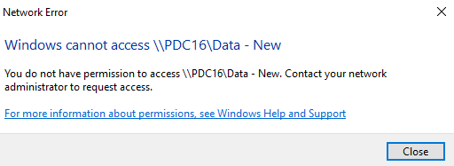
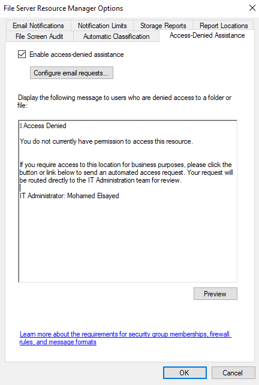
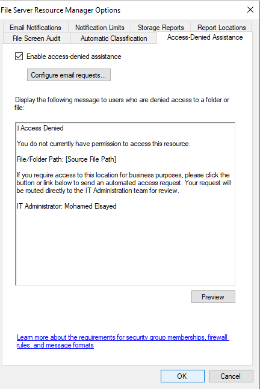
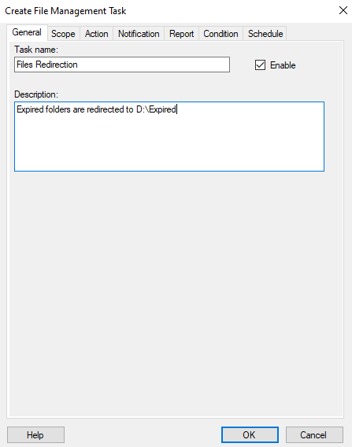

# FSRM Lab — Access-Denied Assistance & File Management Tasks

**Server:** `PDC16` (domain: `company.local`)
**Shared folder:** `\\PDC16\Data`
**File Management Task data:** `E:\Data` → expired files redirected to `E:\Expired`
**Report location:** `C:\StorageReports\Scheduled`

## Lab Overview

This lab covers two FSRM features that are unrelated to quotas or file screening but solve real day-to-day admin problems:

- **Access-Denied Assistance (ADA)** — instead of leaving users stuck on a generic "Access Denied" error, FSRM (plus a matching Group Policy setting) lets a server show a customized message with a self-service **Request Assistance** button that emails the folder owner/administrator automatically.
- **File Management Tasks** — a rules engine that finds files matching a condition (e.g. "older than 100 days") on a schedule and automatically performs an action on them (e.g. move them to an expiration folder), with full logging, notification, and reporting.

By the end of the lab you will have reproduced the default "Access Denied" error a user sees on an unauthorized share, turned on and customized FSRM's Access-Denied Assistance, enabled the self-service email request workflow, pushed the equivalent settings out via Group Policy so the same experience applies to all file types/clients, confirmed the policy took effect, and built a complete scheduled File Management Task that expires old files into an archive folder.

### Prerequisites
- Windows Server with the **File Server Resource Manager** role service installed
- A shared folder (`\\PDC16\Data`) with NTFS permissions that can produce an access-denied scenario
- Group Policy Management access (Computer Configuration → Administrative Templates → System → Access-Denied Assistance)
- A test data folder (`E:\Data`) and a target archive folder (`E:\Expired`)

### Task Map

| # | Task | What it proves |
|---|------|-----------------|
| 1 | Reproduce the default Access Denied error | Baseline: what users see before ADA is configured |
| 2 | Configure Access-Denied Assistance on the server | Custom message replaces the generic Windows error |
| 3 | Enable users to request assistance by email | Self-service request workflow with routing/CC rules |
| 4 | Push the matching settings via Group Policy | ADA applies to *all* file types, on the client side |
| 5 | Confirm the policy updated the server's message | GPO settings flow back into the live ADA message |
| 6 | *(End-to-end verification)* | A user denied access now sees the custom message + request button |
| 7 | Create a File Management Task | Start building an automated file lifecycle rule |
| 8 | Define the task's scope | Target `E:\Data` |
| 9 | Define action, condition, notification, report, and schedule | Fully automate expiring old files to `E:\Expired` |

---

## Part A — Access-Denied Assistance

### Task 1 — Reproduce the Default Access Denied Error

Before configuring anything, confirm what a user currently experiences when they lack permission to a share.

**Steps**
1. From a client machine, attempt to browse `\\PDC16\Data - New` (or any folder the current user lacks NTFS/share permissions to).
2. Windows returns a generic **Network Error**: *Windows cannot access \\PDC16\Data - New* with the message *You do not have permission to access \\PDC16\Data - New. Contact your network administrator to request access.*



**Result:** This is the unhelpful, dead-end message ADA replaces — it gives the user no way to act and no information for IT to act on.

---

### Task 2 — Configure Access-Denied Assistance on the Server

**Steps**
1. Open **FSRM** → **Configure Options** → **Access-Denied Assistance** tab.
2. Check **Enable access-denied assistance**.
3. In the message box, replace the default text with a custom message, e.g.:
   ```
   Access Denied

   You do not currently have permission to access this resource.

   If you require access to this location for business purposes, please click the
   button or link below to send an automated access request. Your request will
   be routed directly to the IT Administration team for review.

   IT Administrator: Mohamed Elsayed
   ```
4. Use **Preview** to confirm how the message will render to end users.



**Result:** Future access-denied events on this server will show this custom, actionable message instead of the generic Windows error from Task 1.

---

### Task 3 — Enable Users to Request Access by Email

**Steps**
1. From the same tab, click **Configure email requests…**.
2. Check **Enable users to request assistance**.
3. Under **Include the following information in the email**, check **User information (including claims)** and **Device state information** so IT has context for the request.
4. Set **Recipient list** to `Administrator@company.local`.
5. Under **Include the following in the recipient list**, check **Folder owner** and **Administrator** so requests are automatically routed to the people who can actually grant access.
6. Add boilerplate support text under **Add the following text to the end of the email** (e.g. general support / share-permissions support contacts).
7. Check **Generate an event log entry for each email sent** for auditing.
8. Click **OK**.


**Result:** The access-denied message now includes a working **Request Assistance** action that emails the folder owner and the administrator with enough context (user + device claims) to evaluate the request without back-and-forth.

---

### Task 4 — Push Matching Settings via Group Policy

Server-side FSRM settings only cover the resources that server manages. To get the same experience consistently — and to enable ADA for **all file types** on the client side, not just ones FSRM intercepts — the matching policy needs to be set via Group Policy.

**Steps**
1. Open **Group Policy Management Editor** on a GPO linked to the relevant OU (clients and/or file servers).
2. Navigate to **Computer Configuration** → **Administrative Templates** → **System** → **Access-Denied Assistance**.
3. Open **Enable access-denied assistance on client for all file types**, set it to **Enabled**. Per the built-in help text, this setting should be applied to **Windows clients** to enable ADA for all file types (supported on Windows Server 2012+/Windows 8+).

   

4. Open **Customize message for Access Denied errors**, set it to **Enabled**, and configure:
   - The custom message text (mirroring the server-side message from Task 2).
   - **Enable users to request assistance**.
   - **Email recipients:** Folder owner, File server administrator.
   - **Additional recipients:** e.g. `momaroof61@gmail.com`.
   - **Email settings:** Include device claims, Include user claims, Log emails in Application and Services event log.
   - Per the Help pane: if this policy is **enabled**, users get the customized message from whichever file server applies it; if **disabled**, users always see the standard message regardless of server configuration; if **not configured**, the server's own setting (Task 2) decides.

   

5. Click **OK**/**Apply** on both policies.

**Result:** ADA behavior is now enforced centrally via Group Policy rather than relying on every file server being configured by hand, and it now covers all file types on managed clients.

---

### Task 5 — Confirm the Policy Took Effect

**Steps**
1. After Group Policy refreshes (`gpupdate /force` or a normal refresh interval), reopen **FSRM** → **Configure Options** → **Access-Denied Assistance**.
2. Confirm the message now includes the dynamic variable **`[Source File Path]`**, showing the specific file/folder that triggered the denial — this is populated automatically from the GPO-driven configuration:
   ```
   Access Denied

   You do not currently have permission to access this resource.

   File/Folder Path: [Source File Path]

   If you require access to this location for business purposes, please click the
   button or link below to send an automated access request. Your request will
   be routed directly to the IT Administration team for review.

   IT Administrator: Mohamed Elsayed
   ```



**Result:** Group Policy and the local FSRM configuration are now in sync, and the message dynamically reports exactly which resource the user was denied — making each request actionable without guesswork.

---

### Task 6 — End-to-End Verification

With Tasks 2–5 complete, repeat the access attempt from Task 1. The user should now see the customized **Access Denied** message (including the specific file/folder path) with a button to automatically email a request to the folder owner and administrator, rather than the generic Windows network error.

> No separate screenshot was captured for this verification step — it is the practical confirmation that Tasks 1–5 work together end to end.

---

## Part B — File Management Tasks

### Task 7 — Create a File Management Task

A **File Management Task** automates a lifecycle action (move, delete, custom command, etc.) against files matching defined conditions, on a schedule.

**Steps**
1. Open **FSRM** → **File Management Tasks** → **Create File Management Task**.
2. On the **General** tab, set **Task name** to `Files Redirection` and leave **Enable** checked.
3. Add a **Description**, e.g. `Expired folders are redirected to D:\Expired`.



**Result:** The task shell is created; its scope, action, condition, notifications, reporting, and schedule are configured across the remaining tabs.

---

### Task 8 — Define the Task's Scope

**Steps**
1. Switch to the **Scope** tab.
2. Check all relevant data kinds under **Include all folders that store the following kinds of data**: **Application Files**, **Backup and Archival Files**, **Group Files**, **User Files**.
3. Confirm `E:\Data` is listed under **The following folders are included in this scope** (added via **Add…** if not already present).


**Result:** The task will evaluate every file under `E:\Data`, regardless of which managed-folder category it falls into.

---

### Task 9 — Define Action, Condition, Notification, Report, and Schedule

This single task is configured across five remaining tabs — together they define *what* happens, *when* a file qualifies, *who* gets warned in advance, *what* gets logged, and *how often* it all runs.

#### 9a — Action

1. On the **Action** tab, set **Type** to **File expiration**.
2. Set **Expiration directory** to `E:\Expired` (use **Browse…**).


Files matching the condition will be **moved** to `E:\Expired` rather than deleted outright — preserving them for recovery while clearing them out of active storage.

#### 9b — Condition

1. On the **Condition** tab, click **Add…** (or use the built-in property conditions shown) and configure:
   - **Days since file was created:** `100`
   - **Days since file was last modified:** `50`
   - **Days since file was last accessed:** `50`
2. Note the built-in caveat: if Last Access Time isn't maintained by the server, that specific condition may not function reliably.


A file must satisfy **all** checked conditions simultaneously to be acted upon — i.e., it must be at least 100 days old **and** untouched (modified/accessed) for at least 50 days.

#### 9c — Notification

1. On the **Notification** tab, click **Add…** to open **Add Notification**.
2. Set **Advance notification (in days)** to `15` — this warns stakeholders 15 days *before* a file is expired, giving them a chance to intervene.
3. On the **Event Log** sub-tab, check **Send warning to event log** and configure the **Log entry**, e.g.:
   ```
   [Number Of Files Under Action] files will expire on or after [File Action Date].
   ```
   using **Insert Variable** to add dynamic placeholders like `[Admin Email]`.


**Result:** Administrators get a 15-day heads-up, logged to the Event Log, before any file is actually moved — avoiding silent, surprise data movement.

#### 9d — Report

1. On the **Report** tab, under **Logging**, check **Log file** and **Error log file**.
2. Check **Generate a report** and **DHTML** under **Report formats**.
3. Leave **Send reports to the following administrators** unchecked if email delivery isn't needed (or check it and supply an address).
4. Note the confirmation: reports are saved to `C:\StorageReports\Scheduled`.


#### 9e — Schedule

1. On the **Schedule** tab, set **Run at:** `11:59:52 AM`.
2. Choose **Weekly** and check every day (**Sunday** through **Saturday**) so the task evaluates files daily.
3. Leave **Run continuously on new files** unchecked (this option only applies to tasks whose condition is based on classification properties).
4. Click **OK** to finish creating the task.


**Result:** `Files Redirection` now runs every day just before midnight, scans `E:\Data`, warns 15 days ahead of action via the event log, and moves any file untouched for 50+ days (and at least 100 days old) into `E:\Expired` — fully automated, logged, and reported.

---

## Lab Summary

| Feature | Object | Key Configuration |
|---|---|---|
| Access-Denied Assistance | Server-side ADA | Custom message + `[Source File Path]` variable, email requests routed to folder owner + Administrator |
| Access-Denied Assistance | Group Policy | "Enable access-denied assistance on client for all file types" + "Customize message for Access Denied errors", both **Enabled** |
| File Management Task | `Files Redirection` | Scope `E:\Data`; Action: File expiration → `E:\Expired`; Condition: created ≥100 days, modified/accessed ≥50 days; 15-day advance notice; daily schedule at 11:59:52 AM |

**Key takeaways**
- Access-Denied Assistance has **two halves** that must agree: the FSRM server-side message/email configuration, and the Group Policy settings that extend the same behavior to all file types on managed clients. Configuring only one half gives an inconsistent experience.
- The ADA message supports **dynamic variables** like `[Source File Path]`, so the same generic message text can still tell the user (and IT) exactly which resource triggered the denial.
- File Management Tasks separate **what** (Action), **when a file qualifies** (Condition), **who's warned and how** (Notification), **what's recorded** (Report), and **how often it runs** (Schedule) into distinct tabs — making a single task fully self-documenting.
- The **Advance notification** feature is what turns an automated deletion/move task from a risky silent operation into a safe, observable one: stakeholders get a logged warning before any file is touched.
- Like the other FSRM features, File Management Task reports land in their own dedicated, configurable location (`C:\StorageReports\Scheduled` by default).

---

### Folder structure of this submission

```
README.md

 ├─ task1-access-denied-message.png
 ├─ task2-configure-access-denied-assistance.png
 ├─ task3-enable-email-requests.png
 ├─ task4-gp-enable-access-denied-assistance.png
 ├─ task4-gp-customize-message.png
 ├─ task5-policies-updated.png
 ├─ task7-create-file-mgmt-task.png
 ├─ task8-define-scope.png
 ├─ task9-define-action.png
 ├─ task9-define-condition.png
 ├─ task9-define-notification.png
 ├─ task9-define-report.png
 └─ task9-define-schedule.png
```

> Keep `README.md` and the `` folder together in the same parent directory (e.g. when uploading to GitHub or opening locally) so the screenshots render correctly.
