# Dynamic Access Control (DAC) with FSRM — Windows Server Admin Lab

This lab walks through configuring **Dynamic Access Control (DAC)** on Windows Server, integrating **File Server Resource Manager (FSRM)** classification properties, Active Directory **claims**, **central access rules**, and **central access policies** to enforce attribute-based access control on a file share.

## Overview

Dynamic Access Control lets you control access to files and folders based on attributes of the user (department, location, etc.), the device (claims), and the resource (classification properties on the file/folder), instead of relying on NTFS/Share permissions alone. FSRM is used here to manage the resource property (classification) side of DAC, while AD Administrative Center is used to configure claim types, resource properties, and central access rules/policies.

## Prerequisites

- A working Active Directory domain with a Domain Controller
- A member file server joined to the domain
- Group Policy Management access to create/edit GPOs
- Test user accounts and a shared folder to apply the policy to

## Lab Steps

### 1. Share the Folder with Authenticated Users Permission
Create the folder to be protected and share it, granting **Authenticated Users** share-level permission as a baseline.

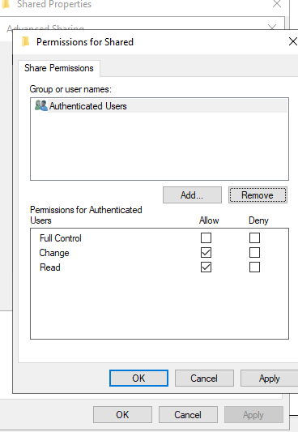

### 2. Set NTFS Permissions for Authenticated Users
Configure NTFS permissions on the folder for **Authenticated Users**, since DAC layers on top of (not instead of) standard NTFS permissions.

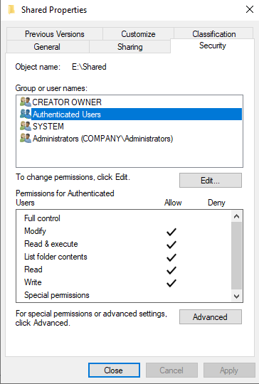

### 3. Enable KDC Support for User Claims (Domain Controllers OU)
Enable the **"KDC support for claims, compound authentication, and Kerberos armoring"** Group Policy setting on the Domain Controllers OU. This is required for Kerberos to issue and transmit user/device claims.

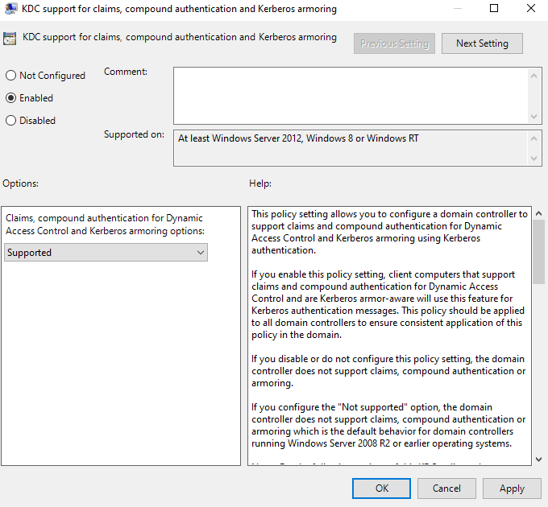

### 4. Edit PC (Device) Classification
Set device claim attribute values on the computer object(s) that will be evaluated as part of the access policy.

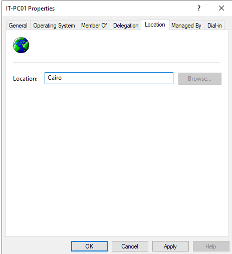

### 5. Enable DAC via Group Policy (FSRM/DAC Control Panel)
Configure the **"KDC support for claims"** and DAC-related settings, and review the Dynamic Access Control control panel to confirm the feature is enabled domain-wide.

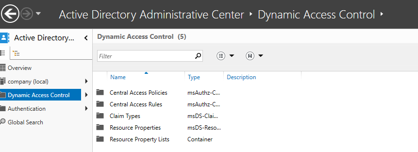

### 5b. Edit User Classification
Set user attribute values (e.g., Department, Location) on the test user account(s) in Active Directory — these become the source for user claims.

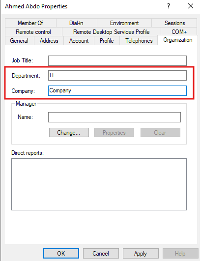

### 6. Add a Department Claim Type
In Active Directory Administrative Center, create a new **claim type** based on the user's `Department` attribute.

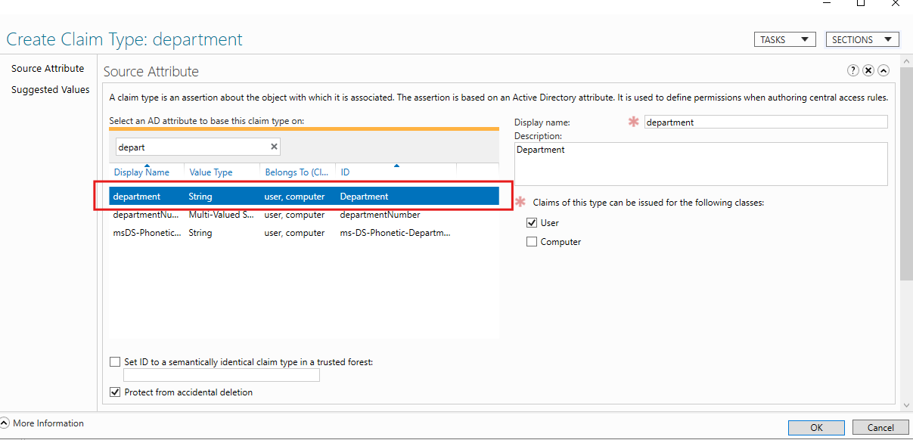

### 7. Add a Location Claim Type
Create an additional **claim type** based on the user's `Location`/`Office` attribute.

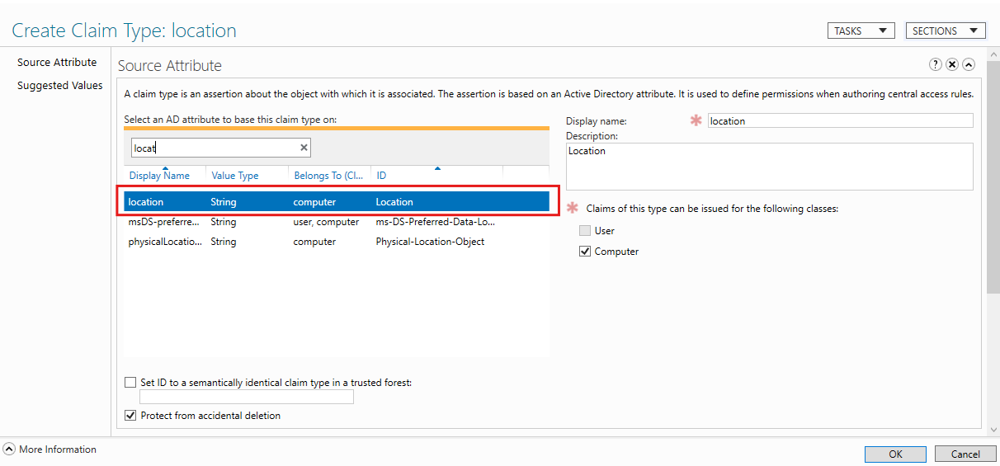

### 8. Enable and Edit the Department Resource Property
Enable the built-in **Department** resource property and edit its suggested values so it can be used to classify files/folders and referenced in central access rules.

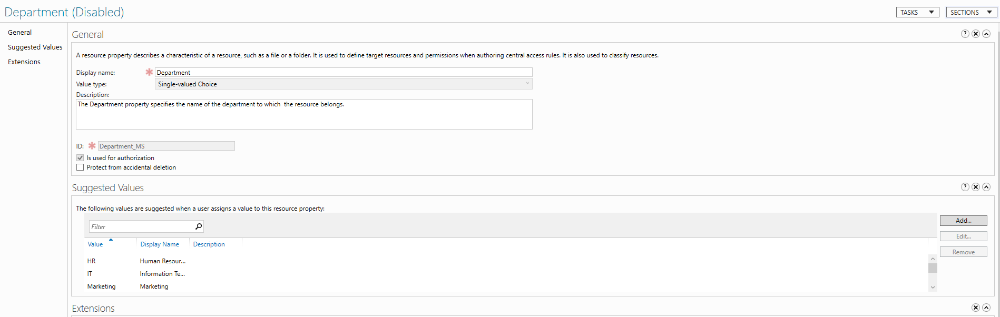

### 8b. Enable and Edit the Location Resource Property
Enable the **Location** resource property and edit its suggested values in the same way.

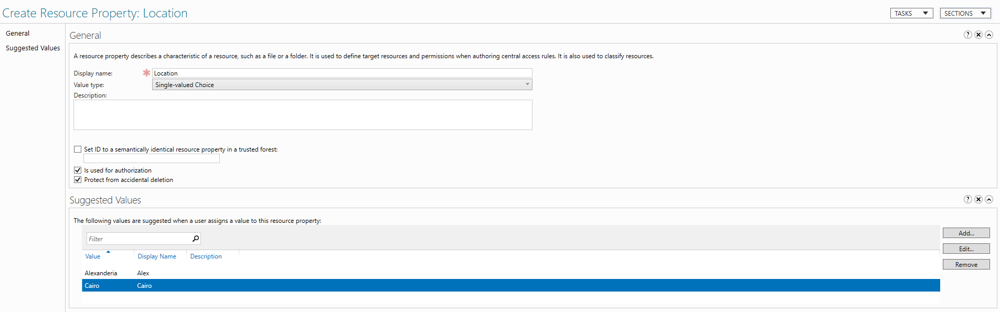

### 9. Update the FSRM Classification Property
In **File Server Resource Manager**, update/refresh the classification property definitions so the newly enabled resource properties (Department, Location) are available for classifying folders.

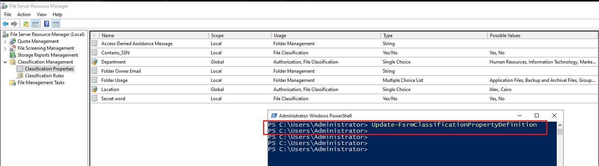

### 10. Add Folder Attributes (Classification)
Apply classification values (Department, Location) directly to the target folder's properties — these are the resource attributes DAC will evaluate against user claims.

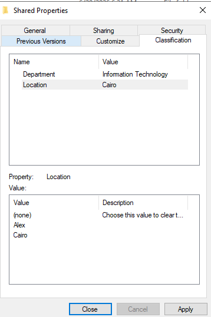

### 11. Create a Central Access Rule
Build a **Central Access Rule** that defines the conditional expression — matching user claims (Department/Location) against resource properties on the folder — to grant or deny access.

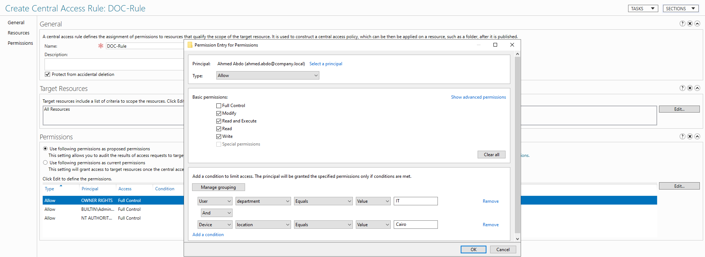

### 12. Create the DAC (Central Access) Policy
Bundle the central access rule into a **Central Access Policy** that can be published and applied via Group Policy.

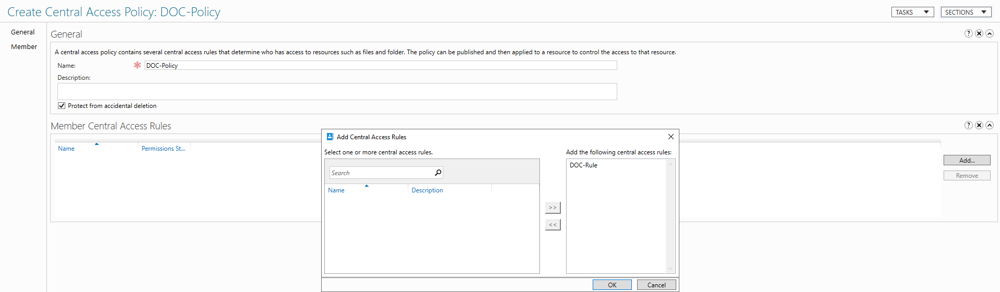

### 13. Review the Central Access Policy for DAC
Verify the central access policy configuration and its associated rule(s) before deployment.

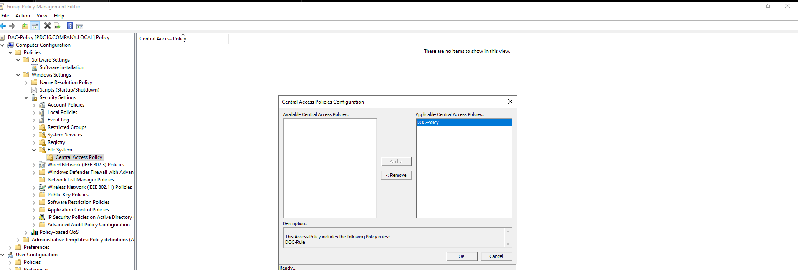

### 14. Apply the Policy on the Folder
Deploy the Central Access Policy to the file server via Group Policy, then apply/associate it to the target folder's security settings (alongside existing NTFS permissions).

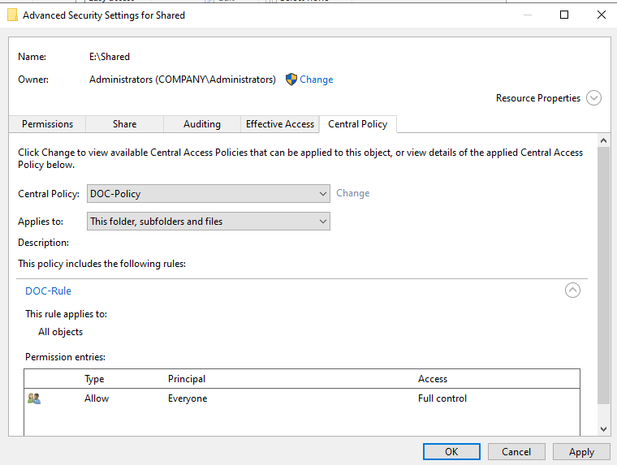

### 15. Verify with Effective Access
Use the **Effective Access** tab on the folder's Advanced Security Settings to confirm the test user is granted access as expected, validating that claims + resource properties + central access rule are all working together.

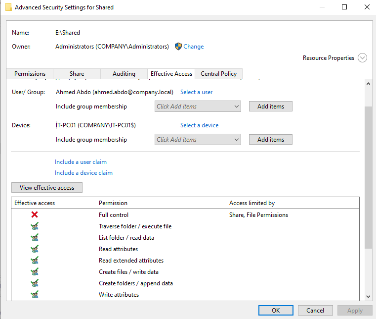

## Result

By combining NTFS/Share permissions with AD claims, FSRM resource classification, and a Central Access Policy, the folder now enforces **attribute-based access control**: a user is only granted access if their claims (e.g., Department = HR, Location = HQ) match the classification applied to the folder — demonstrating a working Dynamic Access Control implementation.

## Notes

- All screenshots referenced above should be placed in the same directory as this README for the images to render correctly on GitHub.
- This lab is part of a broader **100 Windows Server Admin Labs** collection.
