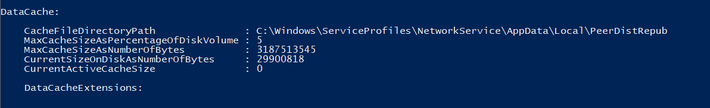

# BranchCache Lab — Hosted Cache Mode

**Domain:** `company.local`
**Main file server:** `PDC16` (head office — content source)
**Branch cache server:** `ADC` (`ADC.company.local` — hosts cached content at the branch)
**Branch clients:** Windows 7+ / Windows 8+ domain members
**Mode:** **Hosted Cache Mode** — clients upload content to a dedicated branch server, and other branch clients download from it instead of crossing the WAN

---

## Lab Overview

**BranchCache** is a Windows WAN-optimization feature that caches content from central file servers at the branch office, dramatically reducing repetitive WAN traffic. When a branch user opens a file from a head-office share, their client:

1. Downloads the file from the main file server over the WAN (first access).
2. Stores a hash-encrypted cached copy on the **Hosted Cache Server** at the branch.
3. The next branch user who requests the same file retrieves it from the **local** hosted cache server instead of crossing the WAN again.

### BranchCache Modes

| Mode | How it works | When to use |
|---|---|---|
| **Hosted Cache** | Branch clients upload to a dedicated branch server; others download from it | Branch has a server; predictable, manageable |
| **Distributed Cache** | Clients cache and share directly peer-to-peer | Small branch, no server |

This lab uses **Hosted Cache Mode** with `ADC.company.local` as the hosted cache server.

### Architecture Diagram

```
┌──────────────────────────────────────────────────────────────┐
│                     HEAD OFFICE (WAN)                        │
│                                                              │
│   PDC16 (Main File Server)                                   │
│   ├─ BranchCache for Network Files feature installed         │
│   ├─ Hash Publication GPO → generates content hashes        │
│   └─ Shared folder → Enable BranchCache in Offline Settings │
└──────────────────────────────┬───────────────────────────────┘
                               │  WAN link (expensive)
                               │  First access only ──────────┐
                               │                              │
┌──────────────────────────────▼───────────────────────────────┤
│                    BRANCH OFFICE (LAN)                       │
│                                                              │
│  ADC (Hosted Cache Server)                                   │
│  ├─ BranchCache for Network Files feature installed         │
│  ├─ Firewall rules: UDP 3702 + TCP 80 (inbound)             │
│  ├─ Cache partition: C:\data (20% of disk)                  │
│  └─ Registered in AD via Service Connection Point (SCP)     │
│                    ▲               │                         │
│   Upload cache     │               │  Serve cached content   │
│                    │               ▼                         │
│  Branch Client 1 ──┘       Branch Client 2                  │
│  (first to fetch)          (gets it from ADC, not WAN)      │
└──────────────────────────────────────────────────────────────┘
```

### Task Map

| # | Task | Where |
|---|------|--------|
| 1 | Install BranchCache for Network Files feature | PDC16 + ADC (Server Manager) |
| 2 | Enable BranchCache on the shared folder | PDC16 — Offline Settings |
| 3 | Apply Hash Publication GPO to main file server | Group Policy (PDC16 OU) |
| 4 | Enable BranchCache on client PCs via GPO | Group Policy (Clients OU) |
| 5 | *(Install Hosted Cache Server role on ADC)* | ADC — Server Manager |
| 6 | Set clients to Hosted Cache mode via GPO | Group Policy (Clients OU) |
| 7 | Enable Automatic Hosted Cache Discovery via GPO | Group Policy (Clients OU) |
| 8 | Add BranchCache firewall inbound rules on ADC | Windows Firewall (ADC) |
| 9 | Verify BranchCache status on ADC (Get-BCStatus) | PowerShell (ADC) |
| 10 | Move cache partition and set percentage on ADC | PowerShell (ADC) |
| 11 | Verify updated DataCache settings | PowerShell (ADC) |
| 12 | Validate client BranchCache status | CMD (branch client) |

---

## Part 1 — Server-Side Setup

### Task 1 — Install BranchCache for Network Files

**BranchCache for Network Files** is a role service under **File and iSCSI Services** that must be installed on both the main file server (so it can generate content hashes) and the branch hosted cache server (so it can serve cached content).

**Steps — on PDC16 (main file server)**
1. Open **Server Manager** → **Add Roles and Features**.
2. Proceed to **Server Roles** → expand **File and Storage Services** → **File and iSCSI Services**.
3. Check **BranchCache for Network Files**.
4. Complete the wizard and click **Install**.

**Steps — on ADC (branch hosted cache server)**
1. Repeat the same process targeting `ADC.company.local` (select it in **Server Selection**).
2. Install **BranchCache for Network Files** on ADC as well.


**Result:** Both servers can now participate in the BranchCache infrastructure — PDC16 publishes content hashes; ADC stores and serves cached content to branch clients.

---

### Task 2 — Enable BranchCache on the Shared Folder

The file server must be told which shares are eligible for BranchCache caching. This is done per-share via the **Offline Settings** dialog.

**Steps**
1. On **PDC16**, right-click the shared folder → **Properties** → **Sharing** tab → **Advanced Sharing** → **Caching**.
2. Keep the mode as **Only the files and programs that users specify are available offline**.
3. Check **Enable BranchCache**.
4. Click **OK**.


**Result:** BranchCache content hashing is now active for this share. When clients access files from this share, the server will generate and publish block hashes that allow BranchCache to verify cached content integrity.

---

### Task 3 — Apply Hash Publication GPO to the Main File Server

The file server needs a Group Policy setting that instructs the BranchCache service to **generate and publish hashes** for shared content. Without this, clients cannot locate or verify cached blocks.

**Steps**
1. Open **Group Policy Management** → create (or edit) a GPO linked to the **OU containing PDC16** (the main file server). Name it, e.g., `BranchCache-FileServer`.
2. Navigate to: **Computer Configuration** → **Policies** → **Administrative Templates** → **Network** → **Lanman Server**.
3. Open **Hash Publication for BranchCache** → set to **Enabled**.
4. In the **Options** drop-down, select **Allow hash publication for all shared folders** (Value = 2).
   > The three options are:
   > - `0` = Allow hash publication only for shared folders on which BranchCache is enabled *(recommended for production — honors per-share setting from Task 2)*
   > - `1` = Disallow hash publication on all shared folders
   > - `2` = Allow hash publication for all shared folders *(used here for simplicity)*
5. Click **OK** / **Apply**.


**Result:** PDC16 now automatically generates BranchCache hashes for shared content. Clients at the branch can request these hashes and use them to retrieve verified cached copies from ADC.

---

## Part 2 — Client-Side GPO Configuration

### Task 4 — Enable BranchCache on Client PCs

BranchCache is off by default on clients. A GPO is the cleanest way to turn it on for all branch workstations at once.

**Steps**
1. Create (or edit) a GPO linked to the **Branch Clients OU**. Name it, e.g., `BranchCache-Clients`.
2. Navigate to: **Computer Configuration** → **Policies** → **Administrative Templates** → **Network** → **BranchCache**.
3. Open **Turn on BranchCache** → set to **Enabled**.
4. Click **OK**.


> **Important:** Enabling BranchCache alone is not enough — you must also configure the **mode** (Task 6). The help text in the dialog explicitly states that after enabling this setting, you must set either *Distributed Cache* or *Hosted Cache* mode, or configure hosted cache servers separately.

**Result:** BranchCache is now active on all branch client computers. Mode selection follows in Task 6.

---

### Task 5 — Install the Hosted Cache Server Role on ADC

> *(No separate screenshot was captured for this step — it follows the same Server Manager flow as Task 1.)*

**Steps**
1. On **ADC**, open Server Manager → **Add Roles and Features** → select the **BranchCache** feature (not the role service — this is the core Hosted Cache Server component, distinct from "BranchCache for Network Files").
2. Additionally, confirm the **BranchCache for Network Files** role service (installed in Task 1) is present.
3. After installation, run in PowerShell:
   ```powershell
   Enable-BCHostedServer -RegisterSCP
   ```
   The `-RegisterSCP` flag registers `ADC` as a BranchCache Hosted Cache Server in Active Directory via a **Service Connection Point (SCP)**, enabling automatic discovery by clients (used in Task 7).

**Result:** ADC is now a functioning Hosted Cache Server, registered in AD so clients can discover it automatically.

---

### Task 6 — Set BranchCache Hosted Cache Mode on Clients

After enabling BranchCache (Task 4), the client must be told *which mode* to operate in and *which server* to use.

**Steps**
1. In the same **BranchCache-Clients** GPO → **BranchCache** settings.
2. Open **Set BranchCache Hosted Cache mode** → set to **Enabled**.
3. In the **Options** box, type the hosted cache server name: `ADC.company.local`.
4. Click **OK**.


**Result:** Branch clients are now directed to upload cached content to and retrieve content from `ADC.company.local` rather than fetching it across the WAN each time.

---

### Task 7 — Enable Automatic Hosted Cache Discovery

This setting tells clients to search Active Directory for hosted cache servers (via the SCP registered in Task 5) rather than relying solely on the manually specified server name from Task 6. It provides resilience and simplifies management when hosted cache servers change.

**Steps**
1. In the same GPO → **BranchCache** settings.
2. Open **Enable Automatic Hosted Cache Discovery by Service Connection Point** → set to **Enabled**.
3. Click **OK**.


**Result:** Clients will automatically find hosted cache servers registered in AD for their site, preferring them over any other BranchCache configuration. This combines with Task 6's explicit name as a fallback.

---

## Part 3 — Firewall and Cache Configuration on ADC

### Task 8 — Add BranchCache Inbound Firewall Rules on ADC

The hosted cache server must accept two types of inbound traffic from branch clients. These rules are usually created automatically when BranchCache is installed, but should be verified or added manually if missing.

**Steps**
1. On **ADC**, open **Windows Defender Firewall with Advanced Security** → **Inbound Rules**.
2. Confirm (or add) both rules:

   | Rule Name | Group | Protocol | Port | Purpose |
   |---|---|---|---|---|
   | BranchCache Peer Discovery (WSD-In) | BranchCache – Peer Discovery | UDP | 3702 | WS-Discovery — allows clients to discover the hosted cache server and check for available cached content |
   | BranchCache Content Retrieval (HTTP-In) | BranchCache – Content Retrieval | TCP | 80 | HTTP — actual transfer of cached content blocks from ADC to clients |

3. Confirm both rules show **Enabled = Yes**, **Action = Allow**, **Profile = All**.


**Result:** ADC can now receive peer-discovery queries (UDP 3702) and content retrieval requests (TCP 80) from branch clients. Without these rules, clients cannot communicate with the hosted cache server.

---

### Task 9 — Verify BranchCache Status on ADC

Before tuning the cache, verify the current BranchCache configuration on the hosted cache server.

**Steps**
1. On **ADC**, open **PowerShell** as Administrator.
2. Run:
   ```powershell
   Get-BCStatus
   ```
3. Review the **DataCache** section:

   | Field | Value | Meaning |
   |---|---|---|
   | `CacheFileDirectoryPath` | `C:\Windows\ServiceProfiles\NetworkService\AppData\Local\PeerDistRepub` | Default cache location |
   | `MaxCacheSizeAsPercentageOfDiskVolume` | `5` | Currently using 5% of disk |
   | `MaxCacheSizeAsNumberOfBytes` | `3,187,513,545` | ~3 GB allocated |
   | `CurrentSizeOnDiskAsNumberOfBytes` | `29,900,818` | ~29 MB currently used |
   | `CurrentActiveCacheSize` | `0` | No active cached content yet |



**Result:** BranchCache is running but using its default cache location (buried inside the Windows profile path) and only 5% of disk. Tasks 10–11 move and expand the cache.

---

### Task 10 — Move Cache Partition and Set Percentage

The default cache path is inconvenient for monitoring and management. Moving it to a dedicated drive/folder and increasing the allocation makes the hosted cache more practical.

**Steps**
1. Move the cache to a dedicated location:
   ```powershell
   Set-BCCache -MoveTo c:\data
   ```
   Confirm the operation when prompted: type `y` → press Enter.

2. Increase the cache size to 20% of the disk volume:
   ```powershell
   Set-BCCache -Percentage 20
   ```
   Confirm again: type `y` → press Enter.


**Result:** The cache will be relocated to `C:\data` and expanded to 20% of that disk volume, giving the hosted cache server significantly more headroom for storing branch content.

---

### Task 11 — Verify Updated DataCache Settings

**Steps**
1. Run `Get-BCStatus` again and inspect the **DataCache** section.
2. Confirm the changes took effect:

   | Field | Before (Task 9) | After (Task 11) |
   |---|---|---|
   | `CacheFileDirectoryPath` | `C:\Windows\...\PeerDistRepub` | `C:\data` ✅ |
   | `MaxCacheSizeAsPercentageOfDiskVolume` | `5` | `20` ✅ |
   | `MaxCacheSizeAsNumberOfBytes` | ~3 GB | ~12.5 GB ✅ |
   | `CurrentSizeOnDiskAsNumberOfBytes` | ~29 MB | ~29 MB (unchanged, cache not yet populated) |
   | `CurrentActiveCacheSize` | `0` | `0` (no client traffic yet) |


**Result:** `CacheFileDirectoryPath = C:\data` and `MaxCacheSizeAsPercentageOfDiskVolume = 20` confirm both changes were applied. The cache is now at `C:\data` with ~12.5 GB capacity, ready to serve branch clients.

---

## Part 4 — Validation

### Task 12 — Validate Client BranchCache Status

With server configuration complete and GPOs applied, verify that branch clients have picked up the correct BranchCache configuration.

**Steps**
1. On a **branch client** (as any domain user), open **Command Prompt** and run:
   ```cmd
   netsh branchcache show status all
   ```
2. Review all three sections:

**BranchCache Service Status**

| Field | Expected Value |
|---|---|
| Service Mode | `Hosted Cache Client (Set By Group Policy)` |
| Current Status | `Running` |
| Service Start Type | `Manual` |
| Hosted Cache Location | `ADC.company.local (Set By Group Policy)` |

**Local Cache Status**

| Field | Value |
|---|---|
| Maximum Cache Size | `5% of hard disk` |
| Active Current Cache Size | `0 Bytes` (no data cached yet) |
| Local Cache Location | `Default` |

**Publication Cache Status**

| Field | Value |
|---|---|
| Maximum Cache Size | `1% of hard disk` |
| Active Current Cache Size | `0 Bytes` |
| Publication Cache Location | `Default` |


**Result:** The client is running in **Hosted Cache Client** mode, pointed at `ADC.company.local`, and the configuration was applied **by Group Policy** — exactly as configured in Tasks 4, 6, and 7. The first time branch clients access files from PDC16's shared folder, the content will be cached on ADC and subsequent accesses by any branch client will be served locally.

---

## Lab Summary

| Component | Server/Object | Key Configuration |
|---|---|---|
| BranchCache for Network Files feature | PDC16 + ADC | Installed via Server Manager |
| BranchCache Hosted Cache Server | ADC | `Enable-BCHostedServer -RegisterSCP`; SCP registered in AD |
| Share-level caching | PDC16 shared folder | Offline Settings → Enable BranchCache |
| Hash Publication GPO | PDC16 OU | Hash publication for all shared folders → Enabled |
| Client GPO (Turn on BranchCache) | Branch Clients OU | Enabled |
| Client GPO (Hosted Cache mode) | Branch Clients OU | `ADC.company.local` |
| Client GPO (Auto discovery) | Branch Clients OU | Enabled (uses AD SCP) |
| Firewall rules | ADC | UDP 3702 (Peer Discovery) + TCP 80 (Content Retrieval) |
| Cache location | ADC | `C:\data` (moved from default) |
| Cache size | ADC | 20% of disk (~12.5 GB) |

**Key takeaways**
- BranchCache requires a **chain of four enablement steps**: feature install on both servers → share-level caching enabled → hash publication GPO on the file server → BranchCache turned on + mode configured on clients. Any missing link silently breaks the chain.
- **Hash publication** is what makes BranchCache work for SMB/CIFS file shares. The file server must generate block hashes so clients can verify the integrity of cached content before using it without re-downloading from the WAN.
- **Hosted Cache mode vs Distributed Cache mode**: Hosted Cache requires a dedicated server but is more efficient for larger branches (cache is centralized and persistent); Distributed Cache is peer-to-peer between clients (no dedicated server needed, but cache is lost when clients restart).
- The `-RegisterSCP` flag in `Enable-BCHostedServer -RegisterSCP` is what allows **automatic discovery** (Task 7) to work — it publishes the hosted cache server's address into Active Directory so clients can find it without being manually configured.
- Firewall rules **UDP 3702** and **TCP 80** are both required — peer discovery lets the client ask "do you have this content?", and content retrieval (HTTP) is how the actual blocks are transferred. Missing either port breaks the feature silently.
- `Set-BCCache -Percentage` and `Set-BCCache -MoveTo` can be run independently or together. The percentage is always relative to the volume the cache folder lives on, so move the folder first before setting the percentage.

---

### Folder structure of this submission

```
README.md

 ├─ task1-install-branchcache-feature.png
 ├─ task2-enable-branchcache-on-share.png
 ├─ task3-hash-publication-gpo.png
 ├─ task4-turn-on-branchcache-clients-gpo.png
 ├─ task6-set-hosted-cache-mode-gpo.png
 ├─ task7-auto-hosted-cache-discovery-gpo.png
 ├─ task8-firewall-inbound-rules.png
 ├─ task9-get-bcstatus.png
 ├─ task10-set-bccache-location-and-percentage.png
 ├─ task11-datacache-updated.png
 └─ task12-validate-client-status.png
```

> Keep `README.md` and the `` folder together in the same parent directory so screenshots render correctly.
