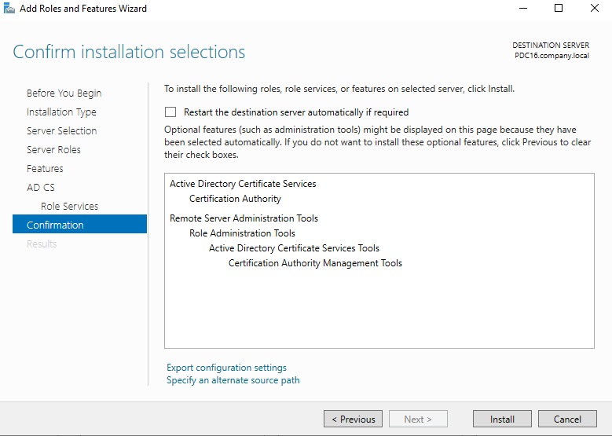

# Work Folders Lab

**Server:** `PDC16.company.local` (domain: `company.local`)
**Work Folders URL:** `http://PDC16.company.local` (HTTP — lab environment)
**Sync share path:** `E:\workfolders`
**Test user:** `ahmed.abdo` → local folder: `C:\Users\ahmed.abdo\Work Folders`

---

## Lab Overview

**Work Folders** is a Windows Server role service (introduced in Server 2012 R2) that lets users sync files between a central file server and their devices — including non-domain-joined PCs, tablets, and phones. It is the on-premises equivalent of OneDrive for Business: a user saves a file into their Work Folders location on any device, and it automatically syncs to the server and out to all their other devices.

### How Work Folders differs from traditional file shares

| Feature | Classic File Share | Work Folders |
|---|---|---|
| Requires VPN to access | Yes (off-premises) | No (HTTPS sync) |
| Works on non-domain devices | Limited | Yes |
| Offline access | Via Offline Files | Built-in |
| Per-user folder isolation | Manual | Automatic |
| Sync protocol | SMB | HTTPS (port 443) |

### Architecture

```
┌──────────────────────────────────────────┐
│           PDC16.company.local             │
│                                          │
│  Roles installed:                        │
│  ├─ Work Folders (File & iSCSI Services) │
│  ├─ IIS Hostable Web Core (auto)         │
│  └─ AD CS – Certification Authority      │
│                                          │
│  Sync Share: E:\workfolders              │
│  ├─ ahmed.abdo\  (per-user subfolder)    │
│  └─ ...                                  │
│                                          │
│  Service: SyncShareSvc (Automatic)       │
│  URL: http://PDC16.company.local (lab)   │
│       https://PDC16.company.local (prod) │
└──────────────────┬───────────────────────┘
                   │ HTTPS sync (or HTTP in lab)
        ┌──────────┴──────────┐
        │                     │
   Domain PC             Non-domain device
   C:\Users\ahmed.abdo\  (BYOD, tablet, etc.)
   Work Folders\
```

### Task Map

| # | Task | Where |
|---|------|--------|
| 1a | Install Work Folders role service | PDC16 — Server Manager |
| 1b | Verify Windows Sync Share service is running | PDC16 — Services |
| 2a | Install Active Directory Certificate Services (CA) | PDC16 — Server Manager |
| 2b | Create a Sync Share (New Sync Share Wizard) | PDC16 — Server Manager |
| 3 | Allow HTTP (unsecure) connections via registry | PDC16 — Registry Editor |
| 4 | Set the Work Folders URL on the client | Client PC — Work Folders setup |
| 5 | Set local Work Folders location on the client | Client PC — Work Folders setup |
| 6 | Confirm sync is active | Client PC — Work Folders |

---

## Part 1 — Server Installation

### Task 1a — Install the Work Folders Role Service

**Work Folders** is a role service under **File and Storage Services → File and iSCSI Services**. When installed, it automatically also installs **IIS Hostable Web Core** to provide the HTTPS endpoint that clients connect to.

**Steps**
1. On **PDC16**, open **Server Manager** → **Add Roles and Features**.
2. Proceed to **Server Roles** → expand **File and Storage Services** → **File and iSCSI Services**.
3. Check **Work Folders**.
4. Accept the prompt to also add **IIS Hostable Web Core** (required dependency).
5. Click **Install** and wait for completion.


> **What gets installed:** The `Work Folders` role service plus `IIS Hostable Web Core`. The latter is a lightweight web server that handles the HTTPS sync protocol between clients and the server — no full IIS installation is needed.

---

### Task 1b — Verify the Windows Sync Share Service

**Steps**
1. Open **Services** (`services.msc`) on PDC16.
2. Find **Windows Sync Share** (Service name: `SyncShareSvc`).
3. Confirm:
   - **Startup type:** `Automatic`
   - **Service status:** `Running`
4. If it is not running, right-click → **Start**.


> `SyncShareSvc` is the core service that enables client devices to sync files from the file server. It must be running and set to Automatic before any client can connect.

**Result:** Both the role service and its backing Windows service are confirmed operational on PDC16.

---

## Part 2 — Certificate Authority and Sync Share Setup

### Task 2a — Install Active Directory Certificate Services (CA)

In production, Work Folders requires **HTTPS** (port 443) and therefore needs a valid SSL/TLS certificate. Installing an enterprise **Certification Authority** on PDC16 lets the server issue its own certificate trusted by domain members.

> **Lab note:** This lab uses **HTTP** (Task 3 covers the registry tweak to allow this). The CA is still installed so the infrastructure is production-ready, and to demonstrate the complete, correct setup.

**Steps**
1. Open **Server Manager** → **Add Roles and Features**.
2. Select **Active Directory Certificate Services** under **Server Roles**.
3. Under **Role Services**, keep the default: **Certification Authority**.
4. Confirm the installation also includes: **Active Directory Certificate Services Tools** and **Certification Authority Management Tools** (RSAT components added automatically).
5. Click **Install**.



6. After installation, complete the **AD CS post-deployment configuration** (click the flag notification → **Configure Active Directory Certificate Services**), set it up as an **Enterprise Root CA**, and name it appropriately (e.g., `company-PDC16-CA`).

**Result:** PDC16 can now issue SSL certificates to itself (and other servers), enabling secure HTTPS Work Folders connections for production deployments.

---

### Task 2b — Create a Sync Share (New Sync Share Wizard)

A **Sync Share** is the server-side folder that Work Folders manages. Each sync share has a dedicated path, a per-user subfolder structure, access permissions, and optionally PC security policies.

**Steps**
1. In **Server Manager** → **File and Storage Services** → **Work Folders**.
2. Click **To create a sync share, start the New Sync Share Wizard**.

**Step 2b-i — Select Server and Path**
3. Select **PDC16** (Online, Not Clustered).
4. Under **Location**, choose **Enter a local path** and type `E:\workfolders`.
5. Click **Next**.


> The wizard only lists servers that have the Work Folders role installed. You can also select an existing share from the list, but entering a local path lets you designate a dedicated folder (which will be created if it doesn't exist).

**Step 2b-ii — User Folder Structure**
6. Choose **User alias** (e.g., subfolders named `ahmed.abdo`, `john.smith`, etc.).
   - **User alias** — maintains compatibility with existing per-user folders based on login names.
   - **User alias@domain** — use this in multi-domain environments to avoid alias collisions.
7. Leave **Sync only the following subfolder** unchecked (sync the entire user folder).
8. Click **Next**.


**Step 2b-iii — Sync Share Name**
9. Accept the default Sync Share name (derived from the path) or type a custom name, e.g., `workfolders`.
10. Click **Next**.

**Step 2b-iv — Sync Access**
11. Under **Grant sync access to groups**, click **Add** and add **COMPANY\Domain Users** so all domain users can sync.
12. Check **Disable inherited permissions and grant users exclusive access to their files** — this ensures each user can only see and access their own subfolder, not anyone else's.
13. Click **Next**.


**Step 2b-v — PC Security Policies (optional)**
14. For this lab, leave **PC Security Policies** unconfigured (no encryption or screen lock requirements). In production you would check **Encrypt Work Folders** and set a lock-screen timeout for BYOD compliance.
15. Click **Next** → **Create**.

**Result:** The sync share `E:\workfolders` is created on PDC16 with per-user `User alias` subfolders and access granted to all Domain Users. When a user first connects, a subfolder named after their alias (e.g., `E:\workfolders\ahmed.abdo`) is automatically created.

---

## Part 3 — Allow HTTP (Lab Only)

### Task 3 — Edit Registry to Allow Unsecure HTTP Connections

In a production environment, Work Folders uses HTTPS (port 443) with a valid SSL certificate. In the lab, the CA is installed but HTTP is used for simplicity. A registry key must be set on the **server** to explicitly allow unsecured (HTTP) client connections.

> ⚠️ **This step is for lab use only.** Never allow unsecured Work Folders connections in production — user data would be transmitted unencrypted.

**Steps**
1. On **PDC16**, open **Registry Editor** (`regedit`).
2. Navigate to:
   ```
   HKEY_LOCAL_MACHINE\SYSTEM\CurrentControlSet\Services\SyncShareSvc\Parameters
   ```
3. Create a new **DWORD (32-bit) Value** named `AllowUnsecureConnection`.
4. Set its **Value data** to `1` (Hexadecimal).
5. Click **OK**.


6. Restart the **Windows Sync Share** service for the change to take effect:
   ```powershell
   Restart-Service SyncShareSvc
   ```

**Result:** The Work Folders service will now accept client connections over HTTP (`http://PDC16.company.local`) instead of requiring HTTPS. This allows the lab to proceed without configuring SSL certificate binding.

---

## Part 4 — Client Setup

### Task 4 — Set the Work Folders URL on the Client

**Steps**
1. On the client PC (as `ahmed.abdo` or any domain user), open **Control Panel** → **System and Security** → **Work Folders**.
2. Click **Set up Work Folders**.
3. On the **Enter a Work Folders URL** screen, type:
   ```
   http://PDC16.company.local
   ```
4. Click **Next**.


> The client will contact the server at this URL and authenticate using the logged-in user's domain credentials. The server looks up which sync share the user belongs to and prepares their per-user subfolder.

---

### Task 5 — Set the Local Work Folders Location on the Client

**Steps**
1. The wizard shows the **Introducing Work Folders** screen with the proposed local path:
   ```
   C:\Users\ahmed.abdo\Work Folders
   ```
2. Optionally click **Change** to use a different local folder.
3. Check **Enable on-demand file access on this PC (recommended)** — this makes all files visible in File Explorer but downloads them only when opened, saving local disk space.
4. Accept the security policy acknowledgment if prompted.
5. Click **Set up Work Folders**.


> **On-demand file access** means files appear as placeholders in File Explorer. Only files the user actually opens are downloaded to the local disk. The rest are always visible but take no space — similar to OneDrive's "Files On-Demand" feature.

---

### Task 6 — Confirm Sync is Active

**Steps**
1. The final screen confirms: **Work Folders has started syncing with this PC**.
2. Work Folders now appears in **File Explorer's** navigation pane.
3. Any file saved into `C:\Users\ahmed.abdo\Work Folders\` will automatically sync to `E:\workfolders\ahmed.abdo\` on PDC16.
4. The same user's Work Folders on any other device pointed at the same URL will receive the file on its next sync.


**Result:** Work Folders is fully configured and actively syncing. Files saved in the local Work Folders folder are uploaded to PDC16 in the background and available on any other device where the same user has set up Work Folders.

---

## Verification Checklist

After completing all tasks, confirm the following:

| Check | Command / Location | Expected |
|---|---|---|
| Work Folders role installed | Server Manager → File and Storage Services → Work Folders | Sync share visible |
| SyncShareSvc running | `services.msc` on PDC16 | Status: Running, Startup: Automatic |
| Sync share exists | `E:\workfolders\` on PDC16 | Folder present; user subfolders created on first sync |
| Registry key set (lab only) | `HKLM\...\SyncShareSvc\Parameters\AllowUnsecureConnection` | Value: 1 |
| Client sync active | File Explorer on client | Work Folders appears in navigation pane |
| File sync round-trip | Save a test file in Work Folders on client | File appears in `E:\workfolders\ahmed.abdo\` on PDC16 |

---

## Production vs Lab Differences

| Setting | Lab (this config) | Production recommendation |
|---|---|---|
| Protocol | HTTP (`http://PDC16.company.local`) | HTTPS (`https://workfolders.company.local`) |
| SSL Certificate | Not bound | Enterprise CA cert or public cert bound in IIS Hostable Web Core |
| `AllowUnsecureConnection` | Set to `1` | Not set (default = 0, HTTPS only) |
| PC Security Policies | Not configured | **Encrypt Work Folders** + screen-lock timeout for BYOD |
| External access | N/A | Reverse proxy / WAP required for internet-facing sync |

---

## Lab Summary

| Object | Name / Value | Purpose |
|---|---|---|
| Role service | Work Folders + IIS Hostable Web Core | Provides the sync endpoint on PDC16 |
| Windows service | `SyncShareSvc` (Automatic) | Handles client sync sessions |
| CA role | AD CS – Enterprise Root CA | Issues SSL certificates (production path) |
| Sync Share | `E:\workfolders` | Server-side storage; per-user `User alias` subfolders |
| Sync access | COMPANY\Domain Users | All domain users can sync |
| Registry key | `AllowUnsecureConnection = 1` | Allows HTTP in lab (remove in production) |
| Client URL | `http://PDC16.company.local` | Endpoint clients connect to |
| Client folder | `C:\Users\ahmed.abdo\Work Folders` | Local sync location |

**Key takeaways**
- Work Folders uses **HTTPS** and a standard web stack (IIS Hostable Web Core) — not SMB — which is what makes it accessible from non-domain devices and across the internet without a VPN.
- The **Sync Share wizard's** "Disable inherited permissions and grant users exclusive access" option is critical for multi-user deployments: without it, users could browse each other's subfolders under `E:\workfolders\`.
- The `AllowUnsecureConnection` registry key is the only way to use HTTP in a lab. Its absence (the default) silently prevents HTTP clients from connecting — always the first thing to check if clients get a connection error in a test environment.
- **On-demand file access** is recommended for BYOD and laptops with limited disk space — files are always visible but only downloaded when opened.
- For internet-facing deployments, a **Web Application Proxy (WAP)** or reverse proxy must be placed in the DMZ to relay HTTPS sync traffic to the internal Work Folders server. The internal URL stays the same; clients use the external FQDN.

---

### Folder structure of this submission

```
README.md
images/
 ├─ task1-install-workfolders-role.png
 ├─ task1-enable-sync-share-service.png
 ├─ task2-install-certificate-authority.png
 ├─ task2-new-sync-share-server-path.png
 ├─ task2-new-sync-share-user-folder-structure.png
 ├─ task2-new-sync-share-sync-access.png
 ├─ task3-registry-allow-unsecure-connection.png
 ├─ task4-client-set-workfolders-url.png
 ├─ task5-client-workfolders-location.png
 └─ task6-workfolders-syncing.png
```

> Keep `README.md` and the `images/` folder together in the same parent directory so the screenshots render correctly.
