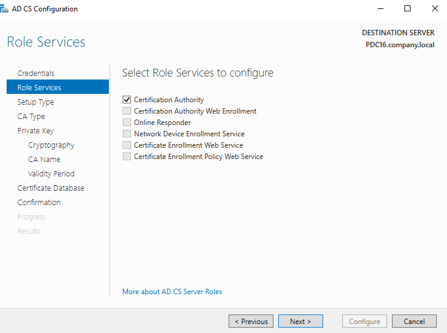
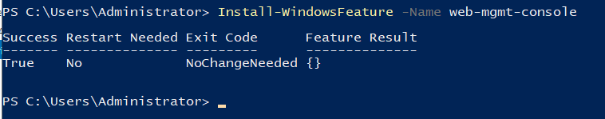
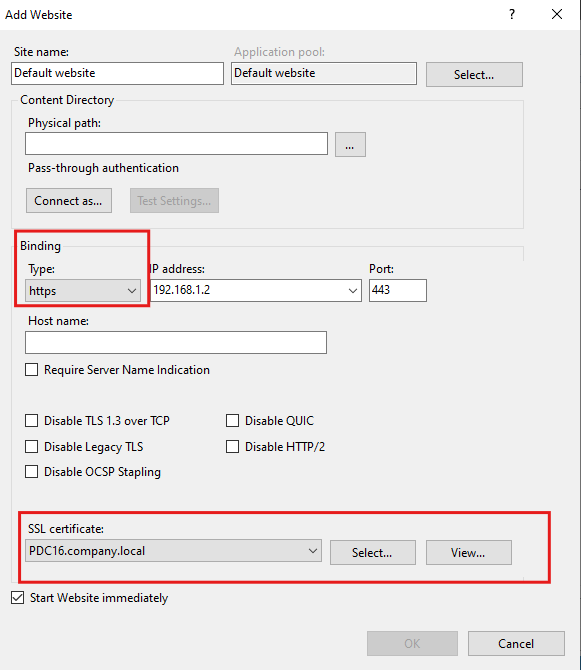
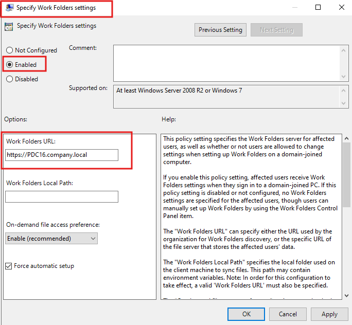

# Lab: Securing Work Folders with an Internal CA-Issued SSL Certificate

## Overview

This lab documents how to secure a **Work Folders** deployment with **HTTPS**, using a certificate issued by an internal **Active Directory Certificate Services (AD CS)** Certification Authority. Work Folders requires SSL by design, so this walks through installing the CA role, requesting a server certificate through IIS's built-in certificate wizard, binding that certificate to the Work Folders website in IIS, and deploying the Work Folders URL to domain-joined clients via Group Policy.

**Lab environment:**
- Server: `PDC16.company.local`
- Certification Authority: `company-PDC16-CA`
- Work Folders URL: `https://PDC16.company.local`
- IIS binding IP: `192.168.1.2`, port `443`

**Goal:** Have Work Folders reachable over a trusted HTTPS connection, with the URL pushed out automatically to domain-joined PCs via GPO.

---

## Table of Contents

1. [Task 1 – Install Active Directory Certificate Services (AD CS)](#task-1--install-active-directory-certificate-services-ad-cs)
2. [Task 2 – Install the IIS Web Management Console](#task-2--install-the-iis-web-management-console)
3. [Task 3 – Create a Domain Certificate via the Internal CA](#task-3--create-a-domain-certificate-via-the-internal-ca)
4. [Task 4 – Bind the Certificate to the Work Folders Website in IIS](#task-4--bind-the-certificate-to-the-work-folders-website-in-iis)
5. [Task 5 – Deploy the Work Folders URL via Group Policy](#task-5--deploy-the-work-folders-url-via-group-policy)
6. [Summary / Key Takeaways](#summary--key-takeaways)

---

## Task 1 – Install Active Directory Certificate Services (AD CS)

Using the **AD CS Configuration** wizard on `PDC16.company.local`, select the **Certification Authority** role service:

- ☑ **Certification Authority**
- ☐ Certification Authority Web Enrollment
- ☐ Online Responder
- ☐ Network Device Enrollment Service
- ☐ Certificate Enrollment Web Service
- ☐ Certificate Enrollment Policy Web Service



**Why:** Work Folders mandates HTTPS, which means the file server needs a valid SSL certificate. Rather than purchasing a public certificate (unnecessary for an internal-only domain resource), this lab uses an internal CA so the server can issue its own trusted certificate — only the base **Certification Authority** role is needed; the web enrollment and other optional services aren't required for this use case.

---

## Task 2 – Install the IIS Web Management Console

Since the certificate will be requested and bound through IIS Manager, ensure the management console feature is installed:

```powershell
Install-WindowsFeature -Name web-mgmt-console
```

Output confirms:
```
Success  Restart Needed  Exit Code       Feature Result
-------  --------------  --------------  --------------
True     No              NoChangeNeeded  {}
```



**Why:** `web-mgmt-console` provides **IIS Manager**, the GUI used in the next step to generate and bind the certificate. `NoChangeNeeded` in the result simply means the feature was already present/installed on this server (e.g., installed alongside the Web Server (IIS) role by a previous lab).

---

## Task 3 – Create a Domain Certificate via the Internal CA

In **IIS Manager → Server Certificates → Create Domain Certificate**, the wizard first collects the certificate's identity details, then asks which CA should issue it.

### 3a. Distinguished Name Properties
- **Common name:** `IIS Cert`
- **Organization:** `Company`
- **Organizational unit:** `local`
- **City/locality:** `Mansoura`
- **State/province:** `Egypt`
- **Country/region:** `US`


### 3b. Select the Online Certification Authority
- **Specify Online Certification Authority:** `company-PDC16-CA\PDC16.company.local`
- **Friendly name:** `WorkFolder`


**Why:** Using **Create Domain Certificate** (rather than a self-signed certificate) lets IIS submit the certificate request directly to the internal CA installed in Task 1, so the resulting certificate is automatically trusted by any domain-joined machine that already trusts that CA — no manual trust import needed on clients, unlike a self-signed certificate. The **Friendly name** (`WorkFolder`) is just a human-readable label to make the certificate easy to identify later among others in the store.

---

## Task 4 – Bind the Certificate to the Work Folders Website in IIS

In IIS Manager, edit (or add) the website's bindings:

- **Type:** `https`
- **IP address:** `192.168.1.2`
- **Port:** `443`
- **SSL certificate:** `PDC16.company.local`



**Why:** Creating the certificate in Task 3 only makes it *available* in the server's certificate store — it must be explicitly **bound** to the website's HTTPS binding before IIS will actually present it during the TLS handshake. Without this step, Work Folders clients would still be unable to establish a secure HTTPS connection to the server.

---

## Task 5 – Deploy the Work Folders URL via Group Policy

Configure the GPO setting **Specify Work Folders settings** (under Computer Configuration → Administrative Templates → Windows Components → Work Folders):

- **Enabled**
- **Work Folders URL:** `https://PDC16.company.local`
- **On-demand file access preference:** `Enable (recommended)`
- ☑ **Force automatic setup**



**Why:** Rather than requiring every user to manually type the Work Folders server URL into Control Panel, this policy **automatically configures Work Folders** on domain-joined PCs the next time affected users sign in — pointing them straight at the correct HTTPS URL, with **Force automatic setup** ensuring it's configured without requiring any user interaction.

---

## Summary / Key Takeaways

| Step | Purpose |
|---|---|
| Install AD CS (Certification Authority role) | Provides an internal, domain-trusted CA to issue server certificates without needing a public certificate |
| Install `web-mgmt-console` | Ensures IIS Manager is available to request and bind the certificate |
| Create Domain Certificate (DN properties + Online CA) | Requests a certificate directly from the internal CA, automatically trusted by domain-joined clients |
| Bind certificate to HTTPS (443) on the site | Makes IIS actually present the certificate during the TLS handshake — required for Work Folders, which mandates SSL |
| GPO: Specify Work Folders settings | Automatically configures the correct HTTPS URL and sync behavior on client PCs without manual setup |

**Key takeaway:** Work Folders' hard requirement for HTTPS means certificate setup isn't optional — using an internal CA (rather than a self-signed cert) is what makes the resulting HTTPS connection **automatically trusted** by every domain-joined client, since those clients already trust the domain's CA by default. Combining that with GPO-based automatic configuration means end users never have to manually type a URL or deal with certificate warnings at all.
