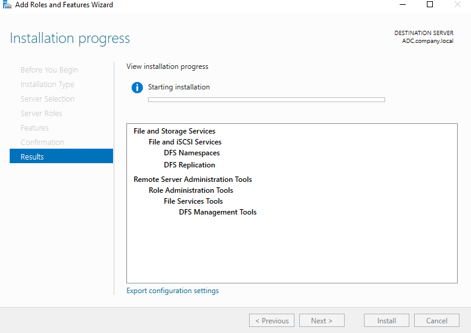
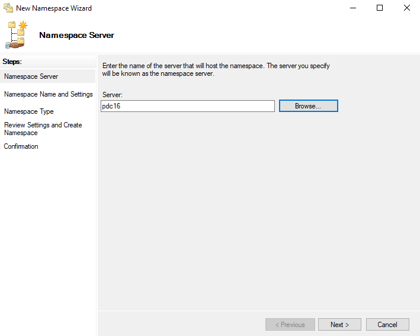
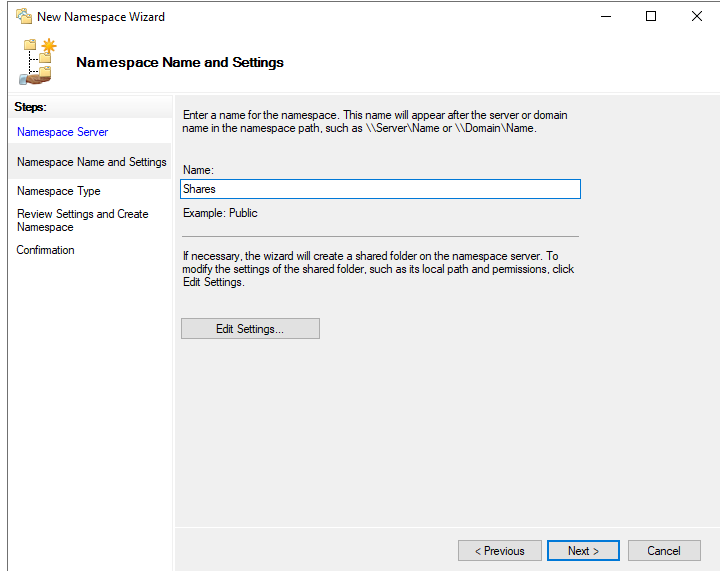
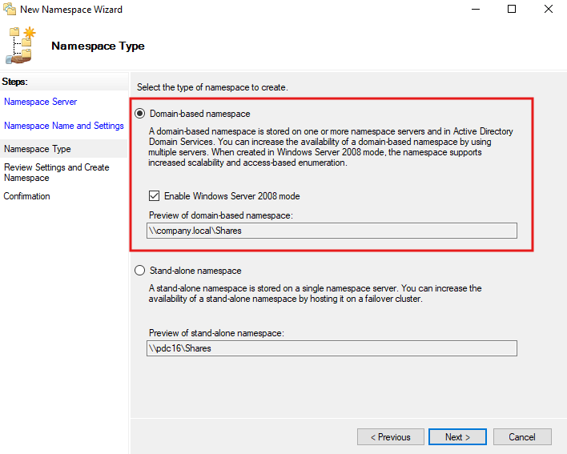
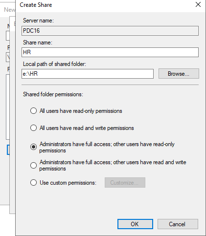
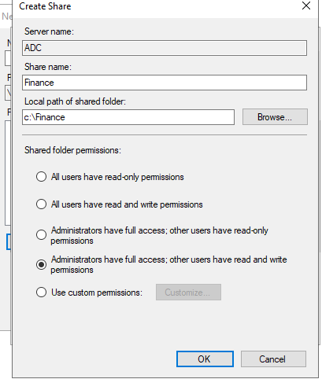
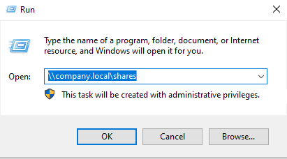
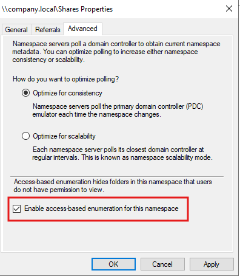
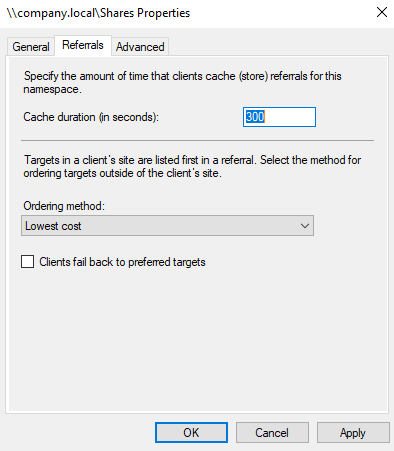
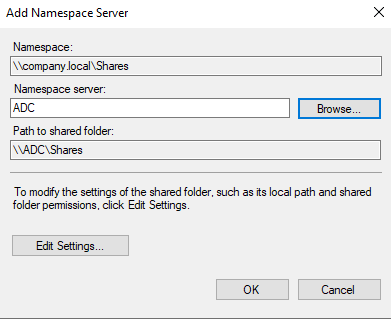

# 🗄️ Windows DFS (Distributed File System) Lab — Complete Setup Guide

> **Lab Environment:** Windows Server 2016  
> **Servers:** `PDC16.company.local` (Primary DC) | `ADC.company.local` (Additional DC)  
> **Domain:** `company.local`  
> **Objective:** Deploy a fault-tolerant, domain-based DFS Namespace with multiple folder targets, access-based enumeration, referral tuning, and namespace redundancy

---

## 📋 Table of Contents

1. [Lab Overview & Architecture](#lab-overview--architecture)
2. [Prerequisites](#prerequisites)
3. [Task 1 — Install DFS Namespaces & DFS Replication](#task-1--install-dfs-namespaces--dfs-replication)
4. [Task 2 — Create a New DFS Namespace (Namespace Server & Name)](#task-2--create-a-new-dfs-namespace-namespace-server--name)
5. [Task 3 — Select Namespace Type (Domain-Based)](#task-3--select-namespace-type-domain-based)
6. [Task 4 — Add Folder Target: HR Share on PDC16](#task-4--add-folder-target-hr-share-on-pdc16)
7. [Task 5 — Add Folder Target: Finance Share on ADC](#task-5--add-folder-target-finance-share-on-adc)
8. [Task 6 — Access the DFS Namespace from a Client](#task-6--access-the-dfs-namespace-from-a-client)
9. [Task 7 — Enable Access-Based Enumeration](#task-7--enable-access-based-enumeration)
10. [Task 8 — Configure Referrals & Cache Duration](#task-8--configure-referrals--cache-duration)
11. [Task 9 — Add a Second Namespace Server (High Availability)](#task-9--add-a-second-namespace-server-high-availability)
12. [Verification & Testing](#verification--testing)
13. [Troubleshooting](#troubleshooting)
14. [Summary](#summary)

---

## Lab Overview & Architecture

**Distributed File System (DFS)** is a set of Windows Server technologies that enables you to organize shared folders located on different servers into a single, unified namespace. Users access a single path (e.g., `\\company.local\Shares`) and are transparently redirected to the actual file server hosting the data.

### DFS Components in This Lab

| Component | Description |
|---|---|
| **DFS Namespaces** | A virtual folder tree that maps to real shared folders on different servers |
| **DFS Replication** | Keeps folder content synchronized between multiple servers (installed but configured separately) |
| **Namespace Server** | The server hosting the namespace (PDC16 + ADC for redundancy) |
| **Folder Targets** | The actual UNC paths to real shared folders (e.g., `\\PDC16\HR`, `\\ADC\Finance`) |

### Architecture Diagram

```
         \\company.local\Shares          ← DFS Namespace (domain-based)
                    │
         ┌──────────┴──────────┐
         │                     │
    \\company.local\Shares\HR  \\company.local\Shares\Finance
         │                     │
    \\PDC16\HR            \\ADC\Finance
    (E:\HR)               (C:\Finance)
```

### Why Domain-Based DFS?

- Users always access `\\company.local\Shares` — **server names are completely hidden**
- If one server goes offline, clients are automatically referred to another server (with DFS Replication)
- Access-Based Enumeration shows users only the folders they have permission to see
- The namespace metadata is stored in **Active Directory**, making it highly available

---

## Prerequisites

Before starting, ensure:

- Two Windows Server 2016 machines are domain-joined:
  - `PDC16` — Primary Domain Controller
  - `ADC` — Additional Domain Controller
- Both servers are online and reachable within the `company.local` domain
- You are logged in as **Domain Administrator** on PDC16
- Shared folders will be created on both servers during the lab:
  - `E:\HR` on PDC16 (shared as `HR`)
  - `C:\Finance` on ADC (shared as `Finance`)

---

## Task 1 — Install DFS Namespaces & DFS Replication

### Why This Is Needed

Before configuring DFS, the required role services must be installed on the server that will host the namespace. This task installs both **DFS Namespaces** (for the unified virtual folder tree) and **DFS Replication** (for keeping data in sync across servers), along with the **DFS Management Tools** for the GUI console.

### Destination Server

> Installation is performed on `ADC.company.local` as shown in the top-right corner of the wizard.

### Steps

1. Open **Server Manager** on `ADC`
2. Click **Manage** → **Add Roles and Features**
3. Choose **Role-based or feature-based installation** → Click **Next**
4. Select **ADC.company.local** as the destination server → Click **Next**
5. Under **Server Roles**, expand:
   - **File and Storage Services**
     - **File and iSCSI Services**
       - ✅ Check **DFS Namespaces**
       - ✅ Check **DFS Replication**
6. The wizard will automatically add **DFS Management Tools** under Remote Server Administration Tools
7. Click **Next** → **Next** → **Install**

### Screenshot



### Components Being Installed

| Component | Purpose |
|---|---|
| **DFS Namespaces** | Role service to host and serve DFS namespace data |
| **DFS Replication** | Role service to replicate content between namespace servers |
| **DFS Management Tools** | GUI console (`dfsmgmt.msc`) for managing namespaces and replication |

> **Note:** Repeat this installation on **PDC16** as well if it doesn't already have DFS roles installed. Both namespace servers need the DFS Namespaces role service.

### Expected Result

- Installation completes with **Success** status
- No restart is required
- The **DFS Management** console becomes available via Server Manager → Tools → DFS Management

---

## Task 2 — Create a New DFS Namespace (Namespace Server & Name)

### Why This Is Needed

A **DFS Namespace** is the root of the unified folder structure. Before adding any folder targets, you must create the namespace itself — specifying which server will host it and what the namespace will be named.

### Opening the New Namespace Wizard

1. Open **DFS Management**: Server Manager → Tools → **DFS Management**
   - Or run `dfsmgmt.msc` from the Run dialog
2. In the left panel, right-click **Namespaces** → **New Namespace...**

### Step 2a — Specify the Namespace Server

Enter the server that will initially host the namespace:

- **Server:** `pdc16`

> You can click **Browse...** to select the server from Active Directory if you prefer.



Click **Next** to continue.

### Step 2b — Specify the Namespace Name

Enter the name that will appear in the namespace path:

- **Name:** `Shares`

This means the full namespace path will be:
- `\\company.local\Shares` (domain-based)
- `\\pdc16\Shares` (stand-alone, not used here)



> **Tip:** Click **Edit Settings...** to customize the local folder path (default is `C:\DFSRoots\Shares`) and permissions. Leave defaults for this lab.

Click **Next** to continue to the Namespace Type selection.

---

## Task 3 — Select Namespace Type (Domain-Based)

### Why This Is Needed

DFS offers two namespace types. Choosing the right type is critical because it determines **availability, scalability, and how the namespace is stored**.

### Namespace Types Compared

| Feature | Domain-Based | Stand-Alone |
|---|---|---|
| **Storage** | Active Directory | Registry of namespace server |
| **Path format** | `\\domain\name` | `\\server\name` |
| **High availability** | Yes (multiple namespace servers) | Only via Failover Cluster |
| **Access-based enumeration** | Yes (in 2008 mode) | Limited |
| **Scalability mode** | Yes (Windows Server 2008 mode) | No |

### Steps

Select **Domain-based namespace** and check **Enable Windows Server 2008 mode**:

- ✅ **Domain-based namespace** (selected)
- ✅ **Enable Windows Server 2008 mode** (checked)

**Preview of domain-based namespace:** `\\company.local\Shares`



### Why Enable Windows Server 2008 Mode?

- Supports **Access-Based Enumeration** (ABE) — users only see folders they have permission to access
- Improved **scalability** for large deployments with many folder targets
- Required for advanced namespace features used later in this lab

### Review Settings Before Creating

Before clicking **Create**, review the final namespace configuration summary:


**Summary of namespace settings:**

| Setting | Value |
|---|---|
| Namespace name | `\\company.local\Shares` |
| Namespace type | Domain (Windows Server 2008 mode) |
| Namespace server | `pdc16` |
| Root shared folder | Created automatically if not existing |
| Local path | `C:\DFSRoots\Shares` |
| Permissions | Everyone read only |

Click **Create** to finalize the namespace.

### Expected Result

- The namespace `\\company.local\Shares` is created and visible in DFS Management
- A shared folder `Shares` is created at `C:\DFSRoots\Shares` on PDC16
- The namespace metadata is published to Active Directory

---

## Task 4 — Add Folder Target: HR Share on PDC16

### Why This Is Needed

The namespace is currently empty — it's just a container. Now you need to add **DFS Folders** (virtual folders inside the namespace) that point to real shared folders on actual servers. This task adds the **HR** department share hosted on PDC16.

### Steps

1. In **DFS Management**, expand `\\company.local\Shares`
2. Right-click the namespace → **New Folder...**
3. In the **New Folder** dialog:
   - **Name:** `HR` (this is the virtual folder name users will see)
   - Click **Add...** under Folder targets
4. In the **Create Share** dialog, fill in:

| Field | Value |
|---|---|
| **Server name** | `PDC16` |
| **Share name** | `HR` |
| **Local path of shared folder** | `e:\HR` |
| **Shared folder permissions** | Administrators have full access; other users have read-only permissions |



5. Click **OK** to create the share and add it as a folder target

### Understanding the Permission Choice

| Permission Option | When to Use |
|---|---|
| All users read-only | Public/reference data |
| All users read and write | Collaborative shared space |
| **Admins full, others read-only** ✅ | Controlled content (HR policies, templates) |
| Admins full, others read and write | Department working folders |
| Custom permissions | Fine-grained NTFS control required |

> **Best Practice:** Use **NTFS permissions** (not just share permissions) for granular access control. Share permissions should be kept broad (e.g., Everyone - Read) while NTFS restricts access to specific groups.

### Expected Result

- A virtual folder `HR` appears under `\\company.local\Shares` in DFS Management
- The folder target `\\PDC16\HR` is listed and shows **Online** status
- Users with access can browse to `\\company.local\Shares\HR` and reach `E:\HR` on PDC16

---

## Task 5 — Add Folder Target: Finance Share on ADC

### Why This Is Needed

A key strength of DFS is that **different department folders can live on different physical servers**. This task adds the **Finance** share hosted on a different server (`ADC`), demonstrating how DFS presents multiple servers as one unified namespace.

### Steps

1. In **DFS Management**, right-click `\\company.local\Shares` → **New Folder...**
2. Name the folder: `Finance`
3. Click **Add...** → **Create Share**
4. Fill in the Create Share dialog:

| Field | Value |
|---|---|
| **Server name** | `ADC` |
| **Share name** | `Finance` |
| **Local path of shared folder** | `c:\Finance` |
| **Shared folder permissions** | Administrators have full access; other users have read **and write** permissions |



5. Click **OK** to create the share on ADC and register it as a folder target

### Key Differences from Task 4

| Setting | HR (PDC16) | Finance (ADC) |
|---|---|---|
| **Server** | PDC16 | ADC |
| **Local path** | `E:\HR` | `C:\Finance` |
| **Write permissions** | Read-only for users | Read **and write** for users |

> **Why read and write for Finance?** Finance staff need to create, modify, and save financial documents — unlike HR policies which users only need to read.

### Expected Result

- A virtual folder `Finance` appears under `\\company.local\Shares`
- The folder target `\\ADC\Finance` shows **Online** status
- The namespace now presents two department folders from two different servers under one path

---

## Task 6 — Access the DFS Namespace from a Client

### Why This Is Needed

After creating the namespace and adding folder targets, you must verify that clients can actually browse the DFS namespace using the domain-based UNC path — not the server-specific path.

### Steps

1. On any **domain-joined client** (or on the server itself for testing), press **Win + R** to open the Run dialog
2. Type the DFS namespace path:

```
\\company.local\shares
```

3. Click **OK**



### What Happens Behind the Scenes

When a client types `\\company.local\Shares`:

1. The client queries a **Domain Controller** for the DFS namespace metadata (stored in AD)
2. The DC returns a **referral** — a list of namespace servers that can serve the namespace
3. The client contacts the namespace server (PDC16 or ADC) to get the folder list
4. When the user opens a subfolder (e.g., `\HR`), the client gets another referral pointing to `\\PDC16\HR`
5. The client connects **directly** to PDC16 — the namespace server is no longer in the data path

### Expected Result

- A File Explorer window opens showing the `HR` and `Finance` folders
- The address bar shows `\\company.local\shares` — not a server name
- Opening `HR` connects to `\\PDC16\HR` transparently
- Opening `Finance` connects to `\\ADC\Finance` transparently

---

## Task 7 — Enable Access-Based Enumeration

### Why This Is Needed

By default, all users can **see** all folders in the DFS namespace, even if they don't have permission to open them. **Access-Based Enumeration (ABE)** hides folders from users who lack read permission — improving security and reducing confusion.

### Without ABE vs. With ABE

| Scenario | Without ABE | With ABE |
|---|---|---|
| HR user browses `\\company.local\Shares` | Sees `HR` and `Finance` folders | Sees only `HR` |
| Finance user browses `\\company.local\Shares` | Sees `HR` and `Finance` folders | Sees only `Finance` |
| Administrator browses | Sees all folders | Sees all folders |

### Steps

1. In **DFS Management**, right-click `\\company.local\Shares` → **Properties**
2. Click the **Advanced** tab
3. Check ✅ **Enable access-based enumeration for this namespace**
4. Click **Apply** → **OK**



### Other Settings on the Advanced Tab

| Setting | Description |
|---|---|
| **Optimize for consistency** | Namespace servers always poll the PDC emulator — ensures all servers have identical namespace data. Best for small environments. |
| **Optimize for scalability** | Each server polls its closest DC at intervals — better performance for large, distributed environments. |

> **Recommendation:** Use **Optimize for consistency** in this lab (default). Switch to scalability mode only if you have many namespace servers spread across multiple sites.

### Expected Result

- Users browsing `\\company.local\Shares` only see folders they have NTFS read permission on
- ABE works in conjunction with NTFS permissions — ensure NTFS permissions are set correctly on the actual shared folders (`E:\HR` and `C:\Finance`)

---

## Task 8 — Configure Referrals & Cache Duration

### Why This Is Needed

A **referral** is the list of folder targets (servers) that a DFS client receives when it accesses a namespace folder. Clients **cache** this referral locally to avoid querying the namespace server on every access. Tuning the cache duration and ordering method affects both **performance** and **failover speed**.

### Steps

1. In **DFS Management**, right-click `\\company.local\Shares` → **Properties**
2. Click the **Referrals** tab
3. Configure the settings:

| Setting | Value Set | Description |
|---|---|---|
| **Cache duration** | `300` seconds (5 minutes) | How long clients cache the referral before re-querying |
| **Ordering method** | `Lowest cost` | How targets are prioritized for clients |
| **Clients fail back to preferred targets** | ☐ Unchecked | Whether clients switch back to preferred target after failover |



### Cache Duration — Tradeoffs

| Duration | Pros | Cons |
|---|---|---|
| **Short (e.g., 60s)** | Faster detection of server changes | More DC/namespace server queries |
| **Long (e.g., 1800s)** | Less network overhead | Slower to reflect server changes |
| **300s (this lab)** ✅ | Good balance for most environments | — |

### Ordering Methods Explained

| Method | Behavior | Best For |
|---|---|---|
| **Lowest cost** | Prefer targets in same AD site (lowest site link cost) | Multi-site environments |
| **Random order** | Distribute load across targets randomly | Load balancing same-site targets |
| **Exclude targets outside client's site** | Only use local-site targets | Strict data locality requirements |

> **Fail back to preferred targets:** Leave this **unchecked** unless you have a primary and backup server relationship. If checked, clients reconnect to their original server after it comes back online — causing a brief interruption.

---

## Task 9 — Add a Second Namespace Server (High Availability)

### Why This Is Needed

Currently, only `PDC16` hosts the namespace. If PDC16 goes offline, **clients cannot resolve `\\company.local\Shares`** — even though `ADC` is running and the Finance share is accessible. Adding `ADC` as a second namespace server makes the namespace **highly available**.

### How Namespace Redundancy Works

```
Client requests \\company.local\Shares
         │
         ▼
   DC returns referral:
   [ \\PDC16\Shares, \\ADC\Shares ]   ← both servers listed
         │
         ▼
   Client tries PDC16 first (lowest cost)
         │
   PDC16 offline?
         │
         ▼
   Client automatically tries ADC  ← seamless failover
```

### Steps

1. In **DFS Management**, right-click `\\company.local\Shares` → **Add Namespace Server...**
2. Fill in the **Add Namespace Server** dialog:

| Field | Value |
|---|---|
| **Namespace** | `\\company.local\Shares` (auto-filled) |
| **Namespace server** | `ADC` |
| **Path to shared folder** | `\\ADC\Shares` (auto-generated) |



3. Click **Edit Settings...** if you need to customize the local path or permissions on ADC
4. Click **OK** to add ADC as a namespace server

### What Happens After Adding ADC

- A shared folder `Shares` is created at the default path on ADC
- Both `\\PDC16\Shares` and `\\ADC\Shares` are registered in Active Directory as namespace servers
- Clients receive referrals listing **both servers** — they connect to whichever is closer/available
- The namespace is now **fault-tolerant** — loss of either server doesn't break access

### Expected Result

- In DFS Management, the namespace `\\company.local\Shares` now shows **2 namespace servers**: PDC16 and ADC
- Test by shutting down PDC16 (in a lab VM) — clients should still reach `\\company.local\Shares` via ADC after the referral cache expires (up to 300 seconds per Task 8)

---

## Verification & Testing

### On the Server (PowerShell)

```powershell
# List all DFS namespaces on this server
Get-DfsnRoot

# List all folders in the namespace
Get-DfsnFolder -Path "\\company.local\Shares\*"

# List folder targets (where each folder points)
Get-DfsnFolderTarget -Path "\\company.local\Shares\HR"
Get-DfsnFolderTarget -Path "\\company.local\Shares\Finance"

# List namespace servers
Get-DfsnRootTarget -Path "\\company.local\Shares"

# Check DFS service status
Get-Service dfs* | Select-Object Name, Status
```

### On a Client Machine

```cmd
:: Access the DFS namespace
\\company.local\shares

:: Check DFS referrals from command line
dfsutil /root:\\company.local\Shares /view

:: Flush DFS client cache (useful for testing)
dfsutil /pktflush
dfsutil /spcflush
```

### Expected Test Results

| Test | Expected Outcome |
|---|---|
| Browse `\\company.local\shares` | Opens File Explorer showing `HR` and `Finance` folders |
| Open `HR` folder | Connects to `E:\HR` on PDC16 transparently |
| Open `Finance` folder | Connects to `C:\Finance` on ADC transparently |
| ABE test (non-admin user with HR access only) | Only `HR` folder is visible |
| Shut down PDC16, wait 300s, browse namespace | ADC serves the namespace; both folders still accessible |

---

## Troubleshooting

| Problem | Possible Cause | Solution |
|---|---|---|
| `\\company.local\Shares` not accessible | DFS Namespaces service not running | Run `net start dfs` or check Services (`services.msc`) |
| Folder target shows **Offline** in DFS Management | Share doesn't exist on target server | Verify the share exists: `net share HR` on PDC16 |
| Users see folders they shouldn't (ABE not working) | ABE not enabled or 2008 mode not active | Confirm namespace type is Domain (2008 mode); re-enable ABE in Properties → Advanced |
| Slow access / long delays connecting | Referral cache expired, querying DC | Normal behavior; reduce cache duration in Task 8 if needed |
| New namespace server not serving clients | Replication lag in AD | Wait for AD replication or run `repadmin /syncall` |
| `Access denied` when creating shares | Insufficient permissions on ADC | Run DFS Management as Domain Administrator |
| Namespace not visible after creation | AD replication delay | Wait 5–15 minutes or force replication with `repadmin /syncall /AdeP` |
| DFS Management console crashes | DFS Management Tools not installed | Install via: `Install-WindowsFeature RSAT-DFS-Mgmt-Con` |

---

## Summary

### Task Completion Overview

| Task | Action | Tool | Result |
|---|---|---|---|
| **Task 1** | Install DFS Namespaces, DFS Replication, and Management Tools on ADC | Server Manager → Add Roles | DFS roles ready on ADC |
| **Task 2** | Create DFS namespace on PDC16, named `Shares` | DFS Management Wizard | Namespace `\\company.local\Shares` created |
| **Task 3** | Select Domain-based namespace type with Windows Server 2008 mode | New Namespace Wizard | Namespace published to Active Directory |
| **Task 4** | Add `HR` folder target pointing to `\\PDC16\HR` (E:\HR) | DFS Management → New Folder | HR department share accessible via DFS |
| **Task 5** | Add `Finance` folder target pointing to `\\ADC\Finance` (C:\Finance) | DFS Management → New Folder | Finance department share accessible via DFS |
| **Task 6** | Verify client access via `\\company.local\shares` | Windows Run dialog | Namespace browseable from clients |
| **Task 7** | Enable Access-Based Enumeration on the namespace | Namespace Properties → Advanced | Users see only permitted folders |
| **Task 8** | Set referral cache duration to 300 seconds, ordering to Lowest Cost | Namespace Properties → Referrals | Optimized client referral behavior |
| **Task 9** | Add ADC as a second namespace server for high availability | Add Namespace Server dialog | Namespace survives PDC16 failure |

### Key Concepts Recap

- **DFS Namespace** = A virtual UNC path (`\\domain\name`) that maps to real shares on real servers
- **Folder Target** = The actual server share a DFS folder points to
- **Domain-Based Namespace** = Namespace stored in AD; supports multiple servers and ABE
- **Access-Based Enumeration** = Hides folders users can't access (security + UX improvement)
- **Referral** = The server list clients receive when resolving a DFS path
- **Namespace Server Redundancy** = Multiple servers hosting the same namespace = no single point of failure

---

> 📌 **Lab Environment Reference**  
> Primary DC: `PDC16.company.local` | Additional DC: `ADC.company.local`  
> Namespace: `\\company.local\Shares` | HR Target: `\\PDC16\HR` (E:\HR) | Finance Target: `\\ADC\Finance` (C:\Finance)
