# 🔄 DFS Replication Lab — Complete Setup Guide

> **Lab Environment:** Windows Server 2016  
> **Servers:** `PDC16.company.local` (Primary DC) | `ADC.company.local` (Additional DC)  
> **Domain:** `company.local`  
> **Namespace:** `\\company.local\Shares`  
> **Objective:** Replicate the `HR` folder between PDC16 and ADC using DFS Replication, monitor topology health, and generate diagnostic reports

---

## 📋 Table of Contents

1. [Lab Overview & Architecture](#lab-overview--architecture)
2. [Prerequisites](#prerequisites)
3. [Task 1 — Share the Destination Folder on the Second Server](#task-1--share-the-destination-folder-on-the-second-server)
4. [Task 2 — Add a New Folder Target](#task-2--add-a-new-folder-target)
5. [Task 3 — Create the Replication Group and Replicated Folder Name](#task-3--create-the-replication-group-and-replicated-folder-name)
6. [Task 4 — Verify Replication Eligibility](#task-4--verify-replication-eligibility)
7. [Task 5 — Select Primary Member & Topology](#task-5--select-primary-member--topology)
8. [Task 6 — Configure Replication Schedule and Bandwidth](#task-6--configure-replication-schedule-and-bandwidth)
9. [Task 7 — Review and Confirm Replication Group Creation](#task-7--review-and-confirm-replication-group-creation)
10. [Task 8 — Force Immediate Replication ("Replicate Now")](#task-8--force-immediate-replication-replicate-now)
11. [Task 9 — Check Replication Topology Health](#task-9--check-replication-topology-health)
12. [Task 10 — Create a Diagnostic Health Report](#task-10--create-a-diagnostic-health-report)
13. [Verification & Testing](#verification--testing)
14. [Troubleshooting](#troubleshooting)
15. [Summary](#summary)

---

## Lab Overview & Architecture

**DFS Replication (DFS-R)** is a Windows Server role service that keeps folders synchronized between multiple servers across a network connection, using an efficient compression algorithm called **Remote Differential Compression (RDC)** — which only transfers the *changed bytes* of a file, not the whole file.

This lab builds on the previous DFS Namespace lab by taking the existing `HR` folder (hosted only on `PDC16`) and adding a **second copy on ADC**, then configuring **DFS Replication** to keep both copies in sync automatically.

### Architecture Diagram

```
        \\company.local\Shares\HR        ← DFS Namespace folder (virtual)
                    │
        ┌───────────┴────────────┐
        │                        │
   \\PDC16\HR                \\ADC\HR - Copy
   (E:\HR)                   (replicated copy)
        │                        │
        └──────── DFS-R ─────────┘
           (bi-directional sync,
            full mesh topology)
```

### Why Add Replication?

| Without DFS-R | With DFS-R |
|---|---|
| Only one server (PDC16) holds HR data | Two servers (PDC16 + ADC) hold identical copies |
| If PDC16 fails, HR data is inaccessible | If PDC16 fails, ADC continues to serve HR data |
| No load distribution | Clients can be referred to the nearest/available server |
| Manual file copying required for backup | Automatic, scheduled, bandwidth-throttled sync |

### Key DFS-R Concepts

| Term | Meaning |
|---|---|
| **Replication Group** | A logical container defining which servers replicate which folder(s) |
| **Replicated Folder** | The specific folder being kept in sync across members |
| **Member** | A server participating in the replication group |
| **Primary Member** | The server whose content is treated as authoritative during initial sync |
| **Topology** | The connection pattern between members (Full Mesh, Hub and Spoke, or No Topology) |
| **Staging Folder** | A temporary folder used to stage files before/after transfer over the network |

---

## Prerequisites

Before starting, ensure:

- The DFS Namespace lab is already completed: `\\company.local\Shares` exists with an `HR` folder target on `\\PDC16\HR`
- Both `PDC16` and `ADC` have the **DFS Replication** role service installed (installed together with DFS Namespaces in the earlier lab)
- You are logged in as **Domain Administrator**
- `ADC` has a local folder/drive available to host the replicated copy of HR

---

## Task 1 — Share the Destination Folder on the Second Server

### Why This Is Needed

Before DFS Replication can sync content to `ADC`, a destination shared folder must exist there. This task creates and shares the local folder that will hold the **replicated copy** of the HR data — named `HR - Copy` to distinguish it from the source.

### Steps

1. On `ADC`, create a local folder (e.g., `C:\HR-Copy`) using File Explorer
2. Right-click the folder → **Properties** → **Sharing** tab → **Advanced Sharing...**
3. In the **Advanced Sharing** dialog:
   - ✅ Check **Share this folder**
   - **Share name:** `HR - Copy`
   - **Limit the number of simultaneous users to:** `16777` (default maximum)
4. Click **Permissions** to set share-level permissions as needed
5. Click **Apply** → **OK**

### Screenshot

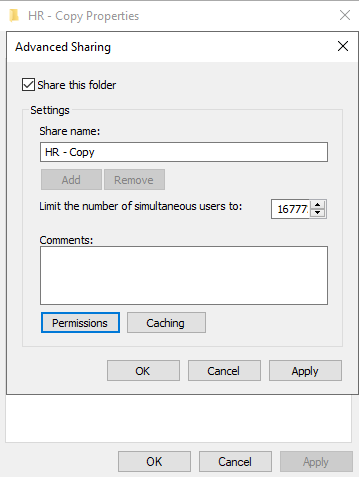

> **Naming convention:** Using `HR - Copy` as the share name makes it immediately clear in DFS Management which target is the replicated copy versus the original `HR` share on PDC16. The DFS folder name presented to users (`HR`) stays the same — only the underlying share name on ADC differs.

### Expected Result

- A new share `HR - Copy` exists on `ADC`, ready to be added as a second folder target for the namespace's `HR` folder

---

## Task 2 — Add a New Folder Target

### Why This Is Needed

The DFS namespace's `HR` folder currently has only **one folder target** (`\\PDC16\HR`). To enable replication, the namespace must know about the **second physical location** (`\\ADC\HR - Copy`) where the synced copy will live.

### Steps

1. In **DFS Management**, expand `\\company.local\Shares` → right-click the **HR** folder → **Add Folder Target...**
2. In the **New Folder Target** dialog:
   - **Folder:** `HR` (read-only, inherited)
   - **Namespace path:** `\\company.local\Shares\HR` (read-only, inherited)
   - **Path to folder target:** Click **Browse...**
3. In the **Browse for Shared Folders** dialog:
   - **Server:** `ADC`
   - Click **Show Shared Folders**
   - Select **HR - Copy** from the list of shares (alongside `Finance` and `Shares`)
4. Click **OK** to select the target, then **OK** again to add it

### Screenshot

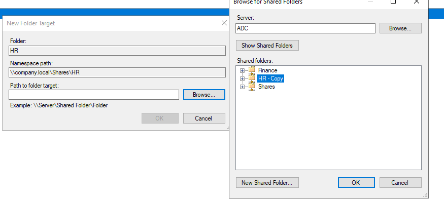

### What You'll See After Adding the Target

DFS Management will detect that the `HR` folder now has **two folder targets pointing to different servers with no replication configured between them**, and will prompt:

> *"Would you like to create a replication group to keep these folders synchronized?"*

Click **Yes** — this launches the **Replicate Folder Wizard**, covered in the next tasks.

### Expected Result

- The `HR` DFS folder now has two targets: `\\PDC16\HR` and `\\ADC\HR - Copy`
- Without replication, these are just two *separate, unsynced* copies — Task 3 onward sets up DFS-R to keep them identical

---

## Task 3 — Create the Replication Group and Replicated Folder Name

### Why This Is Needed

The **Replicate Folder Wizard** automatically creates a **Replication Group** — the container object that defines which servers (members) participate in replicating a specific folder. This task names that group and the replicated folder.

### Steps

The wizard opens automatically after adding the second folder target (or can be started manually via right-click on the HR folder → **Replicate Folder...**).

On the first wizard page:

| Field | Value | Notes |
|---|---|---|
| **Replication group name** | `company.local\shares\hr` | Auto-suggested based on the namespace path |
| **Replicated folder name** | `HR` | The logical name of the folder being replicated |

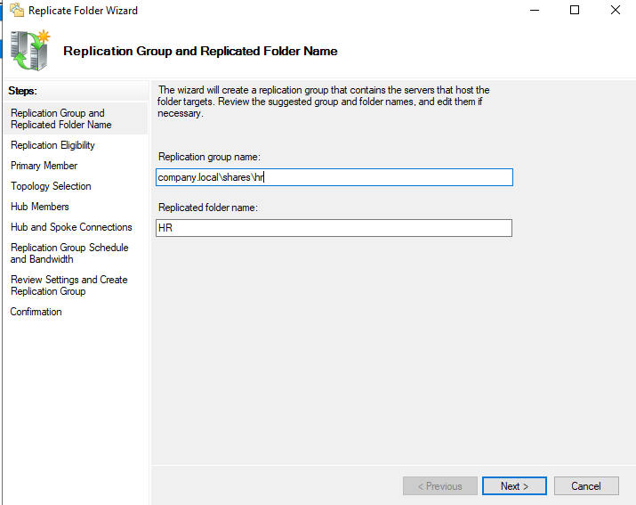

> **Tip:** The auto-generated names are usually fine to keep as-is — they clearly map back to the namespace path, making it easy to identify which replication group corresponds to which DFS folder later.

Click **Next** to continue.

### Expected Result

- A replication group object named `company.local\shares\hr` will be created in Active Directory once the wizard completes
- This group will track the `HR` replicated folder and its members

---

## Task 4 — Verify Replication Eligibility

### Why This Is Needed

Before creating the replication group, the wizard checks whether each folder target server **meets the requirements** to participate in DFS Replication (correct OS version, DFS-R service installed and running, no conflicting configuration, etc.).

### Steps

The wizard automatically evaluates both folder targets and displays the results:

| Folder Target | Eligibility |
|---|---|
| `\\ADC\HR - Copy` | ✅ Add as DFS Replication member |
| `\\PDC16\HR` | ✅ Add as DFS Replication member |

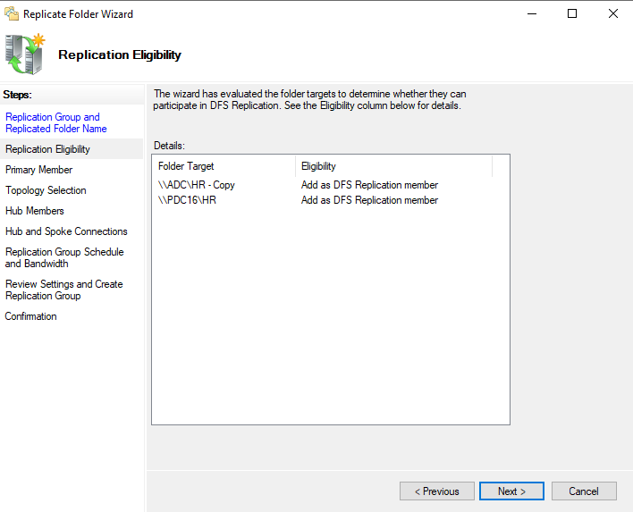

> **If a server shows as ineligible**, common causes include: the DFS Replication role service not being installed on that server, the server running an unsupported OS edition, or the server being offline/unreachable. Resolve the underlying issue and click **Previous** → **Next** to re-evaluate.

Click **Next** to proceed once both members show as eligible.

### Expected Result

- Both `PDC16` and `ADC` are confirmed eligible to join the replication group as members

---

## Task 5 — Select Primary Member & Topology

This task has two sub-steps within the same wizard flow: selecting the **Primary Member** and choosing the **Topology**.

### Step 5a — Select the Primary Member

#### Why This Is Needed

DFS-R needs to know which server's data is the **"source of truth"** during the *initial* sync. Since `PDC16\HR` already contains the live, original HR files, it must be designated as the **Primary Member** — its content will overwrite/seed the other member's folder during initial replication.

#### Steps

- **Primary member:** Select `PDC16` from the dropdown

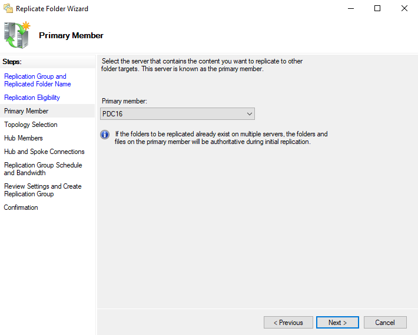

> ⚠️ **Critical:** Choosing the wrong primary member can cause data loss — whatever exists on the chosen primary is treated as authoritative, and conflicting data on other members may be overwritten or moved to a conflict folder during initial sync. Since `PDC16\HR` holds the real HR data, it is correctly chosen as primary, while `ADC\HR - Copy` is currently empty.

Click **Next**.

### Step 5b — Select the Topology

#### Why This Is Needed

The topology defines **how replication connections are created** between members. With only two members in this lab, the choice is simpler, but it's important to understand all three options since real environments often scale to more servers.

#### Topology Options Compared

| Topology | Requirement | Description | Best For |
|---|---|---|---|
| **Hub and Spoke** | 3+ members | Spoke members connect to one or two hub members; data flows from hub outward | Branch office scenarios (central hub, many remote sites) |
| **Full Mesh** ✅ (selected) | 10 or fewer members recommended | Every member replicates directly with every other member | Small to medium groups needing all-to-all sync |
| **No Topology** | Any | No connections created automatically; configure manually afterward | Custom/complex replication requirements |

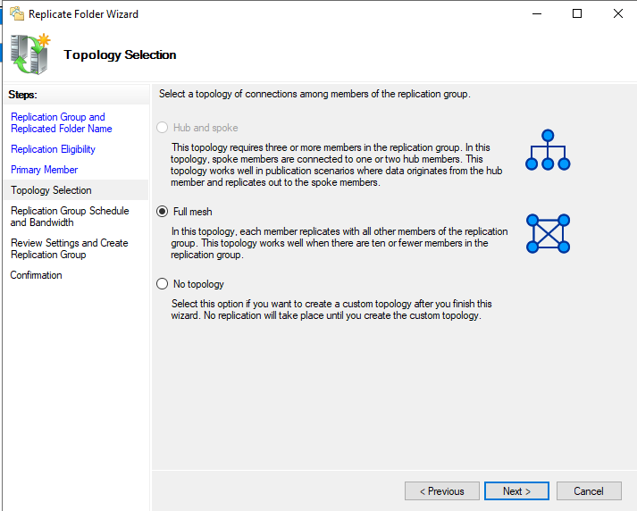

- **Selected:** **Full mesh** — appropriate since this lab has exactly 2 members (well under the 10-member guideline)

Click **Next**.

### Expected Result

- `PDC16` is set as the authoritative primary member for initial replication
- A full-mesh connection will be created directly between `PDC16` and `ADC`

---

## Task 6 — Configure Replication Schedule and Bandwidth

### Why This Is Needed

Replication traffic consumes network bandwidth. This task configures **when** replication happens and **how much bandwidth** it's allowed to consume — critical for production environments where you don't want DFS-R saturating the WAN link during business hours.

### Steps

Choose between two scheduling modes:

| Option | Behavior |
|---|---|
| **Replicate continuously using the specified bandwidth** ✅ (selected) | Replication runs 24/7, throttled to a chosen bandwidth setting |
| **Replicate during the specified days and times** | Replication only occurs during defined time windows (requires creating at least one interval) |

For this lab:

- **Mode:** Replicate continuously using the specified bandwidth
- **Bandwidth:** `Full`

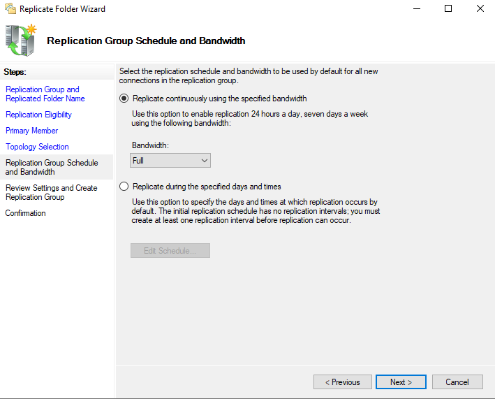

### Bandwidth Options (Typical Values)

| Setting | Use Case |
|---|---|
| **Full** ✅ (used in lab) | Lab/test environments or LANs with no bandwidth constraints |
| 16 Kbps – 256 Mbps (graduated steps) | Production WAN links where you must reserve bandwidth for other traffic |

> **Production Recommendation:** Never use "Full" over WAN links in production. Instead, use the scheduled mode and throttle bandwidth (e.g., 4 Mbps during business hours, Full overnight) to avoid impacting other network traffic.

Click **Next**.

### Expected Result

- Replication between PDC16 and ADC will run continuously with no bandwidth throttling (appropriate for this LAN-based lab)

---

## Task 7 — Review and Confirm Replication Group Creation

### Why This Is Needed

Before any AD objects are created, the wizard presents a final summary. After clicking **Create**, the wizard executes each configuration step and reports success or failure for each — letting you verify that the entire replication group was created correctly.

### Steps

1. Review the settings summary page (replication group name, members, primary member, topology, bandwidth)
2. Click **Create**
3. The wizard processes each step and shows the **Confirmation** page with task-by-task results

### Screenshot

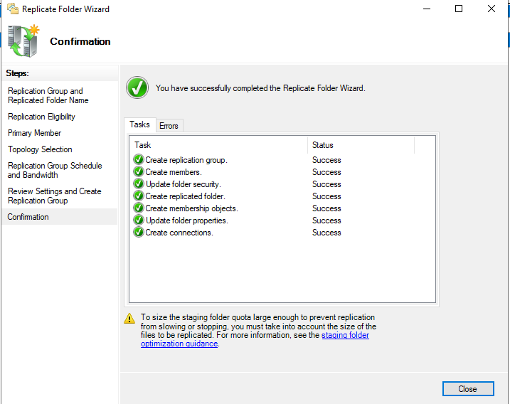

### Confirmation Task Checklist

| Task | Status |
|---|---|
| Create replication group | ✅ Success |
| Create members | ✅ Success |
| Update folder security | ✅ Success |
| Create replicated folder | ✅ Success |
| Create membership objects | ✅ Success |
| Update folder properties | ✅ Success |
| Create connections | ✅ Success |

> ⚠️ **Important Warning Shown:** *"To size the staging folder quota large enough to prevent replication from slowing or stopping, you must take into account the size of the files to be replicated."* The default staging quota is 4096 MB — for HR folders with large files (e.g., scanned documents, large spreadsheets), this may need to be increased via the replicated folder's **Staging** properties.

Click **Close** to finish.

### Expected Result

- The replication group `company.local\shares\hr` is fully created in Active Directory
- Initial replication begins automatically: PDC16's `HR` content is copied to ADC's `HR - Copy` folder
- Initial sync may take time depending on data volume — monitor via DFS Management or Event Viewer (DFS Replication log)

---

## Task 8 — Force Immediate Replication ("Replicate Now")

### Why This Is Needed

By default, replication follows the configured schedule (continuous in this lab). However, administrators often need to **force an immediate sync** — for example, right after making an urgent file change, or to verify replication is working without waiting for the normal interval.

### Steps

1. In **DFS Management**, expand **Replication** → select the `company.local\shares\hr` replication group
2. Click the **Connections** tab
3. Right-click the connection between the two members → **Replicate Now...**
4. In the **Replicate Now** dialog:

| Field | Value |
|---|---|
| **Sending member** | `ADC` |
| **Receiving member** | `PDC16` |
| **Current schedule** | Normal schedule |
| **Bandwidth usage** | Full |
| **Schedule option** | ● Use normal schedule (selected) |

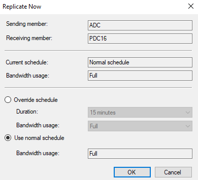

5. Click **OK** to trigger replication immediately on this connection

> **Override schedule option:** If selected, you can specify a **Duration** (e.g., 15 minutes) and a temporary **Bandwidth usage** that overrides the normal schedule just for this forced sync — useful for a one-time burst of high-bandwidth replication outside normal limits.

### Expected Result

- Any pending changes on `ADC` are immediately pushed to `PDC16` (and vice versa, since the connection is bi-directional in full-mesh topology — you may need to trigger "Replicate Now" on both directions to force a full two-way sync)
- Replication activity can be monitored in real time via Resource Monitor or DFS Replication health reports (Task 10)

---

## Task 9 — Check Replication Topology Health

### Why This Is Needed

DFS Replication topology information is stored in Active Directory and cached locally on domain controllers. After making topology changes (or periodically as a health check), administrators should verify that AD has processed the latest topology and that no orphaned or missing connections exist.

### Steps

1. In **DFS Management**, right-click the replication group `company.local\shares\hr` → **Check Replication Topology...**
2. The wizard validates the topology against Active Directory
3. A confirmation dialog appears once the check completes

### Screenshot

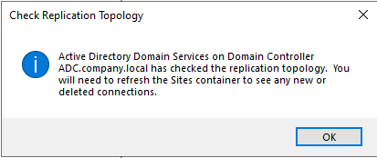

**Dialog message:**
> *"Active Directory Domain Services on Domain Controller ADC.company.local has checked the replication topology. You will need to refresh the Sites container to see any new or deleted connections."*

4. Click **OK**
5. Refresh the **Sites and Services** view (or DFS Management console) to see any updated connection objects

### What This Check Validates

- All replication group members still exist and are reachable in AD
- Connection objects match the configured topology (full mesh in this case)
- No duplicate or conflicting connection objects exist
- Detects and can repair topology inconsistencies caused by manual AD edits or replication errors

### Expected Result

- AD confirms the topology is consistent with the configured Full Mesh setup between PDC16 and ADC
- Any stale connection objects are identified for cleanup

---

## Task 10 — Create a Diagnostic Health Report

### Why This Is Needed

DFS Replication includes a built-in **Diagnostic Report** feature that generates an HTML health report — showing replication backlog, file/folder counts, errors, and overall sync status. This is the primary tool for **proactively monitoring** DFS-R health in production.

### Steps

1. In **DFS Management**, right-click the replication group `company.local\shares\hr` → **Create Diagnostic Report...**
2. Walk through the **Diagnostic Report Wizard**:
   - **Type of Diagnostic Report or Test:** Health Report
   - **Path and Name:** Accept defaults or customize
   - **Members to Include:** Both ADC and PDC16
   - **Options:** Configure backlog computation, file counting, etc.
3. On the final **Review Settings and Create Report** page, verify:

| Setting | Value |
|---|---|
| **Replication Group** | `company.local\shares\hr` |
| **Report Location** | `C:\DFSReports` |
| **Report Name** | `Health-company.local_shares_hr-28Jun2026-1722` |
| **Servers to Use** | ADC, PDC16 |
| **Compute Backlog** | Yes |
| **Reference Member** | ADC |

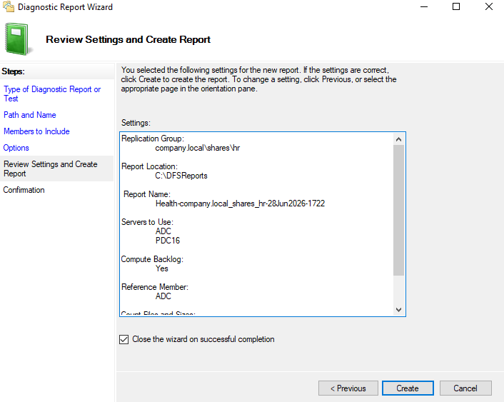

4. Leave ✅ **Close the wizard on successful completion** checked
5. Click **Create**

### Understanding Key Report Settings

| Setting | Purpose |
|---|---|
| **Compute Backlog** | Calculates how many files/updates are still pending replication between members — a key health indicator |
| **Reference Member** | The member used as the baseline for comparing file counts and backlog across all other members |
| **Report Name** | Auto-timestamped (date + time) so multiple reports can be kept for trend analysis |

### Expected Result

- An HTML report is generated at `C:\DFSReports\Health-company.local_shares_hr-28Jun2026-1722.html`
- The report opens automatically (or can be opened manually) and shows:
  - Replication group topology overview
  - Per-member file/folder counts
  - Backlog item counts between each pair of members
  - Any replication errors or warnings detected

---

## Verification & Testing

### On the Server (PowerShell)

```powershell
# View all replication groups
Get-DfsReplicationGroup

# View replicated folders within a group
Get-DfsReplicatedFolder -GroupName "company.local\shares\hr"

# View replication group members
Get-DfsrMember -GroupName "company.local\shares\hr"

# Check replication backlog between two members
Get-DfsrBacklog -GroupName "company.local\shares\hr" -FolderName "HR" -SourceComputerName PDC16 -DestinationComputerName ADC

# Check DFS-R service health
Get-Service DFSR | Select-Object Name, Status

# View recent DFS Replication events
Get-WinEvent -LogName "DFS Replication" -MaxEvents 20
```

### Manual File Sync Test

1. Create a new test file in `E:\HR` on `PDC16` (e.g., `test-replication.txt`)
2. Wait a few moments (or trigger **Replicate Now** as in Task 8)
3. Check `C:\HR-Copy` on `ADC` — the file should appear automatically
4. Reverse the test: create a file in `ADC`'s copy and verify it appears in `PDC16\HR`

### Expected Test Results

| Test | Expected Outcome |
|---|---|
| Create file on PDC16\HR | File appears on ADC\HR-Copy within the replication schedule window |
| Create file on ADC\HR-Copy | File appears on PDC16\HR (bi-directional full mesh) |
| Run diagnostic report | Report shows 0 backlog items once sync completes, no errors |
| Replicate Now | Forces immediate sync regardless of normal schedule |
| Check Replication Topology | Confirms AD-stored topology matches configured Full Mesh |

---

## Troubleshooting

| Problem | Possible Cause | Solution |
|---|---|---|
| Initial replication never starts | DFS-R service not running on a member | Check `Get-Service DFSR` on both servers; start if stopped |
| Files not syncing after changes | Replication schedule restricts current time | Verify schedule in Replication Group Properties; use "Replicate Now" to force sync |
| High backlog count in diagnostic report | Large initial dataset or insufficient bandwidth | Increase bandwidth allocation temporarily, or wait for initial sync to complete |
| "Add as DFS Replication member" not shown (ineligible) | DFS-R role service missing on target server | Install via `Install-WindowsFeature FS-DFS-Replication` |
| Conflicting files appear in `DfsrPrivate\ConflictAndDeleted` | Same file modified on multiple members before sync completed | Review conflict folder; DFS-R automatically keeps most recent version, older moved to conflict store |
| Replication stuck/stalled | Staging folder quota too small | Increase staging quota: Replicated Folder Properties → increase from default 4096 MB |
| "Check Replication Topology" shows stale connections | Manual AD changes or removed members not cleaned up | Re-run the topology check; manually remove orphaned connection objects if needed |
| Diagnostic report shows errors | Network connectivity issue between members | Test connectivity with `Test-NetConnection ADC -Port 445`; check firewall rules for SMB/RPC |

---

## Summary

### Task Completion Overview

| Task | Action | Tool | Result |
|---|---|---|---|
| **Task 1** | Share destination folder `HR - Copy` on ADC | File Explorer → Advanced Sharing | Destination share ready for replication target |
| **Task 2** | Add `\\ADC\HR - Copy` as a second folder target for the `HR` namespace folder | DFS Management → Add Folder Target | HR folder now has 2 targets (PDC16 + ADC) |
| **Task 3** | Name the replication group and replicated folder | Replicate Folder Wizard | Group `company.local\shares\hr` defined |
| **Task 4** | Verify both servers are eligible for DFS-R membership | Replicate Folder Wizard | Both PDC16 and ADC confirmed eligible |
| **Task 5** | Select PDC16 as primary member; choose Full Mesh topology | Replicate Folder Wizard | Authoritative source set; all-to-all replication configured |
| **Task 6** | Set continuous replication with Full bandwidth | Replicate Folder Wizard | Replication runs 24/7 unthrottled |
| **Task 7** | Review and create the replication group | Replicate Folder Wizard | All 7 setup tasks completed successfully |
| **Task 8** | Force immediate sync between members | DFS Management → Replicate Now | On-demand replication outside normal schedule |
| **Task 9** | Validate replication topology against Active Directory | DFS Management → Check Replication Topology | Topology consistency confirmed |
| **Task 10** | Generate an HTML health/diagnostic report | DFS Management → Create Diagnostic Report | Backlog, file counts, and errors documented |

### Key Concepts Recap

- **DFS Replication (DFS-R)** keeps multiple copies of a folder in sync across servers using efficient differential compression
- **Primary Member** seeds the initial data — choose the server with the authoritative, existing content
- **Full Mesh topology** is ideal for small replication groups (≤10 members) where every server needs every other server's updates
- **Replicate Now** allows forcing sync outside the normal schedule — useful for testing or urgent updates
- **Check Replication Topology** ensures AD's stored connection objects match your intended configuration
- **Diagnostic Reports** are the primary tool for ongoing health monitoring — always check backlog counts after initial setup or major changes
- **Staging folders** require careful sizing in production — undersized staging quotas are a common cause of replication slowdowns

---

> 📌 **Lab Environment Reference**  
> Primary DC: `PDC16.company.local` (Primary Member, source: `E:\HR`)  
> Additional DC: `ADC.company.local` (Replica: `HR - Copy`)  
> Replication Group: `company.local\shares\hr` | Topology: Full Mesh | Bandwidth: Full (continuous)
