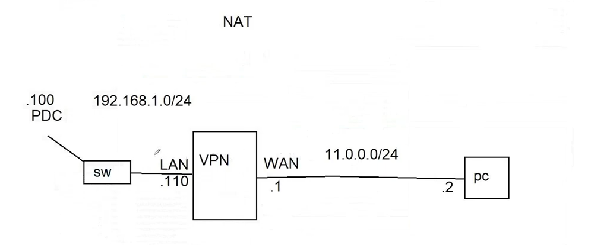
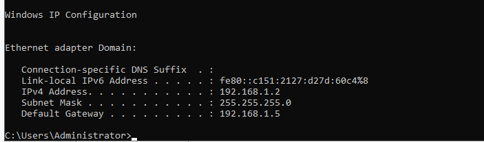
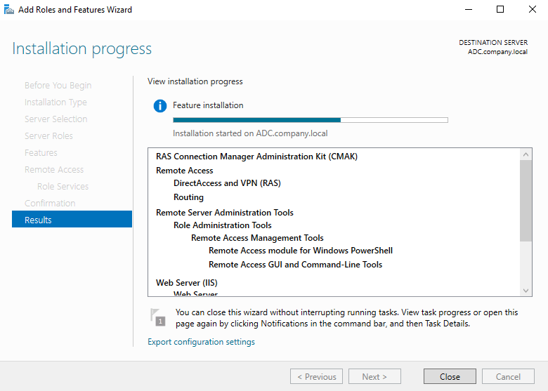
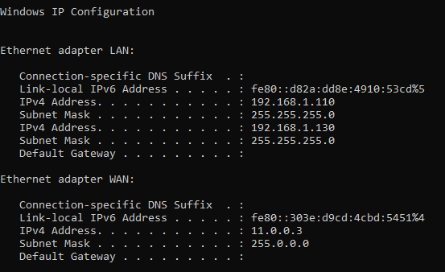
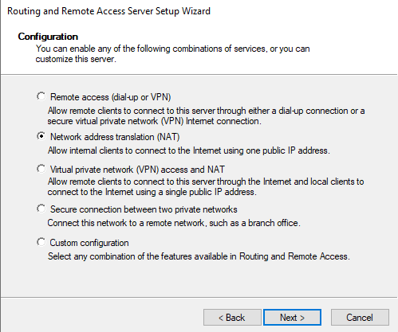
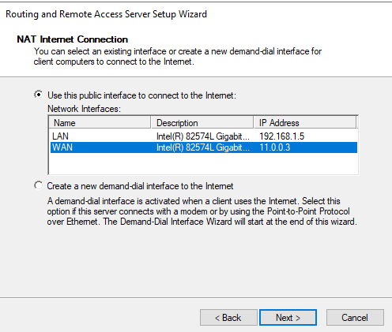
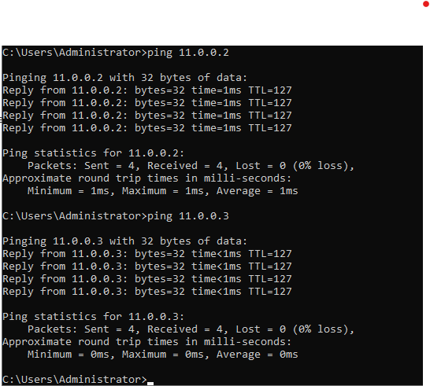
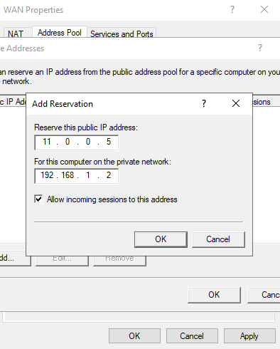
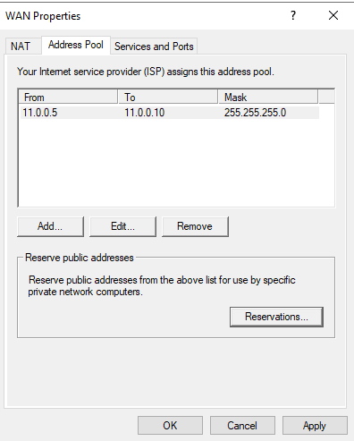
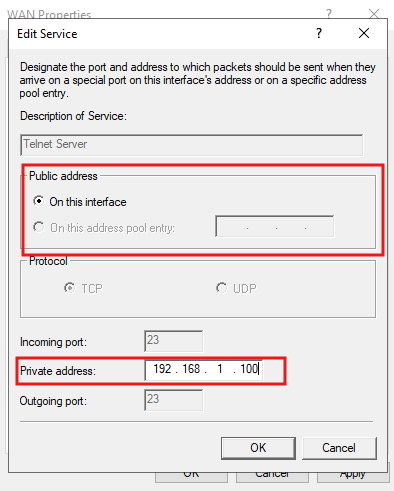

# 🌐 NAT (Network Address Translation) & Routing Lab — Complete Setup Guide

> **Lab Environment:** Windows Server 2022 (Routing and Remote Access Server / RRAS)  
> **Servers:** `PDC16.company.local` (internal server) | `ADC.company.local` (NAT/Router VM)  
> **Domain:** `company.local`  
> **Objective:** Configure a Windows Server as a NAT router to allow an internal LAN to reach the "Internet" (simulated WAN), then expose internal services (Telnet, RDP) to outside clients via static IP reservation and port forwarding

---

## 📋 Table of Contents

1. [Lab Overview & Topology](#lab-overview--topology)
2. [Prerequisites](#prerequisites)
3. [Task 1 — Understand the Network Topology](#task-1--understand-the-network-topology)
4. [Task 2 — Verify PDC16's Network Configuration](#task-2--verify-pdc16s-network-configuration)
5. [Task 3 — Install Remote Access (NAT & Routing) Role](#task-3--install-remote-access-nat--routing-role)
6. [Task 4 — Verify the VPN/NAT VM's LAN and WAN Interfaces](#task-4--verify-the-vpnnat-vms-lan-and-wan-interfaces)
7. [Task 5 — Configure NAT and Routing via the Setup Wizard](#task-5--configure-nat-and-routing-via-the-setup-wizard)
8. [Task 6 — Specify the Public (WAN) Interface](#task-6--specify-the-public-wan-interface)
9. [Task 7 — Verify Inside Can Reach Outside](#task-7--verify-inside-can-reach-outside)
10. [Task 8 — Verify Outside Cannot Reach Inside (Default NAT Behavior)](#task-8--verify-outside-cannot-reach-inside-default-nat-behavior)
11. [Task 9 — Create an IP Reservation to Allow Outside → Inside Access](#task-9--create-an-ip-reservation-to-allow-outside--inside-access)
12. [Task 10 — Review the Dynamic NAT Address Pool](#task-10--review-the-dynamic-nat-address-pool)
13. [Task 11 — Enable Port Forwarding for Telnet and Remote Desktop](#task-11--enable-port-forwarding-for-telnet-and-remote-desktop)
14. [Task 12 — Verify External PC Can Access PDC16 After Port Forwarding](#task-12--verify-external-pc-can-access-pdc16-after-port-forwarding)
15. [Verification & Testing](#verification--testing)
16. [Troubleshooting](#troubleshooting)
17. [Summary](#summary)

---

## Lab Overview & Topology

**Network Address Translation (NAT)** allows multiple devices on a private network to share a single public IP address when communicating with external networks. Windows Server's **Routing and Remote Access Service (RRAS)** can act as a NAT router, translating private (internal) IP addresses to a public (external) IP address — exactly like a home router connects an entire household to the Internet through one ISP-assigned address.

In this lab, a Windows Server VM (`ADC`) is configured with **two network interfaces** — one facing the internal LAN, one facing the simulated "Internet" (WAN) — and acts as the NAT gateway between them.

### Network Diagram

```
                              NAT
   .100                                                    .2
   PDC16 ──┐         192.168.1.0/24          11.0.0.0/24    │
            │                                                │
         ┌──┴──┐    LAN              VPN/NAT          WAN   │
         │ SW  ├────────────┤  ADC (Router)  ├───────────────┤  PC
         └─────┘    .110    └────────────────┘   .1          .2
                              (NAT translation
                               happens here)
```

| Device | Role | IP Address |
|---|---|---|
| **PDC16** | Internal server (the "protected" resource) | `192.168.1.100` (LAN — private) |
| **SW (Switch)** | Connects internal LAN devices | — |
| **ADC (VPN/NAT box)** | Windows Server running RRAS — the NAT router | LAN: `192.168.1.110` / WAN: `11.0.0.1` |
| **PC** | External/outside client (simulates Internet host) | `11.0.0.2` (WAN — public) |

### Why This Matters

| Real-World Equivalent | Lab Component |
|---|---|
| Your home router | `ADC` running RRAS NAT |
| Your home network devices (laptop, phone) | `PDC16` and other LAN devices |
| The Internet | The `11.0.0.0/24` WAN network |
| ISP-assigned public IP | `11.0.0.1` (NAT's WAN interface) |
| Port forwarding to a home server | Tasks 9–12 in this lab |

---

## Prerequisites

Before starting, ensure:

- `ADC` is a Windows Server 2022 VM with **two virtual network adapters**: one connected to the internal LAN switch, one connected to the WAN/external network
- `PDC16` is joined to the `company.local` domain and connected to the internal LAN
- An external **PC** (or VM) exists on the `11.0.0.0/24` network to simulate an outside client
- You have **local administrator** access on `ADC` to install server roles

---

## Task 1 — Understand the Network Topology

### Why This Is Needed

Before configuring anything, it's essential to understand the full network layout: which devices are "inside" (private/trusted) versus "outside" (public/untrusted), and which IP ranges belong to each zone.

### Topology Diagram



### Breaking Down the Diagram

| Segment | Network | Description |
|---|---|---|
| **Internal LAN** | `192.168.1.0/24` | Private network behind NAT; hosts PDC16 (`.100`) and the NAT box's LAN interface (`.110`) |
| **WAN (simulated Internet)** | `11.0.0.0/24` | "Public" network; hosts the NAT box's WAN interface (`.1`) and the external PC (`.2`) |
| **VPN/NAT device** | `ADC` | The Windows Server with two NICs that performs the translation between the two networks |

> **Key Insight:** PDC16 has **no direct route** to the `11.0.0.0/24` network. It only knows about `192.168.1.0/24`. Its default gateway is `192.168.1.110` (the NAT box's LAN IP) — every packet destined outside the LAN goes through `ADC`, which then translates the source IP from `192.168.1.100` to `11.0.0.1` (or a pool address) before forwarding it onto the WAN.

### Expected Result

- A clear mental model: **PDC16 = inside, PC = outside, ADC = the NAT boundary between them**

---

## Task 2 — Verify PDC16's Network Configuration

### Why This Is Needed

Before configuring NAT on the router, confirm that the internal server (`PDC16`) is correctly configured with a private IP address and that its **default gateway points to the NAT box's LAN interface**. Without a correct gateway, PDC16 will never be able to reach the WAN/Internet — regardless of how well NAT is configured on ADC.

### Steps

On `PDC16`, open **Command Prompt** and run:

```cmd
ipconfig /all
```

### Screenshot



### Verifying the Output

| Field | Value | Check |
|---|---|---|
| **IPv4 Address** | `192.168.1.2` | ✅ On the internal LAN subnet |
| **Subnet Mask** | `255.255.255.0` | ✅ Matches `/24` |
| **Default Gateway** | `192.168.1.5` | ⚠️ Should point to the NAT box's LAN IP |

> **Note on gateway IP:** In this output the default gateway shows `192.168.1.5`. Depending on how the lab environment is laid out, this could be a different internal router/gateway device on the LAN, or it should match the NAT box's LAN interface (`192.168.1.110` per the topology diagram) for traffic to correctly route to the Internet via NAT. **Always verify your gateway IP matches your actual NAT/router LAN interface IP** — a mismatch here is one of the most common causes of "inside can't reach outside" failures.

### Expected Result

- PDC16 has a valid private IP address on the `192.168.1.0/24` network
- Its default gateway is correctly set to route Internet-bound traffic to the NAT device

---

## Task 3 — Install Remote Access (NAT & Routing) Role

### Why This Is Needed

Windows Server doesn't perform NAT or routing out of the box — the **Remote Access** server role (which includes **Routing and Remote Access Service / RRAS**) must be installed first. This role provides DirectAccess, VPN (RAS), and **Routing** — the component that enables NAT.

### Steps

1. On `ADC`, open **Server Manager** → **Manage** → **Add Roles and Features**
2. Proceed through the wizard:
   - **Installation Type:** Role-based or feature-based installation
   - **Server Selection:** `ADC.company.local`
3. Under **Server Roles**, check:
   - ✅ **Remote Access**
     - Under **Role Services**, check:
       - ✅ **DirectAccess and VPN (RAS)**
       - ✅ **Routing**
4. Accept the additional features prompt (adds Remote Access Management Tools, Web Server (IIS) dependencies, etc.)
5. Click **Install**

### Screenshot



### Components Being Installed

| Component | Purpose |
|---|---|
| **DirectAccess and VPN (RAS)** | Enables remote access VPN connectivity (not the focus of this lab, but bundled with Remote Access) |
| **Routing** | Enables RRAS to perform NAT and route traffic between interfaces — **this is the key component for this lab** |
| **Remote Access Management Tools** | GUI console (`rrasmgmt.msc`) and PowerShell module to configure RRAS |
| **Web Server (IIS)** | Installed automatically as a dependency for certain Remote Access features |

### Expected Result

- The Remote Access role completes installation successfully
- The **Routing and Remote Access** console becomes available under Server Manager → Tools

---

## Task 4 — Verify the VPN/NAT VM's LAN and WAN Interfaces

### Why This Is Needed

Before configuring NAT, confirm that `ADC` has **two distinct network interfaces** correctly named and IP-addressed — one for the internal LAN side, one for the external WAN side. RRAS NAT configuration depends entirely on correctly identifying which interface is "inside" and which is "outside."

### Steps

On `ADC`, open **Command Prompt** and run:

```cmd
ipconfig /all
```

### Screenshot



### Verifying Both Interfaces

| Interface | IPv4 Address | Subnet Mask | Role |
|---|---|---|---|
| **LAN** | `192.168.1.110` (also `192.168.1.130` — secondary IP) | `255.255.255.0` | Internal/private-facing — connects to PDC16's network |
| **WAN** | `11.0.0.3` | `255.0.0.0` | External/public-facing — connects to the "Internet" (PC) |

> **Note:** This server has been configured with **two IP addresses on the LAN adapter** (`192.168.1.110` and `192.168.1.130`) — this is common when a server needs to respond on multiple addresses (e.g., for testing failover or multiple services). The interface naming (`LAN` and `WAN`) was set manually by renaming the network adapters in **Network Connections** (`ncpa.cpl`) for clarity — this is a best practice that makes the RRAS configuration wizard much easier to navigate later.

### Expected Result

- Two clearly distinguishable interfaces exist: `LAN` (private side) and `WAN` (public side)
- Neither interface has a Default Gateway configured directly on this server (NAT servers typically don't need one on the LAN side, and the WAN side gateway may be configured separately depending on the topology)

---

## Task 5 — Configure NAT and Routing via the Setup Wizard

### Why This Is Needed

With the Remote Access role installed and both interfaces verified, you can now run the **Routing and Remote Access Server Setup Wizard** to enable and configure NAT — the core function that allows internal LAN clients to reach external networks using the WAN interface's IP.

### Steps

1. Open **Routing and Remote Access** console (`rrasmgmt.msc`) on `ADC`
2. Right-click the server name → **Configure and Enable Routing and Remote Access**
3. The **Routing and Remote Access Server Setup Wizard** launches
4. On the **Configuration** page, select from the available service combinations:

| Option | Description |
|---|---|
| Remote access (dial-up or VPN) | VPN/dial-up only — no NAT |
| **Network address translation (NAT)** ✅ (selected) | Allows internal clients to connect to the Internet using one public IP address |
| Virtual private network (VPN) access and NAT | Combines VPN remote access with NAT |
| Secure connection between two private networks | Site-to-site VPN |
| Custom configuration | Manually combine any RRAS features |



5. Select **● Network address translation (NAT)**
6. Click **Next**

### Why NAT-Only (Not VPN+NAT)?

This lab focuses specifically on demonstrating NAT behavior (inside-to-outside connectivity, port forwarding) without the added complexity of VPN tunnel configuration. The **NAT** option directly enables this with the simplest wizard path.

### Expected Result

- The wizard proceeds to ask which interface should be treated as the "public" (Internet-facing) interface — covered in Task 6

---

## Task 6 — Specify the Public (WAN) Interface

### Why This Is Needed

NAT requires knowing exactly **which network interface represents the "public" side** — this is the interface whose IP address will be used (or whose address pool will be used) when translating outbound traffic from internal clients.

### Steps

On the **NAT Internet Connection** page of the wizard:

- **● Use this public interface to connect to the Internet** (selected)
- From the **Network Interfaces** list, select:

| Name | Description | IP Address |
|---|---|---|
| LAN | Intel(R) 82574L Gigabit... | `192.168.1.5` |
| **WAN** ✅ (selected) | Intel(R) 82574L Gigabit... | `11.0.0.3` |



Click **Next**, then complete the wizard (**Finish**).

> **Alternative option not used:** *Create a new demand-dial interface to the Internet* — this is used when the NAT box connects to the Internet via a dial-up modem or PPPoE connection rather than a static Ethernet WAN link. Not applicable in this lab since `ADC` has a direct Ethernet connection to the `11.0.0.0/24` WAN.

### Expected Result

- RRAS is now configured and started, with NAT bound to the **WAN** interface (`11.0.0.3`)
- All interfaces other than WAN (i.e., LAN) are automatically treated as **private/internal** interfaces
- Internal clients on the LAN side can now have their traffic translated through the WAN interface's public IP when reaching external destinations

---

## Task 7 — Verify Inside Can Reach Outside

### Why This Is Needed

The fundamental purpose of NAT is to let internal (private) clients reach external (public) destinations. This task confirms that connectivity works correctly **from the NAT router itself** by pinging both the external PC and its own WAN interface.

### Steps

On `ADC` (the NAT router), open **Command Prompt** and run:

```cmd
ping 11.0.0.2
ping 11.0.0.3
```

### Screenshot



### Results Analysis

| Target | Result | Meaning |
|---|---|---|
| `11.0.0.2` (PC) | 4/4 packets received, 0% loss, ~1ms | ✅ ADC can reach the external PC across the WAN |
| `11.0.0.3` (own WAN interface) | 4/4 packets received, 0% loss, <1ms | ✅ Confirms the WAN interface itself is up and responding |

> **Next step for full verification:** Repeat this same ping test **from PDC16** (the internal LAN client) targeting `11.0.0.2`. If PDC16 can successfully ping the external PC, that confirms NAT translation is correctly forwarding and translating LAN-originated traffic out through the WAN interface — the true end-to-end test of "inside reaching outside."

### Expected Result

- All outbound connectivity tests succeed
- This confirms NAT is actively translating and forwarding traffic from the internal network toward the WAN/Internet side

---

## Task 8 — Verify Outside Cannot Reach Inside (Default NAT Behavior)

### Why This Is Needed

A core security feature of NAT is that it's **inherently one-directional** by default — internal clients can initiate connections outward, but external clients **cannot initiate connections inward** to private LAN addresses, because those private IPs (like `192.168.1.x`) simply don't exist/aren't routable from the public side. This task proves that default behavior.

### Steps

On the external **PC** (on the `11.0.0.0/24` network), open **Command Prompt** and attempt to ping the internal server directly by its private IP:

```cmd
ping 192.168.1.2
```

### Screenshot


### Result

```
Pinging 192.168.1.2 with 32 bytes of data:
Request timed out.
Request timed out.
Request timed out.
Request timed out.
```

### Why This Happens

| Reason | Explanation |
|---|---|
| **No route exists** | The external PC has no route to the `192.168.1.0/24` network — it only knows about `11.0.0.0/24` |
| **Private IPs aren't advertised** | NAT deliberately does not expose internal IP addresses to the outside network |
| **No inbound NAT mapping configured (yet)** | Without a specific reservation or port forwarding rule, RRAS has no instruction to forward inbound packets to any internal host |

> **This is expected and correct behavior** — it's the entire point of NAT as a security boundary. The next two tasks (9 and 11) show the two official ways to **deliberately punch through** this default-deny behavior when you specifically want an outside host to reach something inside.

### Expected Result

- Confirms NAT is correctly blocking unsolicited inbound traffic to internal hosts by default — exactly as designed

---

## Task 9 — Create an IP Reservation to Allow Outside → Inside Access

### Why This Is Needed

Sometimes you need to make sure a specific internal computer **always** gets a specific public-facing address from the pool (rather than addresses being dynamically/arbitrarily assigned), and you want to explicitly allow incoming sessions to reach it. An **IP reservation** combined with the **"Allow incoming sessions"** flag achieves this.

### Steps

1. In **Routing and Remote Access**, expand `ADC` → **IPv4** → right-click **NAT** → **Properties**
2. Click the **Address Pool** tab
3. Click **Reservations...**
4. Click **Add...**
5. In the **Add Reservation** dialog:

| Field | Value |
|---|---|
| **Reserve this public IP address** | `11.0.0.5` |
| **For this computer on the private network** | `192.168.1.2` |
| **Allow incoming sessions to this address** | ✅ Checked |



6. Click **OK** → **Apply** → **OK**

### Understanding "Allow Incoming Sessions"

| Setting | Effect |
|---|---|
| ☐ Unchecked (default) | The reserved public address can only be used for **outbound** NAT translation from `192.168.1.2` |
| ✅ **Checked** | External hosts can **initiate new inbound connections** to `11.0.0.5`, which NAT will forward directly to `192.168.1.2` — effectively a 1:1 (static) NAT mapping for all ports |

> **Security implication:** Checking this box exposes **all ports** on `192.168.1.2` to anyone who can reach `11.0.0.5` from the outside — equivalent to placing that internal machine directly on the public network in terms of port exposure. Use this only for fully trusted hosts, or prefer the more granular **Port Forwarding** approach (Task 11) for production environments.

### Expected Result

- The public address `11.0.0.5` is now permanently bound to `192.168.1.2`
- External hosts on the `11.0.0.0/24` network can now initiate connections to `11.0.0.5` and reach `192.168.1.2` directly

---

## Task 10 — Review the Dynamic NAT Address Pool

### Why This Is Needed

Beyond static reservations, RRAS NAT maintains a **pool of public addresses** that can be dynamically assigned to internal clients as they need outbound translation (useful when the WAN side has more than one usable public IP available, e.g., an ISP-assigned block). This task reviews that pool configuration.

### Steps

1. In **Routing and Remote Access**, open **NAT** → **Properties** → **Address Pool** tab

### Screenshot



### Pool Configuration

| Field | Value |
|---|---|
| **From** | `11.0.0.5` |
| **To** | `11.0.0.10` |
| **Mask** | `255.255.255.0` |

> *"Your Internet service provider (ISP) assigns this address pool"* — this label in the dialog reflects real-world usage: an ISP typically hands you a block of public IPs, and you configure that entire block here so RRAS can use any address in the range for NAT translations or reservations.

### Pool vs. Single Address NAT

| Configuration | Use Case |
|---|---|
| **Single public IP (just the WAN interface IP)** | Most common home/small office setup — typical "many-to-one" NAT |
| **Address Pool (multiple public IPs)** | When you have several public IPs available and want to reserve specific ones for specific internal servers, or load-balance translations across multiple addresses |

The reservation created in Task 9 (`11.0.0.5` → `192.168.1.2`) draws from this very pool — `11.0.0.5` through `11.0.0.10` are the six addresses available for reservations or dynamic NAT use.

### Expected Result

- The address pool `11.0.0.5–11.0.0.10` is confirmed as the available public address range for this NAT configuration
- This pool is the source for both the reservation in Task 9 and the port-forwarding rules in Task 11

---

## Task 11 — Enable Port Forwarding for Telnet and Remote Desktop

### Why This Is Needed

Rather than exposing an entire internal host (as the reservation in Task 9 effectively does), **port forwarding** lets you expose **only specific services/ports** on a specific internal machine — a much more secure and granular approach. This task configures port forwarding so external clients can reach **Telnet (port 23)** and **Remote Desktop (port 3389)** on `PDC16` specifically.

### Steps

1. In **Routing and Remote Access** → **NAT** → **Properties** → **Services and Ports** tab
2. Select **Telnet Server** from the list of predefined services (or **Add...** for a custom service)
3. Click **Edit...** to configure the service mapping

### Configuring the Telnet Service

| Field | Value |
|---|---|
| **Description of Service** | Telnet Server |
| **Public address** | ● On this interface (the NAT box's public-facing address) |
| **Protocol** | ● TCP |
| **Incoming port** | `23` |
| **Private address** | `192.168.1.100` |
| **Outgoing port** | `23` |



4. Click **OK**
5. Repeat the same process for **Remote Desktop**:

| Field | Value |
|---|---|
| **Description of Service** | Remote Desktop |
| **Public address** | ● On this interface |
| **Protocol** | ● TCP |
| **Incoming port** | `3389` |
| **Private address** | `192.168.1.100` |
| **Outgoing port** | `3389` |

6. Click **OK** → **Apply** → **OK** to save both port forwarding rules

### How Port Forwarding Differs from the Task 9 Reservation

| Aspect | Task 9 (IP Reservation + Allow Incoming) | Task 11 (Port Forwarding) |
|---|---|---|
| **Exposure scope** | ALL ports on the internal host | ONLY the specific port(s) configured |
| **Public address used** | A dedicated reserved address (`11.0.0.5`) | The NAT interface's main public address |
| **Security** | Lower (broad exposure) | Higher (minimal attack surface) |
| **Typical real-world use** | DMZ-style server, fully exposed host | Web servers, RDP jump boxes, game servers — specific known services only |

### Expected Result

- External clients connecting to the NAT box's public IP on **port 23** are forwarded to `192.168.1.100:23` (Telnet on PDC16)
- External clients connecting to the NAT box's public IP on **port 3389** are forwarded to `192.168.1.100:3389` (RDP on PDC16)
- All other ports on PDC16 remain inaccessible from outside — unlike the broad exposure in Task 9

---

## Task 12 — Verify External PC Can Access PDC16 After Port Forwarding

### Why This Is Needed

The final verification step — confirming that the port forwarding rules configured in Task 11 actually work end-to-end, by connecting **from the external PC** to PDC16's forwarded services through the NAT box's public address.

### Steps

From the external **PC** (on `11.0.0.0/24`), attempt to connect to PDC16's forwarded services using the NAT box's public WAN address:

```cmd
:: Telnet test
telnet 11.0.0.3 23

:: Remote Desktop test
mstsc /v:11.0.0.3:3389
```

### Screenshot


> The screenshot shows **PDC16's own Server Manager / Local Server dashboard** being accessed remotely — confirming that the Remote Desktop session successfully reached PDC16 through the forwarded port. Note the system info confirming this is `PDC16` (Computer name: `PDC16`, Domain: `company.local`, IPv4: `192.168.1.2`) and the desktop is being viewed remotely via the VM window (note the floating VM toolbar at the top showing `11.0.0.3` — the WAN address used to reach it).

### What This Confirms

| Verification Point | Result |
|---|---|
| External PC reaches `11.0.0.3:3389` | ✅ Connection succeeds |
| RRAS NAT forwards the connection to `192.168.1.100:3389` | ✅ Confirmed — PDC16's desktop is now visible/controllable |
| PDC16's identity confirmed | ✅ Computer name `PDC16`, domain `company.local` |
| Port forwarding rule from Task 11 is functioning correctly | ✅ End-to-end success |

### Expected Result

- The external PC successfully establishes a Remote Desktop session to PDC16 — proving the complete NAT + port forwarding chain works: **External PC → NAT box public IP (port 3389) → translated/forwarded → PDC16 private IP (port 3389)**

---

## Verification & Testing

### On the NAT Router (ADC) — PowerShell

```powershell
# View NAT configuration
Get-NetNat

# View RRAS service status
Get-Service RemoteAccess

# View current NAT translation table (active sessions)
netsh routing ip nat show interface
netsh routing ip nat show global

# View configured static mappings (port forwarding rules)
netsh routing ip nat show interface name="WAN"
```

### On PDC16 (Internal Client)

```cmd
:: Confirm gateway is set correctly
ipconfig /all

:: Test outbound connectivity through NAT
ping 11.0.0.2
tracert 11.0.0.2
```

### On the External PC

```cmd
:: Should FAIL (default NAT behavior)
ping 192.168.1.100

:: Should SUCCEED (after Task 9 reservation)
ping 11.0.0.5

:: Should SUCCEED (after Task 11 port forwarding)
telnet 11.0.0.3 23
mstsc /v:11.0.0.3:3389
```

### Expected Test Matrix

| Test | Before NAT Config | After Task 5–6 | After Task 9 | After Task 11 |
|---|---|---|---|---|
| PDC16 → PC (outbound) | ❌ Fails | ✅ Succeeds | ✅ Succeeds | ✅ Succeeds |
| PC → PDC16 direct private IP | ❌ Fails | ❌ Fails | ❌ Fails | ❌ Fails |
| PC → `11.0.0.5` (reserved) | N/A | N/A | ✅ Succeeds | ✅ Succeeds |
| PC → `11.0.0.3:23` (Telnet) | N/A | N/A | N/A | ✅ Succeeds |
| PC → `11.0.0.3:3389` (RDP) | N/A | N/A | N/A | ✅ Succeeds |

---

## Troubleshooting

| Problem | Possible Cause | Solution |
|---|---|---|
| Internal client can't reach outside at all | Default gateway not set to NAT box's LAN IP | Verify `ipconfig` on the client; correct the gateway to match the NAT router's LAN interface |
| NAT wizard doesn't show the WAN interface | Interface not yet renamed/identified | Rename adapters in Network Connections before running the wizard for clarity |
| RRAS won't start after configuration | Conflicting role or Windows Firewall blocking | Check **Event Viewer** → Applications and Services Logs → RasMan / RemoteAccess; ensure firewall allows RRAS |
| Reservation doesn't allow inbound access | "Allow incoming sessions" checkbox not checked | Edit the reservation and ensure the checkbox is checked, then **Apply** |
| Port forwarding rule doesn't work | Internal host's firewall blocking the port | Check Windows Defender Firewall on `PDC16` — ensure inbound rules allow Telnet (23) and RDP (3389) |
| Port forwarding rule doesn't work (NAT side) | Wrong private IP address entered | Double-check the "Private address" field matches PDC16's actual current IP exactly |
| External PC times out on RDP despite forwarding rule | RDP service not running on PDC16, or NLA blocking | Confirm Remote Desktop is enabled in PDC16's System Properties; check `Get-Service TermService` |
| Telnet doesn't connect | Telnet Server feature not installed on PDC16 | Install via: `Install-WindowsFeature TelnetServer` and start the `TlntSvr` service |
| Address pool exhausted | All reserved/pool addresses in use | Expand the pool range in Address Pool tab, or remove unused reservations |

---

## Summary

### Task Completion Overview

| Task | Action | Tool | Result |
|---|---|---|---|
| **Task 1** | Review network topology (LAN/WAN/NAT boundary) | Topology diagram | Understood inside vs. outside zones |
| **Task 2** | Verify PDC16's IP, subnet, and default gateway | `ipconfig /all` | Confirmed PDC16 is correctly addressed on the LAN |
| **Task 3** | Install Remote Access role (DirectAccess/VPN + Routing) | Server Manager → Add Roles | RRAS components available |
| **Task 4** | Verify ADC's LAN and WAN interface configuration | `ipconfig /all` | Confirmed dual-NIC setup is correct |
| **Task 5** | Run RRAS Setup Wizard, select NAT configuration | Routing and Remote Access Wizard | NAT mode selected and initiated |
| **Task 6** | Designate the WAN interface as the public/Internet-facing interface | RRAS Wizard | NAT bound to WAN (`11.0.0.3`) |
| **Task 7** | Confirm NAT router itself can reach the outside PC | `ping` | Outbound connectivity confirmed |
| **Task 8** | Confirm outside PC CANNOT reach inside server by default | `ping` (expected failure) | Default NAT security boundary verified |
| **Task 9** | Reserve a public IP and allow incoming sessions to a specific internal host | NAT Properties → Address Pool → Reservations | Outside-to-inside access enabled for one host (all ports) |
| **Task 10** | Review the available dynamic NAT address pool | NAT Properties → Address Pool | Confirmed pool range `11.0.0.5–11.0.0.10` |
| **Task 11** | Configure port forwarding for Telnet (23) and RDP (3389) to PDC16 | NAT Properties → Services and Ports | Specific service-level inbound access enabled |
| **Task 12** | Verify external PC can reach PDC16 via forwarded ports | `telnet` / `mstsc` | End-to-end port forwarding confirmed working |

### Key Concepts Recap

- **NAT** translates private IP addresses to a public IP (or pool of public IPs) so multiple internal hosts can share Internet access through one or more public addresses
- **Default NAT behavior is one-directional** — outbound connections work automatically; inbound connections are blocked unless explicitly configured
- **IP Reservation + Allow Incoming Sessions** = broad, all-port exposure of a specific internal host (use sparingly, only for trusted hosts)
- **Port Forwarding (Services and Ports)** = the secure, recommended way to expose only specific services on specific ports
- **Address Pool** defines the full range of public IPs available to RRAS for NAT translation and reservations — analogous to an ISP-assigned IP block
- Always verify **default gateway** settings on internal clients — a misconfigured gateway is the #1 cause of "NAT isn't working" issues that have nothing to do with NAT itself

---

> 📌 **Lab Environment Reference**  
> Internal Server: `PDC16` (`192.168.1.100` / `192.168.1.2`) | NAT Router: `ADC` (LAN: `192.168.1.110` / WAN: `11.0.0.3`)  
> External Client: `PC` (`11.0.0.2`) | NAT Address Pool: `11.0.0.5–11.0.0.10` | Reserved Address: `11.0.0.5` → `192.168.1.2`  
> Forwarded Ports: Telnet (23), RDP (3389) → `192.168.1.100`
