# 🔐 Remote Access VPN Lab — Complete Setup Guide

> **Lab Environment:** Windows Server 2022 (Routing and Remote Access Service / RRAS)  
> **VPN Server:** `ADC.company.local` | **Internal Server:** `PDC16.company.local`  
> **Domain:** `company.local`  
> **Test User:** `COMPANY\ahmed.abdo`  
> **Objective:** Configure a Windows Server as a Remote Access VPN gateway so external users can connect from the Internet, receive a private IP address, and securely access internal LAN resources as if they were physically on the network

---

## 📋 Table of Contents

1. [Lab Overview & Topology](#lab-overview--topology)
2. [Prerequisites](#prerequisites)
3. [Task 1 — Understand the Remote Access VPN Topology](#task-1--understand-the-remote-access-vpn-topology)
4. [Task 2 — Select VPN as the Remote Access Type](#task-2--select-vpn-as-the-remote-access-type)
5. [Task 3 — Select the WAN Interface (Internet-Facing)](#task-3--select-the-wan-interface-internet-facing)
6. [Task 4 — Configure IP Address Assignment Method](#task-4--configure-ip-address-assignment-method)
7. [Task 5 — Assign the VPN Client IP Address Range](#task-5--assign-the-vpn-client-ip-address-range)
8. [Task 6 — Configure Authentication Method (RADIUS vs Local)](#task-6--configure-authentication-method-radius-vs-local)
9. [Task 7 — View VPN Ports and Protocol Types](#task-7--view-vpn-ports-and-protocol-types)
10. [Task 8 — Grant User Dial-In Permission](#task-8--grant-user-dial-in-permission)
11. [Task 9 — Create VPN Connection on Client (Legacy Wizard)](#task-9--create-vpn-connection-on-client-legacy-wizard)
12. [Task 10 — Add VPN Connection via Windows Settings](#task-10--add-vpn-connection-via-windows-settings)
13. [Task 11 — Review VPN Connection Properties After Connect](#task-11--review-vpn-connection-properties-after-connect)
14. [Task 12 — View Active Remote Access Clients on the Server](#task-12--view-active-remote-access-clients-on-the-server)
15. [Task 13 — Inspect the RAS (PPP Dial-In) Adapter on the Client](#task-13--inspect-the-ras-ppp-dial-in-adapter-on-the-client)
16. [Task 14 — Validate VPN: Ping Internal Server from Remote Client](#task-14--validate-vpn-ping-internal-server-from-remote-client)
17. [Verification & Testing](#verification--testing)
18. [Troubleshooting](#troubleshooting)
19. [Summary](#summary)

---

## Lab Overview & Topology

A **Remote Access VPN** allows individual remote users (employees working from home, travelling workers) to connect securely over the Internet to their corporate network. Once connected, the VPN client appears to be "inside" the corporate LAN — receiving an internal IP address and accessing resources (file servers, domain controllers, intranet sites) exactly as if they were sitting at a desk in the office.

This lab uses Windows Server's built-in **Routing and Remote Access Service (RRAS)** as the VPN gateway. Unlike the previous NAT lab (which used RRAS for NAT only), this lab configures the **Remote Access (VPN)** mode of RRAS and assigns internal IP addresses to VPN clients from a dedicated pool.

### Architecture Diagram

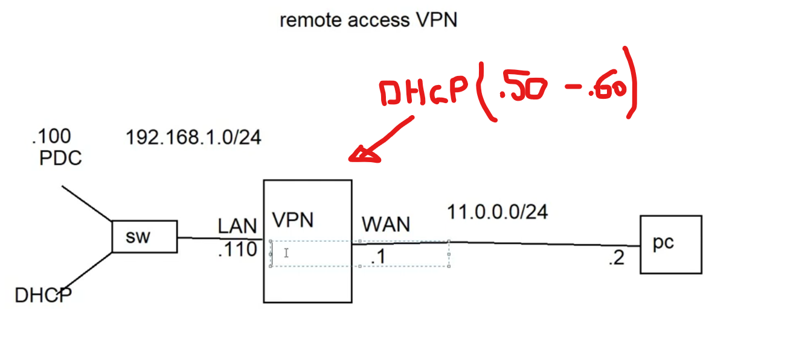

```
                       remote access VPN

  .100                                                      .2
  PDC  ──┐     192.168.1.0/24         11.0.0.0/24           │
  DHCP   │                                                    │
       ┌─┴──┐   LAN     VPN Server   WAN                     │
       │ sw ├──────────┤    ADC     ├──────────────────────── PC
       └────┘  .110    └──────────  ┘ .1               VPN
                                                        client
                    DHCP pool: .50–.60
               (assigned to VPN clients)
```

### Device Roles in This Lab

| Device | Role | IP Address(es) |
|---|---|---|
| **PDC16** | Domain Controller & internal resource being accessed | `192.168.1.100` (LAN) |
| **ADC (VPN Server)** | RRAS VPN gateway — authenticates users and assigns IPs | LAN: `192.168.1.110` / WAN: `11.0.0.1` (approx) |
| **PC (VPN Client)** | External machine connecting from the "Internet" | `11.0.0.2` (physical) + `192.168.1.50–.60` (tunnel IP) |

### Remote Access VPN vs. NAT (Previous Lab)

| Feature | NAT Lab | Remote Access VPN Lab |
|---|---|---|
| Who initiates? | Internal clients (inside-out) | External clients (outside-in, authenticated) |
| Purpose | Share one public IP / expose services | Give remote users full LAN access |
| Authentication required? | No | Yes (domain credentials) |
| Client gets internal IP? | No | Yes (from the `.50–.60` pool) |
| Tunnel encryption? | No | Yes (PPTP/L2TP/SSTP/IKEv2) |

---

## Prerequisites

Before starting, ensure:

- `ADC` is running Windows Server 2022 with **two network adapters**: LAN (`192.168.1.110`) and WAN (`11.0.0.x`)
- The **Remote Access** role is already installed on `ADC` (covered in the prior NAT lab — if re-configuring, disable NAT mode first)
- `PDC16` is running as a Domain Controller for `company.local`
- A **domain user account** (`ahmed.abdo`) exists in Active Directory
- A **PC/VM** on the `11.0.0.0/24` network is available to act as the VPN client
- The domain `company.local` resolves correctly from the VPN server

---

## Task 1 — Understand the Remote Access VPN Topology

### Why This Is Needed

Before any configuration, visualize the complete picture: the VPN server sits at the network boundary with one foot on the LAN and one foot on the WAN, and VPN clients connecting from the Internet will receive private IP addresses from the `.50–.60` pool and become "virtual" LAN members.

### Topology Breakdown

| Segment | Network | Detail |
|---|---|---|
| **Internal LAN** | `192.168.1.0/24` | PDC16 (`.100`), VPN server LAN NIC (`.110`), DHCP server also on this LAN |
| **VPN Address Pool** | `192.168.1.50–.60` | Reserved exclusively for VPN client tunnel assignments — 11 addresses available |
| **WAN / "Internet"** | `11.0.0.0/24` | VPN server WAN NIC (`.1`), external PC/VPN client (`.2`) |

> **Key Design Point:** VPN clients are assigned addresses from the **same subnet as the LAN** (`192.168.1.x`). This means once connected, VPN clients can communicate directly with all LAN resources using native IP routing — no additional routing configuration is needed for internal servers to reply to VPN clients.

---

## Task 2 — Select VPN as the Remote Access Type

### Why This Is Needed

The RRAS Setup Wizard offers multiple remote access configurations. For this lab you need pure **Remote Access (VPN)** mode — not NAT, not site-to-site VPN.

### Steps

1. On `ADC`, open **Routing and Remote Access** (`rrasmgmt.msc`)
2. If RRAS was previously configured (e.g., from the NAT lab), right-click the server → **Disable Routing and Remote Access**, then right-click → **Configure and Enable Routing and Remote Access** to start fresh
3. In the **Setup Wizard**, on the **Configuration** page, select **Remote access (dial-up or VPN)**
4. Click **Next**
5. On the **Remote Access** page, check:
   - ✅ **VPN** — A VPN server (also called a VPN gateway) can receive connections from remote clients through the Internet
   - ☐ Dial-up — Not needed for this lab

### Screenshot

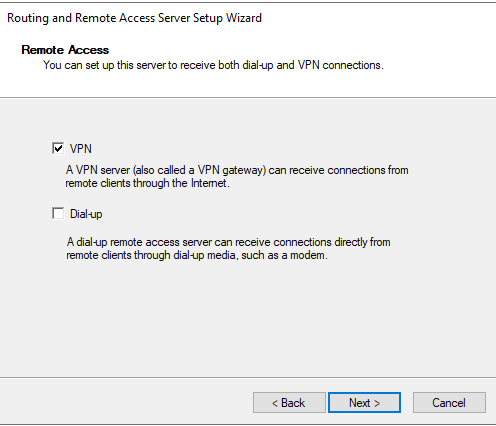

### VPN vs. Dial-Up

| Option | Transport | Use Case |
|---|---|---|
| **VPN** ✅ (selected) | Internet (encrypted tunnel) | Remote workers connecting via broadband, 4G, hotel WiFi, etc. |
| Dial-up | PSTN phone line / modem | Legacy connectivity — rarely used today |

Click **Next** to proceed to interface selection.

---

## Task 3 — Select the WAN Interface (Internet-Facing)

### Why This Is Needed

The wizard needs to know which network interface faces the "Internet" (where VPN clients will connect from). It will configure static packet filters on this interface to allow only VPN protocol traffic through — blocking all other inbound traffic.

### Steps

On the **VPN Connection** page, select the interface that connects to the Internet:

| Name | Description | IP Address |
|---|---|---|
| LAN | Intel(R) 82574L Gigabit... | `192.168.1.5` |
| **WAN** ✅ (selected) | Intel(R) 82574L Gigabit... | `11.0.0.3` |

### Screenshot


### Static Packet Filters Option

> 🔴 **Important checkbox shown in the screenshot:**  
> *"Enable security on the selected interface by setting up static packet filters. Static packet filters allow only VPN traffic to gain access to this server through the selected interface."*

| Checkbox State | Effect |
|---|---|
| ✅ **Checked (recommended for production)** | RRAS configures the WAN interface to **only accept VPN protocol packets** (PPTP/GRE, L2TP/IPSec, SSTP/HTTPS, IKEv2). All other inbound traffic is silently dropped — greatly reduces attack surface |
| ☐ Unchecked | No automatic filters; Windows Firewall is the only protection — more flexible but less hardened |

Click **Next**.

---

## Task 4 — Configure IP Address Assignment Method

### Why This Is Needed

When a VPN client connects and authenticates successfully, the server must assign it an IP address for the VPN tunnel interface. This step decides **how** those IP addresses are given out — automatically via DHCP, or from a manually-defined static range.

### Steps

On the **IP Address Assignment** page, choose how VPN clients receive their IP addresses:

| Option | Description |
|---|---|
| **Automatically** | RRAS forwards DHCP requests to an existing DHCP server (if one is configured and reachable on the LAN) |
| **● From a specified range of addresses** ✅ (selected) | You manually define a static pool of IPs that RRAS manages independently |

### Screenshot

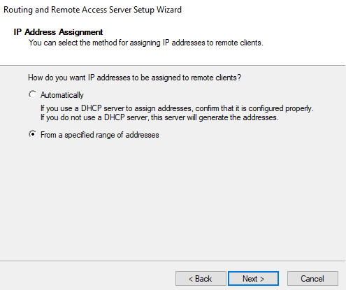

### Why Use a Specified Range Instead of Automatic?

| Consideration | Automatic (DHCP) | Specified Range (Static Pool) |
|---|---|---|
| **Requires DHCP server** | Yes — must be reachable from RRAS | No — RRAS manages the pool internally |
| **Complexity** | More network components | Simpler, self-contained |
| **Control** | DHCP policies apply | Full direct control over VPN IP range |
| **Lab suitability** | Requires DHCP relay/agent config | ✅ Simpler — better for this lab |

Selecting **"From a specified range"** makes RRAS act as its own mini-DHCP for VPN clients only — assigning IPs directly from the range defined in the next step.

Click **Next**.

---

## Task 5 — Assign the VPN Client IP Address Range

### Why This Is Needed

Defines exactly which IP addresses VPN clients can receive. The range must be part of the internal LAN subnet so that VPN-connected clients are treated as local LAN members for routing purposes.

### Steps

1. Click **New...** to add an address range
2. In the **New IPv4 Address Range** dialog:

| Field | Value |
|---|---|
| **Start IP address** | `192.168.1.50` |
| **End IP address** | `192.168.1.60` |
| **Number of addresses** | `11` (auto-calculated) |

3. Click **OK** to add the range

### Screenshot

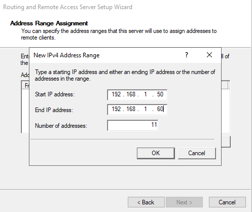

### Address Range Design Considerations

| Parameter | Value | Rationale |
|---|---|---|
| **Subnet** | `192.168.1.x` | Same as internal LAN — VPN clients become virtual LAN members without extra routing |
| **Start** | `.50` | Leaves `.1–.49` free for static assignments, network devices, servers |
| **End** | `.60` | Allows up to 11 simultaneous VPN sessions |
| **Avoid overlap** | Don't overlap with DHCP scope | Ensure the DHCP server (PDC16) doesn't hand out `.50–.60` to LAN clients — add an exclusion in DHCP |

> ⚠️ **Important:** If your LAN has a DHCP server (PDC16 has DHCP), you **must** exclude the range `192.168.1.50–60` from the DHCP server's scope to prevent address conflicts between VPN-assigned IPs and DHCP-assigned IPs.

Click **Next**.

---

## Task 6 — Configure Authentication Method (RADIUS vs Local)

### Why This Is Needed

VPN connections require user authentication. RRAS can authenticate users in two ways: locally (using its own Active Directory / NPS) or by forwarding authentication requests to a dedicated **RADIUS** server. This step chooses between the two.

### Steps

On the **Managing Multiple Remote Access Servers** page:

| Option | Description |
|---|---|
| **● No, use Routing and Remote Access to authenticate connection requests** ✅ (selected) | RRAS authenticates directly against the local machine or domain — no external RADIUS needed |
|○ Yes, set up this server to work with a RADIUS server | Forwards authentication to an NPS/RADIUS server — required when you have multiple VPN servers needing centralized authentication and policy management |

### Screenshot

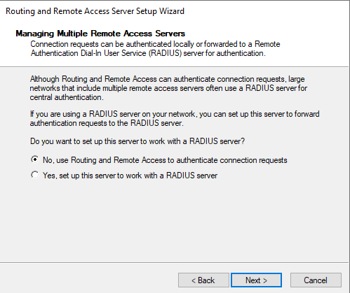

### RADIUS vs. Local Authentication

| Aspect | Local (RRAS) | RADIUS (NPS) |
|---|---|---|
| **Infrastructure needed** | None beyond RRAS | Requires NPS server (Network Policy Server) |
| **Scale** | Good for single VPN server | Required for multiple VPN servers with unified policies |
| **Logging & reporting** | Basic RRAS logs | Centralized, detailed accounting |
| **Policies** | User Dial-in properties | Rich NPS network policies (time-of-day, group membership, health checks) |
| **Lab suitability** | ✅ Simpler for this lab | Overkill for a single-server lab |

Click **Next** → **Finish** to complete the wizard and start RRAS in VPN mode.

---

## Task 7 — View VPN Ports and Protocol Types

### Why This Is Needed

After RRAS is configured, review the available **VPN ports** — each VPN tunnel protocol type has a set of virtual ports that clients can connect through. Understanding the protocol mix helps you enforce specific security policies (e.g., disabling PPTP in favor of IKEv2).

### Steps

1. In **Routing and Remote Access**, expand `ADC` → click **Ports**
2. Right-click **Ports** → **Properties** to open the Ports Properties dialog

### Screenshot

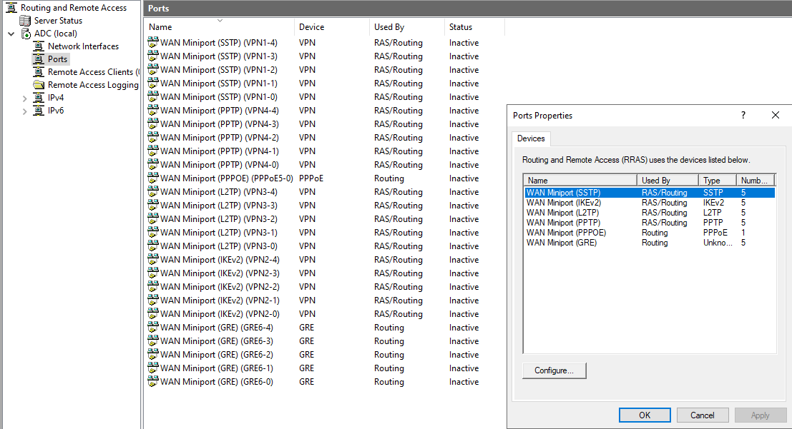

### VPN Protocol Reference

| Protocol | Type | Security Level | Ports in Lab | Notes |
|---|---|---|---|---|
| **WAN Miniport (SSTP)** | VPN | High (SSL/TLS — port 443) | 5 | Traverses firewalls/NAT easily; uses HTTPS |
| **WAN Miniport (IKEv2)** | VPN | Very High (IPSec) | 5 | Supports MOBIKE — reconnects after IP change; best for mobile workers |
| **WAN Miniport (L2TP)** | VPN | High (L2TP/IPSec) | 5 | Requires certificate or pre-shared key; very secure |
| **WAN Miniport (PPTP)** | VPN | Low (deprecated) | 5 | MS-CHAPv2 with RC4 — considered broken; avoid in production |
| **WAN Miniport (PPPoE)** | Routing | N/A | 1 | DSL-style routing; not VPN |
| **WAN Miniport (GRE)** | Routing | Low | 5 | Generic tunneling; used by PPTP |

> **Port count:** Each protocol shows 5 ports — meaning a maximum of 5 simultaneous VPN connections **per protocol type**. Click **Configure...** on any protocol to adjust the number of ports allowed.

> ⚠️ **Production Note:** Disable PPTP in production environments. In the Ports Properties, click Configure next to WAN Miniport (PPTP) and set the maximum ports to `0` to fully disable it, forcing clients to use IKEv2 or SSTP.

---

## Task 8 — Grant User Dial-In Permission

### Why This Is Needed

Even with RRAS fully configured, domain users **cannot connect by default** — each user's Active Directory account must explicitly have dial-in/VPN access granted. This is a deliberate security design: you control exactly which users can use the VPN.

### Steps

1. Open **Active Directory Users and Computers** (`dsa.msc`) on `PDC16`
2. Navigate to the OU containing the user (`ahmed.abdo`)
3. Double-click the user → click the **Dial-in** tab
4. Under **Network Access Permission**, select:
   - **● Allow access** — explicitly grants VPN access to this user

### Screenshot

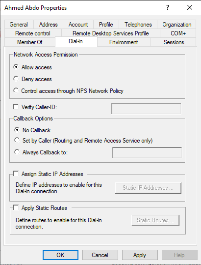

### Dial-In Tab Options Explained

| Setting | Description |
|---|---|
| **● Allow access** ✅ (selected) | User can always connect via VPN/dial-up |
| ○ Deny access | User can never connect, regardless of any NPS policy |
| ○ Control access through NPS Network Policy | Access is determined by NPS/RADIUS network policies — best for large deployments |

### Additional Dial-In Settings (Not Changed in This Lab)

| Setting | Purpose |
|---|---|
| **Verify Caller-ID** | Restricts VPN connections to those originating from a specific phone number (dial-up only) |
| **Callback Options** | Server calls the client back at a specified number after authentication (security or cost feature) |
| **Assign Static IP Addresses** | Override the pool and force this specific user to always get a specific IP |
| **Apply Static Routes** | Inject specific routes into the routing table when this user connects |

> **Production Practice:** Rather than setting "Allow access" on each user individually, use **NPS Network Policies** with group membership conditions — allow VPN access to members of an `AD_VPN_Users` security group, and add/remove users from that group to control VPN access at scale.

---

## Task 9 — Create VPN Connection on Client (Legacy Wizard)

### Why This Is Needed

The external **PC** needs a VPN connection profile configured so it knows where to connect (the VPN server's public IP) and what credentials to use. Windows offers two methods: the legacy **Control Panel / Network Wizard** (shown here) and the modern **Windows Settings** approach (Task 10). Both create the same underlying connection.

### Steps — Part A: Choose Connection Type

1. On the **PC** (external client), open **Control Panel** → **Network and Sharing Center** → **Set up a new connection or network**
2. Select **Connect to a workplace** → **Next**

### Screenshot

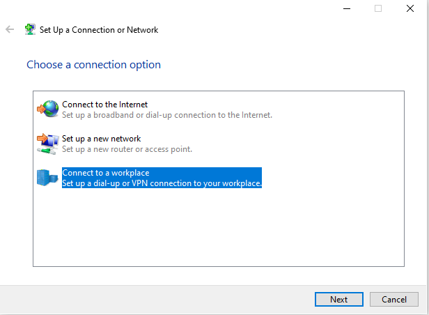

### Steps — Part B: Choose VPN Transport

3. Select **→ Use my Internet connection (VPN)** — not Dial directly

### Screenshot

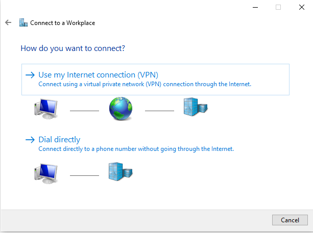

### Steps — Part C: Enter VPN Server Address

4. Fill in the connection details:

| Field | Value | Notes |
|---|---|---|
| **Internet address** | `11.0.0.3` | The VPN server's **public WAN IP address** — what the PC uses to reach the server over the Internet |
| **Destination name** | `VPN Connection` | Friendly label shown in Network Connections |
| ☐ Use a smart card | Unchecked | Not using certificate-based auth |
| ✅ Remember my credentials | Checked | Saves username/password so user doesn't re-enter each time |
| ☐ Allow other people to use | Unchecked | Connection only available to the current Windows user account |

### Screenshot

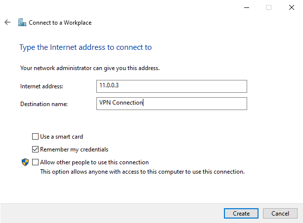

5. Click **Create** — the connection is created but not yet connected

---

## Task 10 — Add VPN Connection via Windows Settings

### Why This Is Needed

The modern Windows 10/11 **Settings** method for creating a VPN connection is more accessible to end users than the legacy Control Panel wizard. This task shows the alternative — and preferred — method, and also confirms the full credential details that make the connection work.

### Steps

1. On the **PC**, open **Windows Settings** → **Network & Internet** → **VPN**
2. Click **Add a VPN connection**
3. Fill in the **Add a VPN connection** dialog:

| Field | Value |
|---|---|
| **VPN provider** | `Windows (built-in)` |
| **Connection name** | `VPN Connection1` |
| **Server name or address** | `11.0.0.3` |
| **VPN type** | `Automatic` |
| **Type of sign-in info** | `User name and password` |
| **User name** | `COMPANY\ahmed.abdo` |
| **Password** | (domain password) |
| ✅ Remember my sign-in info | Checked |

### Screenshot

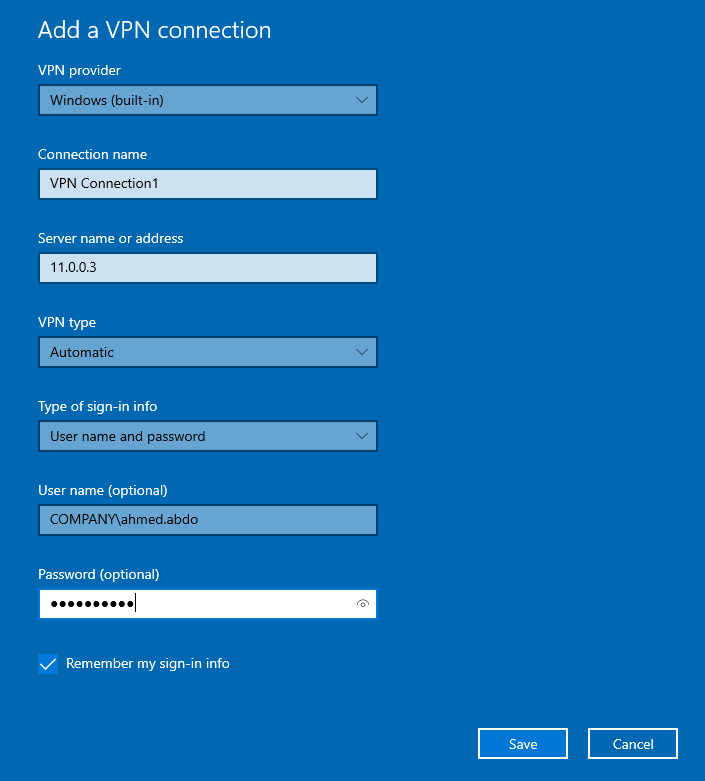

4. Click **Save**

### Key Settings Notes

| Field | Detail |
|---|---|
| **VPN type: Automatic** | Windows tries IKEv2 first, then SSTP, then L2TP, then PPTP — selecting the best protocol both sides support |
| **User name format** | `COMPANY\ahmed.abdo` uses the domain NetBIOS name prefix — alternatively `ahmed.abdo@company.local` (UPN format) works too |
| **Server address** | Must be the **WAN IP** (`11.0.0.3`) — the address reachable from the Internet, not the internal LAN IP |

---

## Task 11 — Review VPN Connection Properties After Connect

### Why This Is Needed

After successfully connecting the VPN, verify the actual IP address and DNS settings assigned to the VPN tunnel adapter — confirming the client received an address from the correct pool and is using the correct internal DNS server.

### Steps

1. Connect the VPN: right-click the connection → **Connect**
2. After connecting, open **Network Connections** (`ncpa.cpl`)
3. Right-click the VPN connection → **Status** → **Details**

### Screenshot

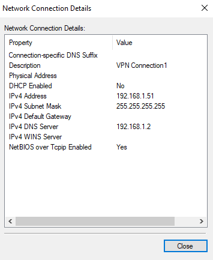

### Connection Details Breakdown

| Property | Value | What It Confirms |
|---|---|---|
| **Description** | `VPN Connection1` | Correct connection profile connected |
| **DHCP Enabled** | `No` | IP was assigned from RRAS static pool (not DHCP) |
| **IPv4 Address** | `192.168.1.51` | ✅ Address is from the configured pool (`192.168.1.50–.60`) |
| **IPv4 Subnet Mask** | `255.255.255.255` | A /32 host route — normal for PPP-based VPN tunnels |
| **IPv4 Default Gateway** | *(blank)* | VPN tunnel doesn't replace the default gateway (split tunneling — only LAN traffic goes through VPN) |
| **IPv4 DNS Server** | `192.168.1.2` | ✅ Internal DNS server (PDC16) is being used — VPN client can resolve `company.local` domain names |

> **Subnet Mask `255.255.255.255`:** This is normal for PPP/VPN virtual adapters — it indicates a point-to-point link with a single host address. The routing table handles directing internal traffic (192.168.1.x) through the VPN tunnel separately.

---

## Task 12 — View Active Remote Access Clients on the Server

### Why This Is Needed

From the **server side**, RRAS provides a live view of all currently connected VPN clients — showing username, connection duration, number of ports used, and NAP compliance status. This is the administrator's primary tool for monitoring active VPN sessions.

### Steps

1. On `ADC`, open **Routing and Remote Access**
2. Expand `ADC (local)` → click **Remote Access Clients**

### Screenshot

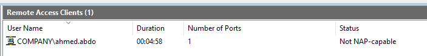

### Active Client Table

| Field | Value | Meaning |
|---|---|---|
| **User Name** | `COMPANY\ahmed.abdo` | The domain user currently connected |
| **Duration** | `00:04:58` | Connected for ~5 minutes |
| **Number of Ports** | `1` | One VPN tunnel/port in use |
| **Status** | `Not NAP-capable` | Network Access Protection check: this client doesn't support NAP (normal for basic Windows 10 clients without NPS/NAP agent configured) |

### Administrative Actions Available

By right-clicking a connected client, administrators can:

- **Disconnect** — Forcibly terminate the VPN session (useful if a user's credentials are compromised, or session must be ended immediately)
- **Send Message** — Pop up a message to the connected client (informing them of maintenance, etc.)

---

## Task 13 — Inspect the RAS (PPP Dial-In) Adapter on the Client

### Why This Is Needed

When a VPN connection is established, Windows creates a **virtual network adapter** (a PPP adapter, also called a RAS dial-in interface) that represents the VPN tunnel endpoint. Examining this adapter confirms the IP assigned by the server from the pool, and shows the point-to-point nature of the VPN link.

### Steps

On the **PC** (VPN client), open **Command Prompt** and run:

```cmd
ipconfig /all
```

Look for the adapter named **PPP adapter RAS (Dial In) Interface**.

### Screenshot

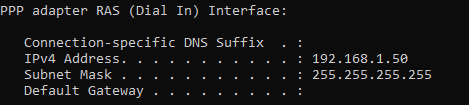

### RAS Adapter Details

| Field | Value | Meaning |
|---|---|---|
| **IPv4 Address** | `192.168.1.50` | ✅ Assigned from the RRAS VPN pool (`.50–.60`); this is the client's "virtual" internal LAN address |
| **Subnet Mask** | `255.255.255.255` | Point-to-point tunnel — /32 host mask is normal for PPP links |
| **Default Gateway** | *(blank)* | Split tunneling: only traffic destined for internal LAN routes through the tunnel; Internet traffic still goes through the PC's normal Internet connection |

### Two IP Addresses on the VPN Client

After connecting, the PC has **two relevant IP addresses**:

| Adapter | IP | Network |
|---|---|---|
| Physical NIC (WAN) | `11.0.0.2` | External "Internet" network — used to reach the VPN server |
| PPP RAS Adapter (VPN) | `192.168.1.50` | Internal LAN network — used to communicate with LAN resources |

The routing table directs traffic to `192.168.1.x` through the VPN tunnel, and all other traffic through the physical NIC as normal.

---

## Task 14 — Validate VPN: Ping Internal Server from Remote Client

### Why This Is Needed

The ultimate end-to-end validation: from the remote PC (physically on the `11.0.0.0/24` WAN network), attempt to **reach PDC16's internal LAN address** (`192.168.1.2`). Success proves the entire VPN chain works — authentication, tunnel establishment, IP assignment, and LAN routing.

### Steps

On the **PC** (with VPN connected), open **Command Prompt** and run:

```cmd
ping 192.168.1.2
```

### Screenshot

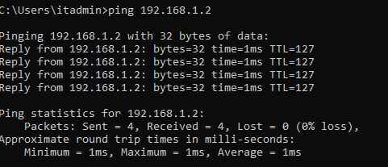

### Result Analysis

```
Pinging 192.168.1.2 with 32 bytes of data:
Reply from 192.168.1.2: bytes=32 time=1ms TTL=127
Reply from 192.168.1.2: bytes=32 time=1ms TTL=127
Reply from 192.168.1.2: bytes=32 time=1ms TTL=127
Reply from 192.168.1.2: bytes=32 time=1ms TTL=127

Ping statistics for 192.168.1.2:
    Packets: Sent = 4, Received = 4, Lost = 0 (0% loss)
    Minimum = 1ms, Maximum = 1ms, Average = 1ms
```

| Verification Point | Result |
|---|---|
| Packets sent = received | ✅ 4/4 — 0% packet loss |
| `192.168.1.2` replied | ✅ PDC16 is reachable through the VPN tunnel |
| Response time ~1ms | ✅ Very fast — LAN-speed responses across the VPN (LAN lab environment) |
| **TTL = 127** | ✅ Confirms traffic went through at least one hop (the VPN tunnel terminates on ADC, then routes to PDC16 on LAN) |

### Why TTL = 127 (Not 128)?

PDC16 responds with TTL=128 (Windows default). The packet passes through **one hop** (the RRAS VPN server `ADC`) on its return path, decrementing TTL by 1 → client receives TTL=127. This confirms the expected routing: **PC VPN Tunnel → ADC (LAN hop) → PDC16**.

---

## Verification & Testing

### On the VPN Server (ADC) — PowerShell

```powershell
# View all active VPN connections
Get-RemoteAccessConnectionStatistics

# View RRAS service status
Get-Service RemoteAccess | Select-Object Name, Status

# View VPN configuration
Get-VpnServerConfiguration

# View IP address pool utilization
netsh ras ip show pool

# View connected users via netsh
netsh ras show activeservers
```

### On the VPN Client (PC)

```cmd
:: Confirm VPN adapter IP
ipconfig /all

:: Test internal LAN access
ping 192.168.1.2      :: PDC16
ping 192.168.1.100    :: Another internal resource

:: Test domain resolution through VPN
nslookup pdc16.company.local

:: Test domain controller connectivity
nltest /dsgetdc:company.local

:: Trace the route (should show VPN server as first hop)
tracert 192.168.1.2
```

### Complete Validation Checklist

| Test | Target | Expected Result |
|---|---|---|
| VPN connects | `11.0.0.3` | ✅ Connection established without errors |
| VPN adapter gets internal IP | — | ✅ `192.168.1.50–.60` range |
| Internal DNS server assigned | — | ✅ `192.168.1.2` (PDC16) |
| Ping internal server | `192.168.1.2` | ✅ Replies received, TTL=127 |
| Ping VPN server LAN IP | `192.168.1.110` | ✅ Replies received |
| Domain name resolution | `pdc16.company.local` | ✅ Resolves correctly via internal DNS |
| Server shows client connected | RRAS console | ✅ `COMPANY\ahmed.abdo` visible in Remote Access Clients |
| Disconnect user (admin) | RRAS console right-click | ✅ Session terminated |

---

## Troubleshooting

| Problem | Possible Cause | Solution |
|---|---|---|
| VPN connection fails with "The remote connection was not made" | Wrong server IP, firewall blocking VPN port | Verify `11.0.0.3` is reachable from the client; check Windows Firewall on ADC allows VPN ports |
| Authentication fails (wrong credentials) | User doesn't have Dial-in permission | Check the user's **Dial-in tab** in AD Users and Computers — set to **Allow access** |
| Authentication fails (correct credentials) | RRAS not joined to domain / NPS issue | Ensure ADC can authenticate against the domain; run `nltest /dsgetdc:company.local` on ADC |
| VPN connects but can't reach internal resources | Split tunneling routing issue | Check routing table on client with `route print`; ensure `192.168.1.x` routes through the VPN adapter |
| IP address conflict on LAN | VPN pool overlaps with DHCP scope | Add an exclusion in DHCP server for `192.168.1.50–60` |
| VPN pool exhausted | More than 11 simultaneous users | Expand the address range (Task 5); add more addresses to the pool |
| Can't ping PDC16 through VPN | Windows Firewall on PDC16 blocking | Add inbound rule on PDC16: allow ICMP/ping from `192.168.1.0/24` |
| RRAS won't start after reconfiguration | Conflict with previous NAT/RRAS config | Disable and re-enable RRAS: right-click server in console → Disable Routing and Remote Access → reconfigure |
| "Not NAP-capable" status in Remote Access Clients | Client doesn't have NAP agent | Expected — informational only; doesn't prevent VPN connectivity unless NPS policy requires NAP |
| IKEv2 fails, falls back to PPTP | No machine certificate for IKEv2 | Either configure a machine certificate for IKEv2 or explicitly set VPN type to SSTP/L2TP |

---

## Summary

### Task Completion Overview

| Task | Action | Tool | Result |
|---|---|---|---|
| **Task 1** | Reviewed VPN network topology and IP plan | Topology diagram | Understood VPN server dual-NIC role and address pool design |
| **Task 2** | Selected Remote Access (VPN) mode in RRAS wizard | RRAS Setup Wizard | VPN server mode enabled |
| **Task 3** | Designated WAN interface as the Internet-facing VPN endpoint | RRAS Setup Wizard | WAN (`11.0.0.3`) bound for VPN incoming connections |
| **Task 4** | Chose static address range (not DHCP) for client IP assignment | RRAS Setup Wizard | RRAS acts as its own IP pool manager for VPN clients |
| **Task 5** | Defined IP pool `192.168.1.50–192.168.1.60` (11 addresses) | RRAS Setup Wizard | VPN clients receive internal LAN subnet addresses |
| **Task 6** | Set authentication to local RRAS (no RADIUS) | RRAS Setup Wizard | Domain credentials authenticated by RRAS directly |
| **Task 7** | Reviewed VPN port types (SSTP, IKEv2, L2TP, PPTP) and counts | RRAS → Ports Properties | Confirmed 5 ports per protocol type, understood protocol options |
| **Task 8** | Granted `ahmed.abdo` dial-in (VPN) permission in AD | Active Directory Users and Computers → Dial-in tab | User authorized to establish VPN connections |
| **Task 9** | Created VPN connection profile on client via Control Panel | Windows Network Wizard | "VPN Connection" profile created pointing to `11.0.0.3` |
| **Task 10** | Created VPN connection via Windows Settings (modern method) | Windows Settings → VPN | "VPN Connection1" added with full credentials |
| **Task 11** | Verified assigned VPN IP (`192.168.1.51`) and DNS (`192.168.1.2`) | Network Connection Details | Confirmed pool assignment and internal DNS usage |
| **Task 12** | Viewed active session in RRAS Remote Access Clients | Routing and Remote Access Console | Confirmed `COMPANY\ahmed.abdo` connected for ~5 minutes |
| **Task 13** | Inspected PPP RAS adapter on client (`192.168.1.50`) | `ipconfig /all` on PC | Confirmed tunnel adapter has internal LAN IP from pool |
| **Task 14** | Pinged PDC16 (`192.168.1.2`) from VPN-connected remote PC | `ping` command | 0% packet loss — end-to-end VPN access to internal LAN confirmed |

### Key Concepts Recap

- **Remote Access VPN** gives external users a virtual presence on the internal LAN through an encrypted tunnel — they receive an internal IP and can access all LAN resources
- **RRAS in VPN mode** handles authentication, IP assignment, and tunnel management in a single Windows Server role
- **IP Address Pool** must be on the same subnet as the LAN and **must not overlap** with the DHCP scope
- **Dial-in permission** in AD is the per-user access control gate — must be set to "Allow" (or managed via NPS policy) before any user can connect
- **Two connection methods** (Control Panel wizard vs. Windows Settings) both create equivalent VPN profiles — modern deployments prefer Windows Settings or MDM/Intune deployment
- **TTL=127** in ping results confirms traffic traverses exactly one hop (the VPN gateway) — a good sign of correct routing
- **Split tunneling** (no default gateway on VPN adapter) means only internal traffic goes through the tunnel; Internet traffic still routes normally — efficient but means Internet traffic is not protected by corporate firewall

---

> 📌 **Lab Environment Reference**  
> VPN Server: `ADC` | WAN: `11.0.0.3` | LAN: `192.168.1.110`  
> VPN Client Pool: `192.168.1.50–192.168.1.60` | DNS via VPN: `192.168.1.2` (PDC16)  
> Test User: `COMPANY\ahmed.abdo` | Connected Client IP: `192.168.1.50–.51`
