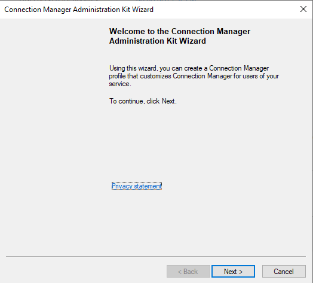
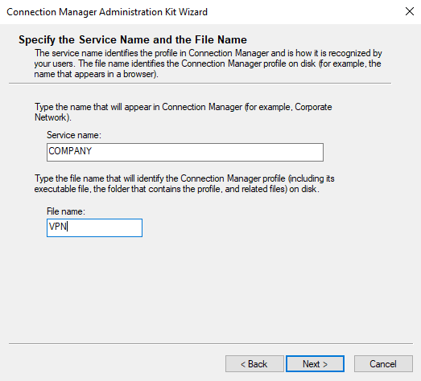
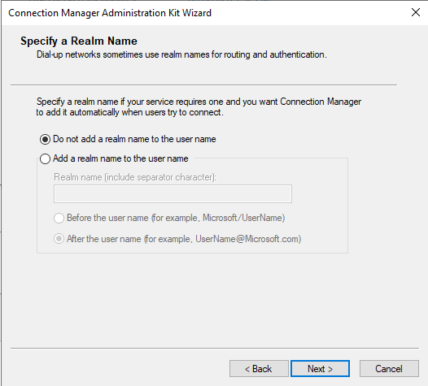
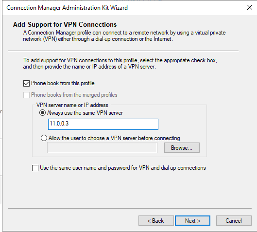
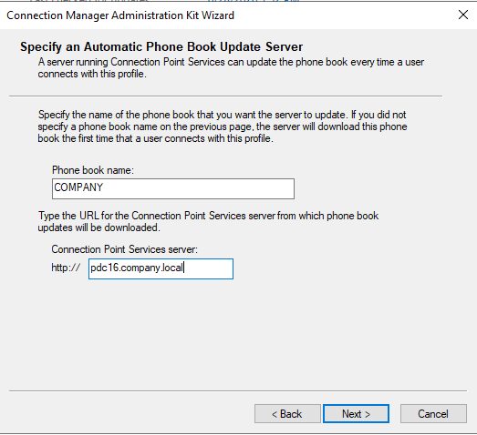
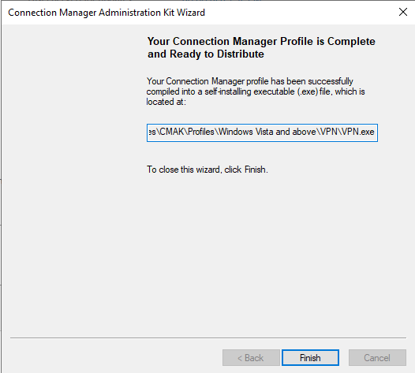
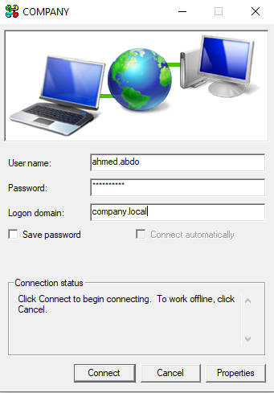

# 📦 CMAK (Connection Manager Administration Kit) Lab — Complete Setup Guide

> **Lab Environment:** Windows Server 2022  
> **Tool:** Connection Manager Administration Kit (CMAK)  
> **VPN Server:** `ADC.company.local` | **WAN IP:** `11.0.0.3`  
> **Phone Book Server:** `PDC16.company.local`  
> **Domain:** `company.local`  
> **Test User:** `ahmed.abdo`  
> **Objective:** Use CMAK to create a branded, self-installing VPN profile package (`.exe`) that can be distributed to remote users — eliminating the need for manual VPN setup on each client machine

---

## 📋 Table of Contents

1. [Lab Overview — What Is CMAK?](#lab-overview--what-is-cmak)
2. [Prerequisites](#prerequisites)
3. [Task 1 — Launch the CMAK Wizard](#task-1--launch-the-cmak-wizard)
4. [Task 2 — Specify the Service Name and File Name](#task-2--specify-the-service-name-and-file-name)
5. [Task 3 — Specify a Realm Name](#task-3--specify-a-realm-name)
6. [Task 4 — Add Support for VPN Connections](#task-4--add-support-for-vpn-connections)
7. [Task 5 — Specify an Automatic Phone Book Update Server](#task-5--specify-an-automatic-phone-book-update-server)
8. [Task 6 — Complete and Distribute the Profile](#task-6--complete-and-distribute-the-profile)
9. [Task 7 — Install and Use the CMAK Profile on a Client](#task-7--install-and-use-the-cmak-profile-on-a-client)
10. [Verification & Testing](#verification--testing)
11. [Troubleshooting](#troubleshooting)
12. [Summary](#summary)

---

## Lab Overview — What Is CMAK?

**Connection Manager Administration Kit (CMAK)** is a Windows Server feature that allows IT administrators to create **customized, self-installing VPN connection profiles** — packaged as a single `.exe` file that end users simply run to install a fully pre-configured VPN connection on their device.

### The Problem CMAK Solves

Without CMAK, every remote employee must manually configure their VPN connection:
- Enter the server IP or hostname
- Choose the correct VPN protocol type
- Set domain credentials
- Optionally configure proxy settings, routes, etc.

This is error-prone, time-consuming, and produces inconsistent configurations across the organization.

### The CMAK Solution

With CMAK, the administrator builds the profile **once** on a server, embedding all settings (server address, protocol, phone book, branding, etc.) into a `.exe` installer. Users receive this file (via email, a web portal, or a file share) and run it — the VPN profile is installed automatically with zero manual configuration.

### CMAK vs. Manual VPN Profile (Previous Lab)

| Aspect | Manual (Task 9–10 in previous lab) | CMAK Profile |
|---|---|---|
| **Configuration** | User enters server IP, protocol, credentials | All pre-embedded in the `.exe` |
| **Distribution** | Each device configured individually | One `.exe` file shared via email/portal/GPO |
| **Branding** | Generic Windows VPN icon | Custom service name, logo, splash screen |
| **Consistency** | Varies between users | Identical on every device |
| **Updates** | Manual reconfiguration | Automatic phone book updates |
| **Scale** | Impractical for > 10 users | Designed for enterprise-scale deployment |

### What the CMAK Wizard Produces

```
VPN.exe  ← self-installing profile package
  │
  ├── Service name: "COMPANY"
  ├── VPN server: 11.0.0.3
  ├── Realm: (none — uses plain credentials)
  ├── Phone book: auto-updated from pdc16.company.local
  └── Target OS: Windows Vista and above
```

---

## Prerequisites

Before starting, ensure:

- The **Remote Access VPN** lab (previous lab) is complete — RRAS is configured and running on `ADC` with the VPN pool (`192.168.1.50–.60`)
- **CMAK** is installed on the server (installed as a Feature in Server Manager: Features → **RAS Connection Manager Administration Kit (CMAK)**)
- `PDC16` is accessible at `pdc16.company.local` and will serve as the **Connection Point Services** (phone book update) server
- A test user `ahmed.abdo` exists in AD with dial-in permission granted

### Install CMAK (if not already installed)

```powershell
# Install CMAK via PowerShell
Install-WindowsFeature CMAK

# Or via Server Manager:
# Manage → Add Roles and Features → Features → RAS Connection Manager
# Administration Kit (CMAK) → Install
```

---

## Task 1 — Launch the CMAK Wizard

### Why This Is Needed

CMAK is a wizard-driven tool — all profile configuration is done interactively through a sequence of pages that cover every aspect of the VPN connection package. The wizard compiles everything into the final `.exe` at the end.

### Steps

1. On the **server** (`ADC` or `PDC16`), open **Server Manager** → **Tools** → **Connection Manager Administration Kit**
   - Or search for `CMAK` in the Start menu
   - Or run `cmak.exe` directly from `C:\Windows\System32`

2. The **Connection Manager Administration Kit Wizard** welcome screen appears:

> *"Using this wizard, you can create a Connection Manager profile that customizes Connection Manager for users of your service. To continue, click Next."*

### Screenshot



3. Click **Next** to begin the profile configuration

### What CMAK Generates

At the end of the wizard, CMAK produces a self-extracting `.exe` installer. When a user runs this on their Windows machine, it:
- Installs the Connection Manager profile into the user's VPN connections
- Creates a desktop/Start menu shortcut branded with your service name
- Configures all VPN settings automatically — no user input needed (except credentials at connect time)

---

## Task 2 — Specify the Service Name and File Name

### Why This Is Needed

These two fields define the **identity** of the CMAK profile:
- The **Service name** is what users see in Connection Manager — it brands the VPN connection with your organization's name
- The **File name** determines the name of the output `.exe` and all associated profile files on disk

### Steps

On the **Specify the Service Name and the File Name** page:

| Field | Value | Purpose |
|---|---|---|
| **Service name** | `COMPANY` | The display name shown in the Connection Manager dialog and in the user's network connections list |
| **File name** | `VPN` | The base filename for all output files: `VPN.exe`, `VPN.cms`, `VPN.pbk`, etc. |

### Screenshot



### Naming Guidelines

| Field | Rules | Example |
|---|---|---|
| Service name | Descriptive, user-facing; spaces allowed | `Company VPN`, `CorpNet`, `COMPANY` |
| File name | No spaces; alphanumeric + hyphens; becomes filename on disk | `VPN`, `CompanyVPN`, `Corp-Remote` |

> **Tip:** The service name appears in the Connection Manager splash screen and the connection icon label that users see. Use a clear, recognizable name like your company name or `[Company] Corporate VPN`.

Click **Next**.

---

## Task 3 — Specify a Realm Name

### Why This Is Needed

A **realm name** is an identifier appended to (or prepended before) a username during authentication — historically used by ISPs and dial-up networks to route authentication requests to the correct authentication server. For example, `username@realm.com` or `realm/username`.

In modern domain-based VPN setups, realm names are generally **not needed** because Active Directory handles authentication through the domain name in the credentials directly (e.g., `COMPANY\ahmed.abdo`).

### Steps

On the **Specify a Realm Name** page, select:

- **● Do not add a realm name to the user name** ✅ (selected)

Leave the "Add a realm name" option unchecked.

### Screenshot



### Realm Name Options Explained

| Option | When to Use |
|---|---|
| **Do not add a realm name** ✅ (this lab) | Domain VPN using AD credentials (`COMPANY\username` or `username@company.local`) — realm is implicit |
| **Add realm name — Before the user name** | Legacy dial-up/ISP format: `realm/username` (e.g., `Microsoft/JohnDoe`) |
| **Add realm name — After the user name** | Email-style UPN format: `username@realm.com` (e.g., `JohnDoe@Microsoft.com`) |

> In this lab, users authenticate as `ahmed.abdo` with domain `company.local` — the domain is specified separately in the Connection Manager login dialog, so no realm prefix/suffix is needed here.

Click **Next**.

---

## Task 4 — Add Support for VPN Connections

### Why This Is Needed

This is the core page of the wizard — it configures the **VPN server endpoint** that the profile will connect to. Without this, the CMAK profile would only support dial-up connections, not the Internet-based VPN tunnels needed for remote access.

### Steps

On the **Add Support for VPN Connections** page:

| Setting | Value | Notes |
|---|---|---|
| ✅ **Phone book from this profile** | Checked | Use the phone book bundled in this profile (contains server entries) |
| ☐ Phone books from the merged profiles | Unchecked | Not merging another profile |
| **VPN server name or IP address** | ● Always use the same VPN server | Hardcodes a single server |
| **Server address** | `11.0.0.3` | The VPN server's **public WAN IP** — the address reachable from the Internet |
| ☐ Allow the user to choose a VPN server | Unchecked | Removes choice — users always connect to the company server |
| ☐ Use the same user name and password for VPN and dial-up | Unchecked | VPN-only profile |

### Screenshot



### "Always Use the Same VPN Server" vs. "Allow User to Choose"

| Option | Use Case |
|---|---|
| **Always use the same server** ✅ (selected) | Standard enterprise deployment — one VPN gateway, no user choice needed |
| Allow the user to choose | Multi-site organizations with regional VPN gateways (e.g., US East, US West, Europe) — users select the nearest server |

> **Why `11.0.0.3` (IP, not hostname)?** Using a static IP ensures the profile works even if internal DNS isn't reachable from the external client's current network. In production, consider using a **FQDN** like `vpn.company.com` so the profile continues to work if the server IP ever changes (just update DNS).

Click **Next**.

---

## Task 5 — Specify an Automatic Phone Book Update Server

### Why This Is Needed

The **phone book** in Connection Manager is a database of available dial-up access numbers and VPN server addresses. The **Automatic Phone Book Update** feature allows CMAK profiles to download an updated phone book from a central server every time a user connects — ensuring that if VPN server addresses change, all users automatically receive the updated list without needing to reinstall the profile.

### Steps

On the **Specify an Automatic Phone Book Update Server** page:

| Field | Value | Notes |
|---|---|---|
| **Phone book name** | `COMPANY` | Matches the service name — the name of the phone book file that the server will host |
| **Connection Point Services server** | `pdc16.company.local` | The server hosting the phone book update service (via IIS/HTTP) |
| **Full URL** | `http://pdc16.company.local` | The base URL from which the updated phone book is downloaded |

### Screenshot



### How Phone Book Updates Work

```
Client runs VPN.exe → CMAK profile installed
       │
Client connects using COMPANY VPN profile
       │
Before/during connect: profile checks
http://pdc16.company.local for phone book update
       │
       ├── If updated version available → downloads new phone book
       │   (new VPN server IPs, new dial-up numbers, etc.)
       │
       └── Connects to VPN server specified in phone book
```

### Connection Point Services Requirements

For phone book auto-update to work, `PDC16` must be running:
- **IIS** (to serve HTTP requests for phone book downloads)
- **Connection Point Services** (a component that manages and serves phone book files)

> **In this lab context:** The phone book update server setting points to `pdc16.company.local`. If Connection Point Services is not fully configured on PDC16, the auto-update feature will simply not function — the VPN profile itself will still work using the static server address (`11.0.0.3`) configured in Task 4.

Click **Next** through any remaining wizard pages (additional customization options like custom graphics, additional files, etc. can be left at defaults for this lab).

---

## Task 6 — Complete and Distribute the Profile

### Why This Is Needed

After configuring all settings, the wizard **compiles** everything into a self-installing `.exe` package. This final page confirms where the output file is located so you can distribute it to users.

### Steps

The wizard's final confirmation page displays:

> *"Your Connection Manager Profile is Complete and Ready to Distribute"*  
> *"Your Connection Manager profile has been successfully compiled into a self-installing executable (.exe) file, which is located at:"*

**Output path:**
```
...\CMAK\Profiles\Windows Vista and above\VPN\VPN.exe
```

(Full default path: `C:\Program Files (x86)\CMAK\Profiles\Windows Vista and above\VPN\VPN.exe`)

### Screenshot



### What Was Created

CMAK generates a complete profile folder containing:

| File | Purpose |
|---|---|
| `VPN.exe` | The **self-installing executable** — this is what you distribute to users |
| `VPN.cms` | Connection Manager Service profile — the configuration text file |
| `VPN.pbk` | Phone book file — contains VPN server entries |
| `VPN.cmp` | Compiled profile data |
| `cmroute.dll` | Routing DLL for Connection Manager |
| `cmbind.dll` | Binding DLL |

> **Distribution methods for `VPN.exe`:**  
> - Email attachment (simple, works for small teams)  
> - Company intranet/self-service portal  
> - Network share accessible to remote users  
> - Group Policy software deployment (for domain-joined machines)  
> - Microsoft Intune / SCCM app deployment (enterprise MDM)

Click **Finish** to close the wizard.

---

## Task 7 — Install and Use the CMAK Profile on a Client

### Why This Is Needed

The final validation — distribute `VPN.exe` to a client machine, install the profile by running the executable, then use the resulting **COMPANY** Connection Manager dialog to authenticate and establish the VPN tunnel.

### Steps

#### Step 7a — Transfer and Run VPN.exe on the Client

1. Copy `VPN.exe` to the external **PC** (e.g., via a shared folder, USB, or download from a web share)
2. On the PC, double-click **VPN.exe**
3. The installer runs silently and installs the **COMPANY** Connection Manager profile
4. A shortcut to **COMPANY** appears in the Start menu and/or desktop

#### Step 7b — Connect Using the COMPANY Profile

5. Launch the **COMPANY** Connection Manager dialog

### Screenshot



### COMPANY Connection Manager Dialog

| Field | Value | Notes |
|---|---|---|
| **User name** | `ahmed.abdo` | Domain username (without domain prefix — Connection Manager appends the logon domain) |
| **Password** | `**********` | The user's AD domain password |
| **Logon domain** | `company.local` | The domain against which credentials are authenticated |
| ☐ Save password | Unchecked | For security — don't save passwords on shared/unmanaged devices |
| ☐ Connect automatically | Unchecked | Manual connect — useful for testing |

6. Click **Connect**

### What Happens During Connection

```
User clicks Connect in COMPANY dialog
       │
Connection Manager reads VPN.exe profile settings
       │
Checks for phone book update at http://pdc16.company.local
       │
Establishes VPN tunnel to 11.0.0.3 (ADC WAN interface)
       │
RRAS on ADC authenticates credentials (ahmed.abdo / company.local)
       │
RRAS assigns IP from pool 192.168.1.50–.60
       │
VPN tunnel established → client appears on internal LAN
       │
User can now access internal resources (PDC16, file shares, etc.)
```

### Expected Result

- The COMPANY dialog shows **Connected** status
- The PC receives an internal IP address from the `192.168.1.50–.60` pool
- Internal resources (e.g., `\\PDC16`, `\\company.local\Shares`) become accessible
- RRAS on ADC shows `COMPANY\ahmed.abdo` in the **Remote Access Clients** list

---

## Verification & Testing

### On the Server (ADC) — PowerShell

```powershell
# Confirm CMAK feature is installed
Get-WindowsFeature CMAK

# Verify RRAS is running (prerequisite)
Get-Service RemoteAccess | Select-Object Name, Status

# Check active VPN clients after CMAK profile connects
# (Open Routing and Remote Access → Remote Access Clients)
```

### On the Client (PC) After Connecting via CMAK Profile

```cmd
:: Confirm VPN adapter got internal IP
ipconfig /all
:: Look for PPP adapter: 192.168.1.50–60

:: Ping internal server through VPN
ping 192.168.1.2

:: Resolve domain name through VPN (uses internal DNS)
nslookup pdc16.company.local

:: Browse internal file shares
\\company.local\Shares
```

### End-to-End Test Checklist

| Step | Test | Expected Result |
|---|---|---|
| 1 | Run `VPN.exe` on client | Installs silently; COMPANY icon appears in Start menu |
| 2 | Open COMPANY dialog | Login form with User name, Password, Logon domain fields |
| 3 | Enter credentials and Connect | Connection Manager shows "Connected" |
| 4 | `ipconfig /all` on client | PPP adapter shows `192.168.1.5x` address |
| 5 | `ping 192.168.1.2` | 4/4 replies — PDC16 reachable through VPN |
| 6 | Check RRAS on ADC | `COMPANY\ahmed.abdo` visible in Remote Access Clients |
| 7 | Disconnect and reconnect | Phone book update check fires at connect time |

---

## Troubleshooting

| Problem | Possible Cause | Solution |
|---|---|---|
| `VPN.exe` won't run on client | OS version mismatch | Profile was built for "Windows Vista and above" — confirm client is Windows 7/10/11 |
| COMPANY dialog doesn't appear after install | Installation failed silently | Re-run `VPN.exe` as Administrator; check `%AppData%\Microsoft\Network\Connections\Pbk` for the `.pbk` file |
| Connection fails: "The remote connection was not made" | Wrong server IP in profile | Re-run CMAK wizard with correct IP; rebuild and redistribute `VPN.exe` |
| Authentication fails | User credentials wrong or no dial-in permission | Verify `ahmed.abdo` has **Allow access** on the Dial-in tab in AD; confirm password is correct |
| Phone book update fails | Connection Point Services not configured on PDC16 | This only affects the auto-update feature — VPN connection itself still works via the hardcoded `11.0.0.3` |
| "Logon domain" field is missing | CMAK profile option | In CMAK wizard, ensure "Include Windows Logon Information" or domain field is enabled in advanced options |
| VPN connects but can't reach internal resources | Routing issue (split tunneling) | Check routing table: `route print`; confirm `192.168.1.0/24` routes via VPN adapter |
| CMAK wizard doesn't appear in Tools menu | CMAK feature not installed | `Install-WindowsFeature CMAK` then check Server Manager → Tools |
| Profile needs to be updated (new server IP) | Server IP changed | Run CMAK wizard again, update the server IP, rebuild `VPN.exe`, redistribute to users |

---

## Summary

### Task Completion Overview

| Task | Action | Tool | Result |
|---|---|---|---|
| **Task 1** | Launched the CMAK wizard | Server Manager → Tools → CMAK | Wizard started; ready to build VPN profile package |
| **Task 2** | Set Service name (`COMPANY`) and File name (`VPN`) | CMAK Wizard | Profile identity configured; output will be `VPN.exe` branded as "COMPANY" |
| **Task 3** | Chose not to add a realm name | CMAK Wizard | Plain AD credentials used (`ahmed.abdo` + domain) — no realm prefix/suffix |
| **Task 4** | Configured VPN server address (`11.0.0.3`) | CMAK Wizard | Profile hardcoded to always connect to `11.0.0.3` |
| **Task 5** | Set phone book update server (`pdc16.company.local`) | CMAK Wizard | Profile will check for updated server list on each connect |
| **Task 6** | Compiled and located the output `VPN.exe` | CMAK Wizard | Self-installing package ready at `...\CMAK\Profiles\...\VPN\VPN.exe` |
| **Task 7** | Ran `VPN.exe` on client, entered credentials, connected | Connection Manager | COMPANY VPN established; user reached internal LAN resources |

### Key Concepts Recap

- **CMAK** packages all VPN configuration into a single `.exe` — zero manual setup for end users
- The **Service name** is the user-visible brand name; the **File name** is the technical filename for disk artifacts
- **Realm names** are not needed for standard Active Directory domain VPNs — skip this for domain-joined or domain-credential-based setups
- The **VPN server address** in CMAK should be the **public WAN IP** — not the internal LAN IP — since clients connect from the Internet
- **Phone book auto-update** allows server addresses to be updated centrally without redistributing the profile installer
- When the VPN server IP changes, simply **rebuild and redistribute** `VPN.exe` — or rely on phone book auto-update to push the new address to existing profiles
- The COMPANY Connection Manager dialog is essentially a more polished, pre-configured version of the manual Windows VPN connection created in the previous lab

### CMAK Workflow Summary

```
Admin runs CMAK wizard on server
    │
    ├── Set service name: COMPANY
    ├── Set file name: VPN
    ├── Skip realm name
    ├── Set VPN server: 11.0.0.3
    └── Set phone book server: pdc16.company.local
    │
CMAK compiles → VPN.exe
    │
Admin distributes VPN.exe to all remote users
    │
User runs VPN.exe → COMPANY Connection Manager installed
    │
User opens COMPANY → enters ahmed.abdo / password / company.local
    │
VPN tunnel to 11.0.0.3 → IP from pool 192.168.1.50-60
    │
User accesses internal LAN resources securely ✅
```

---

> 📌 **Lab Environment Reference**  
> CMAK Output: `VPN.exe` | Service Name: `COMPANY` | VPN Server: `11.0.0.3`  
> Phone Book Server: `http://pdc16.company.local` | Test User: `ahmed.abdo` | Domain: `company.local`  
> Client VPN IP Pool: `192.168.1.50–192.168.1.60`
