# 🔐 NPS / RADIUS Authentication for VPN — Complete Lab Guide

> **Lab Environment:** Windows Server 2022  
> **NPS/RADIUS Server:** `PDC16.company.local` (`192.168.1.2`)  
> **VPN Server (RRAS):** `ADC.company.local` (`192.168.1.5` LAN / `11.0.0.3` WAN)  
> **Domain:** `company.local` | **Test User:** `COMPANY\ahmed.abdo`  
> **VPN Group:** `IT-GROUP`  
> **Objective:** Replace local RRAS authentication with centralized **NPS (Network Policy Server) / RADIUS** authentication, define granular VPN access policies (group membership, time restrictions, encryption), enforce **L2TP/IPSec** with a pre-shared key, and enable accounting/log files

---

## 📋 Table of Contents

1. [Lab Overview — NPS / RADIUS Architecture](#lab-overview--nps--radius-architecture)
2. [Prerequisites](#prerequisites)
3. [Task 1 — Install Network Policy and Access Services (NPS)](#task-1--install-network-policy-and-access-services-nps)
4. [Task 2 — Register NPS in Active Directory](#task-2--register-nps-in-active-directory)
5. [Task 3 — Switch User to "Control Access via NPS Network Policy"](#task-3--switch-user-to-control-access-via-nps-network-policy)
6. [Task 4 — Select RADIUS Server Scenario in NPS](#task-4--select-radius-server-scenario-in-nps)
7. [Task 5 — Select VPN Connection Type](#task-5--select-vpn-connection-type)
8. [Task 6 — Add the VPN Server as a RADIUS Client](#task-6--add-the-vpn-server-as-a-radius-client)
9. [Task 7 — Select MS-CHAPv2 as the Authentication Protocol](#task-7--select-ms-chapv2-as-the-authentication-protocol)
10. [Task 8 — Apply Policy to All Users (No Group Filter Yet)](#task-8--apply-policy-to-all-users-no-group-filter-yet)
11. [Task 9 — Configure IP Filters (No Filter)](#task-9--configure-ip-filters-no-filter)
12. [Task 10 — Select Encryption Settings](#task-10--select-encryption-settings)
13. [Task 11 — Add a Realm Name to the NPS Policy](#task-11--add-a-realm-name-to-the-nps-policy)
14. [Task 12 — Add Group Condition & Review Network Policies](#task-12--add-group-condition--review-network-policies)
15. [Task 13 — Review the VPN Network Policy Properties](#task-13--review-the-vpn-network-policy-properties)
16. [Task 14 — Define Day and Time Restrictions](#task-14--define-day-and-time-restrictions)
17. [Task 15 — Specify Access Client IPv4 Address Condition](#task-15--specify-access-client-ipv4-address-condition)
18. [Task 16 — Define Authentication Type Condition](#task-16--define-authentication-type-condition)
19. [Task 17 — Define Constraints (Authentication Methods in Policy)](#task-17--define-constraints-authentication-methods-in-policy)
20. [Task 18 — Configure VPN Server for L2TP/IKEv2 with Pre-Shared Key](#task-18--configure-vpn-server-for-l2tpikev2-with-pre-shared-key)
21. [Task 19 — Point VPN Server (RRAS) to RADIUS Server](#task-19--point-vpn-server-rras-to-radius-server)
22. [Task 20 — Restart the VPN Server (RRAS)](#task-20--restart-the-vpn-server-rras)
23. [Task 21 — Create L2TP/IPSec VPN Connection on Client](#task-21--create-l2tpipsec-vpn-connection-on-client)
24. [Task 22 — Configure VPN Security Settings on Client](#task-22--configure-vpn-security-settings-on-client)
25. [Task 23 — Verify VPN Connects Successfully](#task-23--verify-vpn-connects-successfully)
26. [Task 24 — Validate Client Can Reach Internal LAN](#task-24--validate-client-can-reach-internal-lan)
27. [Task 25 — Configure NPS Accounting (Log Files)](#task-25--configure-nps-accounting-log-files)
28. [Task 26 — Review Log File Properties](#task-26--review-log-file-properties)
29. [Verification & Testing](#verification--testing)
30. [Troubleshooting](#troubleshooting)
31. [Summary](#summary)

---

## Lab Overview — NPS / RADIUS Architecture

In the previous Remote Access VPN labs, **RRAS on ADC authenticated users locally** against Active Directory. While functional, this approach has significant limitations at scale:

| Problem with Local RRAS Auth | NPS/RADIUS Solution |
|---|---|
| Access policies set per-user in AD (dial-in tab) | Centralized, rich policies based on groups, time, IP, protocol |
| No granular control (time of day, group membership, encryption requirements) | Full conditional access: group, schedule, IP range, auth method |
| Multiple VPN servers need individual policy management | One NPS server serves all VPN servers in the organization |
| Limited logging (RRAS logs only) | Centralized RADIUS accounting with structured log files |

### Architecture Diagram

```
                    company.local domain
  ┌──────────────────────────────────────────────────────────┐
  │                                                          │
  │  PDC16 (192.168.1.2)              ADC (192.168.1.5)     │
  │  ┌─────────────────┐              ┌────────────────────┐ │
  │  │   NPS / RADIUS  │◄────────────►│   RRAS VPN Server  │ │
  │  │   (Port 1812)   │  RADIUS Auth │   (authenticates   │ │
  │  │   Network Policy│  requests    │   via PDC16 now)   │ │
  │  │   Server        │              │   WAN: 11.0.0.3    │ │
  │  └─────────────────┘              └────────────────────┘ │
  │                                          ▲               │
  └──────────────────────────────────────────┼───────────────┘
                                             │ L2TP/IPSec tunnel
                                             │ (pre-shared key)
                                        PC (11.0.0.2)
                                        COMPANY\ahmed.abdo
```

### RADIUS Authentication Flow

```
1. VPN Client connects to ADC (11.0.0.3) using L2TP/IPSec + PSK
2. ADC (RADIUS client) forwards auth request to PDC16 (RADIUS server) on UDP port 1812
3. NPS on PDC16 evaluates:
   a. Is the user in IT-GROUP?  → (Condition)
   b. Is it within allowed hours (1AM–8PM)?  → (Condition)
   c. Does the request use MS-CHAPv2?  → (Constraint)
4. NPS returns: ACCEPT or REJECT
5. If ACCEPT: ADC establishes the VPN tunnel and assigns an IP from pool
6. NPS logs the event to C:\Windows\system32\LogFiles\INyymm.log
```

---

## Prerequisites

- Remote Access VPN lab completed; RRAS running on `ADC`
- `PDC16` is the Domain Controller for `company.local`
- AD group `IT-GROUP` exists and contains `ahmed.abdo`
- Both `PDC16` and `ADC` are domain-joined and reachable on the LAN

---

## Task 1 — Install Network Policy and Access Services (NPS)

### Why This Is Needed

NPS is the Windows Server implementation of a RADIUS server. It must be installed on `PDC16` before it can accept RADIUS authentication requests from the VPN server.

### Steps

1. On **PDC16**, open **Server Manager** → **Manage** → **Add Roles and Features**
2. Under **Server Roles**, check:
   - ✅ **Network Policy and Access Services**
     - Under Role Services: ✅ **Network Policy Server**
3. Accept the addition of **Network Policy and Access Services Tools** under Remote Server Administration Tools
4. Click **Install**

### Screenshot

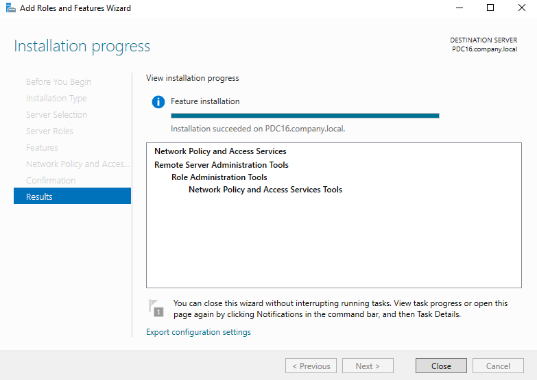

### What Gets Installed

| Component | Purpose |
|---|---|
| **Network Policy and Access Services** | The parent role containing NPS |
| **Network Policy Server** | The RADIUS server service (`IAS.exe`) — handles authentication and authorization requests |
| **NPS Management Tools** | MMC snap-in (`nps.msc`) for managing policies, RADIUS clients, and accounting |

### Expected Result

- Installation succeeds on `PDC16.company.local`
- **Network Policy Server** appears in Server Manager → Tools
- The NPS service (`IAS`) starts automatically

---

## Task 2 — Register NPS in Active Directory

### Why This Is Needed

For NPS to read users' dial-in properties (required to make authorization decisions), the NPS server computer account must be **authorized in Active Directory**. Without this registration, NPS cannot access the dial-in attributes of domain user objects.

### Steps

1. On `PDC16`, open **Network Policy Server** (`nps.msc`)
2. Right-click **NPS (Local)** in the left panel → **Register server in Active Directory**
3. A confirmation dialog appears:

> *"To enable NPS to authenticate users in the Active Directory, the computers running NPS must be authorized to read users' dial-in properties from the domain. Do you wish to authorize this computer to read users' dial-in properties from the company.local domain?"*

4. Click **OK**

### Screenshot

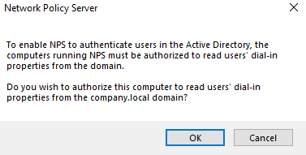

### What Registration Does

- Adds the NPS server's computer account (`PDC16$`) to the **RAS and IAS Servers** security group in AD
- Members of this group have read access to user dial-in properties (`msNPAllowDialin`, `msRADIUSServiceType`, etc.)
- Without this, NPS returns **Access-Reject** for all requests regardless of policy

### PowerShell Alternative

```powershell
# Register NPS in AD via PowerShell (on PDC16)
Register-NpsServer -Domain company.local
```

---

## Task 3 — Switch User to "Control Access via NPS Network Policy"

### Why This Is Needed

When NPS is used for VPN access control, the per-user **dial-in tab** setting in AD should be changed from **Allow access** (which bypasses NPS policy evaluation) to **Control access through NPS Network Policy** — this makes NPS the single decision-maker, allowing rich policy conditions to apply.

### Steps

1. On `PDC16`, open **Active Directory Users and Computers** (`dsa.msc`)
2. Find user `ahmed.abdo` → double-click → **Dial-in** tab
3. Under **Network Access Permission**, change to:
   - **● Control access through NPS Network Policy**

### Screenshot

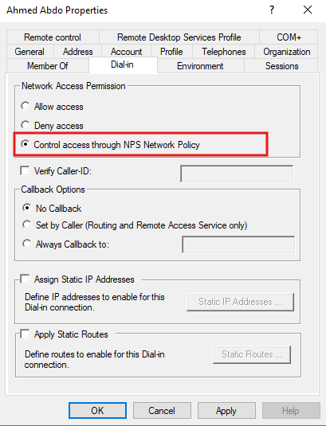

### Three Dial-In Permission States Compared

| Setting | How Access Is Determined |
|---|---|
| **Allow access** | Always allowed — NPS policy is **ignored** for this user |
| **Deny access** | Always denied — NPS policy is **ignored** |
| **● Control via NPS Network Policy** ✅ | NPS evaluates **all configured policies** — the policy's permission (grant/deny) applies |

> **Best Practice:** Set all VPN users to "Control access through NPS Network Policy" and manage access through NPS group-based policies — not per-user dial-in settings. This is far more scalable.

---

## Task 4 — Select RADIUS Server Scenario in NPS

### Why This Is Needed

NPS provides pre-built **Standard Configuration** scenarios that create the right policy templates for common deployments. The **"RADIUS server for Dial-Up or VPN Connections"** scenario creates the correct connection request policies and network policies in one guided flow.

### Steps

1. In **NPS (Local)** console on `PDC16`, in the center pane under **Standard Configuration**:
2. Select **RADIUS server for Dial-Up or VPN Connections** from the dropdown
3. Click **Configure VPN or Dial-Up**

### Screenshot

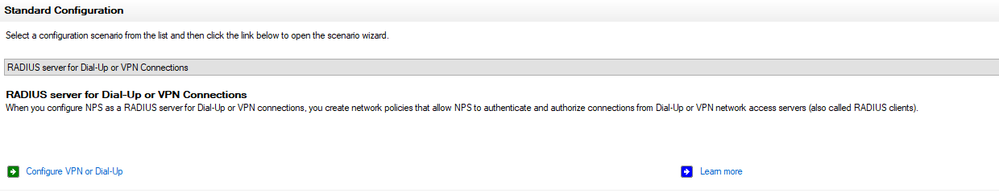

### Scenario Description

> *"When you configure NPS as a RADIUS server for Dial-Up or VPN connections, you create network policies that allow NPS to authenticate and authorize connections from Dial-Up or VPN network access servers (also called RADIUS clients)."*

This wizard will walk through:
- Connection type (VPN vs. Dial-up)
- RADIUS client registration (the VPN server)
- Authentication method selection
- User group scoping
- IP filter configuration
- Encryption requirements
- Realm name configuration

---

## Task 5 — Select VPN Connection Type

### Why This Is Needed

The wizard needs to know whether to create policies for **VPN connections** or **Dial-up connections** — the correct policy template depends on this choice, as VPN and dial-up use different NAS port types and have different authentication characteristics.

### Steps

In the **Configure VPN or Dial-Up** wizard:

| Option | Description |
|---|---|
| ○ Dial-up Connections | Creates policies for dial-up (modem/ISDN) servers |
| **● Virtual Private Network (VPN) Connections** ✅ (selected) | Creates policies for VPN gateways (RRAS, Cisco, etc.) |

- **Name:** `Virtual Private Network (VPN) Connections` (auto-filled; used as the base name for created policies)

### Screenshot

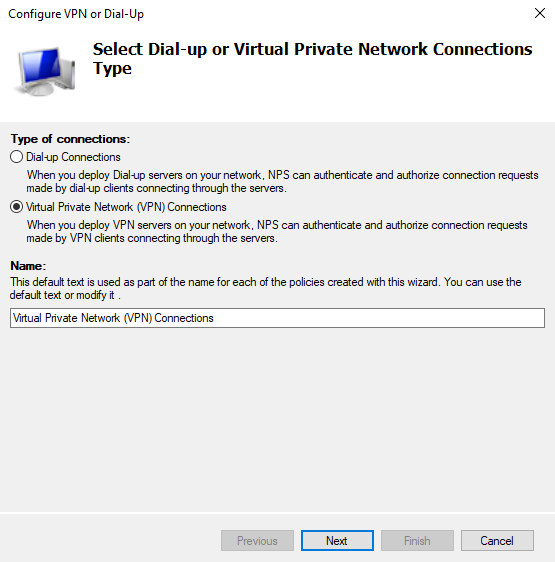

Click **Next**.

---

## Task 6 — Add the VPN Server as a RADIUS Client

### Why This Is Needed

In RADIUS architecture, the **VPN server (ADC) is a RADIUS client** — it sends authentication requests to NPS. NPS must know which servers are authorized to send these requests and verify them using a **shared secret** (a password known only to both sides).

### Steps

On the **RADIUS Clients** page, click **New...** and fill in the **New RADIUS Client** dialog:

| Field | Value | Notes |
|---|---|---|
| **Friendly name** | `VPN` | Display name in NPS console — identifies this client |
| **Address (IP or DNS)** | `192.168.1.5` | The LAN IP of ADC (the VPN server) — use the LAN-facing IP, not WAN |
| **Shared Secret → ● Manual** | `(strong password)` | A secret known to both ADC and NPS — must match exactly on both sides |
| **Confirm shared secret** | `(same password)` | Must match |

### Screenshot

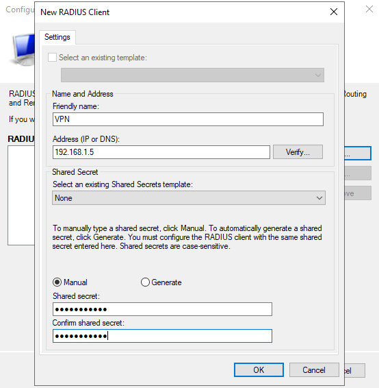

### Shared Secret Security Guidelines

| Requirement | Detail |
|---|---|
| **Minimum length** | 22+ characters recommended |
| **Complexity** | Mix uppercase, lowercase, numbers, symbols |
| **Case-sensitive** | Must be entered identically on ADC (Task 19) |
| **Keep confidential** | Never sent over the network in plaintext — only used to sign/verify RADIUS packets |

> **Note:** Click **Verify...** to test connectivity to the RADIUS client IP before saving. This confirms `192.168.1.5` (ADC) is reachable from `PDC16` on the LAN.

Click **OK** → **Next**.

---

## Task 7 — Select MS-CHAPv2 as the Authentication Protocol

### Why This Is Needed

NPS must enforce which **authentication protocol** the VPN connection uses. MS-CHAPv2 is the standard protocol for Windows RRAS VPN connections — it provides mutual authentication and encrypted password exchange.

### Steps

On the **Configure Authentication Methods** page:

| Protocol | Status | Notes |
|---|---|---|
| ☐ Extensible Authentication Protocol (EAP) | Unchecked | For certificate-based or smart card auth — not used in this lab |
| ✅ **Microsoft Encrypted Authentication version 2 (MS-CHAPv2)** | Checked | Password-based authentication; supports mutual auth and encryption |
| ☐ Microsoft Encrypted Authentication (MS-CHAP) | Unchecked | Legacy version — only for very old OS clients |

### Screenshot

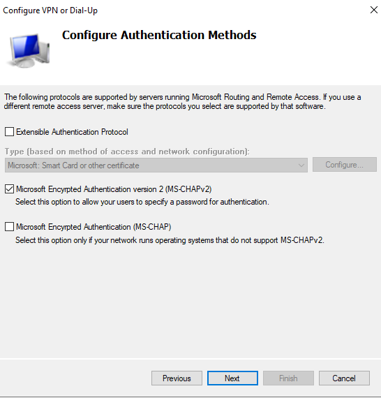

### Authentication Protocol Comparison

| Protocol | Security | Use Case |
|---|---|---|
| **MS-CHAPv2** ✅ | Good — encrypted challenge/response | Standard Windows VPN clients (PPTP, L2TP, SSTP) |
| EAP-TLS | Excellent — certificate-based | Smart cards, certificate-based auth, 802.1X |
| PEAP | Very Good — TLS-wrapped EAP | Wireless networks, certificate server available |
| MS-CHAP v1 | Poor — legacy | Only for Windows 9x/NT clients |
| PAP | None — plaintext | Never use in production |
| CHAP | Weak | Legacy only |

Click **Next**.

---

## Task 8 — Apply Policy to All Users (No Group Filter Yet)

### Why This Is Needed

The wizard offers the option to scope the VPN policy to specific user groups. At this stage in the wizard, the group list is left **empty** — meaning the policy initially applies to all users. Group-based conditions are added in Task 12 by editing the policy properties directly.

### Steps

On the **Specify User Groups** page:

- Leave the **Groups** list empty
- If no groups are selected, the note confirms: *"this policy applies to all users"*

### Screenshot

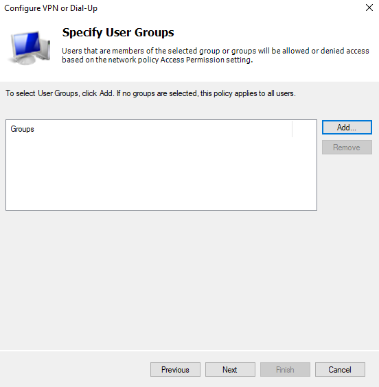

> **Why leave it blank here?** The wizard's group picker is functional but limited. In Task 12, you'll add the `IT-GROUP` condition directly in the policy properties — giving more control over the exact condition type (Windows Groups vs. User Groups) and condition logic.

Click **Next**.

---

## Task 9 — Configure IP Filters (No Filter)

### Why This Is Needed

NPS can restrict which IP addresses VPN clients receive or which internal networks they can reach. For this lab, **no IP filter** is applied — VPN clients can reach the entire internal LAN. In production, you might configure filters to restrict VPN clients to specific resources only.

### Steps

On the **Specify IP Filters** page:

- **IP Filter template:** `None` (selected)
- Leave all Input/Output filter buttons unconfigured

### Screenshot

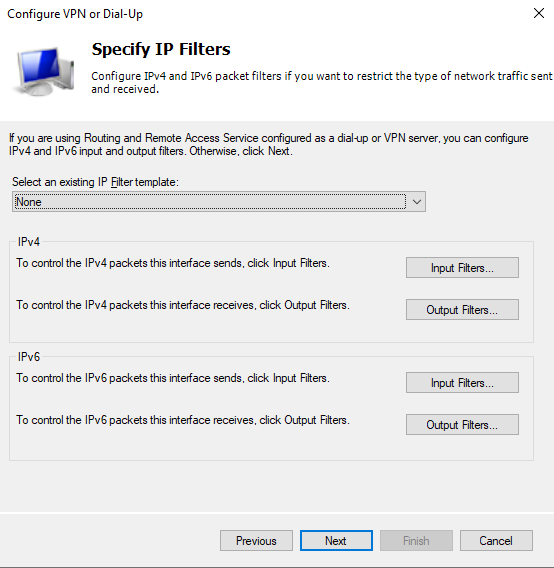

### When IP Filters Are Useful (Production Scenarios)

| Filter Type | Example Use Case |
|---|---|
| **IPv4 Input Filter** | Block VPN clients from sending traffic to sensitive subnets (e.g., finance servers) |
| **IPv4 Output Filter** | Restrict what the VPN server forwards back to clients |
| **Both** | Implement a split-access VPN: allow HR VPN users to reach only HR servers |

Click **Next**.

---

## Task 10 — Select Encryption Settings

### Why This Is Needed

NPS enforces minimum encryption strength for VPN sessions. The encryption settings here apply to **MPPE (Microsoft Point-to-Point Encryption)** used with PPTP/MS-CHAPv2. All three levels are enabled to allow maximum client compatibility — the VPN server and client negotiate the strongest mutually supported level.

### Steps

On the **Specify Encryption Settings** page, check all three levels:

| Encryption Level | Key Size | Status |
|---|---|---|
| ✅ **Basic encryption (MPPE 40-bit)** | 40-bit RC4 | Legacy clients — very weak; only enabled for compatibility |
| ✅ **Strong encryption (MPPE 56-bit)** | 56-bit RC4 | Slightly better but still weak |
| ✅ **Strongest encryption (MPPE 128-bit)** | 128-bit RC4 | Current standard for PPTP; this is what modern clients use |

### Screenshot

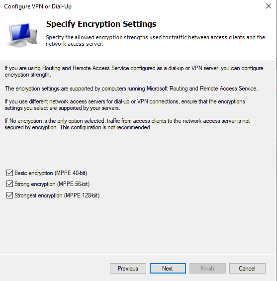

> ⚠️ **Production Note:** For L2TP/IPSec connections (configured in Task 18), encryption is handled by **IPSec** (AES-256 by default) — not MPPE. These MPPE settings only apply to PPTP connections. Since this lab migrates to L2TP/IPSec in Task 18, these encryption settings become less relevant but must still be configured to complete the wizard.

Click **Next**.

---

## Task 11 — Add a Realm Name to the NPS Policy

### Why This Is Needed

A **realm name** in NPS acts as a routing identifier — it tells NPS which domain or authentication realm a user credential belongs to, and optionally strips the realm prefix/suffix before forwarding authentication to AD. This is especially useful when connection profiles (like CMAK) append realm identifiers to usernames.

### Steps

On the **Specify a Realm Name** page:

| Field | Value | Notes |
|---|---|---|
| **Realm name** | `VPN-Company` | An identifier for this NPS realm — can match the CMAK realm or ISP routing name |
| ✅ **Before authentication, remove the realm name from the user name** | Checked | Strips `VPN-Company` prefix before forwarding to AD — ensures AD receives clean username, not `VPN-Company/ahmed.abdo` |

### Screenshot

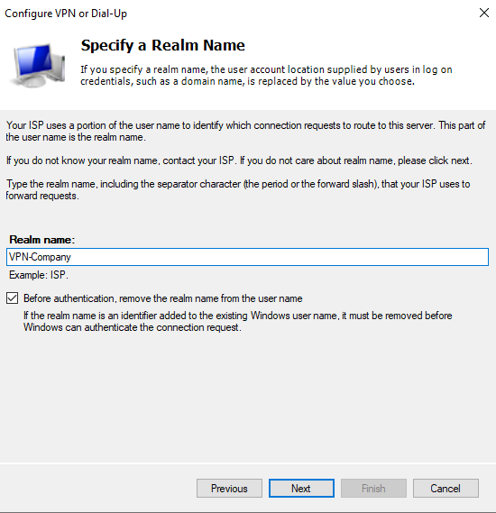

### Why "Remove Before Authentication" Is Checked

If a CMAK profile or client appends a realm identifier to the username (e.g., `VPN-Company/ahmed.abdo`), AD cannot find a user named `VPN-Company/ahmed.abdo` — it only knows `ahmed.abdo`. Stripping the realm before lookup ensures the correct AD account is found.

Click **Next** → **Finish** to complete the wizard and create the initial policies.

---

## Task 12 — Add Group Condition & Review Network Policies

### Why This Is Needed

After the wizard completes, the VPN network policy exists but applies to all users. Now refine it by adding an **IT-GROUP** condition — only domain users who are members of `IT-GROUP` will be granted VPN access.

### Steps — Add Group Condition

1. In **NPS** → expand **Policies** → click **Network Policies**
2. Double-click **Virtual Private Network (VPN) Connections** policy
3. Click the **Conditions** tab → click **Add...**
4. Select **User Groups** → click **Add...**
5. In the **Select Group** dialog:
   - Object type: `Group`
   - Location: `company.local`
   - Object name: `IT-GROUP`
6. Click **Check Names** → **OK** → **OK**

### Screenshot — Adding the Group Condition

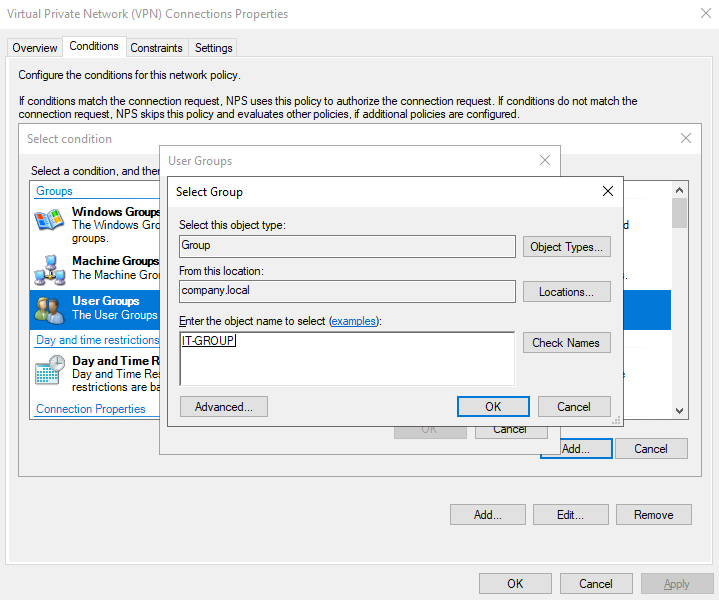

### Screenshot — Network Policies Overview

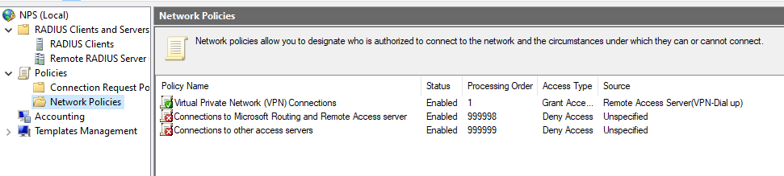

### Network Policies After Configuration

| Policy Name | Status | Processing Order | Access Type | Source |
|---|---|---|---|---|
| **Virtual Private Network (VPN) Connections** | Enabled | 1 | Grant Access | Remote Access Server (VPN-Dial up) |
| Connections to Microsoft Routing and Remote Access server | Enabled | 999998 | Deny Access | Unspecified |
| Connections to other access servers | Enabled | 999999 | Deny Access | Unspecified |

> **Processing order matters:** NPS evaluates policies in order from lowest number (highest priority) to highest. The VPN Connections policy (order 1) is checked first — if a user matches, access is granted. The deny-all policies at 999998/999999 act as a fallback catch-all.

---

## Task 13 — Review the VPN Network Policy Properties

### Why This Is Needed

Verify the core properties of the VPN Connections policy — ensuring it grants access, ignores the per-user dial-in property (relies on policy only), and is correctly typed as a Remote Access Server (VPN-Dial up) policy.

### Steps

Open the **Virtual Private Network (VPN) Connections** policy → **Overview** tab:

| Property | Value | Meaning |
|---|---|---|
| **Policy name** | `Virtual Private Network (VPN) Connections` | Descriptive name created by the wizard |
| **Policy State** | ✅ Policy enabled | NPS actively evaluates this policy |
| **Access Permission** | ● Grant access | Matching requests are **allowed** |
| ✅ **Ignore user account dial-in properties** | Checked | NPS uses policy conditions only — ignores the per-user dial-in tab in AD |
| **Type of network access server** | `Remote Access Server (VPN-Dial up)` | Policy only applies to requests from VPN/dial-up servers |

### Screenshot

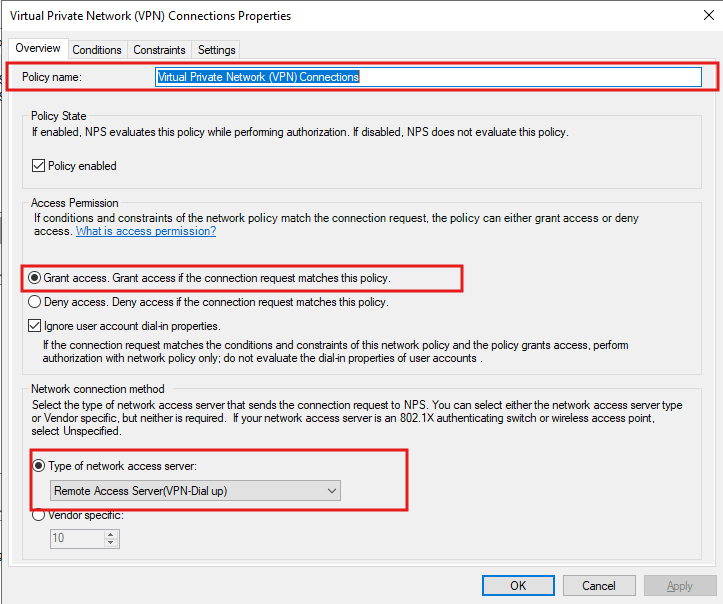

> **"Ignore user account dial-in properties"** is the correct setting when using **NPS for centralized control**. With this checked, the user's AD dial-in tab is irrelevant — whether it says Allow, Deny, or Control via NPS, the policy permission wins. This is the intended enterprise behavior.

---

## Task 14 — Define Day and Time Restrictions

### Why This Is Needed

Organizations often need to limit VPN access to **business hours** — preventing after-hours access that might indicate compromised credentials being used, or simply enforcing company policy that employees should not work outside defined hours.

### Steps

1. In the VPN policy → **Conditions** tab → **Add...**
2. Select **Day and time restrictions** → **Add...**
3. In the grid, select the allowed time range:
   - **Days:** Sunday through Saturday (all days)
   - **Hours:** 1:00 AM to 8:00 PM
   - Status: **● Permitted** (blue = allowed)

### Screenshot

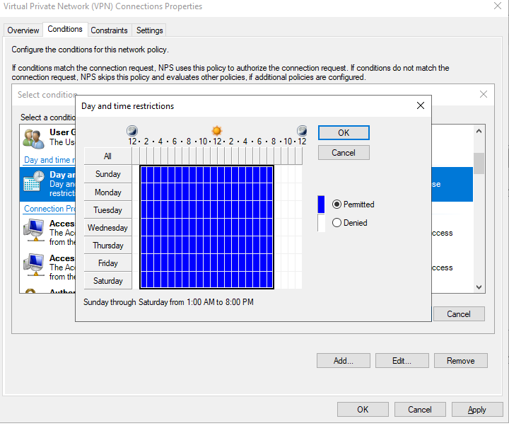

### Reading the Time Grid

- **Blue cells** = **Permitted** (VPN connections allowed)
- **White/empty cells** = **Denied** (outside allowed hours — connections rejected)
- The summary below the grid reads: *"Sunday through Saturday from 1:00 AM to 8:00 PM"*

> **Real-World Example:** A bank might configure: Mon–Fri 7:00 AM to 10:00 PM (permitted) with weekends denied — employees can access VPN for early morning and late evening work, but completely blocked on weekends.

> **Time Zone Note:** NPS applies time restrictions based on the **NPS server's local time zone** — ensure PDC16's time zone matches your intended business hours zone.

---

## Task 15 — Specify Access Client IPv4 Address Condition

### Why This Is Needed

NPS can restrict which IP addresses are permitted to send RADIUS requests to this server. The **Access Client IPv4 Address** condition filters on the **RADIUS client's IP** (the VPN server's IP) — not the VPN user's IP. This ensures only the registered VPN server can send authentication requests.

### Steps

1. In the VPN policy → **Conditions** tab → **Add...**
2. Scroll to **Connection Properties** → select **Access Client IPv4 Address**
3. Click **Add...**
4. In the text box, enter the VPN server's LAN IP address (e.g., `192.168.1.5`) or leave blank to allow any registered RADIUS client

### Screenshot

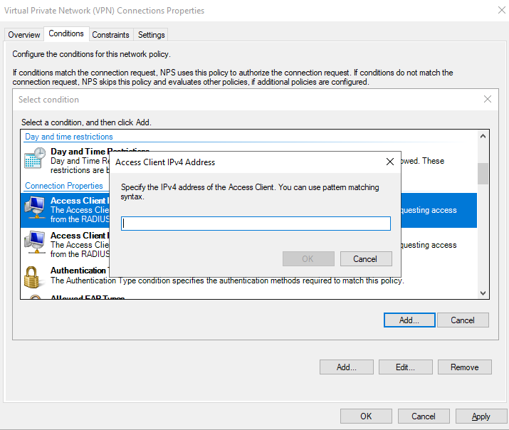

> **Lab Note:** In this lab, the field is shown empty — meaning the condition accepts requests from any registered RADIUS client (`192.168.1.5` in this case, as registered in Task 6). In production with multiple VPN servers, you might use pattern matching (e.g., `192.168.1.*`) or leave this condition out and rely on the RADIUS client registration in Task 6 to restrict access.

---

## Task 16 — Define Authentication Type Condition

### Why This Is Needed

NPS can enforce that only specific authentication protocols are used. Adding an **Authentication Type** condition as a policy condition ensures the policy only matches (and grants access to) connections that negotiate a specific protocol — mismatched protocols fall through to the deny-all fallback.

### Steps

1. In the VPN policy → **Conditions** tab → **Add...**
2. Select **Authentication Type** → **Add...**
3. In the **Authentication Method** dialog, check the desired protocol(s):

| Protocol | Selection | Notes |
|---|---|---|
| CHAP | ☐ | Legacy |
| EAP | ☐ | For certificate-based auth |
| **MS-CHAP v2** | ✅ | Standard for Windows VPN — match what was configured in Task 7 |
| PAP | ☐ | Never — unencrypted |
| PEAP | ☐ | For wireless/NAP |
| Unauthenticated | ☐ | Never |

### Screenshot

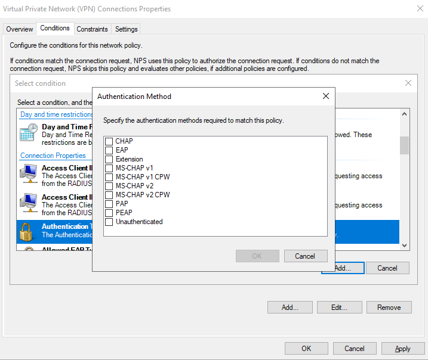

---

## Task 17 — Define Constraints (Authentication Methods in Policy)

### Why This Is Needed

**Constraints** in NPS policy are conditions that must be met **or the connection is denied** — even if the main Conditions all match. The **Authentication Methods** constraint explicitly requires MS-CHAPv2, ensuring that even if an attacker tries to downgrade the auth protocol, NPS rejects non-compliant connections.

### Steps

1. In the VPN policy → **Constraints** tab
2. Click **Authentication Methods** in the left panel
3. Under **Less secure authentication methods**, check:
   - ✅ **Microsoft Encrypted Authentication version 2 (MS-CHAPv2)**
   - ✅ **User can change password after it has expired** (good UX — users aren't locked out when their password expires)

### Screenshot

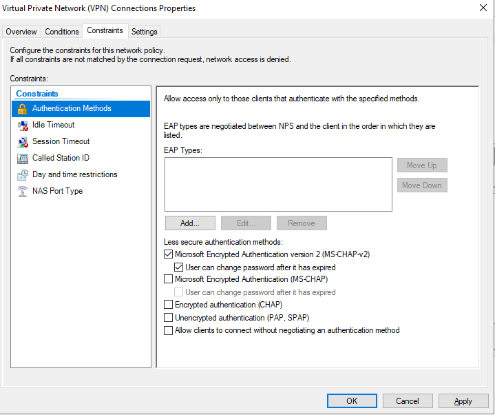

### Conditions vs. Constraints — Key Difference

| Type | Behavior | Example |
|---|---|---|
| **Conditions** | Identifies which connections this policy applies to | User is in IT-GROUP; connection is between 1AM–8PM |
| **Constraints** | Requirements the connection must meet after conditions match | Must use MS-CHAPv2; session timeout ≤ 8 hours |

> If a Condition doesn't match → NPS skips this policy and tries the next one.  
> If a Constraint doesn't match → NPS **denies access** immediately, regardless of other policies.

---

## Task 18 — Configure VPN Server for L2TP/IKEv2 with Pre-Shared Key

### Why This Is Needed

PPTP (used in the basic VPN lab) is considered insecure. **L2TP/IPSec** provides much stronger security by wrapping the L2TP tunnel inside an **IPSec** encryption layer. Windows RRAS supports L2TP/IPSec using either a **machine certificate** or a **pre-shared key (PSK)**. This task configures the PSK option — simpler to deploy than a PKI certificate infrastructure.

### Steps

1. On **ADC**, open **Routing and Remote Access** → right-click `ADC (local)` → **Properties**
2. Click the **Security** tab
3. Configure:

| Setting | Value | Notes |
|---|---|---|
| **Authentication provider** | `RADIUS Authentication` | ADC now forwards auth to NPS on PDC16 |
| **Authentication Methods** button | Opens auth method selection | |
| ✅ **Allow custom IPsec policy for L2TP/IKEv2 connection** | Checked | Enables PSK-based IPSec |
| **Preshared Key** | `KVKMVKJENNJJCNJENWJCN` | The IPSec PSK — must match exactly on both server and client |

### Screenshot

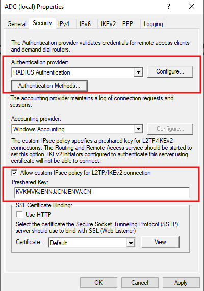

### Authentication Methods Confirmation (from Task 17 screenshot)

The **Authentication Methods** dialog (accessed via the button on this tab) confirms:
- **Authentication provider:** `RADIUS Authentication` — ADC defers to NPS for all authentication
- ✅ **MS-CHAP v2** is the enabled auth method (matching the NPS policy)

> **PSK Security Note:** The pre-shared key `KVKMVKJENNJJCNJENWJCN` is shown here for lab purposes. In production:
> - Use a randomly generated string of 30+ characters
> - Store it securely (password manager, Azure Key Vault, etc.)
> - Rotate it periodically
> - Consider migrating to **machine certificates** (L2TP/IPSec with certificates) for production deployments — PSK provides weaker authentication than certificates

---

## Task 19 — Point VPN Server (RRAS) to RADIUS Server

### Why This Is Needed

With RRAS now configured to use RADIUS authentication (Task 18), it needs to know the **address of the RADIUS server** (PDC16) and the **shared secret** to use when communicating with it. This creates the RADIUS client → server relationship from the RRAS side.

### Steps

1. In **ADC (local) Properties** → **Security** tab → with **Authentication provider** set to **RADIUS Authentication** → click **Configure...**
2. Click **Add...** to add a RADIUS server
3. In the **Add RADIUS Server** dialog:

| Field | Value | Notes |
|---|---|---|
| **Server name** | `PDC` | Resolves to `PDC16.company.local` — use FQDN or IP |
| **Shared secret** | Click **Change...** → enter same PSK as in Task 6 | Must match the shared secret configured on NPS |
| **Time-out (seconds)** | `5` | How long RRAS waits for a RADIUS response before trying the next server |
| **Initial score** | `30` | Priority score — higher = preferred; used when multiple RADIUS servers are configured |
| **Port** | `1812` | Standard RADIUS authentication port (RFC 2865) |
| ☐ Always use message authenticator | Unchecked | Optional security enhancement |

### Screenshot

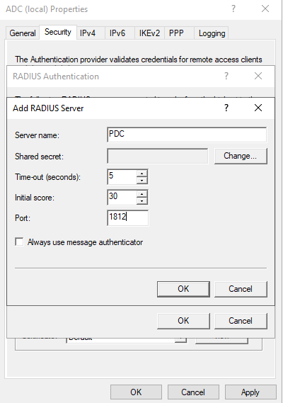

### RADIUS Ports Reference

| Port | Protocol | Purpose |
|---|---|---|
| **1812** | UDP | RADIUS Authentication (modern standard — RFC 2865) |
| **1813** | UDP | RADIUS Accounting (session start/stop records) |
| 1645 | UDP | RADIUS Auth (legacy — some older devices) |
| 1646 | UDP | RADIUS Accounting (legacy) |

Click **OK** → **Apply** → **OK**.

---

## Task 20 — Restart the VPN Server (RRAS)

### Why This Is Needed

After changing the authentication provider from local to RADIUS, and enabling L2TP/IPSec with a PSK, the **RRAS service must be restarted** for all changes to take effect. Without a restart, the server continues using old configuration values.

### Steps

1. In **Routing and Remote Access** → right-click `ADC (local)` → **All Tasks** → **Restart**
2. A dialog shows: *"Please wait while the Routing and Remote Access service on ADC restarts."*

### Screenshot

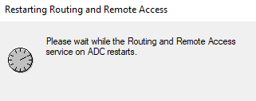

### What the Restart Applies

- RADIUS authentication provider (ADC now authenticates via NPS on PDC16)
- L2TP/IPSec PSK (`KVKMVKJENNJJCNJENWJCN`)
- MS-CHAPv2 as the RRAS-side authentication method
- RADIUS server address (`PDC16:1812`)

> **Active connections:** All existing VPN sessions are **disconnected** during a restart. Schedule restarts during maintenance windows in production.

---

## Task 21 — Create L2TP/IPSec VPN Connection on Client

### Why This Is Needed

The previous VPN labs used "Automatic" protocol detection. Now that the server is configured specifically for L2TP/IPSec, the client connection must be updated to explicitly use **L2TP/IPSec with a pre-shared key** — matching the server configuration.

### Steps

On the **PC** (external client), open **Windows Settings** → **Network & Internet** → **VPN** → **Add a VPN connection**:

| Field | Value |
|---|---|
| **VPN provider** | `Windows (built-in)` |
| **Connection name** | `vpn-new` |
| **Server name or address** | `11.0.0.3` |
| **VPN type** | `L2TP/IPsec with pre-shared key` |
| **Pre-shared key** | `KVKMVKJENNJJCNJENWJCN` (must match Task 18 exactly) |
| **Type of sign-in info** | `User name and password` |
| **User name** | `COMPANY\ahmed.abdo` |
| **Password** | (domain password) |
| ✅ Remember my sign-in info | Checked |

### Screenshot

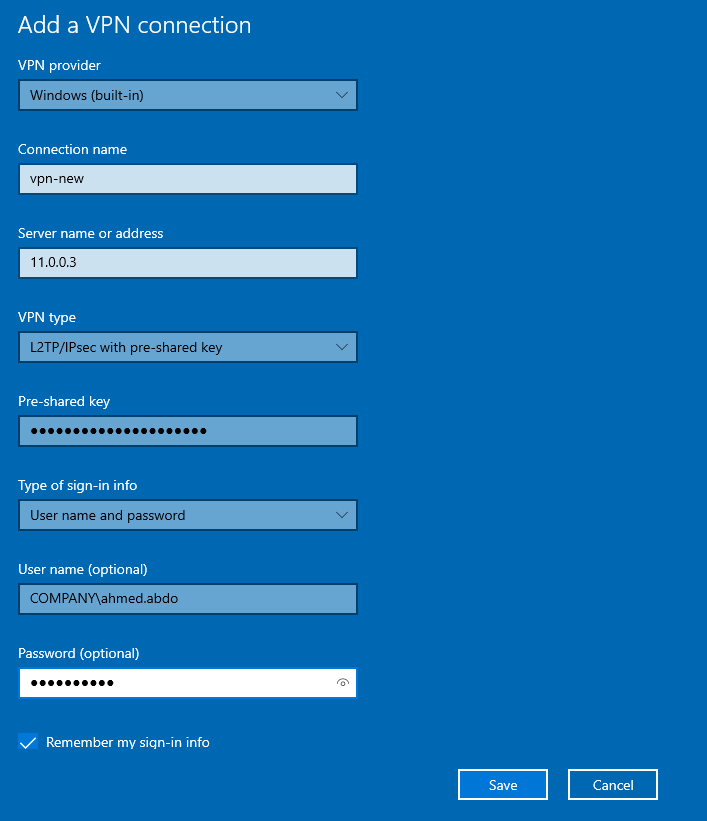

> **Pre-shared key distribution:** In production, the PSK should be distributed securely to users — not via plain email. Consider using CMAK (previous lab) to embed the PSK in the `.exe` installer, or distribute via Intune/MDM policy.

---

## Task 22 — Configure VPN Security Settings on Client

### Why This Is Needed

After creating the connection, verify and explicitly set the security settings in the VPN adapter properties — ensuring the client negotiates the correct protocol (L2TP/IPSec), encryption requirement, and authentication method (MS-CHAPv2).

### Steps

1. Open **Network Connections** (`ncpa.cpl`)
2. Right-click **vpn-new** → **Properties** → **Security** tab
3. Verify/set:

| Setting | Value |
|---|---|
| **Type of VPN** | `Layer 2 Tunneling Protocol with IPSec (L2TP/IPSec)` |
| **Data encryption** | `Require encryption (disconnect if server declines)` |
| **Authentication** | ● Allow these protocols |
| ✅ **Microsoft CHAP Version 2 (MS-CHAP v2)** | Checked |
| ☐ Automatically use my Windows logon name | Unchecked |

### Screenshot

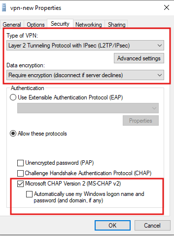

### Why "Require Encryption"?

| Encryption Setting | Behavior |
|---|---|
| No encryption allowed | Connects even if server doesn't offer encryption — plaintext VPN |
| Optional encryption | Uses encryption if available; falls back to plaintext |
| **Require encryption** ✅ | Disconnects if server can't negotiate encryption — no plaintext fallback |
| Maximum strength encryption | Only connects if server supports maximum strength |

**Always use "Require encryption"** in production — a VPN without encryption is worse than no VPN (false sense of security).

---

## Task 23 — Verify VPN Connects Successfully

### Why This Is Needed

End-to-end connection validation — confirming the complete chain works: L2TP/IPSec tunnel established, IPSec PSK accepted, RADIUS authentication via NPS, NPS policy conditions met (IT-GROUP, time window), MS-CHAPv2 authentication passed.

### Steps

1. In Windows Settings → **VPN** → click **vpn-new** → **Connect**
2. Or in the system tray → Network icon → click `vpn-new` → **Connect**

### Screenshot

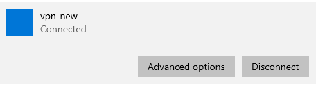

The VPN connection card shows:
```
vpn-new
Connected        [Advanced options]  [Disconnect]
```

### What Happened Behind the Scenes

```
Client initiates L2TP/IPSec to 11.0.0.3
    │
IPSec Phase 1 (IKE): PSK "KVKMVKJENNJJCNJENWJCN" matches → Secure channel
    │
L2TP tunnel established inside IPSec
    │
MS-CHAPv2 authentication: COMPANY\ahmed.abdo / password
    │
ADC (RADIUS client) sends Access-Request to PDC16:1812
    │
NPS evaluates "Virtual Private Network (VPN) Connections" policy:
    ├── User in IT-GROUP?  ✅
    ├── Current time within 1AM–8PM?  ✅
    ├── MS-CHAPv2 used?  ✅
    └── → Access-Accept returned to ADC
    │
ADC assigns IP from pool (192.168.1.50–.60)
    │
VPN tunnel CONNECTED ✅
    │
NPS logs event to C:\Windows\system32\LogFiles\INyymm.log
```

---

## Task 24 — Validate Client Can Reach Internal LAN

### Why This Is Needed

After connection, verify that traffic actually flows through the VPN tunnel and reaches internal LAN resources — the ultimate proof that the L2TP/IPSec + RADIUS authentication chain is fully functional.

### Steps

On the **PC** (VPN client), open **Command Prompt** and run:

```cmd
ping 192.168.1.2 -t
```

### Screenshot

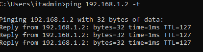

### Result Analysis

```
Pinging 192.168.1.2 with 32 bytes of data:
Reply from 192.168.1.2: bytes=32 time=1ms TTL=127
Reply from 192.168.1.2: bytes=32 time=1ms TTL=127
Reply from 192.168.1.2: bytes=32 time=1ms TTL=127
Reply from 192.168.1.2: bytes=32 time=1ms TTL=127
```

| Check | Value | Confirmation |
|---|---|---|
| Packets received | 4/4 | ✅ Zero packet loss |
| Response time | 1ms | ✅ LAN-speed — tunnel overhead minimal |
| TTL | 127 | ✅ One hop through VPN gateway (128–1) |
| Source: `192.168.1.2` | PDC16 | ✅ Internal server reachable through L2TP/IPSec tunnel |

> The `-t` flag runs ping **continuously** — useful for monitoring stability as configuration changes are made. Press **Ctrl+C** to stop.

---

## Task 25 — Configure NPS Accounting (Log Files)

### Why This Is Needed

**NPS Accounting** records every authentication attempt (success and failure), session start/stop times, user identity, client address, and other RADIUS accounting data to local log files. This provides an audit trail for security investigations, compliance reporting, and capacity planning.

### Steps

1. In **NPS (Local)** → click **Accounting** in the left panel
2. Click **Configure Accounting...**
3. Select **Log to a text file on the local computer**
4. In the **Accounting Configuration Wizard**, configure what to log:
   - ✅ **Accounting Requests** (session start/stop data)
   - ✅ **Authentication Requests** (success/failure records)
   - ✅ **Periodic Accounting Requests** (interim records during active sessions)
   - ✅ **Periodic Authentication Requests**

### Screenshot — Accounting Configuration Summary

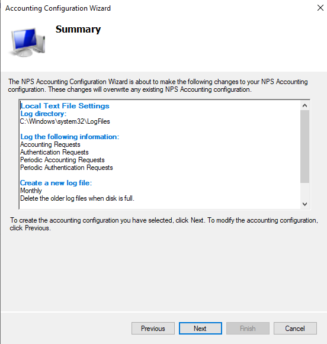

### Accounting Summary Settings Confirmed

| Setting | Value |
|---|---|
| **Log directory** | `C:\Windows\system32\LogFiles` |
| **Log:** Accounting Requests | ✅ |
| **Log:** Authentication Requests | ✅ |
| **Log:** Periodic Accounting Requests | ✅ |
| **Log:** Periodic Authentication Requests | ✅ |
| **Create new log file** | Monthly |
| **When disk is full** | Delete older log files |

Click **Next** → **Finish** to apply the accounting configuration.

---

## Task 26 — Review Log File Properties

### Why This Is Needed

Verify the log file format, location, rotation schedule, and disk management settings — ensuring logs are stored in the correct place, rotated at appropriate intervals, and old logs are automatically cleaned up to prevent disk exhaustion.

### Steps

1. In **NPS (Local)** → **Accounting** → double-click **Local File**
2. Click the **Log File** tab

### Screenshot

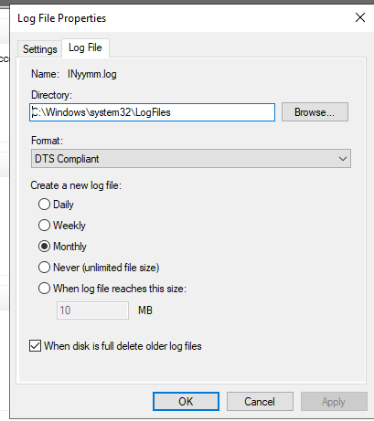

### Log File Configuration Details

| Setting | Value | Explanation |
|---|---|---|
| **Name** | `INyymm.log` | Auto-named: `IN` prefix + year (`yy`) + month (`mm`) — e.g., `IN2607.log` for July 2026 |
| **Directory** | `C:\Windows\system32\LogFiles` | Default NPS log directory |
| **Format** | `DTS Compliant` | Internet Authentication Service (IAS) compatible format — readable by log analysis tools |
| **Create new log file** | ● **Monthly** | A new file is created each month — manageable file sizes |
| ✅ **When disk is full delete older log files** | Checked | Prevents disk exhaustion by auto-purging oldest logs first |

### Log File Naming Convention

| Format | Meaning | Example |
|---|---|---|
| `INyymm.log` | **Monthly** — new file each month | `IN2607.log` = July 2026 |
| `INyymmdd.log` | **Daily** — new file each day | `IN260702.log` = July 2, 2026 |
| `INyymmddhh.log` | **Hourly** | High-traffic environments |

### Reading the Log File (Task 25 Screenshot)

The actual log file (`IN2607.log`) contains comma-separated RADIUS accounting records. Each line includes:

| Field | Example Value | Meaning |
|---|---|---|
| Server | `PDC16` | NPS server that processed the request |
| Service type | `IAS` | Internet Authentication Service |
| Timestamp | `07/02/2026,06:51:31` | Date and time of the event |
| User | `COMPANY\ahmed.abdo` | Authenticated user |
| Client IP | `11.0.0.3` | VPN server (RADIUS client) that sent the request |
| Source IP | `11.0.0.2` | Original VPN client's WAN IP |
| NAS identifier | `ADC` | Network Access Server name |
| Assigned IP | `192.168.1.5` | IP address assigned from VPN pool |
| Port type | `VPN` | Connection type |

### Screenshot — Actual Log File Content

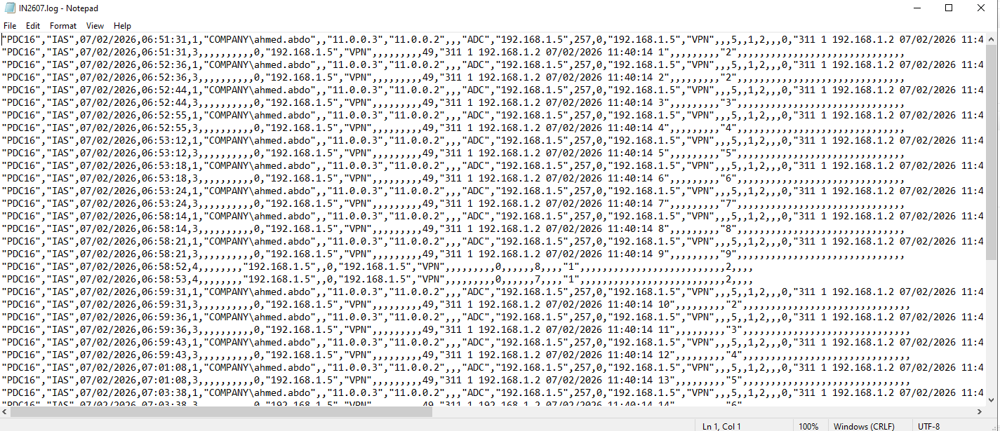

---

## Verification & Testing

### On NPS Server (PDC16) — PowerShell

```powershell
# Check NPS service status
Get-Service IAS | Select-Object Name, Status

# View RADIUS clients registered in NPS
netsh nps show client

# View network policies
netsh nps show np

# Check NPS registration in AD
Get-ADGroupMember -Identity "RAS and IAS Servers"

# View recent NPS event log entries
Get-WinEvent -LogName Security | Where-Object {$_.Id -in 6272,6273,6276} | Select-Object -First 20
```

### Key Event IDs for NPS Monitoring

| Event ID | Meaning |
|---|---|
| **6272** | NPS granted access to a user |
| **6273** | NPS denied access to a user |
| **6274** | NPS discarded a request |
| **6276** | NPS quarantined a user (NAP) |
| **6278** | NPS granted full access after NAP |

### End-to-End Test Matrix

| Test | Expected Result |
|---|---|
| Connect with `ahmed.abdo` (IT-GROUP member) during allowed hours | ✅ Connected — NPS grants access |
| Connect with a user **not** in IT-GROUP | ❌ Rejected — policy condition not met |
| Connect **outside** allowed hours (after 8PM) | ❌ Rejected — time restriction not met |
| Use wrong PSK on client | ❌ IPSec phase 1 fails — tunnel never established |
| Use PAP instead of MS-CHAPv2 | ❌ Rejected — constraint not met |
| Check `C:\Windows\system32\LogFiles\IN2607.log` after connection | ✅ Log entries for `COMPANY\ahmed.abdo` visible |

---

## Troubleshooting

| Problem | Possible Cause | Solution |
|---|---|---|
| RADIUS authentication fails ("Access Denied") | NPS not registered in AD | Right-click NPS (Local) → Register in Active Directory |
| RADIUS authentication fails | Shared secret mismatch between ADC and PDC16 | Re-enter identical shared secret in Task 6 (NPS) and Task 19 (RRAS) |
| L2TP/IPSec won't connect ("Error 789") | PSK mismatch between client and server | Verify PSK in Task 18 (RRAS) matches Task 21 (client) exactly |
| L2TP/IPSec error 789 on Windows 10 client | NAT traversal issue | On client registry: `HKLM\SYSTEM\CurrentControlSet\Services\PolicyAgent` → add DWORD `AssumeUDPEncapsulationContextOnSendRule` = `2`; restart |
| User rejected despite being in IT-GROUP | NPS not reading AD group membership | Ensure NPS is registered in AD (Task 2); verify `PDC16$` is in "RAS and IAS Servers" group |
| Time restriction rejects valid connections | NPS server in wrong time zone | Verify time zone on PDC16 matches intended business hours zone |
| No log files generated | Accounting not configured or NPS service restart needed | Re-run accounting wizard; restart IAS service: `Restart-Service IAS` |
| RRAS shows "RADIUS server not responding" | Port 1812 blocked or wrong IP | Verify firewall allows UDP 1812 from ADC to PDC16; check IP in Task 19 |
| Accounting logs too large | Logging too verbose or Daily rotation with high traffic | Change to Weekly or Monthly rotation in Task 26 log file properties |

---

## Summary

### Task Completion Overview

| Tasks | Action | Key Result |
|---|---|---|
| **1–2** | Install NPS on PDC16; register in Active Directory | RADIUS server ready; authorized to read user dial-in properties |
| **3** | Switch `ahmed.abdo` to "Control access via NPS Network Policy" | NPS policies — not per-user AD setting — control access |
| **4–6** | Configure NPS as RADIUS server for VPN; register ADC as RADIUS client with shared secret | NPS can receive auth requests from ADC |
| **7** | Select MS-CHAPv2 authentication protocol | All VPN connections must use MS-CHAPv2 |
| **8–11** | Configure user groups, IP filters (none), encryption (all MPPE levels), realm name | Policy scope and encryption requirements defined |
| **12** | Add IT-GROUP condition; review 3-policy structure | Only IT-GROUP members can connect |
| **13** | Verify policy grants access; ignores per-user dial-in; typed as VPN server | Policy correctly structured |
| **14** | Restrict VPN to 1:00 AM – 8:00 PM daily | Time-based access control enforced |
| **15–16** | Add access client IP and authentication type conditions | Fine-grained conditional access configured |
| **17** | Set MS-CHAPv2 as Constraint | Protocol downgrade attacks prevented |
| **18** | Enable L2TP/IPSec PSK on RRAS; set RADIUS as auth provider | Secure L2TP/IPSec with centralized RADIUS auth |
| **19** | Point RRAS to PDC16:1812 as RADIUS server | Complete RADIUS client ↔ server relationship |
| **20** | Restart RRAS to apply all changes | All new configuration active |
| **21–22** | Create L2TP/IPSec VPN on client with PSK + MS-CHAPv2 | Client matches server protocol requirements |
| **23–24** | Connect VPN; ping `192.168.1.2` | Full L2TP/IPSec + RADIUS auth chain verified end-to-end |
| **25–26** | Configure NPS accounting; set monthly log files to LogFiles directory | All authentication events logged for audit |

### Architecture Recap

```
Remote PC ──L2TP/IPSec──► ADC (RRAS)
                               │ RADIUS Access-Request (UDP 1812)
                               ▼
                          PDC16 (NPS)
                               │ Evaluates:
                               ├── In IT-GROUP? ✅
                               ├── Within 1AM–8PM? ✅
                               ├── Using MS-CHAPv2? ✅
                               └── Access-Accept → ADC assigns IP
                               │
                               └── Logs to C:\Windows\system32\LogFiles\IN2607.log
```

---

> 📌 **Lab Reference**  
> NPS/RADIUS: `PDC16` (`192.168.1.2`) | Port: UDP 1812/1813  
> VPN Server: `ADC` (`11.0.0.3` WAN / `192.168.1.5` LAN)  
> L2TP PSK: `KVKMVKJENNJJCNJENWJCN` | Auth: MS-CHAPv2  
> Policy: IT-GROUP | Hours: 1AM–8PM daily | Logs: `C:\Windows\system32\LogFiles\IN2607.log`
