# Lab: Windows Server Routing — Static Routes & RIP Version 2 Between Two Sites

## Overview

This lab documents how to route traffic between **two separate sites (LANs)** using **Windows Server's LAN Routing** role — first with **manually configured static routes**, and then with **RIP Version 2 (RIPv2)** as a dynamic routing protocol so routes are learned and advertised automatically instead of maintained by hand.

**Lab environment:**
- **Site 1 router:** `PDC16` — LAN: `192.168.1.0/24`, WAN link: `11.0.0.2`
- **Site 2 router:** `NODE1.company.local` — LAN: `192.168.2.0/24`, WAN link: `11.0.0.3`
- **Transit/WAN network:** `11.0.0.0/24` connecting the two routers
- Routing role: **Routing and Remote Access (RRAS) → LAN routing**

**Goal:** Get `192.168.1.0/24` and `192.168.2.0/24` to reach each other through their respective routers — first via static routes, then by replacing those static routes with dynamic RIPv2 advertisements.

---

## Table of Contents

1. [Task 1 – Verify Site 1's Network Connections](#task-1--verify-site-1s-network-connections)
2. [Task 2 – Verify Site 2's Network Connections](#task-2--verify-site-2s-network-connections)
3. [Task 3 – Install the Routing Role on Both Servers](#task-3--install-the-routing-role-on-both-servers)
4. [Task 4 – Review the Default Routing Table on Each Site](#task-4--review-the-default-routing-table-on-each-site)
5. [Task 5 – Configure LAN Routing on Both Sites](#task-5--configure-lan-routing-on-both-sites)
6. [Task 6 – Add Static Routes on Both Sites](#task-6--add-static-routes-on-both-sites)
7. [Task 7 – Test Connectivity Between Sites](#task-7--test-connectivity-between-sites)
8. [Task 8 – Install the RIP Version 2 Routing Protocol](#task-8--install-the-rip-version-2-routing-protocol)
9. [Task 9 – Add RIP Interfaces on the LAN and WAN](#task-9--add-rip-interfaces-on-the-lan-and-wan)
10. [Task 10 – Set RIP to Use Multicast on Both Sites](#task-10--set-rip-to-use-multicast-on-both-sites)
11. [Task 11 – Confirm the Routing Table Is Now Populated by RIP](#task-11--confirm-the-routing-table-is-now-populated-by-rip)
12. [Summary / Key Takeaways](#summary--key-takeaways)

---

## Task 1 – Verify Site 1's Network Connections

On Site 1 (`PDC16`), run `ipconfig` to confirm the two active interfaces:

- **Ethernet0 (WAN):** `11.0.0.2` / `255.255.255.0`
- **Domain (LAN):** `192.168.1.2` / `255.255.255.0`, gateway `192.168.1.5`

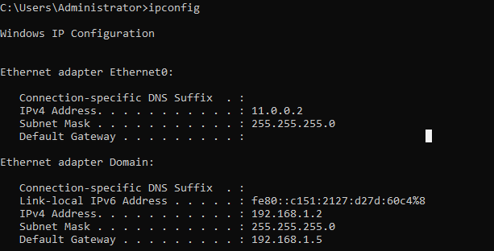

**Why:** Before configuring routing, it's important to confirm the router actually has two distinct interfaces facing each network segment — one facing the LAN (`192.168.1.0/24`) and one facing the WAN transit link (`11.0.0.0/24`) it shares with Site 2's router.

---

## Task 2 – Verify Site 2's Network Connections

On Site 2 (`NODE1`), `ipconfig` shows:

- **LAN:** `192.168.2.2` / `255.255.255.0`
- **WAN:** `11.0.0.3` / `255.255.255.0`, gateway `192.168.1.1`

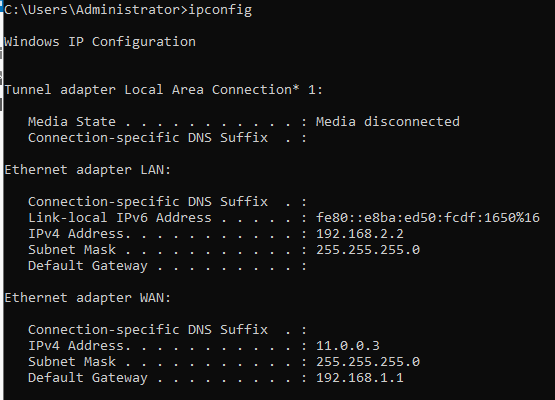

**Why:** Same purpose as Task 1 — confirming Site 2's router also straddles both its own LAN (`192.168.2.0/24`) and the shared WAN transit network before any routing configuration begins.

---

## Task 3 – Install the Routing Role on Both Servers

On both `PDC16` and `NODE1.company.local`, install the **Remote Access** role with the **Routing** role service (via **Add Roles and Features Wizard**). The installation results confirm:

- **Remote Access → DirectAccess and VPN (RAS), Routing**
- **Remote Server Administration Tools → Remote Access Management Tools** (GUI, command-line, and PowerShell module)
- **RAS Connection Manager Administration Kit (CMAK)**
- **Group Policy Management**


**Why:** The **Routing** role service (part of Remote Access) is what enables a Windows Server to act as a network-layer router — forwarding IP packets between its interfaces — rather than functioning purely as an endpoint host.

---

## Task 4 – Review the Default Routing Table on Each Site

Before configuring anything, check each server's starting IPv4 route table via **Routing and Remote Access → IPv4 → Static Routes** (GUI) or `route print` (CLI).

**Site 1 (`PDC16`):**

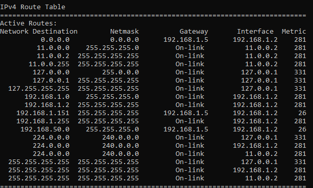

**Site 2 (`NODE1`):**

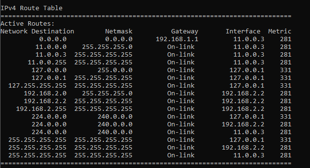

**Why:** At this stage, each router only knows about its **directly connected** subnets (its own LAN and the shared WAN segment) — there is no route yet to the *other* site's LAN. This baseline confirms that connectivity across sites doesn't exist until routing is explicitly configured (Tasks 5–6).

---

## Task 5 – Configure LAN Routing on Both Sites

Run the **Routing and Remote Access Server Setup Wizard** on both servers and choose **Custom configuration**, selecting only:

- ☑ **LAN routing**

(Leave VPN access, Dial-up access, Demand-dial connections, and NAT unchecked.)

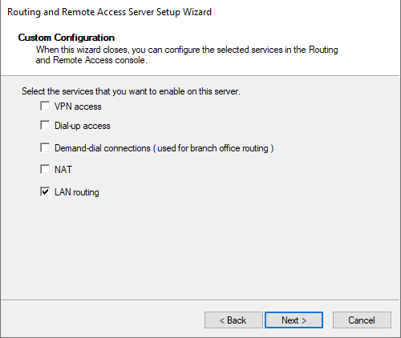

**Why:** Unlike the demand-dial site-to-site VPN scenario, this lab connects two sites over an **already-existing WAN link** (no VPN tunnel needed) — so the server only needs the **LAN routing** service enabled to forward packets between its interfaces, not the demand-dial or NAT services.

---

## Task 6 – Add Static Routes on Both Sites

With LAN routing enabled, manually add a static route on each router pointing to the *remote* site's subnet, via the WAN interface.

**On Site 1** — route to reach Site 2's LAN:
- **Interface:** WAN
- **Destination:** `192.168.2.0`
- **Network mask:** `255.255.255.0`
- **Gateway:** `11.0.0.3` (Site 2's WAN address)
- **Metric:** `256`

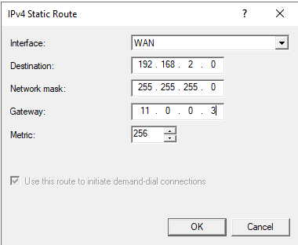

**On Site 2** — route to reach Site 1's LAN:
- **Interface:** WAN
- **Destination:** `192.168.1.0`
- **Network mask:** `255.255.255.0`
- **Gateway:** `11.0.0.2` (Site 1's WAN address)
- **Metric:** `256`

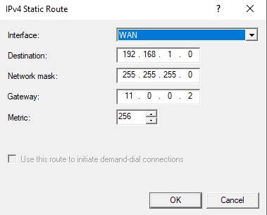

**Why:** Each router needs to be explicitly told "to reach the *other* site's LAN, send traffic out my WAN interface, to my peer router's WAN address." Without this, a router only knows about subnets it's directly connected to — traffic destined for the remote LAN would otherwise be dropped or sent to the default gateway incorrectly.

---

## Task 7 – Test Connectivity Between Sites

**From Site 1**, ping a host on Site 2's LAN:
```
C:\Users\Administrator>ping 192.168.2.2

Reply from 192.168.2.2: bytes=32 time<1ms TTL=127
Reply from 192.168.2.2: bytes=32 time<1ms TTL=127
Reply from 192.168.2.2: bytes=32 time<1ms TTL=127
Reply from 192.168.2.2: bytes=32 time<1ms TTL=127

Packets: Sent = 4, Received = 4, Lost = 0 (0% loss)
```
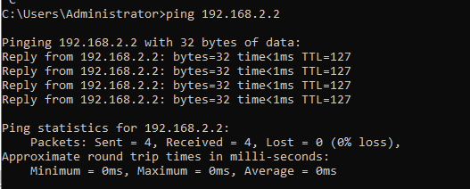

**From Site 2**, ping a host on Site 1's LAN:
```
C:\Users\Administrator>ping 192.168.1.2

Reply from 192.168.1.2: bytes=32 time<1ms TTL=127
Reply from 192.168.1.2: bytes=32 time<1ms TTL=127
Reply from 192.168.1.2: bytes=32 time<1ms TTL=127
Reply from 192.168.1.2: bytes=32 time<1ms TTL=127

Packets: Sent = 4, Received = 4, Lost = 0 (0% loss)
```
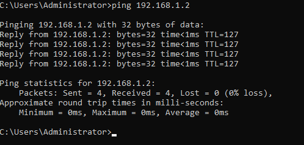

**Result:** 0% packet loss in both directions confirms static routing between the two sites is fully functional.

---

## Task 8 – Install the RIP Version 2 Routing Protocol

To move from manually maintained static routes to **dynamic routing**, open **Routing and Remote Access → IPv4 → General**, right-click → **New Routing Protocol**, and select:

- **RIP Version 2 for Internet Protocol**

(Other available protocols shown: DHCP Relay Agent, IGMP Router and Proxy, NAT — not used in this lab.)

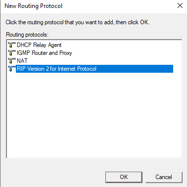

**Why:** RIP (Routing Information Protocol) is a simple **dynamic routing protocol** — once enabled and configured on both routers, they automatically exchange their known routes with each other, so administrators no longer need to manually add/update static routes every time the network topology changes.

---

## Task 9 – Add RIP Interfaces on the LAN and WAN

Under the newly added **RIP** protocol node, right-click → **New Interface**, and add RIP to **both** interfaces on each router:

- ☑ **LAN**
- ☑ **WAN**

(A third interface, `vEthernet (Intel(R) 82574L...) - Virt...`, is shown but not used for RIP in this lab.)

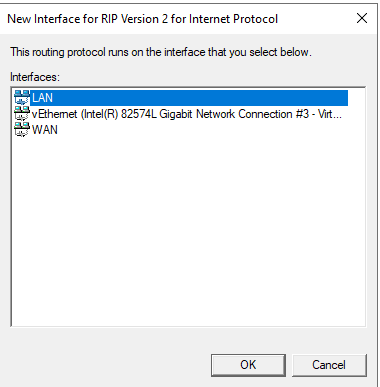

**Why:** RIP needs to be explicitly bound to every interface through which routes should be **learned and advertised** — binding it to the LAN interface lets the router advertise its own local subnet, while binding it to the WAN interface lets it exchange routes with the peer router across the transit link.

---

## Task 10 – Set RIP to Use Multicast on Both Sites

For each RIP-enabled interface (e.g. **RIP Properties – LAN Properties**), configure:

- **Operation mode:** `Periodic update mode`
- **Outgoing packet protocol:** `RIP version 2 multicast`
- **Incoming packet protocol:** `RIP version 1 and 2`
- **Added cost for routes:** `1`

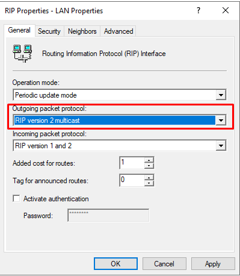

**Why:** RIPv1 broadcasts route updates to the entire subnet (noisy, less efficient, less secure), while **RIPv2 multicast** sends updates only to routers that are specifically listening for RIP traffic (multicast address `224.0.0.9`) — reducing unnecessary network traffic and being generally the preferred choice on modern networks. Accepting **both v1 and v2** on incoming ensures compatibility with any older RIP speakers on the network.

---

## Task 11 – Confirm the Routing Table Is Now Populated by RIP

Reviewing **Site 1's IP Routing Table** after RIP converges shows the remote site's subnet (`192.168.2.0/24` — via prior static config or now RIP-learned) alongside all locally connected networks, with routes correctly associated to the `LAN` and `WAN` interfaces:

| Destination | Network Mask | Gateway | Interface | Metric | Protocol |
|---|---|---|---|---|---|
| `11.0.0.0` | `255.255.255.0` | `0.0.0.0` | LAN | 281 | Local |
| `192.168.1.0` | `255.255.255.0` | `0.0.0.0` | WAN | 281 | Local |
| `192.168.1.151` | `255.255.255.255` | `192.168.1.5` | WAN | 26 | Network ma... |
| `192.168.50.0` | `255.255.255.0` | `192.168.1.5` | WAN | 26 | Network ma... |


**Why:** This confirms RIP is actively populating the routing table — entries marked **Network ma[nagement]** / learned via a neighboring gateway indicate routes that arrived dynamically through the routing protocol rather than being typed in manually, which is the entire point of replacing static routes with RIP: the table stays current automatically as the network changes.

---

## Summary / Key Takeaways

| Step | Purpose |
|---|---|
| Install Remote Access / Routing role | Gives the server the ability to forward IP packets between interfaces |
| Custom config → LAN routing only | Enables basic router functionality without unneeded VPN/NAT/demand-dial services |
| Static routes (per site, via WAN gateway) | Manually tells each router how to reach the *other* site's subnet |
| Ping test | Confirms bidirectional reachability once static routes are in place |
| Install RIPv2 | Adds a dynamic routing protocol so routes no longer need manual maintenance |
| Add RIP to LAN + WAN interfaces | Lets the router both advertise its own subnet and learn routes from its WAN peer |
| RIP v2 multicast | More efficient and modern than RIPv1 broadcast; keeps accepting v1 for compatibility |
| Verify routing table post-RIP | Confirms routes are now being learned dynamically, not just from static entries |

**Key takeaway:** Static routes and RIP solve the same underlying problem — getting traffic between two non-adjacent subnets — but static routes require manual updates on every router whenever the topology changes, while RIP automates that discovery and propagation. This lab demonstrates both approaches side-by-side on the exact same two-site topology, making the practical difference between "manual" and "dynamic" routing very concrete.
