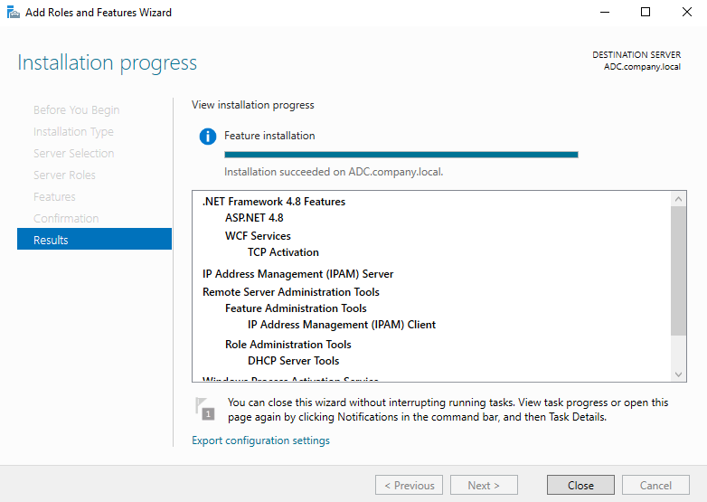
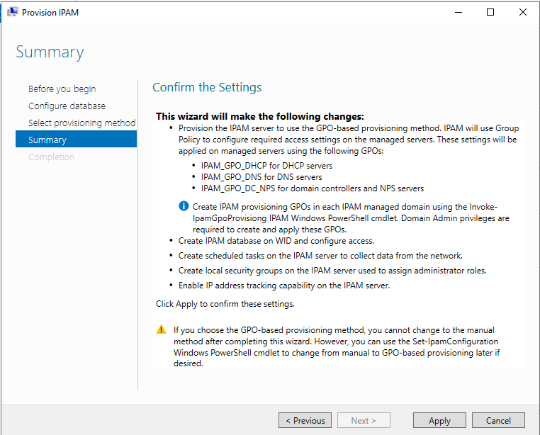
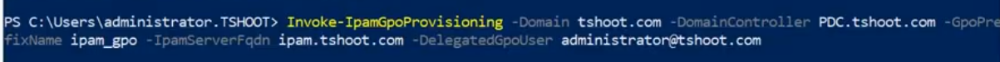
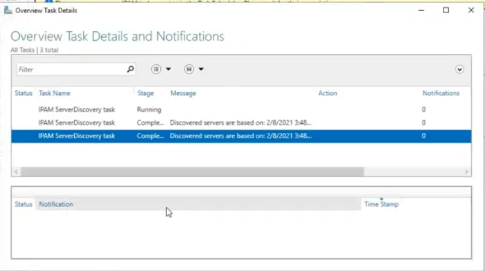
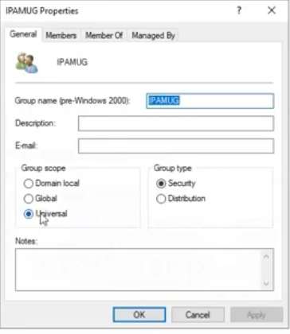

# Lab: Installing and Provisioning IP Address Management (IPAM) with GPO-Based Provisioning

## Overview

This lab documents the installation and initial configuration of the **IP Address Management (IPAM)** server role in Windows Server, using the **Group Policy–based provisioning method**. IPAM centralizes the discovery, monitoring, and management of DHCP and DNS servers and IP address usage across an AD domain. This lab walks through installing the feature, provisioning it with GPOs, running server discovery, bringing a domain controller under management, and reviewing the security group IPAM creates for delegating administrative access.

**Lab environment:**
- IPAM Server: `ADC.company.local` / `ipam.tshoot.com` (naming varies slightly between screenshots — see note below)
- Domain: `tshoot.com`
- Domain Controller: `PDC.tshoot.com` (`192.168.1.100`) — also running DNS and DHCP
- Provisioning method: **Group Policy–based (GPO)**

> **Note on naming:** The install screenshot shows the destination server as `ADC.company.local`, while the provisioning/PowerShell/discovery screenshots reference domain `tshoot.com` and server `ipam.tshoot.com` / `PDC.tshoot.com`. This is common across separate lab sessions/environments reusing the same lab guide — the steps and concepts are identical regardless of which lab domain you're following along in. Substitute your own server FQDN and domain name throughout.

**Goal:** Have a fully provisioned IPAM server that has discovered, and is actively managing, the domain's DHCP/DNS/domain controller infrastructure — with the appropriate security groups in place for delegated administration.

---

## Table of Contents

1. [Task 1 – Install the IPAM Server Feature](#task-1--install-the-ipam-server-feature)
2. [Task 2 – Provision IPAM Using the GPO-Based Method](#task-2--provision-ipam-using-the-gpo-based-method)
3. [Task 3 – Run Invoke-IpamGpoProvisioning to Create the GPOs](#task-3--run-invoke-ipamgpoprovisioning-to-create-the-gpos)
4. [Task 4 – Configure Server Discovery](#task-4--configure-server-discovery)
5. [Task 5 – Start and Monitor the Discovery Task](#task-5--start-and-monitor-the-discovery-task)
6. [Task 6 – Add/Edit a Server and Set It to "Managed"](#task-6--addedit-a-server-and-set-it-to-managed)
7. [Task 7 – Verify the IPAM Security Group Was Created](#task-7--verify-the-ipam-security-group-was-created)
8. [Summary / Key Takeaways](#summary--key-takeaways)

---

## Task 1 – Install the IPAM Server Feature

Using **Server Manager → Add Roles and Features Wizard**, select the **IP Address Management (IPAM) Server** feature and complete the wizard. On the **Results** page, confirm the following were installed:

- `.NET Framework 4.8 Features` (ASP.NET 4.8, WCF Services / TCP Activation)
- **IP Address Management (IPAM) Server**
- **Remote Server Administration Tools → Feature Administration Tools → IP Address Management (IPAM) Client**
- **Role Administration Tools → DHCP Server Tools**



**Why:** IPAM Server has several prerequisites (.NET/WCF, IPAM Client, DHCP admin tools) that the wizard installs automatically, since IPAM needs to remotely query and configure DHCP/DNS servers over WMI/RPC and needs the client console to be manageable locally.

---

## Task 2 – Provision IPAM Using the GPO-Based Method

Launch **IPAM → Provision the IPAM server** from Server Manager to open the **Provision IPAM Wizard**. After configuring the database and selecting **Group Policy–based** as the provisioning method, the **Summary** page confirms the wizard will:

- Provision IPAM to use **Group Policy** to configure access settings on managed servers, via three GPOs:
  - `IPAM_GPO_DHCP` — for DHCP servers
  - `IPAM_GPO_DNS` — for DNS servers
  - `IPAM_GPO_DC_NPS` — for domain controllers and NPS servers
- Create the IPAM database on **WID** (Windows Internal Database) and configure access
- Create scheduled tasks on the IPAM server to collect data from the network
- Create local security groups on the IPAM server for assigning administrator roles
- Enable IP address tracking capability on the IPAM server



**Why GPO-based provisioning:** It automates applying the firewall rules, permissions, and scheduled tasks that managed servers need to allow the IPAM server to query them — instead of manually configuring each DHCP/DNS/DC server's security settings by hand. Note the wizard's warning: **once you choose GPO-based provisioning, you cannot switch to manual provisioning** through the wizard again (though `Set-IpamConfiguration` can reverse it via PowerShell later).

---

## Task 3 – Run Invoke-IpamGpoProvisioning to Create the GPOs

Provisioning the IPAM server itself does **not** automatically create the GPOs in the domain — that requires running the `Invoke-IpamGpoProvisioning` PowerShell cmdlet **on the IPAM server**, with **Domain Admin** privileges:

```powershell
Invoke-IpamGpoProvisioning -Domain tshoot.com -DomainController PDC.tshoot.com `
  -GpoPrefixName ipam_gpo -IpamServerFqdn ipam.tshoot.com -DelegatedGpoUser administrator@tshoot.com
```



**Parameter breakdown:**
| Parameter | Purpose |
|---|---|
| `-Domain` | The AD domain to create/link the GPOs in |
| `-DomainController` | The DC to target for creating the GPOs |
| `-GpoPrefixName` | Prefix used for the three GPO names (e.g. `ipam_gpo_DHCP`, `ipam_gpo_DNS`, `ipam_gpo_DC_NPS`) |
| `-IpamServerFqdn` | The IPAM server's FQDN — the GPOs grant this server the necessary remote access rights |
| `-DelegatedGpoUser` | The account allowed to create/link these GPOs (must have appropriate domain rights) |

**Why:** This cmdlet actually creates the three GPOs in AD and links them at the domain level, embedding the ACLs/firewall rules needed so the IPAM server can remotely read configuration and event log data from DHCP, DNS, and domain controllers. **This must be re-run for every additional domain** the same IPAM server needs to manage.

---

## Task 4 – Configure Server Discovery

In the IPAM console, go to **Overview → Configure Server Discovery**. Select:

- **Select the forest:** `tshoot.com`
- **Select the server roles to discover** for the domain, checking:
  - ☑ **Domain controller**
  - ☑ **DHCP server**
  - ☑ **DNS server**


Note the informational callout: the **discovery schedule can be modified** by editing the `\Microsoft\Windows\IPAM\ServerDiscovery` task in **Task Scheduler** on the IPAM server (requires administrative privileges).

**Why:** This tells IPAM which AD domain(s)/forest to scan and which server roles to look for — it's how IPAM builds its inventory of candidate infrastructure servers before you can bring any of them under active management.

---

## Task 5 – Start and Monitor the Discovery Task

After configuring discovery, either wait for the scheduled run or manually trigger it, then check progress under **Overview → Task Details and Notifications**:

| Task Name | Stage | Message |
|---|---|---|
| IPAM ServerDiscovery task | Running | *(in progress)* |
| IPAM ServerDiscovery task | Completed | Discovered servers are based on: [timestamp] |
| IPAM ServerDiscovery task | Completed | Discovered servers are based on: [timestamp] |



**Why:** This view confirms the discovery process actually completed successfully (rather than failing silently) and shows when the current list of discovered servers was last refreshed — important context before trusting the server inventory shown in IPAM.

---

## Task 6 – Add/Edit a Server and Set It to "Managed"

Once discovered, servers appear in **Server Inventory** with a default **Manageability status** of *Unmanaged*. Open **Add or Edit Server** for the discovered domain controller and review/confirm:

- **Server name (FQDN):** `PDC.tshoot.com`
- **Server forest name:** `tshoot.com`
- **IP address:** `192.168.1.100`
- **Server type:** ☑ DC, ☑ DNS server, ☑ DHCP server (unchecked: NPS server)
- **Manageability status:** change to **Managed**


**Why:** Discovery only *finds* candidate servers — IPAM will not actively poll or manage a server's configuration/events until its Manageability status is explicitly set to **Managed**. This is a deliberate safety gate so IPAM doesn't automatically start querying every discovered machine without administrator confirmation.

---

## Task 7 – Verify the IPAM Security Group Was Created

As part of provisioning (Task 2), IPAM automatically creates local security groups used to delegate role-based access — for example the **IPAMUG** group. Reviewing its **Properties → General** tab confirms:

- **Group name (pre-Windows 2000):** `IPAMUG`
- **Group scope:** **Universal**
- **Group type:** **Security**



**Why:** IPAM uses a set of built-in local security groups (such as IPAM Administrators, IPAM ASM Administrators, IPAM MSM Administrators, IPAM IP Audit Administrators, IPAM Users, and groups like `IPAMUG`) to control who can view or manage different areas of IPAM functionality — verifying they exist confirms provisioning completed correctly and gives you the groups needed to delegate access to other admins without granting full local admin rights on the IPAM server.

---

## Summary / Key Takeaways

| Step | Purpose |
|---|---|
| Install IPAM Server feature | Deploys IPAM Server, its .NET/WCF prerequisites, and the IPAM Client console |
| Provision IPAM (GPO-based) | Sets up the WID database, scheduled tasks, local security groups, and chooses GPO-based access provisioning |
| `Invoke-IpamGpoProvisioning` | Actually creates and links the 3 required GPOs in AD (DHCP / DNS / DC+NPS) — must run per managed domain |
| Configure Server Discovery | Defines which forest/domain and server roles IPAM should scan for |
| Run/monitor discovery task | Confirms IPAM successfully built its server inventory |
| Set server to "Managed" | Explicitly opts a discovered server into active IPAM monitoring/management |
| Verify security groups (e.g. IPAMUG) | Confirms role-based delegation groups exist for granting scoped IPAM access |

**Key sequencing point:** GPO-based provisioning in the wizard (Task 2) only *configures IPAM's intent* to use GPOs — the GPOs themselves aren't created and linked in AD until you explicitly run `Invoke-IpamGpoProvisioning` (Task 3) with Domain Admin rights. Skipping this step is one of the most common reasons IPAM discovery completes but management/access to DHCP, DNS, or domain controllers still fails afterward.
