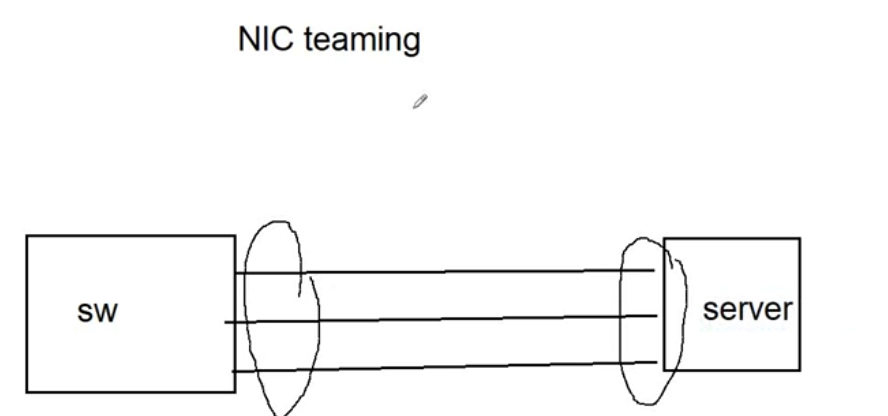
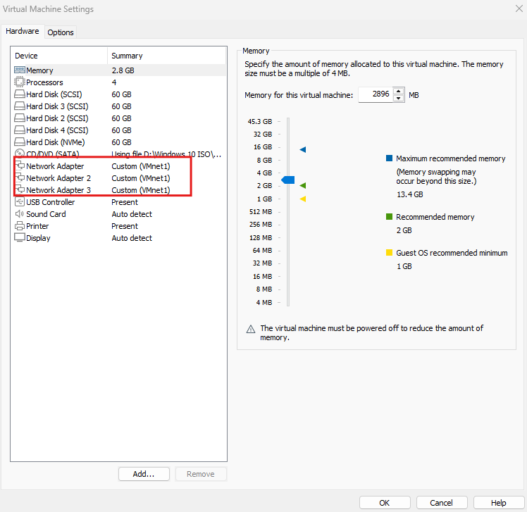
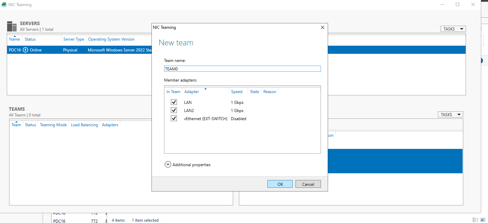
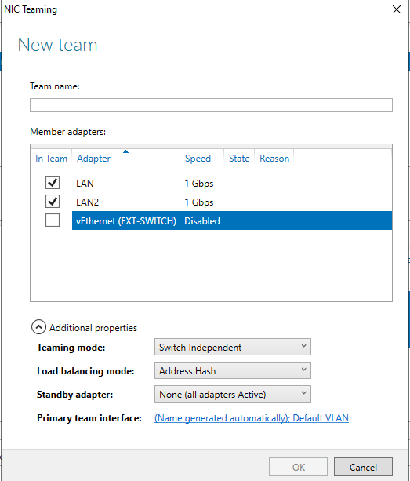
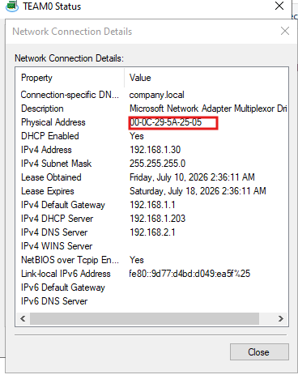
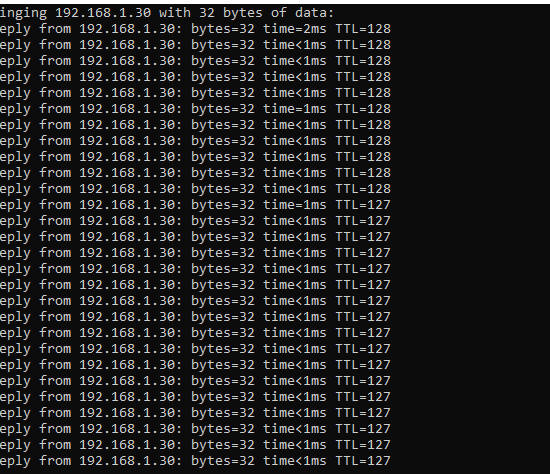
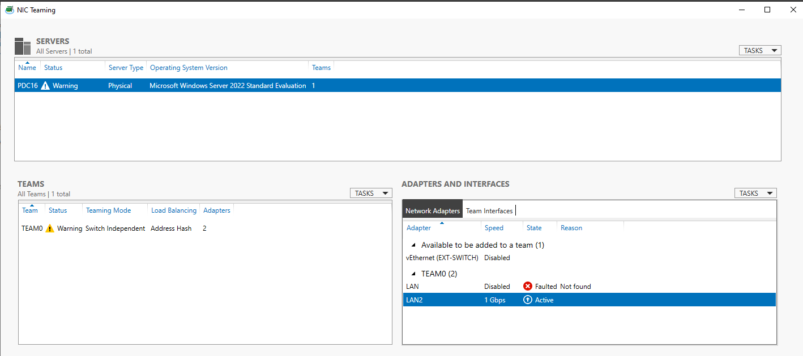

# Lab: Windows Server NIC Teaming for Network Fault Tolerance

## Overview

This lab documents how to configure **NIC Teaming** on a Windows Server (`PDC16`) to provide **network fault tolerance and load balancing** by combining multiple physical (or virtual) network adapters into a single logical team interface. The lab demonstrates the full workflow: connecting multiple NICs to the switch, adding the adapters to the VM, creating the team in Server Manager, and — most importantly — proving that connectivity survives even when one of the teamed adapters fails.

**Lab environment:**
- Server: `PDC16` (Microsoft Windows Server 2022 Standard Evaluation), running as a VM
- Team name: `TEAM0`
- Physical/virtual adapters in the team: `LAN`, `LAN2` (a third adapter, `vEthernet (EXT-SWITCH)`, is available but intentionally excluded)
- Team IPv4 address: `192.168.1.30`

**Goal:** Build a switch-independent NIC team from two network adapters and confirm that the server remains reachable over the network even if one adapter in the team goes down.

---

## Table of Contents

1. [Task 1 – Understand the NIC Teaming Topology](#task-1--understand-the-nic-teaming-topology)
2. [Task 2 – Add Multiple Network Adapters to the VM](#task-2--add-multiple-network-adapters-to-the-vm)
3. [Task 3 – Create a New Team in Server Manager](#task-3--create-a-new-team-in-server-manager)
4. [Task 4 – Configure Additional Team Properties](#task-4--configure-additional-team-properties)
5. [Task 5 – Verify the Team Interface Status](#task-5--verify-the-team-interface-status)
6. [Task 6 – Test Fault Tolerance: Ping Continues When a NIC Goes Down](#task-6--test-fault-tolerance-ping-continues-when-a-nic-goes-down)
7. [Task 7 – Confirm the Faulted Adapter in the NIC Teaming Console](#task-7--confirm-the-faulted-adapter-in-the-nic-teaming-console)
8. [Summary / Key Takeaways](#summary--key-takeaways)

---

## Task 1 – Understand the NIC Teaming Topology

Conceptually, NIC teaming connects **multiple physical network cables** from a server to a switch (or multiple switches), which Windows then presents to the OS and applications as a **single logical network interface**.



**Why:** Instead of the server relying on a single NIC (and single cable/switch port) as a point of failure, teaming multiple NICs means that if one physical link, cable, or switch port fails, traffic automatically continues to flow over the remaining team member(s) — with no IP address change and (ideally) no interruption visible to applications or users.

---

## Task 2 – Add Multiple Network Adapters to the VM

Since this lab runs on a virtualized server, multiple virtual **Network Adapters** must first be added to the VM's hardware configuration (in VMware, in this case) before Windows can team them:

- **Network Adapter** — Custom (VMnet1)
- **Network Adapter 2** — Custom (VMnet1)
- **Network Adapter 3** — Custom (VMnet1)



**Why:** NIC Teaming operates at the OS level on top of whatever physical (or virtual) NICs Windows can see — so before any teaming can be configured inside Windows Server, the hypervisor must first present multiple separate virtual NICs to the guest OS. All three adapters are attached to the same virtual network (`VMnet1`) to simulate multiple physical links reaching the same switch.

---

## Task 3 – Create a New Team in Server Manager

In **Server Manager → Local Server → NIC Teaming**, open **Tasks → New Team**. In the **New team** dialog:

- **Team name:** `TEAM0`
- **Member adapters:** check the adapters to include —
  - ☑ `LAN` (1 Gbps)
  - ☑ `LAN2` (1 Gbps)
  - ☑ `vEthernet (EXT-SWITCH)` (Disabled) — *shown selected by default but should be excluded, see Task 4*



**Why:** This is the primary interface for creating a software NIC team on Windows Server — it lets you group two or more detected network adapters under one team name that will later present a single virtual "Team" interface to the OS.

---

## Task 4 – Configure Additional Team Properties

Expanding **Additional properties** in the New team dialog exposes the teaming behavior settings. For this lab, only the two active physical-style adapters (`LAN`, `LAN2`) are checked — the disabled `vEthernet (EXT-SWITCH)` adapter is left **unchecked**, since it isn't a real active link and shouldn't be part of the team:

- **Teaming mode:** `Switch Independent`
- **Load balancing mode:** `Address Hash`
- **Standby adapter:** `None (all adapters Active)`
- **Primary team interface:** *(Name generated automatically); Default VLAN*



**Configuration choices explained:**
| Setting | Value | Why |
|---|---|---|
| Teaming mode | Switch Independent | The switch doesn't need to be aware of or configured for teaming (no LACP/static config required on the switch side) — each NIC can even connect to a different switch, maximizing fault tolerance. |
| Load balancing mode | Address Hash | Distributes outbound traffic across team members based on a hash of source/destination address info, while keeping a given flow consistently on one adapter. |
| Standby adapter | None (all adapters Active) | Both NICs actively pass traffic simultaneously (active/active) rather than one sitting idle as a pure failover-only standby (active/passive). |

---

## Task 5 – Verify the Team Interface Status

After the team is created, Windows presents `TEAM0` as a standard network connection. Checking **Network Connection Details** for `TEAM0` shows:

- **Description:** `Microsoft Network Adapter Multiplexor Driver`
- **Physical Address:** `00-0C-29-5A-25-05`
- **IPv4 Address:** `192.168.1.30`
- **IPv4 Subnet Mask:** `255.255.255.0`
- **IPv4 Default Gateway:** `192.168.1.1`



**Why:** The **Microsoft Network Adapter Multiplexor Driver** is the virtual adapter Windows creates to represent the team as a whole — this is the interface that gets the IP configuration, not the individual member NICs. Both `LAN` and `LAN2` share this single team-level IP and MAC identity for the network's perspective.

---

## Task 6 – Test Fault Tolerance: Ping Continues When a NIC Goes Down

With a continuous ping running against the team's IP address (`192.168.1.30`), one of the team member adapters (`LAN`) is disabled/disconnected. The ping output shows **no interruption** in connectivity:

```
Pinging 192.168.1.30 with 32 bytes of data:
Reply from 192.168.1.30: bytes=32 time=2ms TTL=128
...
Reply from 192.168.1.30: bytes=32 time<1ms TTL=128
Reply from 192.168.1.30: bytes=32 time<1ms TTL=127   <-- TTL drops from 128 to 127 here
Reply from 192.168.1.30: bytes=32 time<1ms TTL=127
...
```



**Why:** This is the entire point of NIC teaming — traffic transparently continues over the remaining active adapter (`LAN2`) with **zero packet loss** and no IP address change. (Note the subtle TTL shift from `128` to `127` partway through — this can happen when the failover changes the network path slightly, e.g. traversing through a different virtual switch hop, but the connection itself never drops.)

---

## Task 7 – Confirm the Faulted Adapter in the NIC Teaming Console

Back in the **NIC Teaming** console, the team and server now show a **Warning** status, and the **Adapters and Interfaces** pane confirms exactly what happened:

| Adapter | Speed | State | Reason |
|---|---|---|---|
| `LAN` | Disabled | ❌ **Faulted** | *Not found* |
| `LAN2` | 1 Gbps | ✅ **Active** | — |



**Why:** This confirms, from the teaming management console's perspective, that the failure was correctly detected (`LAN` shows Faulted / Not found) while the team as a whole kept functioning because `LAN2` remained Active — exactly matching what the uninterrupted ping test in Task 6 demonstrated. The **Warning** status at the server/team level is expected and correct: it's alerting the admin that redundancy is currently reduced (only 1 of 2 members active), not that the network is down.

---

## Summary / Key Takeaways

| Step | Purpose |
|---|---|
| Multiple NICs connected to switch(es) | Physical (or virtual) foundation required before any teaming can occur |
| Add adapters to the VM | Presents multiple distinct NICs to the guest OS for Windows to team |
| Create New Team (Server Manager) | Groups member adapters under one logical team name |
| Switch Independent + Address Hash + Active/Active | Chosen teaming mode requiring no special switch configuration, while using all members simultaneously for both throughput and redundancy |
| TEAM0 gets its own IP/MAC (Multiplexor driver) | The team — not individual NICs — is what the network and applications actually see |
| Disable one NIC while pinging | Proves failover happens transparently, with no ping loss |
| NIC Teaming console shows Faulted vs Active | Confirms Windows correctly detected the failure and is still routing traffic through the surviving adapter |

**Key takeaway:** NIC Teaming's value is demonstrated concretely in this lab — a live ping to the server's team IP survives a member adapter being taken down, with the team automatically continuing to pass traffic over the remaining active NIC(s), while the NIC Teaming console clearly flags which specific adapter faulted so the issue can be diagnosed and repaired without any network outage.
